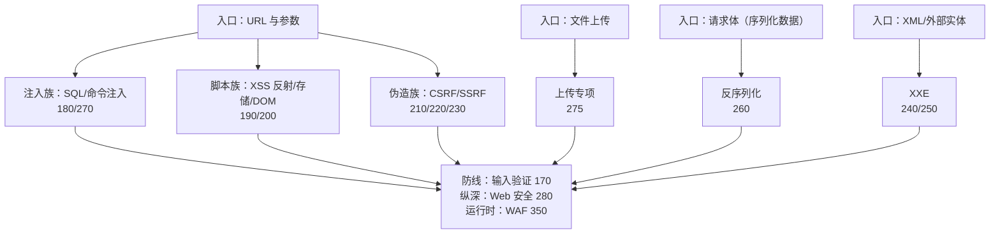

# Web 安全与渗透测试

## 知识点地图

- **知识类别**：知识块导览——Web 漏洞（150-280）与渗透测试方法论（360 系列）两个知识块的地图页。
- **解决什么问题**：Web 安全是安全模块里篇目最多的知识块（注入、XSS、CSRF、SSRF、上传、反序列化……），新人最常见的迷路方式是「从 SQL 注入的 payload 背起」。本篇先立全景：OWASP Top 10 是什么坐标系、每个漏洞类别的入口篇在哪、按什么顺序攻防成对地学。
- **什么时候用到**：进入 Web 安全知识块时定入口；逐个漏洞学习时回来定位「下一个该读哪篇」；向别人推荐路线时当索引。

## 1. 全景：一个 Web 应用的攻击面

把一个典型 Web 应用从外到内切开，每一层对应模块里的一个漏洞族：

OWASP Top 10（2021）是这个地图的官方坐标——前十风险与模块入口的对照：

| 排名 | 风险 | 模块入口 |
| :--- | :--- | :--- |
| A01 | 权限控制失效（越权、IDOR） | [OWASP Top 10 详解](/cybersecurity/160-OWASPTop10Detailed) |
| A02 | 加密机制失效 | [密码学应用](/cybersecurity/030-CryptographyApplication) |
| A03 | 注入 | [SQL 注入](/cybersecurity/180-SQLInjection)、[命令注入](/cybersecurity/270-CommandInjection) |
| A04 | 不安全设计 | [安全编码原则](/cybersecurity/330-SecureCodingPrinciples) |
| A05 | 安全配置错误 | [文件上传安全](/cybersecurity/275-FileUploadSecurity)、[Web 安全纵深](/cybersecurity/280-WebSecurityDeep) |
| A06 | 易受攻击和过时的组件 | [漏洞扫描工具](/cybersecurity/410-VulnerabilityScanTools) |
| A07 | 身份识别和认证失败 | [认证与授权](/cybersecurity/290-AuthenticationAuthorization)、[JWT 安全实践](/cybersecurity/315-JWTSecurityPractice) |
| A08 | 软件和数据完整性失败 | [反序列化漏洞](/cybersecurity/260-DeserializationVulnerability) |
| A09 | 安全日志和监控失效 | [SOC 安全运营](/cybersecurity/550-SOC) |
| A10 | 服务器端请求伪造 | [SSRF 攻击](/cybersecurity/230-SSRFAttack) |

## 2. 攻防成对的学习顺序

模块把每类漏洞拆成「攻击」与「防御」两篇，学习时成对读，先懂攻击再记防御：

1. [OWASP Top 10 详解](/cybersecurity/160-OWASPTop10Detailed)——坐标系本身，先建立全局观；
2. [SQL 注入](/cybersecurity/180-SQLInjection)——注入族的代表，参数化查询是第一道必修防线（[输入验证](/cybersecurity/170-InputValidation) 配套）；
3. [XSS 攻击](/cybersecurity/190-XSSAttack) + [XSS 防御](/cybersecurity/200-XSSDefense)——脚本族；
4. [CSRF 攻击](/cybersecurity/210-CSRFAttack) + [CSRF 防御](/cybersecurity/220-CSRFDefense)——伪造族；
5. [SSRF 攻击](/cybersecurity/230-SSRFAttack)、[XXE 攻击](/cybersecurity/240-XXEAttack) + [XXE 防御](/cybersecurity/250-XXEDefense)、[反序列化](/cybersecurity/260-DeserializationVulnerability)、[命令注入](/cybersecurity/270-CommandInjection)——进阶四类；
6. [文件上传安全](/cybersecurity/275-FileUploadSecurity)——独立专项，攻防一体；
7. [Web 安全纵深](/cybersecurity/280-WebSecurityDeep)——把以上所有防御收束成纵深体系，[WAF 规则](/cybersecurity/350-WAFRule) 做运行时兜底。

## 3. 渗透测试：把「攻」系统化

漏洞会旧、方法论不旧。渗透测试块回答「如何有章法地验证安全」：

- [渗透测试方法论](/cybersecurity/360-PenetrationTestingMethodology)——PTES 七阶段标准流程与法律边界，**先读这篇再碰工具**；
- 信息收集与侦察：[信息收集](/cybersecurity/380-InformationGathering)；
- 扫描与枚举：[Nmap 扫描](/cybersecurity/390-NmapScan)、[漏洞扫描](/cybersecurity/400-VulnerabilityScan)、[Nikto](/cybersecurity/420-NiktoScan)、[OpenVAS](/cybersecurity/430-OpenVASCommands)；
- 漏洞利用：[Burp Suite CLI](/cybersecurity/440-BurpSuiteCLI)、[Metasploit](/cybersecurity/450-MetasploitCommands)、[SQLMap 自动化注入](/cybersecurity/370-SecurityToolsPractice)；
- 口令与在线爆破：[Hashcat 与口令破解](/cybersecurity/460-Hashcat)（含在线服务爆破与授权边界）；
- 特殊面：[无线网络安全](/cybersecurity/465-WirelessSecurity)、[社会工程学与钓鱼防护](/cybersecurity/365-SocialEngineering)——技术外围的射频与「人」两个维度。

所有工具操作只在授权靶场（DVWA、Juice Shop）与自有资产上练习，法律红线见 [渗透测试方法论](/cybersecurity/360-PenetrationTestingMethodology) 第 5 节。

## 4. 动手实践

### 练习一：给一个真实站点画攻击面图

任务：选一个你负责的开源项目或个人站点，按第 1 节的六类入口（URL 参数、上传、序列化、XML...）各找出一个具体落点（没有的写「无此入口」），标注每类对应的防御篇。
提示：入口跟着「用户输入能到达哪里」走——有搜索框就有注入面，有评论框就有 XSS 面，找不到入口的类别可以放心跳过。

### 练习二：OWASP Top 10 自查表

任务：对照第 1 节的对照表，为你自己的项目逐项回答「A01-A10 各是什么状态」，写出三条最优先整改项。
提示：不确定的项先标「待验证」，这就是后续渗透实践（第 3 节）的任务清单——安全工作的起点是把「不知道」变成「待验证清单」。

### 练习三：搭靶场并跑通第一次注入

任务：部署 DVWA 后进入 SQL Injection 模块（Low 难度），手工构造一个 `' OR '1'='1` 验证注入存在，再读 [SQL 注入](/cybersecurity/180-SQLInjection) 的防御节解释为什么参数化查询能挡住它。
提示：先把现象做出来再去读原理，防御篇的每句话都会「对上号」。

## 5. 与之前和之后的知识的关系

- 往前：[安全基础与防御](/cybersecurity/010-SecurityBasicsDefense) 的模块地图里，本篇是「Web 漏洞」知识块的入口；HTTP 基础与浏览器机制是前置；
- 旁支：渗透测试块（360 系列）负责「怎么验证」，本篇的漏洞块负责「攻的是什么」；
- 往后：Web 漏洞是应用层攻击面，再往下走是主机与二进制层——[二进制漏洞利用](/cybersecurity/585-BinaryExploitationPwn) 与 [恶意软件分析](/cybersecurity/570-MalwareAnalysis)。

## 6. 自我检查

- 能不看资料复述 OWASP Top 10（2021）的至少五项，并为每项指出模块入口篇；
- 能说出「攻击/防御成对」结构的意义，并举出一对（如 190+200）；
- 能画出六类入口到漏洞族到防御篇的对应图；
- 能说清渗透测试为什么必须「先读方法论再碰工具」。

## 本章总结

本篇是 Web 安全知识块的地图页：一个应用的六类输入入口对应六个漏洞族，OWASP Top 10 给出官方坐标，模块以「攻击/防御成对」的组织方式展开（180+170、190+200、210+220、240+250，以及攻防一体的 275 上传专项）；渗透测试块（360 系列）把「攻」流程化，是验证防御的尺子。从这张图选你的入口，然后——每一篇都值得在靶场里亲手做一遍。

## 参考与致谢

- OWASP Top 10（2021）条目与顺序：https://owasp.org/Top10/ （CC-BY 许可）；
- 本篇为导览重写：原第九个编号章节分别由 [OWASP Top 10 详解](/cybersecurity/160-OWASPTop10Detailed)（原第 1 节）、[SQL 注入](/cybersecurity/180-SQLInjection)（原第 2 节）、[XSS 攻击](/cybersecurity/190-XSSAttack) 与 [XSS 防御](/cybersecurity/200-XSSDefense)（原第 3 节）、[CSRF 攻击](/cybersecurity/210-CSRFAttack) 与 [CSRF 防御](/cybersecurity/220-CSRFDefense)（原第 4 节）、[命令注入](/cybersecurity/270-CommandInjection)（原第 6 节）、[渗透测试方法论](/cybersecurity/360-PenetrationTestingMethodology)（原第 7 节）、[Nmap 扫描](/cybersecurity/390-NmapScan)（原第 8 节）、[Burp Suite CLI](/cybersecurity/440-BurpSuiteCLI)（原第 9 节）覆盖；原第 5 节文件上传漏洞拆入 [文件上传安全](/cybersecurity/275-FileUploadSecurity)；原无编号操作系列（信息收集/端口扫描/服务枚举/Web 应用测试/漏洞利用/密码破解/后渗透操作/权限提升/内网渗透/报告生成）经逐段比对与 [渗透测试方法论](/cybersecurity/360-PenetrationTestingMethodology) 同名系列逐字节重复，按去重原则移除；
- 其余内容为原创。
