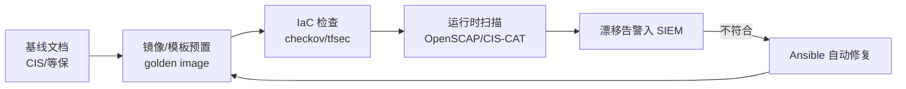

## 知识点地图

- **知识类别**：主机加固与合规——把「安全配置」从个人经验升级为可核查、可自动化的基线（Baseline）体系。
- **解决什么问题**：「服务器要加固」谁都会说，难的是回答三问：按什么标准改（CIS/等保给条目）、改没改全（扫描工具给结论）、下次扩容会不会回退（自动化闭环保一致性）。本篇给出从标准到脚本到持续验证的完整链路。
- **什么时候用到**：
  - 新机器上线：跑一遍加固清单或一键脚本再接入业务；
  - 等保/CIS 合规测评前：对照条目自查 + OpenSCAP 扫描出证据；
  - 事故复盘：「这台机器为什么会被打进来的」往往能追到某条基线项缺失；
  - 混合环境：Windows 与 Linux 各有清单与脚本（第 4、5 节）。
- **学完能做什么**：读懂 CIS Benchmark 条目结构；用 OpenSCAP/Ansible 建自动化闭环；用本篇的两个一键脚本（Linux bash / Windows PowerShell）完成初始化加固。

## 1. 什么是安全基线

基线（Baseline）= 某类系统「上线时必须满足的最低安全配置集合」。它把零散的加固经验
变成可核查、可自动化的检查表，解决三个工程问题：

1. **一致性**：一百台机器不必靠一百个人的习惯来保证安全。
2. **可验证**：配置是否符合基线可以用工具扫描得出结论。
3. **可追溯**：出事后对照基线能回答「我们按标准做了吗」。

类比：基线像体检的「正常值范围」——不保证你健康，但任何一项超标都值得追查。

## 2. CIS Benchmark

CIS（Center for Internet Security）维护着最广泛使用的公开基线库，覆盖操作系统、
数据库、中间件、云服务、容器等 100+ 目标。每份 Benchmark 的条目结构固定：

```text
编号（1.1.4）→ 审计方法（Audit，怎么查）→ 修复方法（Remediation，怎么改）
→ 默认值 → 影响说明（改了会影响什么业务行为）
```

「影响说明」是 CIS 区别于普通检查表的关键：每条建议标注了收紧后可能付出的可用性代价，
便于按业务取舍。条目分为 Level 1（基础且低风险）与 Level 2（更高安全性、
可能影响功能或性能），生产环境通常先全量达成 Level 1。

```bash
# 常见 benchmark 示例（节选自 CIS Ubuntu Linux Benchmark）
6.2.10 检查除 root 外无 UID 0 账户
       awk -F: '($3 == 0) {print $1}' /etc/passwd      # 输出应只有 root
5.2.18 SSH 仅允许强 MAC 算法
       sshd -T | grep -i macs                           # 应不含 *-md5、*-96 系列
4.1.2.3 记录 sudo 命令使用（auditd）
       auditctl -l                                      # 应含 execve 相关规则
```

配套工具 **CIS-CAT**（CIS 官方评估器）与社区版 OpenSCAP 内容可自动给出达标率报告。

## 3. 等保 2.0

网络安全等级保护 2.0（GB/T 22239-2019）是国内强制性合规框架，流程为
「定级 → 备案 → 建设整改 → 等级测评 → 监督检查」。

| 等级 | 对象     | 受侵害客体               | 测评周期   |
| :--- | :------- | :----------------------- | :--------- |
| 一级 | 一般系统 | 合法权益                 | 自行保护   |
| 二级 | 一般系统 | 严重损害合法权益         | 建议每两年 |
| 三级 | 重要系统 | 社会秩序/公共利益        | 每年       |
| 四级 | 特别重要 | 严重损害社会秩序/国家安全 | 每半年     |
| 五级 | 极端重要 | 国家安全                 | 专门监管   |

安全要求分「安全通用要求」+ 针对云计算/移动互联/物联网/工业控制的「安全扩展要求」；
通用要求下再分技术（安全物理环境/通信网络/区域边界/计算环境/管理中心）与管理
（管理制度/机构/人员/建设/运维）两翼。等保与 CIS 的关系是「框架 vs 明细」：
等保告诉你要有访问控制与审计能力，CIS/基线给出逐条怎么配。

## 4. 系统加固清单

### 4.1 Linux 基础加固（可直接执行的核心子集）

```bash
# 身份与认证
sed -i 's/^PASS_MAX_DAYS.*/PASS_MAX_DAYS   90/' /etc/login.defs   # 密码有效期
sed -i 's/^PASS_MIN_LEN.*/PASS_MIN_LEN   12/'  /etc/login.defs    # 最小长度
usermod -L username                    # 锁定长期未用账号
passwd -l $(awk -F: '$2=="!"{print $1}' /etc/shadow) 2>/dev/null || true

# SSH 加固 /etc/ssh/sshd_config
PermitRootLogin no
PasswordAuthentication no              # 仅密钥登录
ClientAliveInterval 300
ClientAliveCountMax 2
AllowAgentForwarding no
# systemctl restart sshd

# 权限与文件
chmod 600 /etc/shadow; chown root:root /etc/shadow
find / -xdev -perm -4000 -type f       # 盘点 SUID，按需移除
umask 027                              # 收紧默认权限（/etc/profile）

# 内核参数 /etc/sysctl.conf
net.ipv4.conf.all.accept_redirects = 0
net.ipv4.conf.all.send_redirects = 0
net.ipv4.conf.all.accept_source_route = 0
kernel.randomize_va_space = 2          # ASLR
sysctl -p
```

### 4.2 数据库加固要点（以 MySQL 为例）

```sql
-- 移除匿名账户与测试库
DELETE FROM mysql.user WHERE User='';
DROP DATABASE IF EXISTS test;

-- 限制 root 远程登录
SELECT user, host FROM mysql.user;     -- root 应仅存 root@localhost

-- 最小权限业务账号，禁止 USING *.*
CREATE USER 'app'@'10.0.%' IDENTIFIED BY '<强随机口令>';
GRANT SELECT, INSERT, UPDATE ON shop.* TO 'app'@'10.0.%';

-- 开启审计与慢日志（留存策略按合规要求）
SET GLOBAL general_log = ON;
```

### 4.3 中间件加固要点

```text
Nginx    ：关闭 server_tokens、禁用 autoindex、限制 HTTP 方法、TLS 1.2+（见 021）
Tomcat   ：删除默认应用（docs/examples/manager）、修改shutdown端口口令、低权限运行
Redis    ：requirepass 强口令、bind 内网地址、rename FLUSHALL/CONFIG、禁 root 运行
K8s      ：kube-bench 对标 CIS Benchmark、禁匿名 API 访问、开启 Pod Security
```

Redis 是攻击者最爱：未授权 Redis 曾是挖矿与勒索的Top入口，加固三件套
（口令、绑定、禁危险命令）缺一不可。

### 4.4 Windows 加固清单（PowerShell 命令）

Windows 域环境与 Linux 的加固对象一一对应：账户策略、防火墙、危险服务、审计策略、
协议版本、终端防护。以下命令需要管理员 PowerShell，可直接在测试机验证：

```powershell
# 账户策略：密码 90 天轮换、至少 12 位、记住 5 个历史口令；锁定阈值与解锁定时
net accounts /maxpwage:90 /minpwage:1 /minpwlen:12 /uniquepw:5
net accounts /lockoutthreshold:5 /lockoutduration:30 /lockoutwindow:30

# 防火墙：三个配置文件（Domain/Public/Private）全部启用
Set-NetFirewallProfile -Profile Domain,Public,Private -Enabled True

# 禁用危险服务：Telnet 与远程注册表是历史上最常见的横向移动入口
Set-Service -Name "Telnet" -StartupType Disabled -Status Stopped
Set-Service -Name "RemoteRegistry" -StartupType Disabled -Status Stopped

# 审计策略：登录、对象访问、权限使用三类事件的成功与失败都要记
auditpol /set /subcategory:"Logon" /success:enable /failure:enable
auditpol /set /subcategory:"Object Access" /success:enable /failure:enable
auditpol /set /subcategory:"Privilege Use" /success:enable /failure:enable

# 禁用 SMBv1（WannaCry/NotPetya 的传播通道，必关）
Set-SmbServerConfiguration -EnableSMB1Protocol $false -Force

# Windows Defender：确认实时防护开启并更新特征库
Set-MpPreference -DisableRealtimeMonitoring $false
Set-MpPreference -MAPSReporting 2
Update-MpSignature
```

讲解与易错点：

- **`net accounts` 是本地策略**，域环境由组策略（GPO）统一下发——改了本机过一阵被 GPO 冲回是「改了没生效」的头号原因，先确认机器是否在域内；
- **审计事件量**：`Object Access` 全开会产生海量日志，先开 `Logon`（成功+失败）这类高价值低噪音项，对象访问按共享目录粒度开；
- **SMBv1 与 LLMNR**：一个管文件共享协议版本（勒索软件通道），一个管名称解析投毒（Responder 抓哈希的靶子，见 [社会工程学与钓鱼防护](/cybersecurity/365-SocialEngineering)），两者都是现代 Windows 的必关项。

## 5. 一键加固脚本

清单的价值在批量执行。下面两个脚本把第 4 节的要点串成可重复的初始化动作，
**仅用于授权环境**，执行前务必先在测试机过一遍——加固脚本的每一条都可能影响业务
（比如 SSH 改端口要先放行新端口再断旧连接）。

### 5.1 Linux 一键加固脚本

```bash
#!/bin/bash
# Linux 安全加固脚本
# 仅用于授权环境

echo "[1/8] 配置账户策略..."
# 密码复杂度
apt install -y libpam-pwquality
cat > /etc/security/pwquality.conf << 'EOF'
minlen = 12
minclass = 3
dcredit = -1
ucredit = -1
lcredit = -1
ocredit = -1
EOF

# 密码过期
chage -M 90 -m 7 -W 14 root

echo "[2/8] 配置 SSH 安全..."
cp /etc/ssh/sshd_config /etc/ssh/sshd_config.bak
cat > /etc/ssh/sshd_config.d/hardening.conf << 'EOF'
Port 2222
PermitRootLogin no
PasswordAuthentication no
PubkeyAuthentication yes
MaxAuthTries 3
LoginGraceTime 30
ClientAliveInterval 300
ClientAliveCountMax 2
AllowUsers admin
EOF

echo "[3/8] 配置防火墙..."
ufw default deny incoming
ufw default allow outgoing
ufw allow 2222/tcp
ufw allow 80/tcp
ufw allow 443/tcp
ufw --force enable

echo "[4/8] 禁用危险服务..."
systemctl disable --now telnet.socket 2>/dev/null
systemctl disable --now rsh.socket 2>/dev/null
systemctl disable --now avahi-daemon 2>/dev/null
systemctl disable --now cups 2>/dev/null

echo "[5/8] 配置内核安全参数..."
cat >> /etc/sysctl.conf << 'EOF'
net.ipv4.tcp_syncookies = 1
net.ipv4.conf.all.rp_filter = 1
net.ipv4.conf.all.accept_redirects = 0
net.ipv4.icmp_echo_ignore_broadcasts = 1
kernel.exec-shield = 1
fs.suid_dumpable = 0
EOF
sysctl -p

echo "[6/8] 配置审计..."
apt install -y auditd
cat > /etc/audit/rules.d/hardening.rules << 'EOF'
-w /etc/passwd -p wa -k identity
-w /etc/shadow -p wa -k identity
-w /etc/ssh/sshd_config -p wa -k sshd
-a always,exit -F arch=b64 -S chmod,chown -F auid>=1000 -k perm_mod
-a always,exit -F arch=b64 -S execve -F auid>=1000 -k exec
EOF
augenrules --load

echo "[7/8] 配置日志..."
sed -i 's/^#SystemMaxUse=/SystemMaxUse=500M/' /etc/systemd/journald.conf
systemctl restart systemd-journald

echo "[8/8] 文件权限加固..."
chmod 700 /root
chmod 600 /etc/shadow
chmod 644 /etc/passwd

echo "安全加固完成！请检查并重启系统。"
```

使用要领：改 SSH 端口的顺序是「先 `ufw allow 2222/tcp` 再重启 sshd」——脚本里防火墙
在第 3 步、SSH 在第 2 步写成文件但未重启，天然避开了锁死；`AllowUsers admin` 假定
admin 账号与密钥已就绪，直接跑会把没有 admin 的机器锁在门外。审计规则（auditd）的
逐条语法与验证见 [Auditd 命令](/cybersecurity/510-AuditdCommands)。

### 5.2 Windows 一键加固脚本

```powershell
# Windows 安全加固脚本
# 需要管理员权限运行

Write-Host "[1/6] 配置账户策略..."
net accounts /maxpwage:90 /minpwage:1 /minpwlen:12 /uniquepw:5
net accounts /lockoutthreshold:5 /lockoutduration:30 /lockoutwindow:30

Write-Host "[2/6] 配置防火墙..."
Set-NetFirewallProfile -Profile Domain,Public,Private -Enabled True
# 禁用规则
Disable-NetFirewallRule -DisplayGroup "远程卷管理"
Disable-NetFirewallRule -DisplayGroup "远程事件日志管理"

Write-Host "[3/6] 禁用危险服务..."
@("Telnet","RemoteRegistry","SNMP","WinRM") | ForEach-Object {
    Set-Service -Name $_ -StartupType Disabled -ErrorAction SilentlyContinue
    Stop-Service -Name $_ -Force -ErrorAction SilentlyContinue
}

Write-Host "[4/6] 配置审计策略..."
auditpol /set /subcategory:"Logon" /success:enable /failure:enable
auditpol /set /subcategory:"Object Access" /success:enable /failure:enable
auditpol /set /subcategory:"Privilege Use" /success:enable /failure:enable
auditpol /set /subcategory:"Account Management" /success:enable /failure:enable

Write-Host "[5/6] 安全配置..."
# 禁用 SMBv1
Set-SmbServerConfiguration -EnableSMB1Protocol $false -Force
# 禁用 LLMNR
New-ItemProperty -Path "HKLM:\Software\Policies\Microsoft\Windows NT\DNSClient" `
  -Name "EnableMulticast" -Value 0 -PropertyType DWord -Force
# 禁用 AutoRun
New-ItemProperty -Path "HKLM:\Software\Microsoft\Windows\CurrentVersion\Policies\Explorer" `
  -Name "NoDriveTypeAutoRun" -Value 255 -PropertyType DWord -Force

Write-Host "[6/6] Windows Defender..."
Set-MpPreference -DisableRealtimeMonitoring $false
Set-MpPreference -MAPSReporting 2
Set-MpPreference -SubmitSamplesConsent 3
Update-MpSignature

Write-Host "安全加固完成！"
```

注意第 3 步把 **WinRM 也停了**——如果你依赖 PowerShell 远程管理，把它从数组里摘出来，
否则脚本跑完远程管理通道就断了。两个脚本共同的纪律：先快照/备份再执行（脚本里 SSH
配置就先做了 `.bak`），跑完用第 6 节的扫描工具出一份达标率报告，把「做了」变成「可证明做了」。

## 6. 自动化合规

基线的价值在于持续验证。三层工具链：

```bash
# 1) 扫描：OpenSCAP 对标 CIS 内容
oscap xccdf eval --profile xccdf_org.ssgproject.content_profile_cis_level1_server \
  --results results.xml --report report.html \
  /usr/share/xml/scap/ssg/content/ssg-ubuntu2204-ds.xml

# 2) 修复：Ansible 加固角色（DevSec 硬化角色为社区事实标准）
ansible-playbook -i hosts devsec.os-hardening.yml   # 幂等，可反复执行

# 3) 拦截：IaC 阶段检查（配置进代码仓库时即校验）
checkov -d terraform/          # Terraform/K8s/Dockerfile 合规扫描
kube-bench run --benchmark cis-1.8
```



## 7. 常见陷阱

| 陷阱                             | 事实                                                   |
| :------------------------------- | :----------------------------------------------------- |
| 基线一次配置后不再复核           | 配置漂移是常态，必须周期性扫描 + 变更拦截              |
| 全量照搬 Level 2 条目            | 部分条目影响业务功能，需按影响说明评估取舍并留痕       |
| 「扫描通过 = 安全」              | 基线只覆盖已知配置项，逻辑漏洞与访问控制需另行验证     |
| 手工逐台修复                     | 必须自动化（镜像预置 + Ansible），否则下次扩容即回退   |
| 只做技术要求不做管理要求         | 等保测评为技术+管理双维度，制度缺失同样失分            |

## 小结

- **初学者要点**：基线是「最低安全配置标准」，CIS Benchmark 提供逐条明细（含审计与
  修复方法），等保 2.0 提供国内合规框架（定级备案、通用+扩展要求）。Linux 加固从
  账号、SSH、权限、内核参数四块入手即可覆盖大部分高风险项。
- **进阶注意**：基线的生命力在自动化闭环——镜像预置、IaC 检查、运行时扫描、漂移修复；
  Level 2 条目按业务取舍并记录理由；等保三级系统每年测评，整改证据（扫描报告、
  流程记录）要与制度同步归档。
