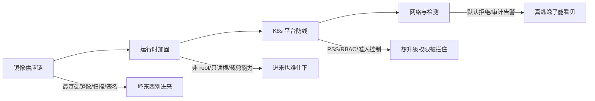

## 1. 心智模型：容器不是「轻量虚拟机」

很多人把容器当作「更省资源的虚拟机」，这直接导致错误的安全预期。两者的隔离强度完全不同：

| 维度       | 虚拟机                 | 容器                          |
| :--------- | :--------------------- | :---------------------------- |
| 隔离边界   | 虚拟化层（硬件辅助）   | 内核命名空间 + cgroup         |
| 内核       | 每个 VM 独立内核       | **所有容器共享宿主机内核**    |
| 逃逸后果   | 拿下一台 VM            | 拿下宿主机 = 拿下全部容器     |
| 默认暴露面 | 少（靠虚拟化层挡住）   | 多（内核系统调用面全部可达）  |

因为共享内核，容器的隔离性由**配置**而不是由**架构**保证：privileged 容器、挂载
Docker socket、挂载宿主机敏感目录，任何一个配置失误都会把「逻辑隔离」降级成
「近乎无隔离」。所以容器安全的第一原则是：**假设逃逸会发生，逐层抬高逃逸成本**。



这四层是递进关系，与云安全的共享责任模型（见 530-CloudSecurity）衔接：云厂商保到
虚拟化层为止，容器以内全部是你的事。

## 2. 镜像安全：供应链的起点

镜像 = 分层文件系统 + 启动配置，一个常见业务镜像 90% 以上的文件来自基础镜像和
依赖包。风险集中在三处：

1. **基础镜像臃肿**：`ubuntu:latest` 里带着包管理器、shell、编译器——攻击者逃逸
   前先在里面装工具；你不用到的每一样东西都是潜在武器。
2. **已知漏洞（CVE）**：基础镜像与语言依赖的漏洞随时间累积，构建时不扫、上线
   前不重扫，就是把过期罐头直接装货。
3. **来源不可信**：镜像名写 `nginx` 而非 `nginx:1.27`，哪天被投毒（typosquatting
   或 tag 被替换）就中招；没有签名的镜像，运行时无从验证「它还是构建时那个它」。

对应的四步实践：

```dockerfile
# 多阶段构建 + 最小运行时镜像（伪代码骨架）
FROM node:22 AS build            # 构建阶段：工具齐全，允许臃肿
COPY . /app
RUN npm ci && npm run build

FROM gcr.io/distroless/nodejs22  # 运行阶段：无 shell、无包管理器
COPY --from=build /app/dist /app
USER nonroot                     # 镜像内声明非 root 用户
ENTRYPOINT ["/nodejs/bin/node", "/app/server.js"]
```

```bash
trivy image --exit-code 1 --severity CRITICAL,HIGH app:1.4.2   # CI 里漏洞即失败
cosign sign app:1.4.2 && cosign verify app:1.4.2               # 签名与验签
```

纪律三条：tag 永远写具体版本、CI 里扫描作为门禁（新 CVE 周期性重扫重建）、
镜像推送到私有仓库并签名验证。

## 3. 运行时加固：抬高逃逸成本

容器默认配置是为「好用」设计的，不是为「安全」设计的。生产部署至少做五件事：

| 加固项                 | 默认行为        | 生产配置                | 防住什么                     |
| :--------------------- | :-------------- | :---------------------- | :--------------------------- |
| 用户                   | root            | `USER 10001` 非 root    | 逃逸后即 root 的宿主权限     |
| 根文件系统             | 可写            | `readOnlyRootFilesystem` | 落盘 Webshell、改系统文件   |
| capabilities           | 全量继承        | 只保留必需（或全 drop） | `CAP_SYS_ADMIN` 等高危能力   |
| seccomp                | Docker 默认档   | `RuntimeDefault` 或更严 | 罕见内核系统调用攻击面       |
| 特权与宿主挂载         | 允许            | **禁止 privileged、禁挂 docker.sock** | 最常见的两条逃逸路径 |

两条最高频的逃逸路径值得背下来：

```text
路径一：privileged 容器
  容器以 --privileged 运行 = 拥有宿主机全部设备与能力
  → mount 宿主机磁盘、加载内核模块，等于直接拿到宿主机

路径二：挂载 Docker socket
  把 /var/run/docker.sock 挂进容器（CI、管理面板常这么干）
  → 容器内用 Docker API 再起一个 privileged 容器挂宿主机根目录 = 宿主机沦陷
```

> 类比：privileged 像把整串钥匙给访客；挂 docker.sock 像把「配钥匙的机器」放进
> 访客房间——两者都是「配置造成的降维」，不是内核漏洞也一样逃逸。

## 4. Kubernetes 平台防线

K8s 把容器管理集中后，安全控制点也集中了。四条主线：

**RBAC：谁能在 API 上做什么。** K8s 里一切操作都是对 API Server 的请求，RBAC
决定「哪个身份对哪些资源有哪些动词」。治理要点：ServiceAccount 按工作负载拆分
（拒绝默认 SA 自动挂载）、不轻易 `cluster-admin`、定期审计 `create pods/exec`
这类高危权限（`kubectl auth can-i` 快速验证）。

**Pod Security Standards（PSS）：Pod 的准入基线。** 三档从宽到严，K8s 1.25 起
稳定内建，作用于命名空间：

| 档位       | 定位       | 典型限制                                       |
| :--------- | :--------- | :--------------------------------------------- |
| privileged | 不设防     | 仅系统组件专用                                  |
| baseline   | 防已知失误 | 禁 privileged、禁宿主网络/宿主路径挂载          |
| restricted | 强加固     | baseline 之上再禁 root、要求 drop ALL、seccomp |

```yaml
# 命名空间层面启用 restricted（生产推荐）
apiVersion: v1
kind: Namespace
metadata:
  name: prod
  labels:
    pod-security.kubernetes.io/enforce: restricted
```

**Secret 管理：别把密钥当普通配置。** 默认 Secret 只是 base64 编码（不是加密），
etcd 未加密时等同明文落库。要点：etcd 静态加密开启、RBAC 收紧 `get secrets`、
优先用云 KMS / External Secrets / Vault 这类外部化方案，配合轮换策略。

**NetworkPolicy：默认拒绝的东西向网络。** Pod 之间默认全通——容器时代「内网即
可信」失效得最彻底的地方。基线做法：每个命名空间先写一条「默认拒绝所有进出」
策略，再按调用关系显式放行（思想与零信任一致，见 320-ZeroTrustArchitecture）。

```yaml
# 命名空间默认拒绝（先立墙，再开小门）
apiVersion: networking.k8s.io/v1
kind: NetworkPolicy
metadata:
  name: default-deny
  namespace: prod
spec:
  podSelector: {}
  policyTypes: ["Ingress", "Egress"]
```

准入控制（Kyverno / OPA Gatekeeper）是这些规则的「执法者」：把「镜像必须来自
私有仓库且已签名」「必须带资源限额」写成集群策略，不合规的 YAML 在创建时就被
拒绝，而不是靠人工 review。

## 5. 动手实践

练习任务（先自己动手，再看下面自检区）：

1. 给一个现有 Deployment 写出 restricted 档要求的 Pod 片段：非 root、只读根
   文件系统、drop 全部 capabilities；运行验证哪些目录仍可写。
2. 用 `kubectl auth can-i --list --as=system:serviceaccount:default:default`
   查看默认 ServiceAccount 的权限，然后关闭它的自动挂载，再查一次，说出差别。
3. 在本地集群（kind/minikube）里先部署 default-deny NetworkPolicy，再验证
   Pod 之间 DNS 与跨 Pod 访问的行为变化。

遮代码自检——先想再对：

提示一：restricted 档的 Pod 安全上下文落在哪个字段？哪些键是必写？

```yaml
spec:
  template:
    spec:
      securityContext:            # Pod 级
        runAsNonRoot: true
        seccompProfile:
          type: RuntimeDefault
      containers:
        - name: app
          securityContext:        # 容器级（逐容器生效）
            allowPrivilegeEscalation: false
            readOnlyRootFilesystem: true
            capabilities:
              drop: ["ALL"]
          volumeMounts:
            - name: tmp
              mountPath: /tmp     # 应用必须可写的目录单独挂 emptyDir
      volumes:
        - name: tmp
          emptyDir: {}
```

提示二：关闭默认 SA 自动挂载是哪个开关、写在谁身上？

```yaml
# 方式一：在 ServiceAccount 上关闭
apiVersion: v1
kind: ServiceAccount
metadata:
  name: default
automountServiceAccountToken: false
# 方式二：在 Pod spec 里按需关闭
#   spec.automountServiceAccountToken: false
# 关闭后 Pod 内不再出现 /var/run/secrets/kubernetes.io/serviceaccount/token，
# 「无 API 需求的容器」从此拿不到集群身份——横向移动少一条路。
```

提示三：default-deny 生效后，怎么只放行「从 frontend 到 backend:8080」？

```yaml
apiVersion: networking.k8s.io/v1
kind: NetworkPolicy
metadata:
  name: allow-frontend-to-backend
  namespace: prod
spec:
  podSelector:
    matchLabels: { app: backend }   # 作用对象：backend 这批 Pod
  policyTypes: ["Ingress"]
  ingress:
    - from:
        - podSelector:
            matchLabels: { app: frontend }   # 且来源是 frontend 这批
      ports:
        - port: 8080
          protocol: TCP
```

## 6. 常见误区

| 误区                                   | 事实                                                       |
| :------------------------------------- | :--------------------------------------------------------- |
| 「容器天生隔离，不用加固」              | 隔离靠共享内核 + 配置，privileged/socket 挂载即降维        |
| 「镜像扫一次就安全」                    | 新 CVE 持续公开，需周期性重扫与重建                        |
| 「K8s Secret 是加密的」                 | 默认只是 base64 编码；需 etcd 加密或外部密钥管理           |
| 「集群内有网络隔离」                    | Pod 间默认全通，NetworkPolicy 不写就没有                    |
| 「业务容器用 cluster-admin 图省事」     | 一次容器沦陷即整集群沦陷，ServiceAccount 必须最小化        |
| 「PSS 是可选项」                        | 1.25 起已内建稳定，生产命名空间至少 baseline               |

## 小结

- **初学者要点**：容器共享宿主机内核，隔离强度低于 VM，安全靠逐层配置；先管住
  镜像（最小化、扫描、签名），再管运行时（非 root、只读根、禁 privileged）。
- **进阶注意**：K8s 四条防线——RBAC 最小化（盯住 `pods/exec`）、PSS 三档准入
  （生产用 restricted）、Secret 外部化与 etcd 加密、NetworkPolicy 默认拒绝；
  privileged 与 docker.sock 挂载是两条必背逃逸路径，准入控制工具把它们变成
  集群级硬约束。
