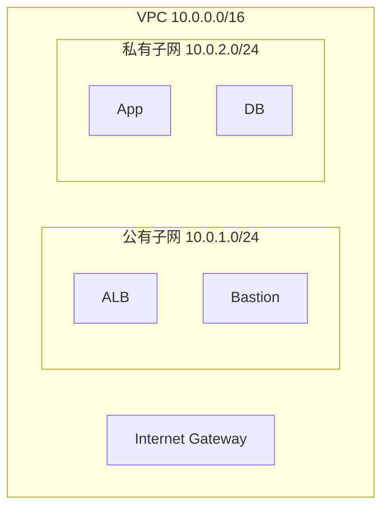
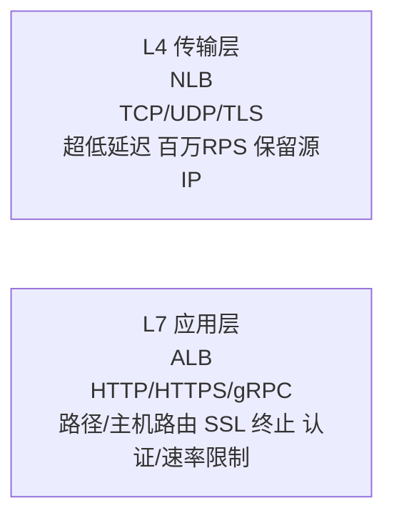
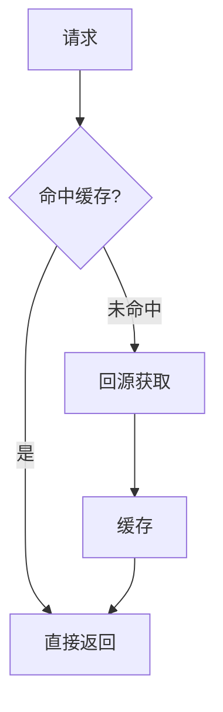
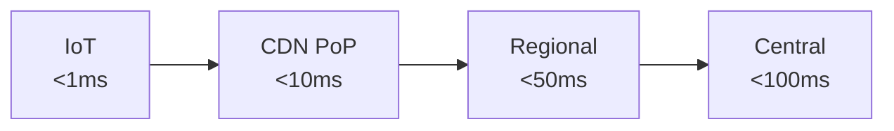
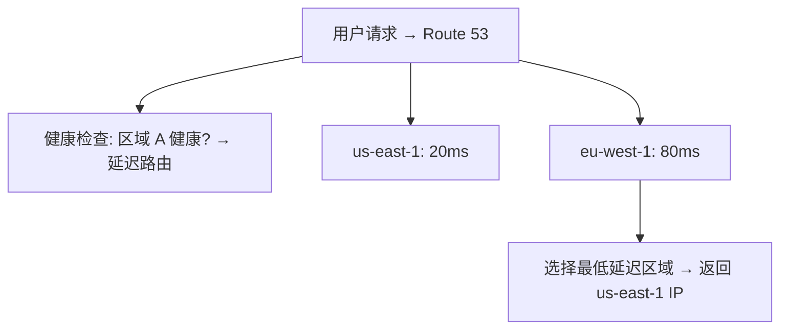
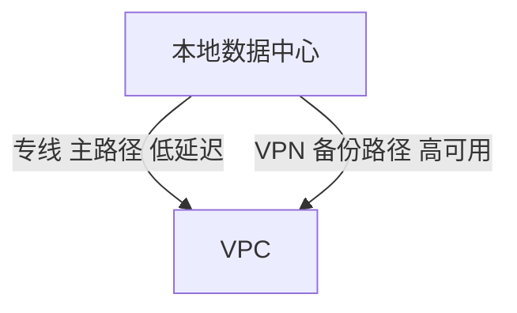
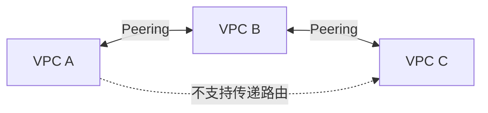
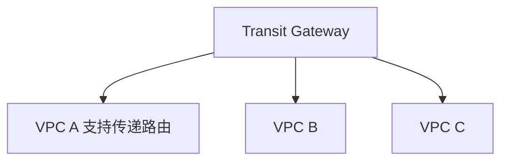
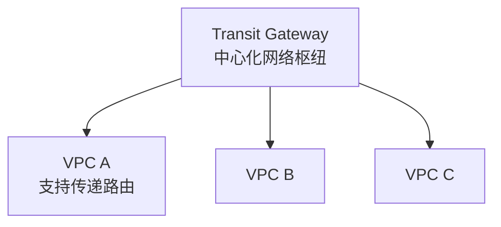

## 1. 虚拟私有云（VPC）

### 1.1 VPC 核心概念

VPC（Virtual Private Cloud）是云上的隔离虚拟网络，用户可自定义 IP 地址范围、子网、路由表和网关：



### 1.2 子网设计

**三层架构子网规划**：

| 层级    | 子网     | CIDR        | 可公网访问 | 用途              |
| ------- | -------- | ----------- | ---------- | ----------------- |
| Web 层  | 公有子网 | 10.0.1.0/24 | 是         | ALB、NAT、Bastion |
| App 层  | 私有子网 | 10.0.2.0/24 | 否         | 应用服务器        |
| Data 层 | 私有子网 | 10.0.3.0/24 | 否         | 数据库、缓存      |

**CIDR 容量计算**：

$$
\text{可用 IP 数} = 2^{(32 - \text{前缀长度})} - 5
$$

其中减去 5 个保留地址：网络地址、广播地址、网关地址、DNS 地址、广播地址。

### 1.3 安全组与网络 ACL

| 特性 | 安全组                     | 网络 ACL                 |
| ---- | -------------------------- | ------------------------ |
| 层级 | 实例级                     | 子网级                   |
| 状态 | 有状态（自动放行返回流量） | 无状态（需显式放行双向） |
| 规则 | 仅允许规则                 | 允许 + 拒绝规则          |
| 评估 | 全部规则评估               | 按规则编号顺序评估       |
| 默认 | 拒绝所有入站，允许所有出站 | 允许所有入站和出站       |

**最小权限安全组设计**：

```
ALB 安全组:
  入站: 80, 443 from 0.0.0.0/0
  出站: 8080 to App 安全组

App 安全组:
  入站: 8080 from ALB 安全组
  出站: 3306 to DB 安全组, 6379 to Redis 安全组

DB 安全组:
  入站: 3306 from App 安全组
  出站: 无
```

## 2. 负载均衡

### 2.1 负载均衡类型



### 2.2 ALB 路由规则

ALB 基于请求内容进行路由：

```mermaid
flowchart TD
    R1[IF Host = api.example.com AND Path = /users/* → Forward to user-service]
    R2[IF Host = api.example.com AND Path = /orders/* → Forward to order-service]
    R3[IF Path = /static/* → Redirect to CDN]
    R4[IF Header[X-Canary] = true → Forward to canary-service 10%]
```

### 2.3 负载均衡算法

| 算法       | 描述               | 适用场景 |
| ---------- | ------------------ | -------- |
| 轮询       | 依次分配           | 均匀负载 |
| 最少连接   | 分配给连接数最少的 | 长连接   |
| IP 哈希    | 基于客户端 IP 哈希 | 会话保持 |
| 加权轮询   | 按权重分配         | 异构实例 |
| 随机       | 随机选择           | 简单场景 |
| 一致性哈希 | 最小化哈希变更     | 缓存亲和 |

一致性哈希虚拟节点数选择：

$$
\text{虚拟节点数} = \frac{\text{物理节点数} \times 150}{\text{允许的负载偏差百分比}}
$$

## 3. CDN 与边缘计算

### 3.1 CDN 工作原理



**CDN 关键指标**：

$$
\text{缓存命中率} = \frac{\text{缓存命中请求数}}{\text{总请求数}} \times 100\%
$$

$$
\text{目标缓存命中率} > 95\%
$$

### 3.2 CloudFront 功能

| 功能                   | 描述                        |
| ---------------------- | --------------------------- |
| Lambda@Edge            | 在边缘节点运行 Lambda 函数  |
| CloudFront Functions   | 轻量级 JS 函数（<1ms 启动） |
| Field Level Encryption | 敏感字段端到端加密          |
| Origin Access Control  | 限制 S3 仅允许 CDN 访问     |
| Real-time Logs         | 实时访问日志流              |
| Signed URL/Cookie      | 付费内容保护                |

### 3.3 边缘计算

边缘计算将计算推到离用户更近的位置：



边缘计算应用场景：

- **IoT 网关**：本地数据预处理与过滤
- **实时视频分析**：边缘推理，减少回传带宽
- **AR/VR 渲染**：低延迟渲染
- **游戏加速**：就近匹配与计算

## 4. DNS 服务

### 4.1 Route 53

AWS Route 53 是高可用的 DNS 服务：

**路由策略**：

| 策略        | 描述         | 适用场景           |
| ----------- | ------------ | ------------------ |
| Simple      | 单一记录     | 单服务器           |
| Weighted    | 按权重分配   | A/B 测试、灰度发布 |
| Latency     | 延迟最优路由 | 多区域部署         |
| Failover    | 主备切换     | 灾难恢复           |
| Geolocation | 地理位置路由 | 本地化内容         |
| Multi-value | 返回多个值   | 简单负载均衡       |

### 4.2 全局流量管理

多区域部署的 DNS 策略：



### 4.3 DNS 安全

- **DNSSEC**：DNS 响应签名验证，防止 DNS 欺骗
- **DNS over HTTPS (DoH)**：加密 DNS 查询
- **DNS over TLS (DoT)**：TLS 加密 DNS 查询
- **域名锁定**：防止未授权的域名转移

## 5. 专线与 VPN

### 5.1 VPN 连接

**Site-to-Site VPN**：IPsec 隧道连接本地网络与 VPC


- 两条隧道自动冗余
- 带宽：1.25 Gbps/隧道
- 加密：AES-256
- 延迟：受公网影响，不稳定

**Client VPN**：OpenVPN 客户端连接 VPC

### 5.2 专线连接（Direct Connect）

专线提供专用物理连接：


| 带宽          | 延迟     | 稳定性 | 成本 |
| ------------- | -------- | ------ | ---- |
| 1/10/100 Gbps | 低且稳定 | 高     | 高   |

**专线 + VPN 双路径架构**：



### 5.3 VPC 对等连接与中转网关

**VPC Peering**：点对点连接两个 VPC



**Transit Gateway**：中心化网络枢纽



Transit Gateway 支持路由表、多区域对等、IPsec VPN 附件。

## 6. 网络架构设计

### 6.1 多账户网络架构

企业级多账户网络拓扑：



### 6.2 网络分段与零信任

零信任网络架构原则：

- **永不信任，始终验证**：每次访问都需认证授权
- **最小权限**：仅授予完成任务所需的最小权限
- **微分段**：细粒度网络隔离
- **持续监控**：实时检测异常行为

### 6.3 网络性能优化

**TCP 优化**：

$$
\text{BDP} = \text{带宽} \times \text{RTT}
$$

$$
\text{最优窗口大小} = \frac{\text{BDP}}{\text{MSS}}
$$

例如：10 Gbps 链路，RTT = 10ms，MSS = 1460 字节：

$$
\text{BDP} = 10 \times 10^9 \times 0.01 = 100 \text{ MB}
$$

$$
\text{窗口大小} = \frac{100 \times 10^6}{1460} \approx 68{,}493
$$

**网络优化清单**：

- [ ] 启用 TCP 窗口缩放（Window Scaling）
- [ ] 调整 TCP 缓冲区大小
- [ ] 启用 ECN（Explicit Congestion Notification）
- [ ] 使用 jumbo frame（MTU 9001）
- [ ] 启用 TCP Fast Open
- [ ] 选择合适的 TCP 拥塞控制算法（BBR / Cubic）
