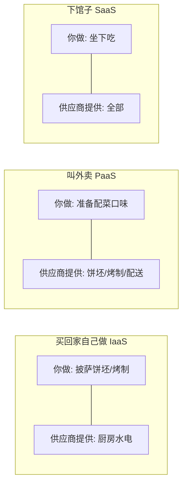
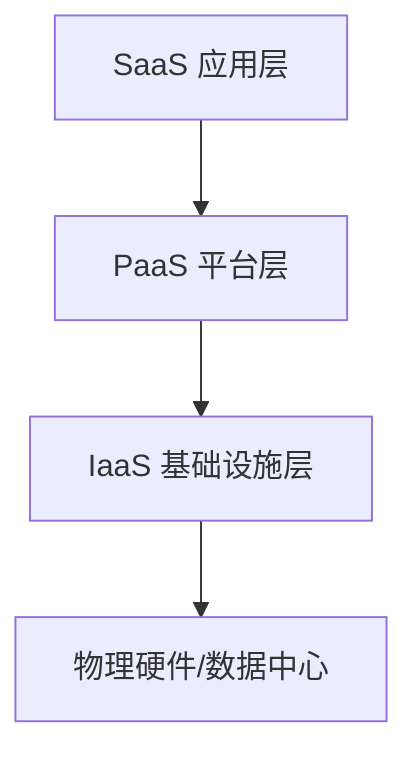

## 前置知识与学习目标

「云计算服务模式」回答的问题是：**供应商管到哪一层，你自己管哪一层**。
同样的应用，部署在云主机上和部署在函数计算上，你的运维工作量天差地别。
理解服务模式是阅读一切云产品文档的前提。

完成本文后，你应当能够：

1. 用「披萨」类比向别人讲清 IaaS/PaaS/SaaS 的边界；
2. 看懂任何一家云商产品页时，快速归类它是哪种模式；
3. 理解责任共担模型，知道安全事件中「谁的责任」怎么划分；
4. 为一个具体业务做出初步的模式选型。

## 1. 一个类比：在家吃披萨的三种方式

业界常用「披萨即服务」（Pizza as a Service）类比三种模式：



| 模式 | 你负责 | 供应商负责 | 类比 |
| :--- | :--- | :--- | :--- |
| IaaS | 操作系统及以上的一切 | 机房、硬件、虚拟化 | 租毛坯房 |
| PaaS | 应用代码与数据 | 操作系统、运行时、扩缩容 | 租精装房 |
| SaaS | 使用与配置 | 一切 | 住酒店 |

这个类比在「数据」维度会失真：无论哪种模式，**数据永远是你的责任**，
酒店不管你财物安全。类比到此为止，严谨的责任划分见下节。

## 2. 服务模式层级与责任共担

### 2.1 层级结构



上层的模式总是包含下层的全部能力，再加一层托管。所以 PaaS 是「IaaS +
平台托管」，SaaS 是「PaaS + 应用托管」。边界越往下，你的自由度越大、
运维负担越重。

### 2.2 责任共担矩阵

| 层级     | IaaS   | PaaS   | SaaS   |
| -------- | ------ | ------ | ------ |
| 应用     | 客户   | 客户   | 供应商 |
| 数据     | 客户   | 客户   | 供应商 |
| 运行时   | 客户   | 供应商 | 供应商 |
| 中间件   | 客户   | 供应商 | 供应商 |
| 操作系统 | 客户   | 供应商 | 供应商 |
| 虚拟化   | 供应商 | 供应商 | 供应商 |
| 服务器   | 供应商 | 供应商 | 供应商 |
| 存储     | 供应商 | 供应商 | 供应商 |
| 网络     | 供应商 | 供应商 | 供应商 |

> 关键认知：**安全是共担的**。IaaS 下云商保证「云本身安全」（物理隔离、
> 宿主机加固），你保证「云上安全」（系统补丁、安全组、账号权限）。历史上
> 大量云上泄露事件（桶配公开、密钥入库）都发生在客户责任区——云商的
> 合规认证不等于你的应用安全。

### 2.3 两个衍生概念

- **FaaS（函数即服务）**：PaaS 的进一步细分，连「常驻进程」都不用管，
  按调用次数与执行时长计费（AWS Lambda、Cloud Functions）。详见
  `260-ServerlessArchitecture`。
- **托管服务（Managed Service）**：数据库、消息队列等中间件的托管形态
  （RDS、Cloud SQL），介于 PaaS 与 IaaS 之间——供应商管到数据库引擎层，
  你管数据与连接。它的出现模糊了三层边界，现代云架构往往按「单个组件」
  选模式，而非整个应用一刀切。

## 3. IaaS（基础设施即服务）

提供虚拟化的计算资源（虚拟机、存储、网络），用户自行管理操作系统及
以上层级。典型心智模型：**你拥有一台没有运维接管的云上服务器**。

| 服务   | 描述             | 示例                 |
| ------ | ---------------- | ---------------- |
| 计算   | 虚拟机/裸金属    | EC2, ECS, VM      |
| 存储   | 块/对象/文件存储 | S3, EBS, OSS      |
| 网络   | VPC/负载均衡     | VPC, ELB, SLB    |

适用场景：需要完全控制操作系统、自定义运行时环境、迁移传统应用
（lift-and-shift）、高性能计算。

代表产品：AWS EC2/S3/VPC；Azure Virtual Machines/Blob；GCP Compute
Engine/Cloud Storage；阿里云 ECS/OSS/VPC。

主要代价：你要管补丁、镜像、备份、扩容与安全加固——这些在 SaaS 世界
是别人替你做的事。

## 4. PaaS（平台即服务）

提供应用运行平台，用户只交付代码与配置，平台负责运行时、扩缩容与
大部分运维。典型心智模型：**git push 之后就不用管了**。

| 服务     | 描述         | 示例                  |
| -------- | ------------ | --------------------- |
| 运行时   | 语言运行环境 | Node.js, Python, Java |
| 中间件   | 应用服务器   | Tomcat, Nginx         |
| 数据库   | 托管数据库   | RDS, Cloud SQL        |
| 消息队列 | 托管消息     | SQS, MQ               |

适用场景：快速应用开发、微服务架构、API 后端、无专职运维的团队。

代表产品：AWS Elastic Beanstalk、Azure App Service、GCP App Engine/Cloud
Run、阿里云 SAE、Heroku。注意各家的「托管数据库/消息队列」也按 PaaS
心智使用。

代价与陷阱：平台能力边界即你的天花板——特定版本要求、无法 SSH 进去
装底层依赖、按平台方式计费（不透明时账单易超预期）；平台绑定带来的
迁移成本也要提前评估。

## 5. SaaS（软件即服务）

直接提供可用的软件应用，用户通过浏览器或 API 使用，无需安装和维护。

核心特征：多租户架构（一套系统服务众多客户，数据逻辑隔离）、按订阅
付费、自动更新、随时随地访问。

代表产品：协作（Slack/Teams/飞书）、CRM（Salesforce）、办公（Google
Workspace/Microsoft 365）、设计（Figma）、开发（GitHub/GitLab）。

对开发者而言 SaaS 有两层意义：一是**消费者**（用 GitHub 写代码）；
二是**生产者**（你的产品可能就该做成 SaaS——订阅制、多租户、自助开通）。

## 6. 选型指南

### 6.1 决策矩阵

| 需求     | IaaS | PaaS | SaaS |
| -------- | ---- | ---- | ---- |
| 完全控制 | 强   | 弱   | 无   |
| 快速上线 | 慢   | 快   | 最快 |
| 定制化   | 强   | 中   | 弱   |
| 运维成本 | 高   | 中   | 低   |
| 技术门槛 | 高   | 中   | 低   |
| 长期成本 | 中   | 中   | 高（随人数线性增长） |

三个追问帮助决策：

1. **有没有必须自管的合规/特殊软件？** 有 -> IaaS 起步。
2. **团队有没有专职运维？** 没有 -> PaaS/SaaS 优先。
3. **这个东西是差异化竞争力吗？** 不是 -> 别自建，买 SaaS。

### 6.2 混合策略（现实中的常态）

```text
核心业务（有特殊性能/合规要求） -> IaaS 或自管 K8s
应用服务（业务逻辑迭代为主）   -> PaaS / 托管 K8s
通用能力（邮件、文档、CRM）    -> SaaS
事件驱动的小片段逻辑           -> FaaS
```

一个典型电商可能同时用五种模式：商品服务跑托管 Kubernetes（PaaS 思维），
历史订单归档到对象存储（IaaS），风控调用云商 AI API（SaaS），大促峰值
用函数计算削峰（FaaS），团队协作用飞书（SaaS）。**按组件选模式，而不是
给公司贴一个标签**。

## 7. 常见坑与定责实录

**坑一：把云商的合规认证当成自己的安全豁免。** 云商持有 SOC 2 / 等保 /
ISO 认证，只覆盖「云本身安全」这一半。真实泄露几乎都发生在客户责任区：
对象存储桶误设公开、密钥硬编码进仓库、虚拟机补丁半年没打。读云商安全
白皮书时，先找责任共担矩阵那一页，圈出「这一层是你」的部分。

**坑二：低估 PaaS 的天花板。** PaaS 的能力边界就是你的天花板。典型翻车：
应用需要调用 OS 级二进制（文档转码、图像处理依赖），托管运行时装不了，
项目中途被迫迁去容器或 IaaS。选 PaaS 前把「有没有 OS 级依赖、特殊端口、
自定义内核参数」列成清单逐一过。

**坑三：SaaS 的按席位成本失速。** SaaS 单价看着便宜，按人计费在团队
扩张时是线性甚至阶梯增长的。选型时用「三年人数曲线」算总账，而不是
只看本月账单；同时确认导出能力——SaaS 数据拿不走，锁定就成立了。

**坑四：把「云存了」当成「有备份」。** 三种模式里数据责任都在你（SaaS
除外），但云存储的持久性（如对象存储的 11 个 9）说的是**硬件不丢**，
不是「你删错/被勒索后能恢复」。开启版本控制、跨账户备份副本、定期演练
恢复，这三件事在 IaaS/PaaS 下永远是客户侧责任。

## 8. 面试题思路

- **「责任共担模型，说说 IaaS 与 SaaS 下同一次数据泄露的定责差异」**：
  抓手是矩阵而不是背书。IaaS 下应用/数据全在客户侧，泄露多定责客户
  （除非证明虚拟化层被攻破）；SaaS 下应用与数据由供应商托管，泄露默认
  供应商责任，但客户对「账号权限管理与配置」仍负责（把管理员账号借给
  外包导致泄露，责任就说不清了）。答到「安全是共担的、按层归属」即可
  站住，能举桶公开的例子是加分项。
- **「给你们公司 3 个系统选服务模式，怎么选？」**：不要直接报答案，先
  当场跑三连问（合规/自管需求、运维能力、是否差异化竞争力），再用
  「按组件选模式」收尾。面试官考察的是决策过程而非结论。
- **「FaaS 算哪一层？」**：陷阱题。按「供应商管到哪层」回答——管到
  运行时之上，属于 PaaS 的极端形态（所以业界常把它并进 Serverless），
  但「你上传的代码与依赖」仍是客户责任区。能说出边界仍在移动，比硬
  归类更好。

## 9. 动手练习

练习一：事故定责判断（10 分钟）。

**任务**：对下面 5 起事故分别判断主要责任在客户还是供应商，并用 2.2 的
责任矩阵说出一层依据：

1. IaaS 虚拟机半年未打系统补丁，被入侵后拖库；
2. 可用区级机房断电，单可用区部署的虚拟机全部停机 40 分钟；
3. 客户员工把存有密钥的对象存储桶误设为公开可读；
4. SaaS 厂商数据库被拖库，你的客户数据泄露；
5. 托管数据库主从切换期间出现 90 秒连接抖动。

**提示**：先问「出事的层属于谁」；第 2、5 题注意追一层——除了「谁的
责任」，还要问「客户的高可用设计有没有放大影响」。

**参考答案**：1 客户（操作系统层补丁）；2 供应商对故障负责，但客户把
生产系统压在单可用区属于设计责任，两面都要说；3 客户（桶配置是客户
责任区的经典例子）；4 供应商（应用与数据托管方），但客户仍需履行合同
追责、通知义务与导出备份；5 供应商（引擎层），客户未实现重试与只读
降级则放大了业务影响。全部答对的标准不是「二选一」，而是能说出层的
归属与设计责任两个维度。

练习二：按组件选模式（15 分钟）。

**任务**：一家在线教育公司有 6 个系统：自研协议直播推流网关、课程管理
后台、HR 系统、离线数据仓库、AI 口语评分（调商用 API 即可）、企业邮箱。
用第 6 节的三连问给每个系统选模式（IaaS/PaaS/SaaS/FaaS/托管中间件均可），
每个写一句理由。

**提示**：两个系统有明确的「硬约束信号」——自研协议意味着 OS 网络栈
控制权，「调商用 API 即可」意味着能力已商品化。先标记硬约束，其余的
再按三连问排。

**参考答案**：

| 系统 | 选型 | 一句理由 |
| :--- | :--- | :--- |
| 直播推流网关 | IaaS 或自管容器 | 自研协议要 OS 网络栈与端口控制权 |
| 课程管理后台 | PaaS / 托管 K8s | 标准 Web 应用，吃托管红利 |
| HR 系统 | SaaS | 商品化能力，自建即负债 |
| 离线数仓 | 托管数仓服务 | 重运维轻差异化 |
| AI 口语评分 | SaaS（云商 AI API） | 无差异化且自研成本高 |
| 企业邮箱 | SaaS | 完全商品化 |

练习三：扩展责任矩阵（10 分钟）。

**任务**：把 2.2 的矩阵向右扩两列——FaaS 与托管数据库——逐行填写
「客户 / 供应商」，并为至少两处与直觉不同的格子写出理由。

**提示**：判断口径仍然是「出事的层归谁管」。FaaS 容易错在「依赖与
镜像」一行；托管数据库容易错在「账号与权限」一行。

**参考答案**：FaaS——应用、数据、代码依赖与配置为客户；运行时、
伸缩及以下全部供应商。托管数据库——数据、连接账号与权限、SQL 与
索引设计为客户；数据库引擎、OS、虚拟化及以下为供应商。与直觉不同的
两处：FaaS 的「代码依赖」仍属客户（你上传的包引入漏洞是客户责任）；
托管数据库的「账号权限」属客户（云商不替你决定谁能连库）。

## 小结

- 初学者要点：三种模式回答「供应商管到哪层」；越往下（IaaS）越自由也
  越累，越往上（SaaS）越省事也越受制于人；数据与账号安全永远是你的
  责任；选型按组件拆分，核心业务可 IaaS、通用能力用 SaaS。
- 进阶注意：责任共担模型是云安全审计与事故定责的基础框架；FaaS 与托管
  服务让三层边界日益模糊，判断「哪种模式」时问「哪一层之后是我的代码/
  数据」比记定义更可靠；PaaS 的平台边界与锁定成本、SaaS 的按席位长期
  成本，都是 TCO 计算里容易被低估的部分。

## 自我检查

- 能不看资料向同事讲清披萨类比在哪个维度失真（数据责任），并给出严谨
  的责任矩阵读法；
- 看到任一云产品页，能在 30 秒内说出它属于哪种模式、判断依据是
  「供应商管到哪一层」；
- 能对一起云上事故给出「层归属 + 设计责任」两个维度的定责分析；
- 能用三连问（合规/自管、运维能力、差异化）为一个具体系统完成选型并
  说出代价；
- 能说出 PaaS 天花板、SaaS 席位成本、「云存了不等于有备份」这三个坑的
  判断信号。
