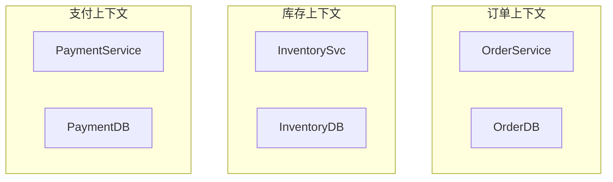

## 1. 微服务概述

### 1.1 什么是微服务

微服务是一种将应用拆分为一组小型、独立部署的服务的架构风格。

### 1.2 与单体架构对比

| 对比项 | 单体架构 | 微服务架构 |
| ------ | -------- | ---------- |
| 部署   | 整体部署 | 独立部署   |
| 技术栈 | 统一     | 异构       |
| 扩展   | 整体扩展 | 按需扩展   |
| 故障   | 全局影响 | 局部影响   |
| 团队   | 集中     | 分散       |
| 复杂度 | 代码复杂 | 运维复杂   |

### 1.3 何时使用微服务

| 场景          | 推荐   |
| ------------- | ------ |
| 小团队/初创   | 单体   |
| 大型复杂系统  | 微服务 |
| 快速验证      | 单体   |
| 高并发/多团队 | 微服务 |

## 2. 服务拆分策略

### 2.1 拆分原则

| 原则     | 描述                   |
| -------- | ---------------------- |
| 单一职责 | 每个服务一个业务能力   |
| 高内聚   | 相关功能放在一起       |
| 松耦合   | 服务间依赖最小化       |
| 独立部署 | 可独立发布             |
| 数据自治 | 每个服务有自己的数据库 |

### 2.2 拆分方法

| 方法       | 描述             |
| ---------- | ---------------- |
| 按业务能力 | 围绕业务功能拆分 |
| 按子域     | DDD 限界上下文   |
| 按用例     | 围绕用户场景     |
| 按数据     | 围绕数据所有权   |

### 2.3 DDD 限界上下文



## 3. 服务通信

### 3.1 同步通信

| 方式    | 协议           | 特点           |
| ------- | -------------- | -------------- |
| REST    | HTTP/JSON      | 简单、通用     |
| gRPC    | HTTP2/Protobuf | 高性能、强类型 |
| GraphQL | HTTP/JSON      | 灵活查询       |

### 3.2 异步通信

| 方式     | 协议          | 特点           |
| -------- | ------------- | -------------- |
| 消息队列 | AMQP          | 解耦、削峰     |
| 事件驱动 | Kafka         | 高吞吐、持久化 |
| 事件总线 | Redis Streams | 轻量级         |

### 3.3 通信模式

| 模式      | 描述         | 适用场景   |
| --------- | ------------ | ---------- |
| 请求-响应 | 同步调用     | 查询类     |
| 事件通知  | 异步通知     | 状态变更   |
| 事件溯源  | 存储所有事件 | 审计、回放 |
| CQRS      | 读写分离     | 复杂查询   |

### 3.4 Saga 模式

跨服务分布式事务的主流解法：把事务拆成一系列本地事务，每步都有对应
的**补偿操作**，失败时反向补偿（而不是回滚数据库）。

**编舞式（Choreography，无中心）**：服务通过事件互相触发，谁也不指挥谁：

```
OrderService → 事件 OrderCreated → InventoryService 预留库存
             → 事件 InventoryReserved → PaymentService 扣款
                      ↓ 任一步失败
        发布补偿事件：CancelOrder ← RefundPayment
```

**编排式（Orchestration，有中心）**：由协调器（或订单服务自身）顺序
调用各参与方，失败时由协调器执行补偿命令：

```
Saga 协调器 → 调用 ReserveInventory → 调用 ProcessPayment
                    ↓ 失败
        协调器 → RefundPayment → CancelOrder
```

| 形态 | 优点 | 缺点 |
| :--- | :--- | :--- |
| 编舞式 | 松耦合、无单点 | 流程散落在事件里，难追踪全局 |
| 编排式 | 流程集中可见、易加步骤 | 协调器可能成为瓶颈/单点 |

简单流程（2-3 步）用编舞式，复杂长流程（步骤多、需监控）用编排式。

## 4. 数据管理

### 4.1 数据库每服务一个

```
每个服务独占自己的数据库
服务间禁止直接访问对方的数据库（只能走 API 或事件）
跨服务查询通过 API 组合或数据复制实现
```

> 这条是微服务数据架构的红线：一旦 A 服务直连 B 服务的库，B 的 schema
> 变更就会破坏 A，两个服务事实上被焊死——「独立部署」从此名存实亡。

### 4.2 数据一致性

| 策略       | 描述          |
| ---------- | ------------- |
| 强一致性   | 2PC（不推荐） |
| 最终一致性 | Saga + 事件   |
| 补偿事务   | 失败时回滚    |

### 4.3 API 组合

```
API Gateway → 聚合多个服务的数据 → 返回给客户端

GET /order-details/123
  → OrderService: 订单信息
  → InventoryService: 库存状态
  → PaymentService: 支付状态
  → 组合返回
```

## 5. 服务治理

### 5.1 服务发现

| 方式       | 描述                   |
| ---------- | ---------------------- |
| 客户端发现 | 客户端查询注册中心     |
| 服务端发现 | 负载均衡器查询注册中心 |

### 5.2 负载均衡

| 策略     | 描述             |
| -------- | ---------------- |
| 轮询     | 依次分配         |
| 随机     | 随机分配         |
| 加权     | 按权重分配       |
| 最少连接 | 分配给连接最少的 |

### 5.3 熔断器

```javascript
// 熔断器状态机
CLOSED → (错误率超阈值) → OPEN
OPEN → (超时后) → HALF_OPEN
HALF_OPEN → (探测成功) → CLOSED
HALF_OPEN → (探测失败) → OPEN
```

### 5.4 限流

| 算法     | 描述             |
| -------- | ---------------- |
| 固定窗口 | 固定时间窗口计数 |
| 滑动窗口 | 平滑计数         |
| 令牌桶   | 匀速生成令牌     |
| 漏桶     | 匀速消费请求     |

## 6. 微服务最佳实践

| 实践       | 描述                 |
| ---------- | -------------------- |
| API 版本化 | `/api/v1/resource`   |
| 幂等设计   | 重复请求结果一致     |
| 健康检查   | `/health` 端点       |
| 优雅降级   | 依赖失败时的备选方案 |
| 配置外部化 | 环境变量/配置中心    |
| 可观测性   | 日志+指标+追踪       |
| 契约测试   | 消费者驱动契约       |
| CI/CD      | 每个服务独立流水线   |

## 7. 常见坑与反模式实录

**坑一：分布式单体（Distributed Monolith）。** 表面上服务拆开、进程分开，
但服务间全是同步调用串成一条链，任何一个发布都要拉着五个服务一起上——
这叫分布式单体，比单体更糟：单体的运维复杂度没躲掉，还叠加了网络不可靠。
识别信号：一次需求改动要跨 3 个以上服务同时发布；服务 A 挂了 B 也挂。
根源通常是按「技术分层」（web 层、service 层、dao 层各拆一个服务）而非
按业务能力拆分。

**坑二：共享库变成隐性耦合。** 拆出十个服务，又共建一个「common 包」
装所有领域模型与 DTO，任何字段变更要十个服务同步升级。共享的应该是
协议（契约）而不是实现；领域模型宁可各服务内冗余一份，靠契约测试守住
边界。

**坑三：同步调用链雪崩。** 请求经过 A -> B -> C -> D 四层同步调用，
延迟与失败率是乘法关系：每层 99% 可用，整链只有 96%；每层 50ms，
整链 200ms 起步。所以第 3 节的红线才有下半句：**查询能组合成事件
驱动的，尽量异步化**；同步链必须配上熔断（5.3）与超时预算逐层递减。

**坑四：拆太细（nano-service）。** 一个服务只做「加购物车」这一件事，
结果是网络调用次数爆炸、追踪成本超过收益。经验判断：一个服务至少要
「一个团队可独立负责 + 一次发布不需要邻居配合」才配独立存在；拆分
永远可以事后做，合并回单体却很难体面。

**坑五：数据双主。** 两个服务都允许写同一份数据（各自有库但语义上
同一实体），靠互相通知来对齐——漂移是必然结局。每个实体必须有唯一
的「写权威」服务，其他服务只读、只缓存。

## 8. 面试题思路

- **「单体到微服务，什么时候值得拆？」**：用「痛点驱动」回答而不是
  「潮流驱动」。可拆的信号：多团队在同一代码库上互相阻塞发布；不同
  模块资源画像差异大到无法统一扩容（如风控要 GPU、查询要内存）；
  单模块故障拖垮全局。答完要主动补反面：小团队、快速验证期先模块化
  单体（逻辑上按限界上下文分层），部署上拆分是第二阶段。
- **「为什么跨服务事务不用 2PC 而用 Saga？」**：抓住两个要害——2PC
  在参与者间持锁等待协调者，微服务里参与者是网络节点，一个宕机就让
  全链阻塞，可用性崩塌；Saga 把原子性换成「每步本地提交 + 失败反向
  补偿」，牺牲隔离性换取可用性，代价是要业务上接受中间状态可见（所以
  配合「预留/确认」语义而非直接扣减）。
- **「服务应该拆多细？」**：给判断标准而不是数字。三条：数据所有权
  是否清晰可分；变更节奏是否差异明显（天天改的和一年改一次的分开）；
  团队规模是否养得起独立运维。以「康威定律」收尾：服务边界最终会
  长成组织沟通结构的形状，拆分方案要和团队规划一起定。

## 9. 动手练习

练习一：拆分演练（20 分钟）。

**任务**：一个单体电商的「下单」流程包含：参数校验、扣库存、生成订单、
调支付网关、加积分、发短信通知、写操作日志。按限界上下文列出你认为
该拆成哪些服务、每个服务拥有哪些数据、哪些功能先拆哪些后拆。

**提示**：先按「数据所有权」画归属（谁的数据谁的服务），再看「变更
节奏」（促销期改的是谁）；通知、日志这类旁路逻辑天然适合事件驱动，
不占同步链。

**参考答案**（一种合理拆法，能自洽即可）：

| 服务 | 拥有数据 | 拆分顺序 |
| :--- | :--- | :--- |
| 订单服务 | 订单主表 | 最后（是编排核心，先拆会牵连） |
| 库存服务 | SKU 余量 | 第一个（高并发、资源画像独特） |
| 支付服务 | 支付流水与网关凭据 | 第二（合规隔离：卡号不出域） |
| 积分服务 | 积分账户 | 随后（变更节奏独立，非关键路径） |
| 通知服务 | 模板与发送记录 | 随后（事件驱动旁路，先做消息化再做拆分） |

操作日志与参数校验不拆：前者是平台设施（归属可观测层），后者属于
订单服务内部的领域逻辑——拆掉它是典型的 nano-service。

练习二：Saga 补偿设计（15 分钟）。

**任务**：对「下单」走编排式 Saga：扣库存 -> 扣款 -> 加积分。写出
每一步的正向操作、对应补偿操作，并推演「扣款超时」时的完整事件序列；
回答：为什么积分补偿不需要「扣积分」之外的额外动作？

**提示**：补偿是「业务上的反悔」不是「数据库回滚」；库存的补偿动词
是「释放预留」而不是「加回去」（中间可能有其他订单消耗）。

**参考答案**：

```text
正向链：
  OrderSaga -> 库存服务 Reserve(stockId, n)      本地事务，返回预留单号
           -> 支付服务 Charge(orderId, amount)   本地事务
           -> 积分服务 Award(orderId, points)    本地事务
           -> 完成，发布 OrderCompleted

推演：Charge 超时
  1. 协调器对 Charge 记为 unknown，进入重试查询（防悬挂）
  2. 查询确认未成功（或成功则走冲正 Refund）
  3. 依次执行补偿：ReleaseStock(预留单号) -> 记录积分未发放
  4. 订单置为 Failed，发布 OrderFailed（下游订阅者据此回滚 UI）
```

积分是「只加分、不扣分」的纯增益操作，失败即不发，无需补偿动作；
库存与资金是「先占有后确认」的语义，必须显式释放或冲正——判断一个
步骤要不要补偿动作的标准：**这一步占用了别人还能感知的资源吗**。

练习三：熔断器实现（25 分钟，可运行代码）。

**任务**：用 TypeScript 实现一个 20 行左右的熔断器 `CircuitBreaker`，
覆盖 5.3 的四条状态转移，并提供验收测试。

**提示（思路）**：三个字段起步——`state`（CLOSED/OPEN/HALF_OPEN）、
`failures`（滑动窗口内失败数）、`openedAt`（OPEN 起始时间）。两个
阈值参数：失败阈值、冷却时长。HALF_OPEN 下只放行一个探测请求。
展开（关键点）：`execute(fn)` 是唯一入口，成功/失败都由它记账；OPEN
判断用 `Date.now() - openedAt >= cooldownMs` 转入 HALF_OPEN。

**参考实现**：

```typescript
type State = 'CLOSED' | 'OPEN' | 'HALF_OPEN';

export class CircuitBreaker {
  private state: State = 'CLOSED';
  private failures = 0;
  private openedAt = 0;
  private probing = false;

  constructor(
    private threshold = 5,        // 失败阈值
    private cooldownMs = 10_000,  // OPEN 冷却时长
  ) {}

  async execute<T>(fn: () => Promise<T>): Promise<T> {
    if (this.state === 'OPEN') {
      if (Date.now() - this.openedAt < this.cooldownMs) {
        throw new Error('circuit open');   // 冷却期内直接快速失败
      }
      this.state = 'HALF_OPEN';            // 冷却结束，放行一个探测
      this.probing = false;
    }
    if (this.state === 'HALF_OPEN' && this.probing) {
      throw new Error('circuit probing');  // 探测期其余请求仍快速失败
    }

    try {
      const result = await fn();
      this.onSuccess();
      return result;
    } catch (err) {
      this.onFailure();
      throw err;
    }
  }

  private onSuccess() {
    this.failures = 0;
    this.state = 'CLOSED';                 // 探测成功回到 CLOSED
  }

  private onFailure() {
    if (this.state === 'HALF_OPEN') {
      this.trip();                         // 探测失败立刻回 OPEN
      return;
    }
    if (++this.failures >= this.threshold) this.trip();
  }

  private trip() {
    this.state = 'OPEN';
    this.openedAt = Date.now();
    this.probing = false;
  }
}
```

验收脚本：注入一个失败率 100% 的依赖，连调 5 次 `execute` 后断言
进入 OPEN（第 6 次立刻抛 `circuit open` 而不是真调用）；等待冷却后
注入成功依赖，断言回到 CLOSED。生产级实现还要加：按时间滑动的失败
率窗口、半开并发探测的互斥、以及打开/关闭时的埋点事件。

## 小结

- 初学者要点：微服务的本质代价是「代码复杂度换运维复杂度」，小团队与
  快速验证场景先单体；拆分按业务能力/DDD 限界上下文，不做技术分层拆分；
  数据库每服务一个、禁止跨库直连；跨服务事务用 Saga 而不是 2PC。
- 进阶注意：同步调用链会把延迟与故障串联，优先考虑事件驱动；通信只允许
  走 API/事件这条「红线」决定了架构能否长期演进；可观测性（追踪 + 拓扑）
  是微服务排错的生命线（见 `170-Observability`）；服务网格与 API 网关
  的治理能力扩展见 `160-ServiceMesh`；从单体演进微服务时，「先按限界
  上下文拆模块（逻辑拆分），再按需拆部署（物理拆分）」是风险最低的路径。

## 自我检查

- 能向同事解释「微服务把代码复杂度换成了什么复杂度」，并举出分布式
  单体的两个识别信号；
- 能说出「数据库每服务一个」这条红线被打破后的连锁后果（schema 耦合、
  发布焊死），以及跨服务查询的两种合法替代（API 组合、数据复制）；
- 能为一个 5 步业务流程设计 Saga 的正向链与补偿链，并说出「哪些步骤
  不需要补偿动作」的判断标准；
- 能不查资料画出熔断器的四条状态转移，并解释 HALF_OPEN 为什么只放行
  少量探测请求；
- 能对「服务拆多细」给出至少三条判断标准，而不是报一个数字。
