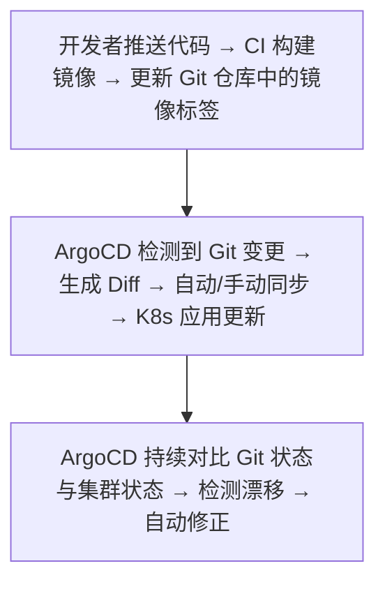

## 知识点地图

- **知识类别**：GitOps——把「部署与运维声明」也纳入版本控制的持续交付方法论，是 IaC 理念在应用发布层的延伸。
- **解决什么问题**：传统 CI/CD 的推送模型里，集群里跑的版本与仓库里的声明渐渐对不上（有人在 kubectl 里手改过、回滚靠记忆）；GitOps 用「Git 即真相 + Agent 持续协调」让漂移可检测、回滚变成 git revert。
- **什么时候用到**：Kubernetes 集群的应用发布与配置管理；多环境晋升（dev 到 staging 到 prod）；审计要求「谁在何时把什么版本发到了生产」。

前置：[Kubernetes 核心](/cloud-computing/110-KubernetesCore)、[Helm 包管理](/cloud-computing/150-HelmPackageManagement)（Helm chart 是 GitOps 仓库最常见的交付物之一）。

## 1. 心智模型：从「推送」到「拉取」

传统 CD 是**推模型**：CI 流水线拿着凭据把新版本推给集群。GitOps 反转为**拉模型**：集群内的 Agent（ArgoCD/Flux）自己盯着 Git 仓库，发现期望状态变了就应用。



四条核心原则（对应下表配置逐条落地）：

| 原则               | 说明                         |
| :----------------- | :--------------------------- |
| **声明式描述**     | 系统状态用声明式方式描述     |
| **Git 为唯一信源** | 所有变更通过 Git 提交        |
| **自动拉取**       | Agent 自动拉取并应用期望状态 |
| **持续协调**       | 持续比对实际状态与期望状态   |

推与拉的取舍：

- **拉模型的三个红利**：集群凭据不外泄（CI 不需要 kubeconfig）；部署即回滚（revert 一个 commit，Agent 自动收敛）；漂移自愈（有人手改集群，Agent 拉回 Git 声明）。
- **代价**：发布不再「流水线跑完即生效」，而是「合入 + Agent 轮询/ webhook 后生效」，需要盯同步状态；密钥不能明文进 Git，需要 Sealed Secrets / External Secrets 配套。
- 工具对比：

| 工具          | 推模型 | 拉模型 | 多集群 | 生态           |
| ------------- | ------ | ------ | ------ | -------------- |
| ArgoCD        |        | 支持   | 支持   | CNCF Graduated |
| Flux          |        | 支持   | 支持   | CNCF Graduated |
| Rancher Fleet | 支持   | 支持   | 支持   | SUSE 生态      |

> ArgoCD 与 Flux 都以拉模型为主（集群内 Agent 监听 Git）；Fleet 两者皆可，常用于 Rancher 体系的大规模多集群分发。选型直觉：要 Web 控制台与可视化 Diff 选 ArgoCD；要一组轻量 CRD、与 kubectl 心智一致选 Flux。

## 2. ArgoCD 实配

```yaml
# argocd-app.yaml
apiVersion: argoproj.io/v1alpha1
kind: Application
metadata:
  name: myapp
  namespace: argocd
spec:
  project: default
  source:
    repoURL: https://github.com/org/k8s-manifests.git
    targetRevision: main
    path: overlays/production
  destination:
    server: https://kubernetes.default.svc
    namespace: production
  syncPolicy:
    automated:
      prune: true          # Git 里删掉的资源，集群里也删掉
      selfHeal: true       # 集群被手改后自动拉回 Git 声明
      allowEmpty: false    # 源目录为空时拒绝同步（防误清空整个命名空间）
    syncOptions:
      - CreateNamespace=true
      - ServerSideApply=true
    retry:
      limit: 3
      backoff:
        duration: 5s
        factor: 2
        maxDuration: 3m
```

逐段解释与易错点：

- `source.path: overlays/production`：配合 Kustomize 的 overlays 结构——`base/` 放通用清单，`overlays/dev|staging|production` 放差异补丁。一个仓库管理多环境的惯例结构。
- `prune: true` 与 `selfHeal: true` 是「持续协调」的开关：前者处理资源删除，后者处理手动篡改。**易错点：`selfHeal` 打开后 `kubectl edit` 的紧急热修会在几十秒内被回滚**——热修必须走仓库（或临时调低同步策略），否则你以为修好了实际早被拉回去。
- `ServerSideApply=true`：大清单（带 CRD、超注解长度）用服务端应用避免「last-applied 注解超限」；但与手写 `kubectl apply --server-side` 混用时注意字段所有权冲突。
- `retry` 的指数退避：同步失败（镜像拉取失败等瞬态错误）自动重试，`maxDuration` 封顶避免无限等待。

**工程场景（Helm + ArgoCD 一键回滚与漂移自愈）**：发布物是 Helm chart 仓库，ArgoCD Application 指向 chart 版本；出问题把 `targetRevision` 指回上一个 chart tag 并合入，ArgoCD 自动完成回滚——全程没有人在集群里敲一条命令，审计记录就是 Git 历史。

## 3. Flux 实配

```yaml
# gotk-sync.yaml
apiVersion: source.toolkit.fluxcd.io/v1
kind: GitRepository
metadata:
  name: myapp
  namespace: flux-system
spec:
  interval: 1m                     # 拉取频率
  url: https://github.com/org/k8s-manifests.git
  ref:
    branch: main
---
apiVersion: kustomize.toolkit.fluxcd.io/v1
kind: Kustomization
metadata:
  name: myapp
  namespace: flux-system
spec:
  interval: 5m                     # 协调（含漂移检测）频率
  sourceRef:
    kind: GitRepository
    name: myapp
  path: './overlays/production'
  prune: true
  healthChecks:
    - apiVersion: apps/v1
      kind: Deployment
      name: myapp
      namespace: production
```

- Flux 的心智模型是**两组 CRD**：`GitRepository`（源）+ `Kustomization`（把源里的清单应用到集群并持续协调）。健康检查通过才算同步成功，失败则保持上一可用状态。
- 与 ArgoCD 的日常差异：Flux 无自带 UI（有第三方 weave-gitops），状态查询靠 `flux get kustomizations`；变更通知走 webhook 接收器（`Receiver` CRD）替代纯轮询。
- 易错点：`interval` 是轮询不是实时——期待「合入即部署」要配 webhook，否则默认要等 1 分钟。

## 4. 仓库结构与晋升回滚

多环境晋升的标准仓库布局：

```
k8s-manifests/
  base/                      # 通用声明：Deployment/Service/ConfigMap 模板
    deployment.yaml
    kustomization.yaml
  overlays/
    dev/                     # 低副本数、调试镜像 tag
    staging/
    production/              # 副本数、资源限额、镜像 tag（由 CI 自动提交）
      kustomization.yaml
```

- **晋升 = 一次 PR**：dev 验证通过后，提 PR 把 staging overlay 的镜像 tag 从 `sha-abc123` 改到 `sha-def456`；批准合入即部署。生产镜像 tag 由 CI 在构建后自动提交到 production overlay——「部署」从此只有一条受审计的路径。
- **回滚 = revert**：`git revert <晋升 commit>` 后 Agent 自动应用旧 tag。不推荐「直接改回旧 tag」：revert 保留了完整历史，而手改会产生新的非审计变更。
- **漂移检测**：ArgoCD 控制台 OutOfSync / `flux diff -k production`；告警接 ArgoCD Notifications 或 Flux 的 provider，让「有人手改了集群」在几分钟内出现在 IM 群里。
- 易错点：镜像 tag 必须唯一（用 commit sha 或时间戳，不用 `latest`）——`latest` 让「回滚到上一个 tag」变成「拉到的还是同一个 latest」，回滚静默失效。

## 5. 与 CI 的分工边界

GitOps 不替代 CI——CI 负责「构建与验证」，GitOps 负责「发布与协调」：

| 阶段 | 谁负责 | 产物 |
| --- | --- | --- |
| 编译、测试、镜像构建 | CI | 镜像 push 到 registry |
| 更新期望状态 | CI 最后一步自动 commit | 镜像 tag 写入 GitOps 仓库 |
| 应用与持续协调 | ArgoCD/Flux | 集群状态收敛到 Git 声明 |

CI 流水线（构建-测试-推送镜像）的完整链路属持续集成主题；本模块的厂商 CLI 实操篇（如 [AWS CodeDeploy 类工具](/cloud-computing/270-AWSCore)所在章）与本文的 GitOps 层互补。

## 动手实践

**任务**：搭一个最小 GitOps 闭环。准备一个 nginx Deployment 清单仓库（base + overlays/dev），本机 kind 集群装 Flux（或用 ArgoCD 安装清单），验证三件事：

1. 合入镜像 tag 变更后集群自动更新；
2. `kubectl scale deployment nginx --replicas=5` 手改后，Agent 把副本数拉回 Git 声明（漂移自愈）；
3. `git revert` 晋升 commit 后集群回到旧版本。

提示：

1. Flux 两步：`flux bootstrap github --owner=<你> --repository=k8s-manifests` 与 `flux create kustomization myapp --source=myapp --path=./overlays/dev --prune=true`;
2. 漂移自愈验证要等一个 `interval` 周期，`flux reconcile kustomization myapp` 可立即触发；
3. 观察同步状态用 `flux get kustomizations`，ArgoCD 用控制台 OutOfSync 标记。

<details>
<summary>自检清单（先自己做，再展开对照）</summary>

- 集群里的副本数回到 Git 声明的值了吗？说明 `prune/selfHeal`（ArgoCD）或 `Kustomization` 默认协调（Flux）在生效。
- revert 后 `kubectl rollout history` 能看到旧模板重新部署；如果没变化，检查镜像 tag 是否唯一（`latest` 陷阱）。
- 故意提交一个非法 YAML（缩进错误）：Agent 应该**保持上一可用状态并持续报错**，而不是清空工作负载——这就是 GitOps 的发布安全性，对比推模型「流水线半路失败集群停在新旧之间」。

</details>

## 常见陷阱

1. **密钥明文进 Git**：GitOps 仓库是「唯一信源」也是最大攻击面；用 Sealed Secrets/External Secrets/SOPS，审查流程加 secret 扫描。
2. **热修被自愈回滚**：紧急修复绕过 Git，`selfHeal` 几十秒后拉回；热修也要走仓库（专门的热修分支 + 快速评审）。
3. **`latest` tag 让回滚失效**：tag 必须指向不可变构建产物。
4. **把 CI 凭据塞进集群**：拉模型的本意就是集群侧拉取，反向配置推模型凭据等于白改。
5. **单仓库巨石化**：所有团队所有环境塞一个仓库，晋升 PR 互相阻塞；按团队/域拆仓库，环境 overlay 只引用本域。

## 相关阅读

- IaC 与 Terraform（基础设施层声明式）：[基础设施即代码](/cloud-computing/410-IaC)
- K8s 核心对象与控制器协调：[Kubernetes 核心](/cloud-computing/110-KubernetesCore)
- Helm chart（GitOps 仓库交付物）：[Helm 包管理](/cloud-computing/150-HelmPackageManagement)
- 云原生方法论全景：[云原生应用](/cloud-computing/080-CloudNativeApp)

## 参考与致谢

- OpenGitOps 文档（CNCF，Apache-2.0）：https://opengitops.dev/
- ArgoCD 官方文档（Apache-2.0）：https://argo-cd.readthedocs.io/
- Flux 官方文档（Apache-2.0）：https://fluxcd.io/flux/
