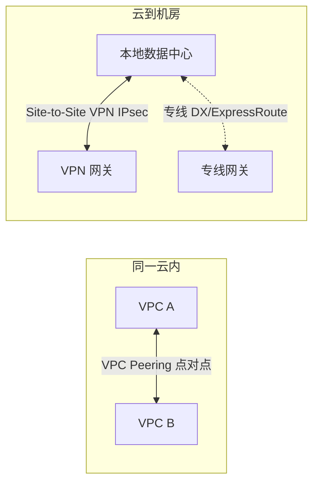
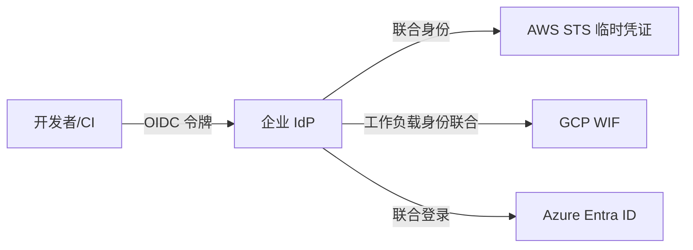

## 前置知识

建议先阅读以下内容再进入本文：

- [云计算基础](/cloud-computing/010-CloudComputingBasics)

## 1. 多云与混合云：是什么、为什么

### 1.1 两个容易混淆的词

- **混合云（Hybrid Cloud）**：自建数据中心/私有云与**某一个**公有云通过专线或 VPN 打通，
  数据和应用可以两边调度。类比：你家（私有）和出租屋（公有）之间修了一条专用公路。
- **多云（Multi-Cloud）**：同时使用**两个及以上**公有云厂商（如 AWS + 阿里云），各云之间
  往往**不打通**，而是按业务切分——A 业务在甲云、B 业务在乙云。类比：在不同城市各租
  一套办公室，彼此并不连通，靠电话协作。

| 形态       | 连通性       | 典型动机                   | 主要难点           |
| ---------- | ------------ | -------------------------- | ------------------ |
| 单公有云   | -            | 简单、生态完整             | 厂商锁定           |
| 混合云     | 专线/VPN 连通 | 数据主权、存量机房利旧     | 网络与运维复杂     |
| 多云       | 多为业务切分 | 议价能力、避免锁定         | 重复建设、人才成本 |
| 多云+混合  | 部分连通     | 大型企业的常见终态         | 全部以上           |

### 1.2 企业选多云/混合云的真实动机

| 动机           | 说明                                       | 典型例子                     |
| -------------- | ------------------------------------------ | ---------------------------- |
| 合规与数据主权 | 法规要求数据留在境内或特定行业云           | 金融、政务上行业云           |
| 避免厂商锁定   | 关键业务保留第二供应商，谈判时有退路       | 核心数据库双云部署           |
| 容灾           | 单一云的 Region 级故障不再致命             | 主备分属两个云               |
| 成本与议价     | 用两家报价互相制衡，各取优势产品           | GPU 训练在 A 云，CDN 用 B 云 |
| 存量与弹性     | 老机房继续跑稳定负载，突发流量溢出到公有云 | 电商大促弹性扩容             |

### 1.3 必须诚实面对的代价

多云不是免费的午餐，**先想清楚代价再上船**：

- **人力成本翻倍不止**：两套 IAM、两套网络模型、两套账单体系，团队要同时精通；
- **安全面扩大**：跨云凭证管理与网络边界是新的高危区；
- **数据一致性**：跨云复制天然是异步的，一致性约束见《CAP 理论与最终一致性》；
- **互换成本被低估**：托管服务的 API（DynamoDB vs Cosmos DB vs FireStore）并不互通，
  「随时可搬走」往往只对纯 IaaS 部分成立。

> 实践建议：**先问业务问题是什么**。只有「合规/容灾/议价」三者至少中一个时才值得
> 付多云税；单纯「怕被锁定」而做的多云，多数最终退化为「两边各一堆没人敢动的系统」。

## 2. 网络互联：把不同地方的云连起来

### 2.1 三种基本连接方式



| 方式                | 带宽与延迟            | 开通周期 | 成本 | 适用                         |
| ------------------- | --------------------- | -------- | ---- | ---------------------------- |
| VPC Peering         | 无带宽瓶颈，内网延迟  | 分钟级   | 低   | 同云内 VPC 互联              |
| Transit Gateway     | 枢纽组网，支持传递    | 小时级   | 中   | 同云多 VPC 的中心化组网      |
| Site-to-Site VPN    | 单隧道约 1.25 Gbps，受公网抖动影响 | 小时级 | 低 | 测试联调、小流量、专线备份 |
| 专线（DX/ExpressRoute/高速通道） | 1-100 Gbps，延迟稳定  | 数天-数周 | 高  | 生产数据库同步、大流量混合云 |

选型经验：**先 VPN 起步验证，流量与 SLA 要求上来后再切专线，专线稳定后 VPN 降级为备份路径**
——两条路径同时发布路由，用 BGP 属性控制主备，专线抖动时自动切换。

### 2.2 跨云互联的现实

云与云之间的「专线」通常不是云厂商直连，而是经第三方骨干（如 Equinix、Megaport）
或同宿主机的托管机房转接；预算有限时，跨云同步走公网 TLS 加密（本文末尾的 rclone
方案）也完全可行，代价是带宽与稳定性受公网影响。

### 2.3 避坑清单

- Peering **不支持传递路由**：A-B、B-C 打通不代表 A-C 可达，超过 3 个 VPC 直接上 Transit Gateway；
- CIDR 冲突是迁移期最常见的坑：两地内网网段规划**上线前必须错开**（如云端统一 10.x，机房 172.16.x）；
- 跨云流量走公网时务必加密并限速，避免拖垮业务带宽或产生巨额出站流量费
  （出站流量计费模型见《云成本优化》）。

## 3. Terraform 多 Provider 管理

多云 IaC 的关键是用 **provider 别名（alias）** 在一份配置里描述多个云，同时**每朵云
独立维护自己的 state**，避免一个后端故障拖垮所有云。

```hcl
# AWS 与阿里云双 Provider 声明
terraform {
  required_version = ">= 1.10"
  required_providers {
    aws        = { source = "hashicorp/aws",        version = "~> 5.0" }
    alicloud   = { source = "aliyun/alicloud",      version = "~> 1.0" }
  }
  # 远程 state：Terraform 1.10+ 推荐 S3 原生锁文件（use_lockfile）
  backend "s3" {
    bucket       = "myapp-tfstate"
    key          = "multicloud/terraform.tfstate"
    region       = "us-east-1"
    encrypt      = true
    use_lockfile = true
  }
}

provider "aws" {
  region = "us-east-1"
  alias  = "global"
}

provider "alicloud" {
  region = "cn-hangzhou"
}
```

```hcl
# 资源通过 provider = "别名" 指定落在哪朵云
resource "aws_s3_bucket" "backup" {
  provider = aws.global
  bucket   = "myapp-multicloud-backup"
}

resource "alicloud_oss_bucket" "backup" {
  provider = alicloud
  bucket   = "myapp-multicloud-backup-cn"
}
```

工程建议：

- **state 按云拆分**：`aws/` 与 `alicloud/` 各自独立目录与后端，爆炸半径互不影响；
- **模块只做单云**：不要写「跨云抽象模块」，两朵云的参数模型差异会把模块搅成泥球；
- 同名资源在两朵云部署时，用 `for_each` + 命名约定保证一致性，差异部分显式声明。

## 4. 统一身份与统一监控

### 4.1 跨云身份：OIDC 联合登录

多云下最忌讳的是「每个云一套静态 AccessKey」。现代做法是让企业 IdP（或 CI 系统）
通过 **OIDC** 换取各云的短期临时凭证：



各云叫法不同（AWS IAM OIDC Federation、GCP Workload Identity Federation、Azure
Workload Identity），本质一致：**不落盘长期密钥，用短时凭证 + 最小权限角色**。
单云内的权限模型细节见《云安全服务》。

### 4.2 统一监控的两条路线

| 路线             | 做法                                       | 适用                         |
| ---------------- | ------------------------------------------ | ---------------------------- |
| 商业平台收敛     | Datadog/New Relic 等在各云部署采集端       | 预算充足、要开箱即用         |
| 开源自建收敛     | Prometheus 每云一个实例 + Thanos/Mimir 全局聚合，OTel 统一采集 | 已有平台团队 |

无论哪条路线，**告警规则与 Runbook 必须以服务为中心而不是以云为中心**——值班同学
收到告警时不应需要先想「这个服务在哪个云」。

## 5. 数据层：跨云同步与迁移

多云的数据面通常是「一份主数据 + 异步复制副本」。结构化数据走各云数据库的原生复制
或 CDC 工具（对比见《云数据库服务》）；对象存储的跨云同步，`rclone` 是最常用的
瑞士军刀——它支持 S3/Azure Blob/GCS/OSS/COS 等数十种后端，统一命令行操作。

工具与命令不在这里展开：rclone 的安装与远程配置、数据同步与校验、跨云迁移实战
（K8s/Velero、镜像、数据库）、跨云 IaC 工具与监控告警，全部按「安装 → 配置远程 →
同步 → 校验 → 迁移」顺序整理在《跨云数据迁移与备份实操》，示例凭证均为占位符，
生产环境请优先使用各云 IAM 角色（`env_auth = true`）而非明文密钥。

## 小结

- **初学者要点**：多云 = 多个公有云按业务切分，混合云 = 私有机房与公有云专线打通；
  连接方式按「VPN 验证 → 专线生产 → VPN 备份」演进；跨云同步先想清楚 RPO 与出站流量成本。
- **进阶注意**：Peering 不传递路由，超过 3 个 VPC 用 Transit Gateway；Terraform 多云按云
  拆 state，模块不做跨云抽象；身份走 OIDF/WIF 短时凭证，杜绝跨云静态 AK/SK；监控告警
  以服务为中心组织。多云税真实存在——每次新增一朵云前，重新对照第 1.3 节的代价清单。
