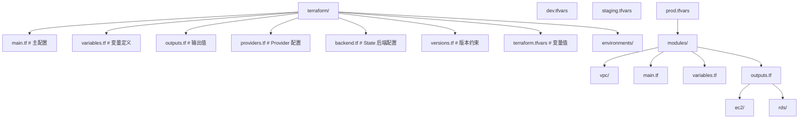

## 知识点地图

- **知识类别**：基础设施即代码（IaC）总览——以 Terraform 为主线的资源层声明式管理，附 Pulumi 生态对比。本文只讲「资源」层：VPC、实例、数据库这类云对象。
- **解决什么问题**：控制台点出来的基础设施无法复制、无法审计、无法回滚；IaC 把基础设施写成代码，获得版本控制、评审、重建与漂移检测。
- **什么时候用到**：新建云环境（dev/staging/prod 一套代码多份参数）；跨账号/跨区域复制架构；基础设施变更纳入 PR 评审。

本篇拆分后的专篇分工：**主机内配置管理（Ansible）与批量运维脚本**见[配置管理与 Ansible](/cloud-computing/415-ConfigurationManagementAnsible)；**GitOps 应用发布**（ArgoCD/Flux）见[GitOps 持续交付](/cloud-computing/155-GitOpsContinuousDelivery)；**云监控告警实操**见[可观测性](/cloud-computing/170-Observability)与[AWS CloudWatch 命令](/cloud-computing/440-AWSCloudWatch)；Pulumi 的命令级实操见[Pulumi 命令](/cloud-computing/530-PulumiCommands)。

## 1. Terraform 基础设施即代码

### 1.1 Terraform 核心概念

| 概念         | 说明                               |
| :----------- | :--------------------------------- |
| **Provider** | 云服务商插件（AWS/Azure/阿里云等） |
| **Resource** | 基础设施资源定义（VM/VPC/DB等）    |
| **State**    | 资源状态文件，记录已创建的资源     |
| **Module**   | 可复用的 Terraform 配置包          |
| **Plan**     | 预览变更（干运行）                 |
| **Apply**    | 执行变更                           |

### 1.2 项目结构



### 1.3 Provider 配置

```hcl
# providers.tf
terraform {
  required_version = ">= 1.6"

  required_providers {
    aws = {
      source  = "hashicorp/aws"
      version = "~> 5.0"
    }
  }

  # 远程 State 存储（Terraform 1.10+ 推荐 S3 原生锁文件；
  # DynamoDB 锁表方式已弃用，仅在旧版本 Terraform 中使用）
  backend "s3" {
    bucket         = "terraform-state-prod"
    key            = "infrastructure/terraform.tfstate"
    region         = "us-east-1"
    encrypt        = true
    use_lockfile   = true
  }
}

provider "aws" {
  region = var.aws_region

  default_tags {
    tags = {
      Environment = var.environment
      ManagedBy   = "terraform"
      Project     = "myapp"
    }
  }
}
```

易错点：本地开发用默认 state 文件时，`apply` 两次并发执行会写坏 state——远程后端 + 锁不是可选项而是第一天就配置的事；`default_tags` 让所有资源自动带环境标签，是后面成本分账与批量脚本（按标签选实例）的基础。

### 1.4 VPC 模块

```hcl
# modules/vpc/main.tf
resource "aws_vpc" "main" {
  cidr_block           = var.vpc_cidr
  enable_dns_hostnames = true
  enable_dns_support   = true

  tags = {
    Name = "${var.name}-vpc"
  }
}

# 公有子网
resource "aws_subnet" "public" {
  count                   = length(var.public_subnet_cidrs)
  vpc_id                  = aws_vpc.main.id
  cidr_block              = var.public_subnet_cidrs[count.index]
  availability_zone       = var.availability_zones[count.index]
  map_public_ip_on_launch = true

  tags = {
    Name = "${var.name}-public-${count.index + 1}"
    Tier = "public"
  }
}

# 私有子网
resource "aws_subnet" "private" {
  count             = length(var.private_subnet_cidrs)
  vpc_id            = aws_vpc.main.id
  cidr_block        = var.private_subnet_cidrs[count.index]
  availability_zone = var.availability_zones[count.index]

  tags = {
    Name = "${var.name}-private-${count.index + 1}"
    Tier = "private"
  }
}

# 互联网网关
resource "aws_internet_gateway" "main" {
  vpc_id = aws_vpc.main.id

  tags = {
    Name = "${var.name}-igw"
  }
}

# NAT 网关（每个 AZ 一个）
resource "aws_nat_gateway" "main" {
  count         = length(var.public_subnet_cidrs)
  allocation_id = aws_eip.nat[count.index].id
  subnet_id     = aws_subnet.public[count.index].id

  tags = {
    Name = "${var.name}-nat-${count.index + 1}"
  }
}

resource "aws_eip" "nat" {
  count  = length(var.public_subnet_cidrs)
  domain = "vpc"
}

# 公有路由表
resource "aws_route_table" "public" {
  vpc_id = aws_vpc.main.id

  route {
    cidr_block = "0.0.0.0/0"
    gateway_id = aws_internet_gateway.main.id
  }

  tags = {
    Name = "${var.name}-public-rt"
  }
}

# 私有路由表
resource "aws_route_table" "private" {
  count  = length(var.private_subnet_cidrs)
  vpc_id = aws_vpc.main.id

  route {
    cidr_block     = "0.0.0.0/0"
    nat_gateway_id = aws_nat_gateway.main[count.index].id
  }

  tags = {
    Name = "${var.name}-private-rt-${count.index + 1}"
  }
}
```

```hcl
# modules/vpc/variables.tf
variable "name" {
  description = "VPC 名称前缀"
  type        = string
}

variable "vpc_cidr" {
  description = "VPC CIDR 地址块"
  type        = string
  default     = "10.0.0.0/16"
}

variable "public_subnet_cidrs" {
  description = "公有子网 CIDR 列表"
  type        = list(string)
}

variable "private_subnet_cidrs" {
  description = "私有子网 CIDR 列表"
  type        = list(string)
}

variable "availability_zones" {
  description = "可用区列表"
  type        = list(string)
}
```

模块设计的要点：`count` 按可用区数量批量创建子网与 NAT，多 AZ 高可用模板一次成型；CIDR 与可用区全部参数化，模块在 dev/prod 间只换 tfvars。易错点：模块内引用外部资源（如直接写死一个 VPC id）会破坏复用——依赖一律从 `variables` 进、产物从 `outputs` 出。

### 1.5 主配置

```hcl
# main.tf
module "vpc" {
  source = "./modules/vpc"

  name                 = "${var.project}-${var.environment}"
  vpc_cidr             = var.vpc_cidr
  public_subnet_cidrs  = var.public_subnet_cidrs
  private_subnet_cidrs = var.private_subnet_cidrs
  availability_zones   = var.availability_zones
}

# EC2 实例
resource "aws_instance" "app" {
  count         = var.app_instance_count
  ami           = data.aws_ami.ubuntu.id
  instance_type = var.instance_type
  subnet_id     = module.vpc.private_subnet_ids[count.index % length(module.vpc.private_subnet_ids)]

  vpc_security_group_ids = [aws_security_group.app.id]

  user_data = templatefile("${path.module}/user_data.sh.tpl", {
    environment = var.environment
    db_host     = aws_db_instance.main.address
  })

  tags = {
    Name = "${var.project}-${var.environment}-app-${count.index + 1}"
  }
}

# RDS 数据库
resource "aws_db_instance" "main" {
  identifier     = "${var.project}-${var.environment}-db"
  engine         = "postgresql"
  engine_version = "16.1"
  instance_class = var.db_instance_class

  allocated_storage     = 100
  max_allocated_storage = 500
  storage_encrypted     = true

  db_name  = "myapp"
  username = "dbadmin"
  password = var.db_password

  vpc_security_group_ids = [aws_security_group.db.id]
  db_subnet_group_name   = aws_db_subnet_group.main.name

  backup_retention_period = 7
  backup_window           = "03:00-04:00"
  maintenance_window      = "Mon:04:00-Mon:05:00"

  skip_final_snapshot = false
  final_snapshot_identifier = "${var.project}-${var.environment}-final"
}

# 数据源 - 获取最新 Ubuntu AMI
data "aws_ami" "ubuntu" {
  most_recent = true
  owners      = ["099720109477"]  # Canonical

  filter {
    name   = "name"
    values = ["ubuntu/images/hvm-ssd/ubuntu-jammy-22.04-amd64-server-*"]
  }
}
```

易错点：`password = var.db_password` 配合 `sensitive = true` 的变量让密码不进日志与 plan 输出，但**会进 state**——生产密码应来自 Secrets Manager（`data "aws_secretsmanager_secret_version"`），state 文件本身加密且访问受限。`skip_final_snapshot = false` 是销毁前自动打最终快照，删库跑路的最后一道保险。

### 1.6 变量与输出

```hcl
# variables.tf
variable "project" {
  description = "项目名称"
  type        = string
  default     = "myapp"
}

variable "environment" {
  description = "环境名称"
  type        = string
}

variable "aws_region" {
  description = "AWS 区域"
  type        = string
  default     = "us-east-1"
}

variable "db_password" {
  description = "数据库密码"
  type        = string
  sensitive   = true
}

# outputs.tf
output "vpc_id" {
  description = "VPC ID"
  value       = module.vpc.vpc_id
}

output "app_instance_ids" {
  description = "应用实例 ID 列表"
  value       = aws_instance.app[*].id
}

output "db_endpoint" {
  description = "数据库连接端点"
  value       = aws_db_instance.main.endpoint
}
```

### 1.7 Terraform 工作流

```bash
# 初始化（下载 Provider 和模块）
terraform init

# 格式化代码
terraform fmt

# 验证语法
terraform validate

# 预览变更
terraform plan -var-file="environments/prod.tfvars" -out=tfplan

# 执行变更
terraform apply tfplan

# 查看状态
terraform state list
terraform state show aws_instance.app[0]

# 销毁所有资源
terraform destroy -var-file="environments/prod.tfvars"
```

纪律：CI 里 `plan -out=tfplan` 保存计划文件，`apply` 只应用这份文件——两次 plan 之间云端若被他人改动，应用旧计划会失败而不是静默覆盖。`terraform destroy` 在生产环境要加双重确认（CI 手动触发 + 输入环境名）。

## 2. Pulumi：通用语言的 IaC

Pulumi 是使用**通用编程语言**（Python/TypeScript/Go）编写基础设施即代码的工具：

| 特性         | Terraform       | Pulumi          |
| :----------- | :-------------- | :-------------- |
| **语言**     | HCL（专用语言） | Python/TS/Go/C# |
| **状态管理** | 自管理/SaaS     | Pulumi Cloud    |
| **测试**     | 有限            | 原生单元测试    |
| **逻辑**     | 声明式          | 命令式+声明式   |
| **生态**     | 最丰富          | 增长中          |

选型直觉：基础设施配置以「声明属性」为主时 HCL 更简洁、生态最全；基础设施需要复杂逻辑（循环生成、跨系统查询、单测）时通用语言占优。团队已有强 TypeScript/Python 工程实践时 Pulumi 上手更快。

Python 示例（同一 VPC 拓扑的 Pulumi 写法）：

```python
# __main__.py
import pulumi
import pulumi_aws as aws

# 配置
config = pulumi.Config()
environment = config.get("environment") or "dev"

# 创建 VPC
vpc = aws.ec2.Vpc("main-vpc",
    cidr_block="10.0.0.0/16",
    enable_dns_hostnames=True,
    tags={"Name": f"myapp-{environment}-vpc"},
)

# 创建子网
public_subnet = aws.ec2.Subnet("public-subnet",
    vpc_id=vpc.id,
    cidr_block="10.0.1.0/24",
    availability_zone="us-east-1a",
    map_public_ip_on_launch=True,
    tags={"Name": f"myapp-{environment}-public"},
)

# 创建安全组
sg = aws.ec2.SecurityGroup("app-sg",
    vpc_id=vpc.id,
    description="Application security group",
    ingress=[
        aws.ec2.SecurityGroupIngressArgs(
            protocol="tcp",
            from_port=443,
            to_port=443,
            cidr_blocks=["0.0.0.0/0"],
        ),
    ],
    egress=[
        aws.ec2.SecurityGroupEgressArgs(
            protocol="-1",
            from_port=0,
            to_port=0,
            cidr_blocks=["0.0.0.0/0"],
        ),
    ],
)

# 输出
pulumi.export("vpc_id", vpc.id)
pulumi.export("subnet_id", public_subnet.id)
pulumi.export("security_group_id", sg.id)
```

易错点：Pulumi 程序里的 `vpc.id` 是 **Output 类型**（部署时才解析的真实值），不能直接当字符串拼接（`f"...{vpc.id}"` 会插进占位符而非真实 id），要用 `apply` 或 `Output.concat`——这是从「写 Terraform 的思路」切到「写程序的思路」最常踩的一步。

安装、stack、导入存量资源与 CI 集成等命令级实操见[Pulumi 命令](/cloud-computing/530-PulumiCommands)。

## 3. 相关专篇导航

- **主机内配置**（装软件、下发配置、systemd、滚动重启）与批量运维脚本：[配置管理与 Ansible](/cloud-computing/415-ConfigurationManagementAnsible)
- **应用发布的 GitOps**（ArgoCD/Flux、漂移自愈、晋升回滚）：[GitOps 持续交付](/cloud-computing/155-GitOpsContinuousDelivery)
- **监控告警**（Prometheus/Grafana 配置、CloudWatch 告警命令）：[可观测性](/cloud-computing/170-Observability) 与 [AWS CloudWatch 命令](/cloud-computing/440-AWSCloudWatch)

## 小结

- **初学者要点**：IaC 的铁律是 **plan 先行、state 即真相**——所有变更先 `plan` 预览，state 文件等价于你的基础设施账本，丢了比代码丢了更麻烦；Terraform 管资源创建，Ansible 管机器内部配置，两者是互补而非竞争。
- **进阶注意**：远程 state 必须开锁与加密（Terraform 1.10+ 用 S3 原生锁文件）；模块设计先从复制粘贴开始、出现第二次重复再抽象；把「部署」也纳入 Git 审计是 GitOps 的主题，见专篇。
