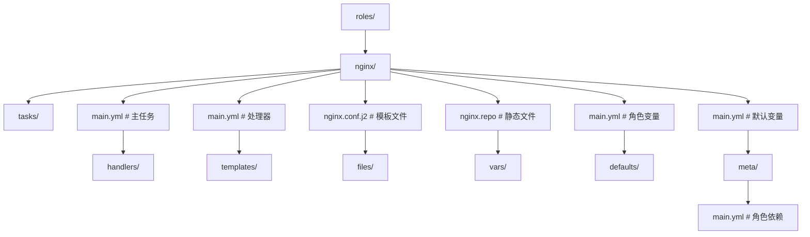

## 知识点地图

- **知识类别**：配置管理（Configuration Management）——Ansible 为代表的「主机内配置」自动化，与批量运维脚本工程化。
- **解决什么问题**：Terraform 建出 50 台机器后，每台机器里的 Nginx 配置、systemd 服务、内核参数还是手工 SSH 逐台敲；配置漂移无法审计；脚本式的运维操作无幂等性。
- **什么时候用到**：初始化 VM 后的软件安装与配置下发；滚动重启与版本发布（无 K8s 的传统部署）；定期清理与巡检；给既有机器群做配置收口。

前置：[基础设施即代码](/cloud-computing/410-IaC)（Terraform 建资源，本文管资源内部）；首次开机初始化与持续配置的分工见 [cloud-init 命令](/cloud-computing/550-CloudInitCommands)。

## 1. 心智模型：声明式 + 幂等 + 无代理

Ansible 的三个设计决定决定了它的所有用法：

1. **无代理**：目标机器只需 SSH + Python，不用装常驻 Agent。红利是零侵入；代价是每次执行都要建立 SSH 连接，万级主机时性能不如 Agent 方案。
2. **幂等模块**：`apt: state=present` 描述「期望状态」而非「执行动作」——已经装过就跳过。重复执行同一 Playbook 结果不变，这是与裸脚本的本质区别。
3. **声明式分工**：Terraform 管「有哪些资源」（VPC、实例、DNS），Ansible 管「资源内部什么样」（软件、配置、服务）。两者互补而非竞争，多数团队按这个边界各管一层。

三个场景理解分工边界：

- **场景 A（Web 集群初始化）**：Terraform 建 3 台 EC2 + 安全组；Ansible 在机器上装 Nginx、下发配置、起服务。资源生命周期归 Terraform，机器内归 Ansible。
- **场景 B（云镜像 vs 运行时配置）**：镜像里用 Packer/云预装基础软件（开机即用，见 cloud-init），Ansible 只负责**持续**配置（改配置、发版本）；把所有配置都堆到开机脚本里，改一行就要重建机器。
- **场景 C（K8s 环境）**：Pod 由镜像自带配置，Ansible 的用武之地收缩到集群外的宿主机（构建机、数据库机、跳板机）。

## 2. Inventory：主机清单

```ini
# inventory/production.ini
[webservers]
web1 ansible_host=10.0.1.10
web2 ansible_host=10.0.1.11

[appservers]
app1 ansible_host=10.0.10.10
app2 ansible_host=10.0.10.11

[dbservers]
db1 ansible_host=10.0.20.10

[production:children]
webservers
appservers
dbservers

[production:vars]
ansible_user=ubuntu
ansible_ssh_private_key_file=~/.ssh/prod_key
ansible_python_interpreter=/usr/bin/python3
```

逐段解释与易错点：

- `[组:children]` 把组组合成父组；`[组:vars]` 给整组定义变量。分组是后面 `hosts: appservers` 选择目标的基础——**分组名要按角色而不是按位置**（appservers 而不是 az-a），角色变了只改 inventory 不改 playbook。
- `ansible_python_interpreter`：Ubuntu 20+ 默认无 `/usr/bin/python`（只有 python3），不显式指定会报找不到解释器——新人第一个 Ansible 报错多半是它。
- 动态 Inventory：云环境的机器列表会变，静态 ini 很快过时；生产上用 `aws_ec2` 插件（按标签自动分组）或 Terraform 输出生成 inventory，机器列表永远和事实一致。

## 3. Playbook：任务编排

```yaml
# playbooks/deploy-app.yml
---
- name: 部署 Web 应用
  hosts: appservers
  become: true

  vars:
    app_version: '2.3.1'
    app_port: 3000
    app_dir: /opt/myapp

  tasks:
    - name: 安装依赖
      ansible.builtin.apt:
        name:
          - curl
          - python3-pip
        state: present
        update_cache: true

    - name: 创建应用目录
      ansible.builtin.file:
        path: '{{ app_dir }}'
        state: directory
        mode: '0755'

    - name: 下载应用包
      ansible.builtin.get_url:
        url: 'https://releases.example.com/myapp/{{ app_version }}/myapp-linux-amd64'
        dest: '{{ app_dir }}/myapp'
        mode: '0755'
      notify: restart myapp

    - name: 部署配置文件
      ansible.builtin.template:
        src: templates/app.conf.j2
        dest: '{{ app_dir }}/app.conf'
        mode: '0644'
      notify: restart myapp

    - name: 部署 systemd 服务
      ansible.builtin.template:
        src: templates/myapp.service.j2
        dest: /etc/systemd/system/myapp.service
        mode: '0644'
      notify: restart myapp

    - name: 确保 myapp 服务运行
      ansible.builtin.systemd:
        name: myapp
        state: started
        enabled: true
        daemon_reload: true

    - name: 等待应用就绪
      ansible.builtin.wait_for:
        port: '{{ app_port }}'
        delay: 5
        timeout: 60

  handlers:
    - name: restart myapp
      ansible.builtin.systemd:
        name: myapp
        state: restarted
```

逐段讲透关键机制：

- **`notify` + `handlers`**：任务真正发生变更（如模板渲染结果与线上不同）时通知 handler，且 handler 在**所有任务结束后只执行一次**。这是幂等设计的精髓：连续跑三遍 playbook，第二、三遍模板无变化，`notify` 不触发，服务不重启。易错点：handler 名要全局唯一；`notify` 写错 handler 名不报错而是静默忽略（Ansible 2.15+ 才有严格模式开关）。
- **`state: present/started` 而不是 `install/restart`**：模块内部先查当前状态再决定动不动手。「确保服务运行」对已运行的服务是 no-op——把它换成 `command: systemctl restart myapp` 就成了每次都重启的非幂等写法。
- **`become: true`**：sudo 提权。易错点：目标机 `ubuntu` 用户需要免密 sudo（`NOPASSWD`），否则卡在交互输入——CI 里表现为超时而不是报错。
- **`wait_for`**：部署后验证端口就绪，失败让整个 playbook 停在这一台主机，防止「部署完成」的假象。更完整的探活可以换成 `uri` 模块打 `/health`。

**工程场景（3 台 Web 主机统一 Nginx 配置并滚动重启）**：`serial: 1` 控制每批一台，配合 `wait_for` 探活，任何一台失败立即中止，剩下机器不受影响——这就是 Ansible 版的滚动发布。命令：`ansible-playbook -i inventory/production.ini playbooks/nginx-rollout.yml --serial 1 --check`（先 `--check` 干跑看 diff，再去掉干跑执行）。

## 4. Role：可复用的任务集合



变量优先级的关键区别：`defaults/` 是**最低优先级**（调用方可随意覆盖），`vars/` 是高优先级（角色内部铁定值）。易错点：把「环境差异变量」放进 `vars/`，三个环境要三份 role 或者永远覆盖不了——环境差异一律进 `defaults/`。

## 5. Jinja2 模板

```jinja2
# roles/nginx/templates/nginx.conf.j2
worker_processes {{ ansible_processor_vcpus }};
error_log /var/log/nginx/error.log warn;
pid /var/run/nginx.pid;

events {
    worker_connections {{ nginx_worker_connections | default(1024) }};
}

http {
    include       /etc/nginx/mime.types;
    default_type  application/octet-stream;

    upstream app_backend {
        
        server {{ hostvars[host]['ansible_host'] }}:{{ app_port }};
        
    }

    server {
        listen 80;
        server_name {{ nginx_server_name }};

        location / {
            proxy_pass http://app_backend;
            proxy_set_header Host $host;
            proxy_set_header X-Real-IP $remote_addr;
        }
    }
}
```

- `groups['appservers']` + `hostvars` 让每台 Web 机的 Nginx 配置**自动包含全部应用机的地址**——inventory 是唯一事实源，加机器只改 inventory。这是配置管理优于手工配置的核心例证。
- `{{ nginx_worker_connections | default(1024) }}`：变量未定义时给默认值，模板对调用方更宽容。
- 易错点：模板里 Nginx 自己的花括号（如 `location ~ \.php$ { fastcgi_param ... }` 没有 Jinja 变量）大多数情况无冲突；真正的冲突是 ` ` 包裹含 `{{` 的原文段。渲染结果先用 `ansible localhost -m template` 干跑或 `--check --diff` 看差异再上线。

## 6. 批量运维脚本：Ansible 覆盖不到的地方

Ansible 之外的批量操作（云 API 层的实例生命周期管理）用 Python 脚本直接走云 API 更直接：

```python
import boto3
import concurrent.futures

ec2 = boto3.resource('ec2')

def get_instances_by_tag(tag_key: str, tag_value: str):
    """根据标签获取实例列表"""
    return list(ec2.instances.filter(Filters=[
        {'Name': f'tag:{tag_key}', 'Values': [tag_value]},
        {'Name': 'instance-state-name', 'Values': ['running']}
    ]))

def execute_ssm_command(instance_ids: list, command: str):
    """通过 SSM 执行命令"""
    ssm = boto3.client('ssm')
    response = ssm.send_command(
        InstanceIds=instance_ids,
        DocumentName='AWS-RunShellScript',
        Parameters={'commands': [command]},
        TimeoutSeconds=300,
    )
    return response['Command']['CommandId']

def rolling_restart(tag_key: str, tag_value: str, batch_size: int = 1):
    """滚动重启实例"""
    instances = get_instances_by_tag(tag_key, tag_value)
    print(f"找到 {len(instances)} 个实例")

    for i in range(0, len(instances), batch_size):
        batch = instances[i:i + batch_size]
        ids = [inst.id for inst in batch]

        # 停止实例
        print(f"停止实例: {ids}")
        for inst in batch:
            inst.stop()
        for inst in batch:
            inst.wait_until_stopped()

        # 启动实例
        print(f"启动实例: {ids}")
        for inst in batch:
            inst.start()
        for inst in batch:
            inst.wait_until_running()

        # 健康检查
        print(f"等待实例就绪: {ids}")
        execute_ssm_command(ids, 'curl -sf http://localhost:3000/health || exit 1')
        print(f"批次 {i // batch_size + 1} 完成")
```

逐段解释与易错点：

- **按标签选择实例**而不是硬编码 id：`tag:{key}` 过滤让脚本对环境无感知，与 Terraform 的 `default_tags`（见 IaC 篇）呼应——没有统一的标签规范，这套自动化就没有入口。
- **SSM Run Command 的定位**：不需要 SSH 端口对公网开放，命令经 AWS API 下发——安全组只留 SSM 的 VPC endpoint。比「脚本里嵌 SSH 私钥」安全一个量级。易错点：实例必须装 SSM Agent 且实例角色带 `AmazonSSMManagedInstanceCore`。
- **`batch_size` 滚动批次**：一次停一批，健康检查过了再下一批。易错点：`wait_until_running` 后端口未必就绪（应用启动比操作系统慢），SSM 里的 `curl -sf ... || exit 1` 才是真正的应用层探活；只用 wait_until_running 会把「机器起来了但应用没起」当成成功。
- 资源清理脚本（未挂载 EBS 卷、闲置弹性 IP、过期快照）是这套模式的另一类应用——扫描 + `dry_run` 开关 + 白名单，成本治理的例行化：

```python
def cleanup_unused_resources(dry_run: bool = True):
    """清理未使用的云资源（先 dry_run 出报告，人工确认后再真删）"""
    ec2 = boto3.resource('ec2')
    findings = []

    for vol in ec2.volumes.filter(Filters=[{'Name': 'status', 'Values': ['available']}]):
        findings.append({'type': 'EBS Volume', 'id': vol.id, 'size': f"{vol.size}GB"})
        if not dry_run:
            vol.delete()

    return findings
```

`dry_run` 默认 `True` 是删除类脚本的铁律：先报告后执行，宁可多跑一遍也不要误删生产卷。

## 7. 与 cloud-init 的分工

首次开机 vs 持续配置：cloud-init（见 [cloud-init 命令](/cloud-computing/550-CloudInitCommands)）只在机器**第一次**启动时跑一次——装基础包、注入 SSH key、写 hostname；Ansible 管**生命周期内**的所有变更。判断标准：这条配置「新机器开出来就该有」还是「随时间会变」——前者 cloud-init/镜像，后者 Ansible。把频繁变更的配置塞进 cloud-init，改一次要重建一台机器，是常见的架构误用。

## 动手实践

**任务**：写一个 role `myapp`，把第 3 节的 playbook 重构为可复用形态，并在两台本机容器（如 `geerlingguy/docker-ubuntu2204-ansible`）上验证幂等性：

1. 第一次跑：任务有 changed、handler 触发重启；
2. 第二次跑：所有任务 ok（0 changed）、handler 不触发。

提示：

1. `ansible-galaxy init roles/myapp` 生成骨架，tasks 挪进 `tasks/main.yml`，变量进 `defaults/main.yml`；
2. 幂等性验证看 playbook 汇总行的 `changed=0`；
3. `--check --diff` 干跑模式可以看「将会改什么」，CI 里先干跑再执行。

<details>
<summary>参考实现要点（先自己写，再展开对照）</summary>

```yaml
# roles/myapp/defaults/main.yml
app_version: '2.3.1'
app_port: 3000
app_dir: /opt/myapp

# roles/myapp/tasks/main.yml
---
- ansible.builtin.include_tasks: install.yml     # 依赖安装
- ansible.builtin.include_tasks: deploy.yml      # 下载/模板/notify
- ansible.builtin.systemd:
    name: myapp
    state: started
    enabled: true
    daemon_reload: true

# playbooks/site.yml
- hosts: appservers
  become: true
  serial: 1                # 滚动：一台成功再下一台
  roles:
    - myapp
```

幂等性自查清单：下载任务用 `get_url` 且带 `checksum`（同版本不同 checksum 才变更）；模板任务 `validate` 参数渲染后先本地语法校验；handler 只挂真正需要重启的变更源。如果第二次运行仍有 changed，通常是某任务用了 `command`/`shell` 模块（永远 changed）——换成对应的状态模块或加 `changed_when`。

</details>

## 常见陷阱

1. **用 command/shell 模块做可声明的事**：永远 changed、无幂等、无回滚；先查模块库再写 shell。
2. **inventory 静态化**：云机器列表变了 inventory 不知道，Ansible 打到不存在的主机或漏掉新机器；上动态 inventory。
3. **handler 名重复或拼错**：静默不执行，服务没重启；跑完看 PLAY RECAP 与 handler 摘要。
4. **secrets 明文进 playbook**：用 Ansible Vault（`ansible-vault encrypt_string`）或外部密钥服务。
5. **删除类脚本没有 dry_run**：先报告后执行，白名单 + 备份双保险。

## 相关阅读

- Terraform 管资源、State 与模块：[基础设施即代码](/cloud-computing/410-IaC)
- Pulumi 的通用语言 IaC 与命令实操：[Pulumi 命令](/cloud-computing/530-PulumiCommands)
- 首次开机初始化：[cloud-init 命令](/cloud-computing/550-CloudInitCommands)
- GitOps 的应用层延伸：[GitOps 持续交付](/cloud-computing/155-GitOpsContinuousDelivery)

## 参考与致谢

- Ansible 官方文档（GPL-3.0 文档，示例为原创重写）：https://docs.ansible.com/
- Ansible 最佳实践（目录结构与滚动发布模式参考其指南页）：https://docs.ansible.com/ansible/latest/tips_tricks/ansible_tips_tricks.html
- AWS Systems Manager Run Command 文档（AWS 网站条款，命令为原创示例）：https://docs.aws.amazon.com/systems-manager/latest/userguide/execute-commands.html
