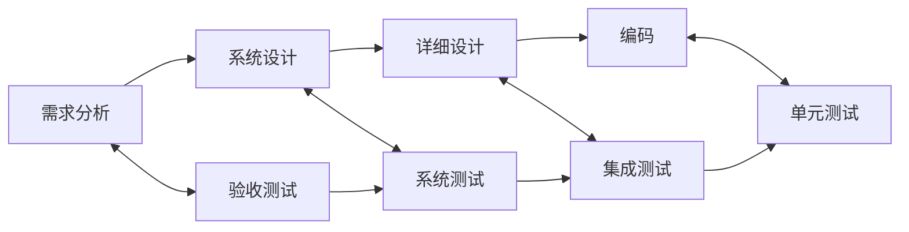

## 1. 测试基础概念

### 1.1 什么是软件测试

软件测试是通过**手动或自动化**手段来运行或检验软件系统的过程，目的是发现缺陷、验证功能、评估质量。

### 1.2 测试目的

| 目的     | 描述                 |
| -------- | -------------------- |
| 发现缺陷 | 找出软件中的错误     |
| 验证功能 | 确认软件满足需求     |
| 评估质量 | 度量软件质量水平     |
| 提供信心 | 为发布提供质量保证   |
| 预防缺陷 | 通过早期测试预防问题 |

### 1.3 测试与调试

| 对比项   | 测试              | 调试     |
| -------- | ----------------- | -------- |
| 目的     | 找缺陷            | 修缺陷   |
| 执行者   | 测试人员/开发人员 | 开发人员 |
| 方式     | 系统化            | 探索式   |
| 可预见性 | 可计划            | 不可预见 |

## 2. 测试七原则

### 原则1：测试显示缺陷的存在

测试只能证明缺陷存在，不能证明缺陷不存在。

### 原则2：穷尽测试不可能

无法测试所有输入组合，需要基于风险选择测试范围。

### 原则3：尽早测试

越早发现缺陷，修复成本越低。

```
需求阶段发现 → 修复成本 1x
设计阶段发现 → 修复成本 5x
编码阶段发现 → 修复成本 10x
测试阶段发现 → 修复成本 20x
生产阶段发现 → 修复成本 100x
```

### 原则4：缺陷集群性

少数模块通常包含大部分缺陷（帕累托法则：80% 的缺陷集中在 20% 的模块中）。

### 原则5：杀虫剂悖论

反复使用相同的测试用例将无法发现新缺陷，需要不断更新和补充测试。

### 原则6：测试依赖于上下文

不同类型的应用需要不同的测试方法。

### 原则7：无错误谬误

没有发现缺陷不等于软件可用，还需要验证是否满足用户需求。

## 3. 测试模型

### 3.1 V 模型



### 3.2 W 模型

V 模型的改进，强调测试与开发并行：

```
需求分析 → 需求评审
    ↓           ↓
系统设计 → 系统测试设计
    ↓           ↓
详细设计 → 集成测试设计
    ↓           ↓
  编码   → 单元测试设计
```

### 3.3 敏捷测试

| 特点       | 描述           |
| ---------- | -------------- |
| 持续测试   | 每个迭代都测试 |
| 全团队参与 | 开发和测试协作 |
| 自动化优先 | 快速反馈       |
| 探索性测试 | 补充自动化不足 |

## 4. 测试生命周期

### 4.1 基本过程

```
1. 测试计划 → 确定范围、策略、资源
2. 测试分析 → 分析需求、识别测试条件
3. 测试设计 → 设计测试用例
4. 测试实现 → 编写脚本、准备数据
5. 测试执行 → 运行测试、记录结果
6. 测试评估 → 评估出口准则
7. 测试报告 → 生成测试报告
8. 测试收尾 → 归档、经验总结
```

### 4.2 测试出口准则

| 准则   | 描述                    |
| ------ | ----------------------- |
| 覆盖率 | 代码/需求覆盖率达到目标 |
| 缺陷率 | 未修复缺陷低于阈值      |
| 通过率 | 测试通过率达到目标      |
| 风险   | 剩余风险可接受          |

## 5. 缺陷管理

### 5.1 缺陷生命周期

```
新建 → 已确认 → 已分配 → 修复中 → 已修复 → 已验证 → 已关闭
                    ↓                    ↓
               已拒绝              重新打开
```

### 5.2 缺陷属性

| 属性     | 描述                      |
| -------- | ------------------------- |
| 严重程度 | 致命/严重/一般/轻微       |
| 优先级   | 紧急/高/中/低             |
| 状态     | 新建/已确认/已修复/已关闭 |
| 环境     | 操作系统/浏览器/版本      |

### 5.3 严重程度 vs 优先级

| 严重程度 | 优先级 | 示例               |
| -------- | ------ | ------------------ |
| 致命     | 紧急   | 系统崩溃、数据丢失 |
| 严重     | 高     | 核心功能不可用     |
| 一般     | 中     | 非核心功能异常     |
| 轻微     | 低     | UI 文案错误        |
## coverage.py 基础

**基本写法：运行覆盖率测量**
`coverage run -m pytest`
`coverage report`
`coverage html`

```bash
# 使用 coverage.py 测量 Python 代码覆盖率
coverage run -m pytest
coverage report -m
coverage html
```

---

## coverage 配置

**换行写法：.coveragerc 配置文件**
`[run]`
`source = <包名>`
`omit = <排除路径>`

```ini
# .coveragerc 配置文件
[run]
source = src
branch = True

[report]
exclude_lines =
    pragma: no cover
    raise NotImplementedError
show_missing = True
```

---

## pytest-cov 插件

**基本写法：pytest 集成覆盖率**
`pytest --cov=<模块> [--cov-report=<格式>]`

```bash
# pytest-cov 插件生成覆盖率
pytest --cov=src --cov-report=term-missing
pytest --cov=src --cov-report=html --cov-report=xml
pytest --cov=src --cov-branch --cov-fail-under=80
```

---

## 分支覆盖率

**基本写法：启用分支覆盖率**
`coverage run --branch -m pytest`
`pytest --cov=<模块> --cov-branch`

```bash
# 分支覆盖率测量条件分支
coverage run --branch -m pytest
pytest --cov=src --cov-branch
```

---

## Jest 覆盖率

**基本写法：Jest 生成覆盖率**
`jest --coverage`
`jest --coverage --collectCoverageFrom=<路径>`

```bash
# Jest 覆盖率报告
jest --coverage
jest --coverage --collectCoverageFrom='src/**/*.js'
jest --coverage --coverageReporters=text-summary
```

---

## Jest 覆盖率配置

**换行写法：jest.config.js 覆盖率配置**
`collectCoverageFrom: ["<路径>"]`
`coverageThreshold: { global: { lines: <n> } }`

```javascript
# Jest 覆盖率配置项
module.exports = {
  collectCoverageFrom: ["src/**/*.{js,ts}", "!src/**/*.d.ts"],
  coverageDirectory: "coverage",
  coverageReporters: ["text", "lcov"],
  coverageThreshold: {
    global: { branches: 80, functions: 80, lines: 80, statements: 80 },
  },
};
```

---

## JaCoCo Java 覆盖率

**换行写法：Maven 配置 JaCoCo**
`<plugin>`
`    <groupId>org.jacoco</groupId>`
`    <artifactId>jacoco-maven-plugin</artifactId>`
`</plugin>`

```xml
# pom.xml 配置 JaCoCo 插件
<plugin>
  <groupId>org.jacoco</groupId>
  <artifactId>jacoco-maven-plugin</artifactId>
  <version>0.8.12</version>
  <executions>
    <execution>
      <goals><goal>prepare-agent</goal></goals>
    </execution>
    <execution>
      <id>report</id>
      <phase>test</phase>
      <goals><goal>report</goal></goals>
    </execution>
  </executions>
</plugin>
```

---

## JaCoCo 命令

**基本写法：运行 JaCoCo 覆盖率**
`mvn clean test`
`mvn jacoco:report`

```bash
# 运行 JaCoCo 生成报告
mvn clean test
mvn jacoco:report
# 报告位于 target/site/jacoco/index.html
```

---

## JaCoCo 阈值检查

**换行写法：设置覆盖率规则**
`<rule>`
`    <element>BUNDLE</element>`
`    <limit><counter>LINE</counter><minimum><n></minimum></limit>`
`</rule>`

```xml
# 强制覆盖率达标
<execution>
  <id>check</id>
  <goals><goal>check</goal></goals>
  <configuration>
    <rules>
      <rule>
        <element>BUNDLE</element>
        <limits>
          <limit>
            <counter>LINE</counter>
            <minimum>0.80</minimum>
          </limit>
        </limits>
      </rule>
    </rules>
  </configuration>
</execution>
```

---

## 覆盖率类型

**基本写法：四种覆盖率指标**
`行覆盖率 | 分支覆盖率 | 函数覆盖率 | 语句覆盖率`

```
# 覆盖率指标说明
行覆盖率 (Lines):      被执行的代码行比例
分支覆盖率 (Branches): 条件分支被执行比例
函数覆盖率 (Functions): 函数被调用比例
语句覆盖率 (Statements): 语句被执行比例
```

---

## 排除文件

**基本写法：排除特定文件**
`coverage run --omit="<模式>" -m pytest`
`pytest --cov=<模块> --cov-config=<文件>`

```bash
# 排除测试文件与第三方代码
coverage run --omit="*/tests/*,*/venv/*" -m pytest
pytest --cov=src --cov-config=.coveragerc
```

---

## 覆盖率报告格式

**基本写法：生成不同格式报告**
`coverage html` | `coverage xml` | `coverage json`
`--cov-report=html|xml|term`

```bash
# 生成多种格式覆盖率报告
coverage html    # HTML 报告到 htmlcov/
coverage xml     # XML 报告
coverage json    # JSON 报告
pytest --cov=src --cov-report=html --cov-report=xml
```

---

## 覆盖率合并

**基本写法：合并多次运行结果**
`coverage combine`
`coverage report`

```bash
# 合并多次测试运行的覆盖率数据
coverage run -m pytest tests/unit
coverage run -a -m pytest tests/integration
coverage combine
coverage report
```
