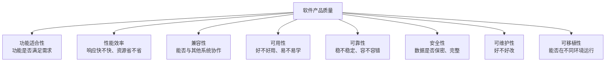

## 1. 从"盖一座桥"说起

### 1.1 为什么软件需要"工程"

想象你被要求"盖一座桥"。你不会直接拉来钢筋水泥就开工，而是会经历一整套流程：

- **先问清楚**：桥要承受多少车流？跨多宽的河？（需求分析）
- **再画图纸**：桥用什么结构？桥墩在哪？（设计）
- **然后施工**：按图纸一步步建（编码实现）
- **最后验收**：检测承重、通车试验（测试验证）
- **长期维护**：定期检查、修补裂缝（运维演进）

**为什么盖桥必须这么严谨？** 因为桥是"大工程"：设计错了可能塌，返工成本极高，而且关系到人的安全。

**软件工程（Software Engineering）就是"软件世界的造桥方法论"**：把软件的开发、运行和维护，当作一个**系统化、规范化、可度量**的工程过程来管理，而不是"一个人拍脑袋写代码"。

### 1.2 软件工程的定义

> **软件工程是将系统化、规范化、可度量的方法应用于软件的开发、运行和维护的学科。（IEEE 定义）**

拆解三个关键词：

| 关键词 | 含义 | 反例 |
| :--- | :--- | :--- |
| 系统化 | 有完整的流程和方法 | 想到哪写到哪 |
| 规范化 | 有标准和规范约束 | 每人一套风格 |
| 可度量 | 有数据衡量质量 | 凭感觉说"差不多了" |

## 2. 软件危机：软件工程诞生的原因

### 2.1 1968 年的"软件危机"

1968 年，北大西洋公约组织（NATO）召开了一次著名的会议，首次提出"**软件危机**"概念。当时的背景是：计算机硬件突飞猛进，但软件开发却乱象丛生——项目大面积超期超预算、软件质量低劣、维护困难。

**软件危机的典型表现**：

| 表现 | 具体场景 |
| :--- | :--- |
| 项目超期超预算 | 计划 6 个月交付，结果做了 2 年，预算翻倍 |
| 软件质量低 | 上线就崩、频繁出 bug，用户投诉不断 |
| 维护困难 | 代码没人敢动，改一行崩三处 |
| 需求变更频繁 | 需求一变，之前的工作全部推倒 |
| 团队协作困难 | 多个人改同一模块，冲突不断 |

### 2.2 危机的根源

软件危机不是"程序员不努力"，而是**软件本身的特性**决定的：

- **软件是抽象的**：看不见摸不着，需求很难一次说清楚
- **软件是复杂的**：一个系统有成千上万个逻辑分支，任何一处出错都可能引发连锁反应
- **软件是可变的**：业务环境在变，需求一直在变
- **软件是人写的**：人容易犯错，且沟通成本极高

**软件工程的价值**，就是通过流程、规范、度量，把这些"不可控"的因素变成"可控"的。

## 3. 软件生命周期：软件的"一生"

### 3.1 六个主要阶段

软件的开发不是"一次写完就完事"，而是一个持续演进的过程，称为**软件生命周期（SDLC, Software Development Life Cycle）**：

```
需求分析 → 系统设计 → 编码实现 → 测试验证 → 部署运维 → 维护演进
```

| 阶段 | 产出物 | 关键活动 |
| :--- | :--- | :--- |
| 需求分析 | 需求规格说明书 | 需求获取、分析、验证 |
| 系统设计 | 设计文档 | 架构设计、详细设计 |
| 编码实现 | 源代码 | 编码、代码审查 |
| 测试验证 | 测试报告 | 单元测试、集成测试、系统测试 |
| 部署运维 | 运行系统 | 部署、监控、运维 |
| 维护演进 | 新版本 | 缺陷修复、功能增强 |

### 3.2 开发模型：不同场景选不同"节奏"

生命周期的具体执行方式，有几种经典模型：

| 模型 | 特点 | 适用场景 |
| :--- | :--- | :--- |
| 瀑布模型 | 线性顺序，一个阶段完成才进入下一阶段 | 需求明确的小项目 |
| V 模型 | 测试活动与开发阶段对应 | 安全关键系统（航空航天、医疗） |
| 增量模型 | 分批交付，每次交付一部分功能 | 大型系统 |
| 螺旋模型 | 风险驱动，每轮迭代都做风险评估 | 高风险项目 |
| 敏捷模型 | 短周期迭代，快速响应变化 | 需求变化频繁（互联网产品） |

**关键认知**：没有"最好的模型"，只有"最适合当前项目"的模型。需求稳定的项目用瀑布高效；需求多变的互联网产品用敏捷。

## 4. 软件质量属性：好软件的标准

### 4.1 ISO 25010 质量模型

"软件好不好"不能只凭感觉，业界有标准化的质量模型。ISO 25010 是当前最权威的软件质量模型，它定义了 8 大质量特性：



**理解要点**：

- **功能适合性**：系统做对了该做的事（功能正确、完整）
- **性能效率**：系统做得快、省资源（响应时间、吞吐量）
- **可靠性**：系统不轻易出故障（可用性、容错性）
- **可维护性**：系统好改（模块化、可分析、可修改）

**一个实用问题**：你的项目在 8 个维度上，哪些是强项、哪些是短板？质量属性之间常常冲突（如性能 vs 可维护性），需要明确优先级（详见 038-software-architecture《质量属性》）。

## 5. 软件工程原则

### 5.1 六大核心原则

| 原则 | 含义 | 反例 |
| :--- | :--- | :--- |
| DRY | Don't Repeat Yourself，消除重复 | 同一逻辑复制粘贴 5 份 |
| KISS | Keep It Simple，保持简单 | 为了"炫技"引入复杂架构 |
| YAGNI | You Aren't Gonna Need It，不做过度设计 | 为不存在的需求设计抽象层 |
| 关注点分离 | 每个模块只关注一个职责 | 一个类什么功能都做 |
| 信息隐藏 | 模块内部实现对外不可见 | 直接暴露内部数据结构 |
| 最少知识 | 最小化模块间的依赖 | 一个对象到处引用其他对象 |

**用一句话记住**：**简单、清晰、可维护**——DRY 减少重复、KISS 保持简单、YAGNI 不做多余、关注点分离让职责清晰。

### 5.2 工程化实践

原则要落地，需要配套的工程实践：

| 实践 | 说明 |
| :--- | :--- |
| 版本控制 | Git 管理代码变更，可追溯可回滚 |
| 持续集成 | 自动化构建和测试，让"红了马上知道" |
| 代码审查 | 同行评审保证质量（见 039-engineering-practices《代码审查清单》） |
| 自动化测试 | 测试金字塔覆盖（单元/集成/E2E） |
| 文档驱动 | 设计文档与代码同步维护 |

## 6. 软件工程 vs 编程

初学者常混淆"编程"和"软件工程"。两者有本质区别：

| 维度 | 编程 | 软件工程 |
| :--- | :--- | :--- |
| 关注点 | 让代码跑起来 | 让系统长期健康 |
| 时间尺度 | 一次开发 | 整个生命周期 |
| 团队 | 个人 | 多人协作 |
| 度量 | 功能是否实现 | 质量、成本、进度 |
| 类比 | 一个人做一顿饭 | 经营一家餐厅 |

**编程能力是基础，软件工程是进阶**。一个人能写代码，不等于能交付一个"长期健康运行的系统"——后者需要工程思维。

## 7. 常见误区

**误区一：软件工程 = 写文档。** → 文档只是手段，工程的核心是"用流程、规范、度量控制风险"。

**误区二：瀑布已经过时了。** → 瀑布没有过时，它适合需求明确的项目；敏捷适合需求多变的项目。选错模型才过时。

**误区三：软件工程是"大公司"才需要的。** → 越是小团队越容易陷入"代码越写越乱"的困境。软件工程的最小实践（版本控制、测试、代码审查）任何团队都需要。

**误区四：质量 = 功能多。** → 功能多≠质量好。一个功能少但稳定、易维护、安全的系统，比功能多但频繁崩溃的系统质量更高。
