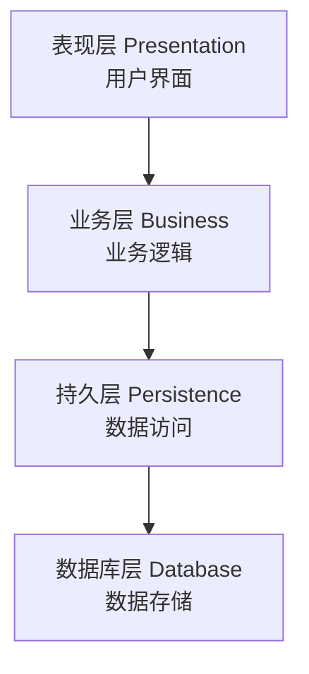
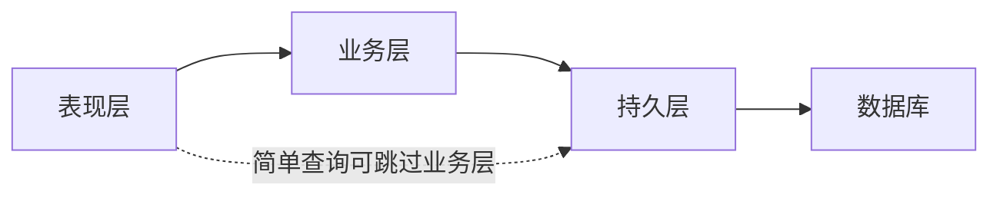
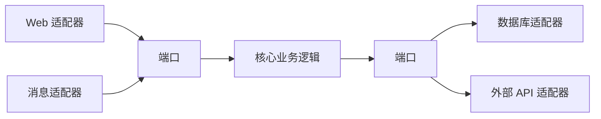

## 1. 从"餐厅厨房"说起：为什么要分层

### 1.1 一个厨房的启示

想象一家餐厅的厨房是怎么运作的：

- **前厅服务员**：接待客人、下单、上菜——他们不和食材打交道
- **主厨**：根据订单设计菜品、决定做菜流程——他们不直接接触洗碗工
- **切配/打荷**：准备食材、处理半成品
- **洗碗工**：清洗餐具

这个分工体系能正常运转，靠的是什么？**职责分离 + 单向协作**：服务员不越权进厨房炒菜，主厨不亲自去洗碗，每层只和"直接相邻"的层级配合。如果有人打破了分工（服务员自己进后厨炒菜），整个餐厅就乱了。

**分层架构（Layered Architecture）就是软件世界的"餐厅厨房"**：把系统按职责拆成若干水平层，每层只负责一类事情，层与层之间单向依赖、各司其职。

### 1.2 分层架构的核心思想

分层架构将系统划分为**多个水平层**，每层只与相邻层交互：



每一层都像是"餐厅里的一个岗位"：

| 层 | 餐厅类比 | 软件职责 |
| :--- | :--- | :--- |
| 表现层 | 前厅服务员 | 和用户打交道：接收输入、展示结果 |
| 业务层 | 主厨 | 核心业务逻辑：决定"怎么做对" |
| 持久层 | 切配/洗碗 | 数据存取：和数据库打交道 |
| 数据库 | 仓库 | 数据最终存储的地方 |

### 1.3 分层的四大原则

**原则一：单向依赖。** 上层依赖下层，下层绝不依赖上层。表现层知道业务层的存在，业务层不知道表现层的存在——就像服务员知道有主厨，主厨不知道今天前台是谁。

**原则二：隔离变化。** 某层内部的变化不影响其他层。比如数据库从 MySQL 换成 PostgreSQL，业务层代码应该"无感知"（因为业务层不直接操作数据库）。

**原则三：关注点分离。** 每层只关心自己的职责。表现层关心"怎么展示"，业务层关心"业务规则是什么"，持久层关心"数据怎么存取"——不要混在一起。

**原则四：可替换性。** 每层的实现可以被替换，只要接口不变。比如表现层从 Web 页面换成手机 App，只要业务层接口稳定，就不影响系统主体。

## 2. 各层的职责详解

### 2.1 表现层（Presentation Layer）

表现层是用户"看得见"的部分，它的职责是：

| 职责 | 说明 | 典型实现 |
| :--- | :--- | :--- |
| 用户交互 | 接收用户输入、响应点击 | HTML 页面、移动端 UI |
| 数据展示 | 把数据格式化成用户能看懂的形式 | 表格、图表、列表 |
| 请求路由 | 把用户请求转发给业务层 | Controller、路由配置 |
| 输入验证 | 做基本格式校验（非空、长度） | 表单校验 |

**表现层的大忌**：把业务逻辑写进界面代码。比如"订单满 100 元免运费"这种规则，如果写在页面的 JavaScript 里，那么换个客户端（手机 App）就要重写一遍——而且容易和服务器规则不一致。

**正确姿势**：表现层只做"收集输入 → 传给业务层 → 展示返回结果"，一切业务判断交给业务层。

### 2.2 业务层（Business Layer）

业务层是系统的"大脑"，存放核心业务规则：

| 职责 | 说明 | 例子 |
| :--- | :--- | :--- |
| 业务逻辑 | 核心业务规则 | "订单满 100 免运费" |
| 流程编排 | 协调多个组件完成业务 | "下单 = 校验库存 + 扣库存 + 生成订单" |
| 事务管理 | 保证多步操作的一致性 | 扣库存和生成订单必须同时成功 |
| 权限控制 | 业务级权限校验 | "只有管理员能删除用户" |

**业务层是分层架构里最"金贵"的一层**——因为它承载了系统的核心价值（业务规则），而且最容易被写坏。业务层的健康标准是：**不依赖任何 UI 细节、不依赖任何具体数据库技术**。它应该是"纯逻辑"的存在。

### 2.3 持久层（Persistence Layer）

持久层负责"数据的存取"，把对象和数据库之间的操作封装起来：

| 职责 | 说明 |
| :--- | :--- |
| 数据访问 | 封装 CRUD（增删改查）操作 |
| ORM 映射 | 对象和关系表之间的映射（Java 的 MyBatis/JPA、Python 的 SQLAlchemy） |
| 查询优化 | 负责 SQL 的性能（索引、批量操作） |
| 缓存管理 | 管理数据缓存 |

**持久层的价值**：业务层不用关心"数据存在 MySQL 还是 Oracle、SQL 怎么写"，只要调用持久层提供的接口（`userRepository.findById(1)`）即可。这样数据库换掉时，业务层不受影响。

## 3. 分层的两种形态：严格与松散

### 3.1 严格分层（Closed Layers）

**规则**：每层只能调用它的直接下层。请求必须一层一层地走：

```
表现层 → 业务层 → 持久层 → 数据库
```

**优点**：依赖关系最清晰，层次纪律最严格。任何请求路径都是可预测的。

**缺点**：某些"简单查询"也要绕一大圈——表现层想显示一个用户列表，也必须经过业务层（哪怕业务层什么都没做）。

### 3.2 松散分层（Open Layers）

**规则**：允许跨层调用，跳过某些层。比如表现层做简单查询时可以直接调用持久层：



**优点**：减少无谓的层间传递，性能更好。

**缺点**：依赖关系变得混乱，业务规则可能被绕过（简单查询渐渐变成带业务判断的查询）。

### 3.3 怎么选

- 业务规则复杂的系统（订单、支付）：用**严格分层**，保证业务层不被绕过
- 以查询为主的系统（报表、展示）：可用**松散分层**，允许只读查询直接访问持久层
- 经验法则：**先严格，再按需开放**——初始用严格分层，出现"明显无意义的绕层"再局部开放

## 4. 常见分层模式：从三层到洋葱

"分层"是一个思想，不同实践给出了不同的"层数"。常见的有：

| 模式 | 分层 | 代表思想 |
| :--- | :--- | :--- |
| 三层架构 | 表现层-业务层-数据层 | 最经典，Java EE 的标配 |
| 四层架构 | 表现-应用-领域-基础设施 | DDD 的分层（见《领域驱动设计》） |
| 六边形架构 | 核心 + 端口 + 适配器 | Alistair Cockburn 提出 |
| 洋葱架构 | 领域核心 + 多层环绕 | Jeffrey Palermo 提出 |

### 4.1 三层架构（最经典）

三层架构是大多数 Web 应用的实际形态，也是很多框架的默认结构：

```
Controller（控制器）→ Service（服务）→ Repository（仓库）→ DB
   表现层              业务层          持久层
```

前端框架的 MVC（Model-View-Controller）本质也是三层思想的体现。

### 4.2 六边形架构（端口与适配器）

六边形架构强调**"核心"与"外界"的隔离**：核心（业务逻辑）位于中心，通过"端口"（接口）与外界交互，外界通过"适配器"实现端口。



**价值**：核心完全不依赖任何具体技术（Web 框架、数据库），可以独立测试、独立演进。这是"依赖倒置"原则的极致体现。

### 4.3 洋葱架构

洋葱架构和六边形类似，但更强调"依赖方向向心"：领域层在最中心，外层只能依赖内层，内层不知道外层的存在。

```
UI → 应用服务 → 领域服务 → 领域模型（核心）
               ↑          ↑
       基础设施层（实现接口）
```

## 5. 分层架构的优缺点

### 5.1 优点

- **简单易懂**：层数不多、职责清晰，团队能快速上手
- **关注点分离**：每层只管一件事，代码更好维护
- **可测试性**：每层可以独立测试（业务层测试不需要启动 UI）
- **标准化**：业界广泛采用，招聘、找资料、交流都容易
- **渐进演进**：可以从三层起步，需要时向六边形/DDD 演进

### 5.2 缺点

- **性能开销**：每多一层就多一次传递，简单操作也被"绕层"
- **过度抽象**：小功能也要经过所有层，代码量膨胀
- **腐化风险**：层间边界容易被打破（程序员赶进度时会"直接连数据库"）
- **单体倾向**：分层天然是"一个应用内部"的结构，容易演变成大泥球

### 5.3 一个判断标准

分层架构适合什么样的系统？

**适合**：业务规则明确、以 CRUD 为主的传统企业应用、中小型 Web 应用。

**不太适合**：超高并发、需要极致性能的系统（层间传递是负担）；架构边界需要物理隔离的系统（此时用微服务）。

## 6. 最佳实践：让分层真正健康

分层架构的失败，90% 不是"选错了层"，而是"层被写坏了"。以下是保持分层健康的实践：

### 6.1 DTO 转换：层间不暴露内部对象

各层之间传递数据时，使用 **DTO（Data Transfer Object）**，而不是直接把数据库实体丢给界面。

```java
// 错误：把数据库实体直接返回给前端
public UserEntity getUser(int id) { return userRepo.findById(id); }

// 正确：转成 DTO 再返回（隐藏敏感字段、结构解耦）
public UserDTO getUser(int id) {
    UserEntity entity = userRepo.findById(id);
    return new UserDTO(entity.getName(), entity.getEmail());
}
```

**为什么**：数据库实体往往包含不该暴露的字段（密码哈希、内部状态），且与数据库结构强耦合。DTO 把"内部表示"和"对外表示"解耦。

### 6.2 依赖倒置：让上层定义接口，下层实现

依赖倒置原则（DIP）在分层中的应用：**业务层定义接口，持久层实现接口**——而不是业务层直接依赖具体数据库。

```java
// 业务层只依赖接口（不知道具体是 MySQL 还是 PG）
public interface OrderRepository {
    Order findById(Long id);
    void save(Order order);
}

// 持久层提供实现
@Repository
public class MysqlOrderRepository implements OrderRepository {
    // 具体 SQL / ORM 实现
}
```

**好处**：数据库可替换、业务层可独立测试（测试时用 Mock 实现接口）。

### 6.3 防腐层：隔离外部系统

对接第三方系统（支付、短信、地图）时，用**防腐层（Anti-Corruption Layer）**把外部模型翻译成内部模型：

```
业务层 ⇄ 防腐层(适配器) ⇄ 第三方系统
```

第三方 API 变化时，只需要改防腐层，业务层不受影响。

### 6.4 统一异常处理

每一层把异常转换成"本层语言"：持久层把 SQL 异常转成"数据访问异常"，业务层把数据访问异常转成"业务异常"，表现层统一处理并返回友好提示。

**错误示范**：数据库的 SQLException 一路抛到前端，用户看到一堆技术细节。

### 6.5 分层边界守卫

用工具强制分层纪律（防止"赶进度时直接跨层"）：

- Java 有 ArchUnit（架构测试），可以编写规则："Controller 不得直接调用 Repository"
- 代码评审时把"是否破坏分层"作为检查项
- 使用依赖分析工具（如 jdepend）检测层间依赖

## 7. 分层架构实战：一个订单模块的例子

把上述理论落到一个真实的"下单"场景，看看分层如何协作：

```java
// 表现层：接收 HTTP 请求
@RestController
public class OrderController {
    private final OrderService orderService;

    @PostMapping("/orders")
    public OrderDTO createOrder(@RequestBody CreateOrderRequest req) {
        // 只做基本校验 + 调用业务层
        return orderService.createOrder(req);
    }
}

// 业务层：核心业务逻辑
@Service
public class OrderService {
    private final OrderRepository orderRepository;
    private final InventoryRepository inventoryRepository;

    @Transactional
    public OrderDTO createOrder(CreateOrderRequest req) {
        // 1. 业务校验
        if (req.getItems().isEmpty()) throw new BusinessException("订单不能为空");
        // 2. 扣库存（通过持久层接口）
        for (Item item : req.getItems()) {
            inventoryRepository.decrease(item.getProductId(), item.getQuantity());
        }
        // 3. 生成订单
        Order order = new Order(req.getCustomerId(), req.getItems());
        orderRepository.save(order);
        // 4. 返回 DTO
        return OrderDTO.from(order);
    }
}

// 持久层：数据访问
@Repository
public class MysqlOrderRepository implements OrderRepository {
    @Override
    public void save(Order order) {
        // 具体的 SQL / ORM 操作
    }
}
```

**观察这个例子**：

- 表现层不知道"扣库存"的存在——它只负责接收请求和返回结果
- 业务层不知道"数据存在哪"——它只调用 `OrderRepository` 接口
- 持久层不知道"为什么扣库存"——它只负责执行
- 每层职责单一，替换任何一层（换框架、换数据库）都不影响其他层

## 8. 常见反模式与误区

### 反模式一：贫血分层（Anemic Layering）

**症状**：业务层变成了"空壳 Service"，所有业务逻辑写在表现层或持久层里，分层只剩空架子。

**对策**：业务逻辑必须进业务层，层内使用领域模型承载逻辑。

### 反模式二：层泄漏（Layer Leakage）

**症状**：表现层直接调用持久层方法、持久层里出现业务判断（"如果订单状态是 X 就查表 Y"）。

**对策**：靠 ArchUnit 等工具 + 代码评审拦截。

### 反模式三：上帝层（God Layer）

**症状**：某一层承载了系统 80% 的逻辑，其他层都是"传话筒"。

**对策**：重新分配职责，让每层有实质内容。

### 反模式四：为分层而分层

**症状**：简单的小系统也强行套 5 层架构，代码量翻倍、维护更困难。

**对策**：分层的深度要和系统复杂度匹配——小项目用 2-3 层即可，不要为了"规范"而过度分层。
