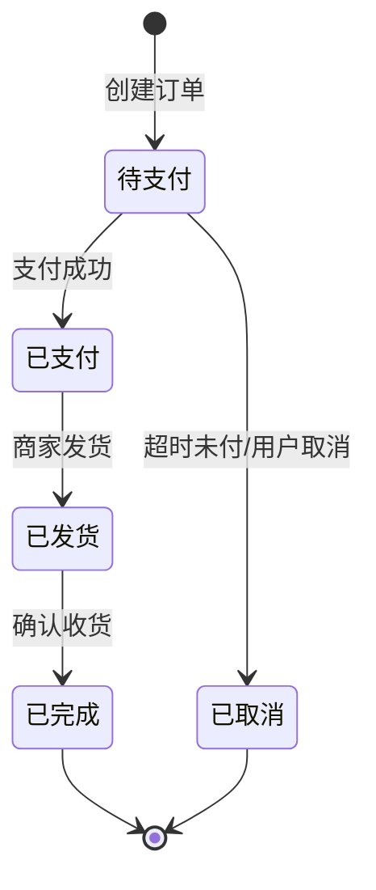
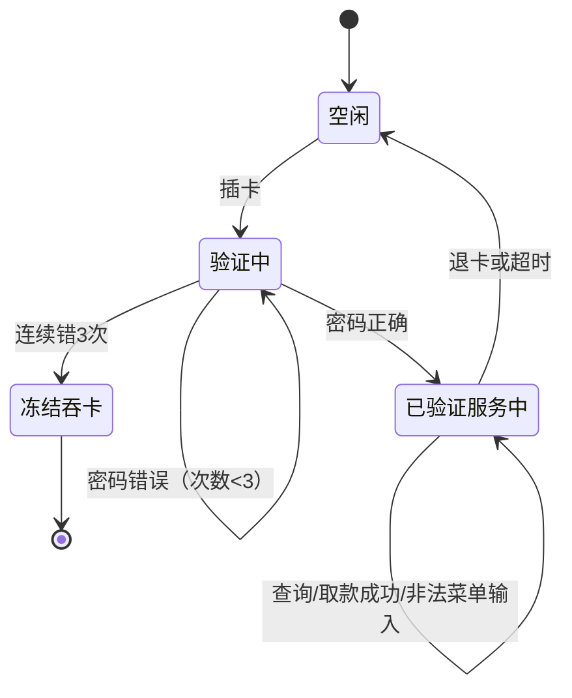

## 1. 从"查字典"与"查地图"说起

等价类划分与边界值分析（见[等价类划分](/software-testing/050-EquivalenceClassPartition)、[边界值分析](/software-testing/060-BoundaryValueAnalysis)）解决的是「**一个输入**该取哪些值」——像查字典，每个字（输入项）单独研究。

但软件行为有两类问题字典解决不了：

- **组合问题**：退款能不能通过，取决于「订单状态、申请时间、会员等级」三个条件同时取什么值——单看每个条件都对，合在一起才出错。这需要**判定表**与**正交试验法**，像查地图看「几条路交叉的路口」。
- **流程问题**：同一笔转账，从「未登录」发起和从「已登录」发起是完全不同的行为；同一个订单，不能「发货两次」。行为依赖**先后顺序与当前状态**。这需要**场景法**与**状态迁移法**，像查地图看「路线怎么走、哪些路走过了不能重走」。

本篇补齐这两类工具，并与已学的单输入方法组成完整的黑盒方法工具箱。

## 2. 判定表：多条件组合的「真相表格」

### 2.1 四个组成部分

判定表（Decision Table）把「什么条件组合导致什么动作」画成一张表：

| 组成 | 含义 | 例子（优惠券规则） |
| :--- | :--- | :--- |
| 条件桩 | 列出所有条件 | 是否新用户、订单是否满 100 元 |
| 动作桩 | 列出所有可能的动作 | 减 20、打 9 折、无优惠 |
| 规则 | 一列 = 一种条件组合及其动作 | 「新用户 + 满 100 → 减 20」是一列 |
| 化简 | 合并「动作相同且某条件无关紧要」的规则 | 满 100 时新老用户都打 9 折 → 两列合一列 |

### 2.2 设计步骤（以优惠券为例）

规则：新用户且订单满 100 减 20；非新用户满 100 打 9 折；不满 100 无优惠；新用户不满 100 减 5。

```text
第一步：列条件桩（n 个条件 → 理论上 2^n 条规则）
  C1：是否新用户    取值：Y / N
  C2：订单满 100    取值：Y / N

第二步：列动作桩
  A1：减 20    A2：打 9 折    A3：减 5    A4：无优惠

第三步：画全组合（2^2 = 4 条规则），逐列填动作
  规则    1        2        3        4
  C1      Y        Y        N        N
  C2      Y        N        Y        N
  动作    减20     减5      9折      无优惠

第四步：化简——逐条件检查「取什么值动作都一样」的列
  本例 4 条规则动作各不相同，无法化简（能化简的例子见练习 1）
```

化简的写法：某条件对结果无影响时，该格填「-」（不计入规则数）。化简后规则数就是**最少必要用例数**——这是判定表对「测多少条」的直接回答。

### 2.3 适用与局限

- 适用：条件 2~5 个、条件之间有逻辑依赖（IF-THEN 规则、审批流、权限判断）；
- 局限：条件多了组合爆炸（5 个条件 32 列，8 个条件 256 列）——此时要么合并条件、要么改用正交法抽样。

## 3. 正交试验法：组合爆炸时的「科学抽样」

### 3.1 因素与水平

正交法源自实验设计：**因素**是输入项（浏览器、操作系统、网络环境），**水平**是每个因素的取值个数（浏览器 3 种、系统 3 种、网络 2 种）。全组合 = 3 × 3 × 2 = 18 组；正交表用一张标准行数的表把实验次数砍到「水平数的平方」量级：记号 L9(3^4) 的意思是——最多容纳 **4 个因素**、每个因素最多 **3 个水平**、只需 **9 次**实验。因素的实际水平数不足时，重复已有水平补齐到表要求的数目即可。

### 3.2 一个兼容性矩阵例子

因素与水平：浏览器（Chrome / Firefox / Safari）、系统（Windows / macOS / Android）、网络（Wi-Fi / 4G，只有 2 个水平，补一个「Wi-Fi」凑成 3 个水平：1=Wi-Fi、2=4G、3=Wi-Fi）。

```text
全组合：3 × 3 × 2 = 18 组
选 L9(3^4) 标准表，取 3 个因素，网络因素按补齐后的水平映射 → 9 组
```

| 用例 | 浏览器 | 系统 | 网络 |
| :--- | :--- | :--- | :--- |
| 1 | Chrome | Windows | Wi-Fi |
| 2 | Chrome | macOS | 4G |
| 3 | Chrome | Android | Wi-Fi |
| 4 | Firefox | Windows | 4G |
| 5 | Firefox | macOS | Wi-Fi |
| 6 | Firefox | Android | Wi-Fi |
| 7 | Safari | Windows | Wi-Fi |
| 8 | Safari | macOS | Wi-Fi |
| 9 | Safari | Android | 4G |

正交表的性质保证：**每两个因素的每一对水平组合，在 9 次实验中恰好均匀出现**（均匀分散、齐整可比）——例如「浏览器 × 系统」的 9 种搭配全部各出现一次，「网络 × 系统」的 6 种搭配也都在表中。

### 3.3 适用与局限

- 适用：配置兼容性测试、参数化配置组合（因素多、各因素独立）；
- 核心局限：它只保证**两两组合**被覆盖，三个因素的交互缺陷可能漏掉——「均匀抽样」是覆盖与成本的折中，不是全覆盖；
- 与[等价类划分](/software-testing/050-EquivalenceClassPartition)第 5 节的成对测试（pairwise）的关系：pairwise 是「两两组合覆盖」这一思想的通用算法实现，正交表是它的经典表格工具；因素水平参差不齐时用 pairwise 工具更灵活，整齐对称时查正交表更快。

## 4. 场景法：沿着业务流程走一遍

### 4.1 基本流与备选流

场景法把业务拆成一条**基本流**（一切顺利的主路径）加若干**备选流**（分支、异常、取消），每个「基本流 + 零条或多条备选流」的组合构成一个**场景**，一个场景对应一条测试用例。

### 4.2 实例：ATM 取款

以一个经典的 ATM 实训需求为背景（账号密码验证、连续错 3 次冻结、取款校验余额）：

```text
基本流（成功取款）：
  插卡 → 输入密码（正确）→ 选「取款」→ 输入金额（不高于余额）→ 吐钞 → 退卡

备选流：
  F1 密码错误 → 提示重输（回到输密码步骤）
  F2 连续错 3 次 → 冻结账户，吞卡，会话结束
  F3 金额超过余额 → 提示余额不足，回到输入金额步骤
  F4 输入非菜单选项 → 提示「输入的编号有误」，重显菜单
  F5 中途取消/超时未操作 → 退卡，会话结束
```

场景矩阵（行 = 备选流，列 = 场景，V 走到 / X 不涉及，I 无效）：

| 场景 | 基本流 | F1 密码错 | F2 冻结 | F3 余额不足 | F4 非法输入 |
| :--- | :--- | :--- | :--- | :--- | :--- |
| S1 正常取款 | V | X | X | X | X |
| S2 密码错一次后成功 | V | V | X | X | X |
| S3 三次错密码冻结 | V | V | V | X | X |
| S4 金额超余额重输后成功 | V | X | X | V | X |
| S5 非法菜单输入 | V | X | X | X | V |

每个场景写一条用例：前置（账户余额 500 元）+ 步骤（按场景路径）+ 预期（吐钞 200 元、余额 300、卡退出）。**场景矩阵的价值是「防漏」**——备选流的组合场景（如 S3：先输错两次、第三次成功、第四次又输错）最容易被漏测，矩阵逼着你逐一画 V/X。

## 5. 状态迁移法：把「行为的合法性」画成状态机

### 5.1 三要素

状态迁移测试面向「对象在生命周期里的合法变化」：

- **状态**：对象当前所处的情形（订单：待支付、已支付、已发货、已完成、已取消）；
- **事件**：触发迁移的外部输入（支付成功、商家发货、用户取消）；
- **迁移**：状态 + 事件 → 新状态（待支付 + 支付成功 → 已支付）。



### 5.2 覆盖强度分三档

| 覆盖策略 | 要求 | 强度 |
| :--- | :--- | :--- |
| 状态覆盖 | 每个状态至少到达一次 | 最弱（只查「进得去」） |
| 迁移覆盖 | 每条合法迁移至少执行一次 | 常用基线（查「走得通」） |
| 迁移对覆盖 | 相邻两条迁移的串联组合都执行 | 最强（查「连着走会不会出错」，如支付后立即取消） |

### 5.3 别忘了非法迁移

黑盒状态测试的一大价值是验证**系统拒绝非法迁移**：在「已发货」的订单上发起「取消」，系统应该拒绝并给出明确提示，而不是把状态改掉。从迁移表看：合法迁移之外的所有「状态 × 事件」组合都是非法迁移用例——数量 = 状态数 × 事件数 − 合法迁移数，挑其中业务上最可能发生的（重复支付、已取消后再支付）优先测。

### 5.4 适用判断

- 适用：有明显生命周期与状态约束的对象（订单、账户、工单、审批单、设备连接）；
- 不适用：无状态的工具类功能（格式转换、纯计算）。

## 6. 错误推测法：经验清单化的「最后一击」

错误推测法不讲究系统性，靠经验直接猜容易出错的地方。它的正确用法是**把个人经验沉淀为团队清单**，常见条目：

- 输入为空、全空格、0、负数、超大数、超长字符串；
- 特殊字符与转义序列（引号、反斜杠、emoji、SQL/HTML 片段）；
- 重复操作（重复提交、双击、刷新回退重放）；
- 并发与中断（两个端同时登录、操作中途断网、来电打断）；
- 时间边界（23:59:59 下单、闰年 2 月 29 日、时区跨越）。

它通常作为补充手段：先用判定表/场景法/状态迁移法铺开主干覆盖，再用错误推测法打「方法覆盖不到的奇点」。

## 7. 方法选择决策表

| 被测特征 | 首选方法 | 辅助方法 |
| :--- | :--- | :--- |
| 单输入有取值范围 | 等价类 + 边界值 | 错误推测 |
| 多个条件组合决定结果（5 个条件以内） | 判定表 | 错误推测 |
| 多因素多水平配置（>5 组合爆炸） | 正交法 / pairwise | 判定表（对关键子集） |
| 有明确业务流程分支 | 场景法 | 判定表（对每个分支内部） |
| 对象有生命周期状态约束 | 状态迁移法 | 场景法 |
| 时间紧、无需求文档 | 错误推测 + 风险优先 | 探索性测试 |

答题框架（面试常问「给 XX 功能设计用例」）：先判断被测特征属于哪类，点名方法，再按方法输出用例表——方法选对比用例数量更能体现测试思维。

## 8. 常见误区

**误区一：条件一多就硬画判定表。** 8 个条件 256 列没人看得完。先合并相关性强的条件，或对非关键因素改用正交法。

**误区二：正交表水平数不匹配硬套。** 表里要 3 水平，实际因素只有 2 个取值，重复一个水平补齐即可，但不能把 3 水平的因素塞进 L9 只留 2 个取值——那会漏掉一个水平。

**误区三：场景法只测基本流。** 基本流通了只说明「顺的时候能用」；备选流及其组合才是缺陷高发区，场景矩阵要给备选流组合留位置。

**误区四：状态迁移只测合法迁移。** 非法迁移被正确拒绝是状态约束存在感最强的证明；只测合法路径等于只验证了状态机的一半。

**误区五：方法之间互斥。** 一份完整的用例集往往同时用三四种方法：状态迁移画骨架，每个迁移内部用等价类边界值取值，分支条件用判定表展开，最后用错误推测补漏。

## 9. 与相邻知识的关系

- 之前：[等价类划分](/software-testing/050-EquivalenceClassPartition)与[边界值分析](/software-testing/060-BoundaryValueAnalysis)解决单输入取值，本篇方法是它们在「组合维度」与「时间维度」的延伸；
- 并行：[白盒覆盖](/software-testing/070-WhiteBoxTestCoverage)从代码结构回答「测到了没有」，本篇方法从需求结构回答「测哪些」——黑盒设计用例、白盒衡量覆盖，两者对同一份用例集打分；
- 之后：场景法是 [E2E 测试](/software-testing/220-E2ETest)脚本设计的直接方法论（一条场景一条脚本）；状态迁移的回归价值在 [CI/CD 测试](/software-testing/230-CICDTest)中兑现——状态机不变时，迁移用例集可以长期稳定回归。

## 10. 面试题思路

**「判定表怎么化简，化简的依据是什么？」** 先讲结构（条件桩/动作桩/规则），再讲化简规则：两条规则动作相同、且仅有一个条件取值不同时，该条件可合并为「-」（无关项）。依据是：该条件不影响输出，两列用例等价，测一列即可代表两列。

**「全组合测不完怎么办？」** 分层作答：先判定表化简降维；条件独立且组合爆炸时用正交/pairwise 保证两两覆盖，同时明确交代「三因素交互可能漏」的代价；对高风险交互再单独补组合用例——体现「覆盖与成本的显式权衡」。

**「登录功能怎么设计用例？」** 组合框架：账号/密码各自等价类与边界值（单输入层）→ 「账号正确 × 密码正确 × 验证码正确 × 账户状态正常」判定表（组合层）→ 连续失败锁定用状态迁移（已锁定、剩余次数递减、解锁）（状态层）→ 错误推测补 XSS 输入、重复提交（补漏层）。

## 11. 动手与遮代码自检

先看任务与提示，自己设计完再看参考实现。

### 练习 1：快递运费的判定表（实践题）

任务：运费规则为「会员免运费；非会员订单满 99 元免运费；普通件 8 元，易碎品加收 5 元」。设计判定表并化简，给出最少用例数。

提示：条件桩先列全（会员？满 99？易碎品？），写完 8 列再化简——注意「会员」列在免运费规则里可能与其他条件无关。

参考实现：

```text
条件桩：C1 会员（Y/N）  C2 满99（Y/N）  C3 易碎品（Y/N）
动作桩：A1 免运费  A2 运费8元  A3 运费13元（8+5）

全组合 8 列：
规则   1   2   3   4   5   6   7   8
C1     Y   Y   Y   Y   N   N   N   N
C2     Y   Y   N   N   Y   Y   N   N
C3     Y   N   Y   N   Y   N   Y   N
动作   A1  A1  A1  A1  A3  A2  A3  A2

化简：
  规则 1~4（会员，C2/C3 任意）动作都是 A1 → 合并为一列：C1=Y，其余 "-"
  规则 6 与 8（非会员、不满99、非易碎）→ A2，C3=N
  规则 5 与 7（非会员、不满99、易碎）→ A3，C3=Y
  （非会员且满 99 的组合规则表中不存在——若需求允许满 99 非会员也免运费，
   需求有歧义，应先澄清再补充）

化简后 3 条规则 → 最少 3 条用例（会员任意件 / 非会员普通件 / 非会员易碎件）
```

自检：化简后的每条用例能否唯一确定一种运费结果？「非会员 + 满 99」这条歧义你主动提出来了吗？

### 练习 2：ATM 会话的状态迁移（实践题）

任务：把第 4.2 节的 ATM 需求画成会话级状态机（状态至少含：空闲、验证中、已验证服务中、冻结吞卡、退卡完成），列出合法迁移，按迁移覆盖写出用例清单，并挑两条非法迁移写成用例。

提示：事件包括插卡、输密码（对/错）、选菜单、取款成功、取消/超时；「验证中」状态要带一个内部计数（错几次）。

参考实现：



```text
迁移覆盖用例清单（每条合法迁移至少一条）：
  TC1 空闲→验证中：插卡，提示输密码
  TC2 验证中→验证中：输错密码一次，提示重输
  TC3 验证中→已验证服务中：输对密码，进入菜单
  TC4 验证中→冻结吞卡：连续输错三次，吞卡退出
  TC5 服务中自环：取款成功，余额更新、继续菜单
  TC6 服务中自环（非法菜单）：输入 9，提示「输入的编号有误，请输入1~4」
  TC7 服务中→空闲：选退卡，回到空闲

非法迁移用例（示例两条）：
  TC8 冻结后的卡再插卡 → 拒绝服务，提示联系柜台（不允许再进入验证中）
  TC9 验证中直接选「取款」→ 无此菜单入口，操作无效（不允许跳过验证）
```

自检：TC2 与 TC4 连起来跑就是「迁移对」场景（错两次、第三次成功、第四次又错）——你的用例表里有这条组合吗？

### 练习 3：网购「下单后取消」的场景法（挑战题）

任务：为「用户下单后取消订单」设计场景矩阵：基本流为下单成功；备选流含支付超时自动取消、用户手动取消、取消时商家已发货（取消失败）、取消后申请退款。要求至少覆盖一条备选流组合场景。

提示：矩阵行是备选流，列是场景；组合场景（手动取消 + 已发货）往往就是需求歧义点。

参考实现：

```text
基本流 B：选商品 → 下单成功 → 待支付
备选流 F1：支付超时（如 30 分钟）→ 系统自动取消
备选流 F2：用户在待支付状态手动取消 → 取消成功
备选流 F3：商家已发货后用户申请取消 → 取消失败，引导走退货流程
备选流 F4：取消成功后申请退款 → 原路退回

场景矩阵：
场景        B   F1  F2  F3  F4
S1 下单成功  V   X   X   X   X
S2 超时自动取消 V V   X   X   X
S3 手动取消  V   X   V   X   X
S4 已发货取消失败 V X  X   V   X
S5 取消后退款 V   X   V   X   V（F2+F4 组合场景）
```

自检：S5 就是「备选流组合」；写 S5 用例时你有没有发现需求没说「退款到账时限」？发现需求歧义本身就是场景法的产出之一。

## 12. 小结

- 初学者要点：等价类与边界值管「单输入取值」，判定表管「多条件组合」，正交法管「组合爆炸时科学抽样」，场景法管「业务流程分支」，状态迁移管「状态与事件的合法性」，错误推测法补经验盲区——先判断被测特征属于哪类，再选方法；
- 进阶注意：判定表化简后规则数就是最少用例数，化简依据是「无关条件合并」；正交法只保证两两覆盖，三因素交互可能漏；场景法要给备选流组合留位置；状态迁移必须测非法迁移；方法可以叠加——状态机画骨架、判定表展开分支、等价类边界值取值、错误推测收尾。
