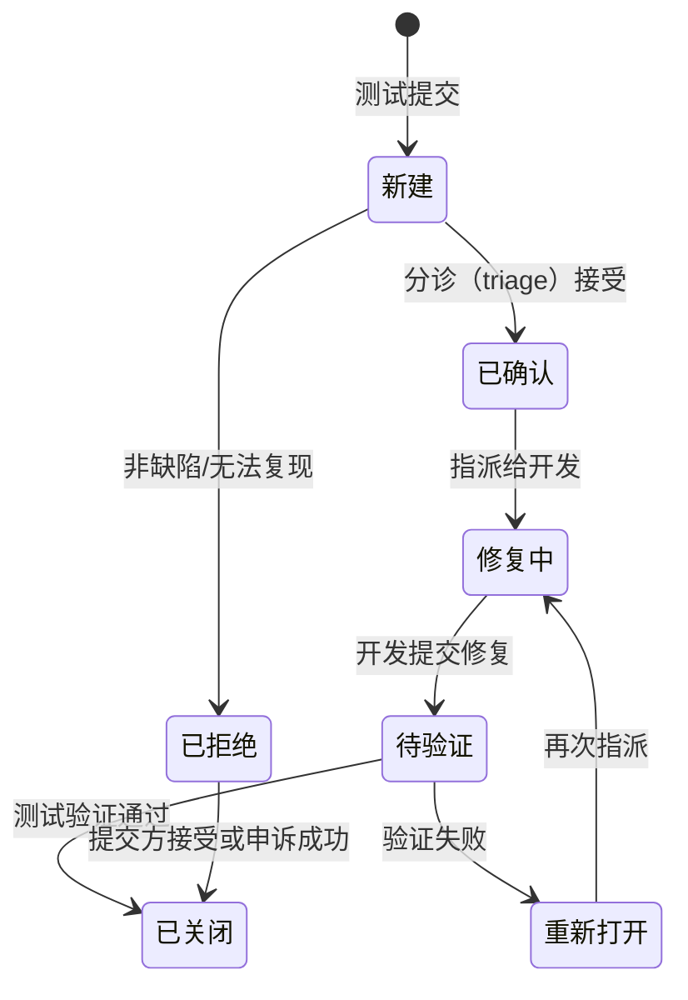

## 1. 从「一封邮件」说起

想象测试工程师小王发了这样一封邮件：「登录功能有 bug，偶尔登不上，尽快修一下。」开发同事回复：「我这边一直是好的。」三天过去，缺陷悬而未决，两边互相怀疑。

问题不在技术，在**交付物质量**：小王交付的不是一个「缺陷」，而是一段情绪加模糊印象。**缺陷报告（Bug Report）是测试工程师最核心的交付物**——它的读者是开发、产品与未来的自己；一份好报告让缺陷在十分钟内被接受、被定位、被修复；一份差报告让同样的缺陷在沟通里耗掉三天。

[测试概念与原则](/software-testing/020-TestConceptPrinciple) 已经给出缺陷的生命周期简版与严重程度/优先级的区分，本篇聚焦「怎么写报告」与「怎么管流转」这两件实战事。

## 2. 缺陷报告八要素

一份合格的缺陷报告包含八个要素，缺一个，沟通成本就往别处转移一分：

| 要素 | 回答的问题 | 反例 |
| :--- | :--- | :--- |
| 标题 | 一眼看出「哪里、什么条件下、坏了什么」 | 「有 bug」「登录坏了」 |
| 环境与版本 | 在哪个环境、哪个版本、什么设备上发生 | 不写环境（「我手机上」） |
| 前置条件 | 复现前需要满足的状态 | 不写（「先要有购物车商品」没说） |
| 复现步骤 | 编号的、可照做的操作序列 | 一段口语化描述 |
| 期望结果 | 依据是什么（需求文档第几节） | 不写（开发只能靠猜） |
| 实际结果 | 观察到的现象，与期望逐条对应 | 与步骤混写 |
| 证据 | 截图、录屏、日志、请求响应 | 「我截图了但没贴」 |
| 严重程度与优先级 | 有多坏 / 多快修（先客观分级） | 不分或混用 |

**标题公式**：`[模块] 在某条件下执行某操作，实际结果与期望不符`。收敛到一行：

```text
差：「下单有时候会失败」
好：「[订单] 库存为 1 的商品被两人同时下单时，第二单支付成功但不生成订单记录」
```

写标题前先问自己：只看标题，开发能不能判断这单该不该归自己、大概去哪看？能，就合格了。

## 3. 复现步骤的写作规范

复现步骤是报告的技术核心，三条标准：

**最小化**：去掉与缺陷无关的操作。三十步的复现路径里往往只有两步是本质的——能把三十步压缩到三步，说明你理解了缺陷的触发条件，也大幅降低开发的定位成本。

**确定性**：每一步都有明确的输入与预期反馈，不依赖「运气」。「多试几次」不是步骤；「用账号 A 在 Chrome 130 下连续提交 5 次，第 3 次必现」才是步骤。

**可观察**：关键步骤给出观察点——点「提交」后「页面无跳转 + Network 面板 order 接口返回 500」比「卡住了」有效得多。日志与请求响应直接附在证据里，注意脱敏（手机号、token 打码）。

### 偶现缺陷怎么办

「偶尔出现」不是不报的理由，而是改变报告策略的信号：

1. **量化概率**：固定脚本或手动重复 N 次，记录出现次数（「重复 50 次出现 2 次，约 4%」）；
2. **找相关变量**：偶现通常与并发、时序、缓存、网络波动相关——记录出现时的环境差异（时间点、其他操作、日志上下文）；
3. **给证据链**：偶现缺陷的录屏与日志比可复现缺陷更重要，因为开发无法按步骤重放；
4. **标题如实标注概率**：`[登录] 弱网下重复提交偶现双 session（重复 50 次出现 2 次）`。

## 4. 缺陷生命周期状态机

一条缺陷从提交到关闭的完整流转：



两个工程上最容易走偏的细节：

- **关闭权在测试侧**：缺陷由测试验证后关闭，开发修完自己点「关闭」是流程倒挂——「修复」与「验证修复」必须是两个人；
- **重新打开优于新开**：同一现象修复后再现，应该 Reopen 原缺陷而不是新开一条——重开次数是衡量修复质量的关键度量（见第 7 节），拆成新缺陷会把这条信号稀释掉。

## 5. 分歧处理：无法复现、被拒绝、被延期

**开发说无法复现**：先自查报告——步骤是否最小化、环境是否写全；然后补证据：录屏（最无争议）、发生时刻的服务端日志时间戳、请求/响应原文。仍无法复现时，约定一个双方都执行的复现实验（同账号、同环境、同操作 20 次），用数据说话。

**缺陷被标记为「已拒绝」**：不争论「是不是 bug」，回到**依据**——报告里的期望结果引用的是需求文档第几节。需求没写清楚的，升级为需求澄清而不是缺陷争吵；澄清结果无论偏向哪方，都是流程的进步。

**被标记为「延期修复」（Deferred）**：合法但不免费。延期的缺陷要留在缺陷库里带状态可见，并做一次剩余风险评估：触发条件多常见？影响是数据错误还是展示问题？能否临时规避？风险不可接受的延期要升级到发布评审，而不是默默接受。

## 6. Triage：缺陷分诊会议

缺陷多了以后，「谁来判断这个缺陷该不该修、什么时候修」需要制度化，这就是 triage（分诊）：

| 要素 | 内容 |
| :--- | :--- |
| 参与者 | 测试负责人、开发负责人、产品经理（三方缺一不可：技术可行性 + 业务优先级 + 质量视角） |
| 输入 | 新建缺陷队列，附严重程度初评 |
| 决策 | 接受/拒绝、定级（严重程度、优先级）、指派、排期或延期 |
| 输出 | 每条缺陷状态明确、无「无主」缺陷；被拒绝与延期的附理由 |

分诊的价值不在开会本身，而在**决策留痕**：日后回顾「这个缺陷为什么当时没修」时，有据可查。

## 7. 缺陷度量：数字会说话

[软件度量](/software-testing/370-SoftwareMetrics) 讲过缺陷密度与泄漏率的公式，这里补充四个缺陷流程自身的度量与解读：

| 指标 | 公式 | 解读 |
| :--- | :--- | :--- |
| 缺陷泄漏率 | 生产缺陷数 /（测试发现 + 生产发现） | 测试体系有效性的总成绩单，越低越好 |
| 重开率 | 被重新打开的缺陷数 / 已修复数 | 修复质量指标；高重开率说明「为关而修」或验证环境不一致 |
| 平均修复时长 | 从确认到待验证的平均时间 | 反映团队响应速度；应按严重程度分开统计 |
| 缺陷发现曲线 | 每日新增缺陷随时间的变化 | 测试退出判断的依据：新增持续走低且趋零，比「测满两周」更客观 |

缺陷曲线的典型形态是「先升后降」：测试初期发现率爬升，中期达峰，后期收敛。如果后期仍在高位波动，要么缺陷集群区没测透（回到[缺陷集群性](/software-testing/020-TestConceptPrinciple)原则集中火力），要么修复引入了新问题（看重开缺陷的分布）。

## 8. 常见误区

**误区一：一条报告塞多个缺陷。** 「登录超时、头像显示错误、下拉刷新白屏」三个现象三种归属，拆成三条——否则开发修一个、关一条，另外两个跟着「被关闭」。

**误区二：只写现象不写期望。** 没有「期望结果」，报告就退化为观后感；期望要尽量引用需求文档或通用惯例（如「按需求 3.2 节，应返回 404」）。

**误区三：严重程度按情绪定级。** 「这个 bug 让我很恼火所以是致命」——严重程度评「对用户/数据的影响」，优先级才考虑业务与情绪无关的排期因素（见 020 的严重程度与优先级对照）。

**误区四：偶现缺陷因为「复现不了」就不报。** 带概率描述与证据链的偶现报告同样有效；不报的唯一结果是它在生产环境以更高的代价复现。

**误区五：把缺陷报告写成追责文书。** 报告的语气是描述性的：「重复提交产生两条记录」，而不是「开发没做防重导致重复提交」——前者让修复更快，后者让协作更慢。

## 9. 与相邻知识的关系

- 之前：[测试概念与原则](/software-testing/020-TestConceptPrinciple) 给出缺陷生命周期简版与严重程度/优先级的概念区分，本篇把它们落到报告与流程；
- 并行：[调试思路](/software-testing/300-DebugThinking) 是开发视角的定位方法论——报告里的复现步骤与环境信息正是调试的第一手输入；[代码评审清单](/software-testing/460-CodeReviewChecklist) 是缺陷的左移防线，评审拦住一个缺陷，本篇的全部流程成本都不必发生；
- 之后：缺陷度量是[软件度量](/software-testing/370-SoftwareMetrics)体系在测试流程上的投影；生产环境缺陷的根因分析最终汇入[技术债务管理](/software-testing/380-TechDebtManagement)的债务登记册。

## 10. 面试题思路

**「一份好的缺陷报告应该包含什么？」** 按八要素答，并主动补一句「为什么」：标题决定流转效率、期望结果决定是否成立、证据决定定位速度。能说出「关闭权在测试侧」「重开优于新开」属于经验加分。

**「开发说无法复现，你怎么办？」** 考察协作与证据意识：先自查报告质量，再补录屏与日志，然后约定可重复的复现实验用数据收敛，全程对事不对人。答「坚持是他环境问题」或「算了我不报了」都是减分项。

**「怎么判断测试可以退出/发布了？」** 组合作答：缺陷发现曲线收敛且趋零、严重缺陷全部关闭且遗留缺陷经风险评估可接受、覆盖率达到计划基线——比背「通过率 95%」之类的单指标更能体现测试思维。

## 11. 动手与遮代码自检

先看任务与提示，自己写完再看参考实现。

### 练习 1：把口语描述改写成规范缺陷报告（实践题）

任务：你收到一条口头反馈：「刚才我用手机点那个优惠券按钮，点了没反应，有时候又能用，反正不太行。」把它改写成一份规范的缺陷报告（模块自拟为「营销-优惠券领取」）。

提示：八要素逐项补齐；「有时候又能用」要变成概率描述；「没反应」要给出可观察的期望与实际结果。

参考实现：

```text
标题：[营销-优惠券领取] 移动端弱网下点击「立即领取」无响应，重复 20 次出现 6 次
环境：iOS 18.0 / Safari / 前端 v2.3.1 / 生产环境
前置条件：账号已登录，账户无可领的已领券记录
复现步骤：
  1. 打开「我的-优惠券」页
  2. 开启弱网模拟（DevTools Slow 3G）
  3. 点击「立即领取」按钮
  4. 观察页面与 Network 面板
  5. 重复步骤 3-4 共 20 次
期望结果：每次点击按钮后按钮置灰并出现 loading，接口返回后提示「领取成功」（依需求 4.1 节）
实际结果：20 次中 14 次正常；6 次按钮无任何反馈，无 loading，coupon/receive 接口 pending 超过 10 秒
证据：录屏一份（已附）；失败样本的请求响应与时间戳（已附，token 已脱敏）
严重程度：一般（功能可用性受损，无数据错误）
优先级：高（营销主路径，影响活动转化）
```

自检：对照八要素表逐项打勾；「偶尔又能用」这类原话是否已经全部转译为可度量描述？

### 练习 2：给偶现崩溃设计报告策略（挑战题）

任务：某个安卓机型上支付完成页偶现白屏崩溃（约 3%），你手上只有两台测试机之一能复现。写出你的报告策略：报什么、附什么证据、给开发什么样的复现建议。

提示：偶现 + 机型相关 → 环境矩阵与设备信息是关键；崩溃日志（tombstone/anr trace）比录屏更能定位。

参考实现：

```text
报告策略：
1. 标题带概率与机型：[支付] Android 14 / Pixel 8 上支付完成页偶现白屏（约 3%，20 次中 1 次）
2. 环境：精确到机型、系统版本、App 版本、网络制式；注明另一台测试机（不同机型）不复现
3. 步骤：固定可复现机的操作序列 + 复现概率
4. 证据：崩溃日志全文（脱敏）、录屏、发生时刻前后 60 秒的埋点/日志时间戳
5. 给开发的复现建议：指明「机型相关，怀疑渲染/内存类问题」，附设备参数
   与崩溃堆栈首行，建议优先查日志而非按步骤重放
6. 严重程度：严重（支付主路径崩溃）；优先级：高
```

自检：你的报告有没有把「我这两台机器一台能复现」这个关键线索写进环境栏？机型相关性是这份报告最有价值的信息。

### 练习 3：用 GitHub Issues 落地一个最小缺陷流程（实践题）

任务：为自己仓库设计一套基于 GitHub Issues 的缺陷流程：用标签表达状态与严重程度，写一条「重开优于新开」的约定说明。

提示：GitHub Issues 没有内置状态机，用标签（`status:new`、`status:confirmed`、`status:fixed-awaiting-verify`、`status:closed`）+ 关闭/重开动作近似；严重程度用 `severity:critical/high/normal` 标签。

参考实现：

```bash
# 建立标签体系（一次）
gh label create "status:new" --color d4c5f9
gh label create "status:confirmed" --color 1d76db
gh label create "status:fixed-awaiting-verify" --color fbca04
gh label create "severity:critical" --color b60205

# 测试侧提交缺陷（标题按公式）
gh issue create \
  --title "[订单] 库存为 1 的商品并发下单时第二单支付成功但无订单记录" \
  --body "环境：prod v1.8.2 / 步骤：… / 期望：… / 实际：… / 证据：…" \
  --label "status:new,severity:critical"

# 修复验证通过后关闭；若复现则 reopen 而非新开
gh issue reopen 42
```

```text
仓库约定（写进 CONTRIBUTING）：
  缺陷关闭由提交报告的测试侧执行；修复后再现一律 reopen 原缺陷并注明
  「修复版本 + 复现版本」，禁止另开新缺陷替代重开。
```

自检：这条流程里「关闭权在测试侧」和「重开优于新开」两条原则分别落在哪个动作上？

## 12. 小结

- 初学者要点：缺陷报告八要素（标题、环境、前置、步骤、期望、实际、证据、定级）一个不能少；复现步骤追求最小化、确定性、可观察；偶现缺陷用概率与证据链报告而不是放弃；关闭权在测试侧，修复后再现重开原缺陷；
- 进阶注意：triage 让「修不修、多快修」的决策留痕；重开率、泄漏率、缺陷发现曲线是流程质量的三个关键读数——曲线收敛比「测满排期」更接近退出判据的本质；报告的语气是描述现象而非追责，目的是把「缺陷存在」这个事实以最低沟通成本传递出去。
