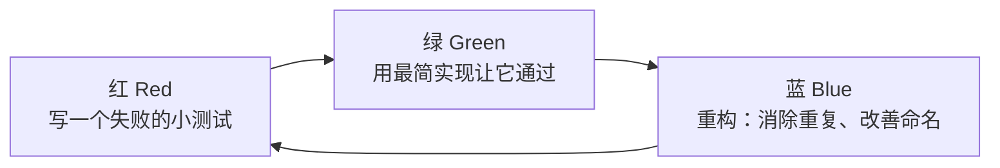

## 知识点地图

- **知识类别**：TDD 测试驱动开发（测试方法学家族）。
- **解决什么问题**：「先实现、后补测试」的顺序让测试沦为形式、设计缺乏可测性约束——TDD 把顺序倒过来，用测试驱动设计。
- **什么时候用到**：写纯逻辑（算法、规则、解析器）；修缺陷（先写复现测试再修）；需要以小步幅约束调试成本时。
- **同族文档**：业务方共同确认验收场景的 BDD 见《BDD 行为驱动开发》；替身技术见《测试替身》。

前置知识：单元测试结构（AAA 模式）、至少一门语言的测试框架。

## 1. TDD：测试驱动开发

### 1.1 核心思想：先写测试，再写实现

传统流程是「先实现、后补测试」，测试往往沦为形式；TDD（Test-Driven
Development）把顺序倒过来：**在写任何实现代码之前，先写一个会失败的测试**。
测试在这里不只是验证工具，更是**设计工具**——为了写测试，你必须先想清楚
这个函数的名字、参数、返回值和边界，实现只是让测试变绿的桥。

类比：TDD 像导航软件设定目的地再出发——你先明确「到达时的样子」（断言），
再决定走哪条路（实现）；走偏了立刻有提示（测试变红）。

### 1.2 红-绿-重构循环



每轮循环通常只有几分钟；循环多轮后统一跑一次全量测试与提交。

### 1.3 TDD 三定律（Robert C. Martin 表述）

1. 不写任何实现代码，除非为了让一个失败的测试通过；
2. 只写刚好让测试失败的测试（一次一个断言场景）；
3. 只写刚好让测试通过的实现。

三条定律合起来强制你以「小步幅」前进，每次失败都发生在刚刚改过的几行里，
调试成本被压到最低。

### 1.4 完整示例：订单折扣（TypeScript + Vitest）

需求：满 100 减 20，满 500 减 150，不含并列优惠。

第一轮（红）：先写测试，此时 `discount` 还不存在，运行即红。

```typescript
import { describe, it, expect } from 'vitest';
import { discount } from '../src/discount';

describe('订单折扣', () => {
  it('订单 120 元应减 20 元', () => {
    expect(discount(120)).toBe(20);   // 失败：discount 未实现
  });
});
```

第二轮（绿）：用最简实现让它通过，哪怕「作弊」。

```typescript
export function discount(amount: number): number {
  return 20; // 够土，但它让测试变绿——下一轮再加约束
}
```

第三轮（红）：加第二条规则，逼实现进化。

```typescript
it('订单 80 元无折扣', () => {
  expect(discount(80)).toBe(0);     // 失败：硬编码的 20 被揭穿
});

it('订单 600 元应减 150 元', () => {
  expect(discount(600)).toBe(150);  // 失败：还没有满 500 规则
});
```

第四轮（绿 + 重构）：正式实现并整理。

```typescript
export function discount(amount: number): number {
  if (amount >= 500) return 150;    // 条件从严到宽排列，便于阅读
  if (amount >= 100) return 20;
  return 0;
}
```

继续补边界用例（`500`、`100`、`99.99`），用「边界值分析」补齐清单。

### 1.5 测试清单与 TDD 的适用边界

动手前先列「测试清单」（如：正常满减、无折扣、恰好压线、金额为 0、负数
金额、非数字），每完成一轮划掉一项。清单保证边界不遗漏，循环保证节奏。

| 适合 TDD                              | 不太适合                          |
| ------------------------------------- | --------------------------------- |
| 纯逻辑：算法、规则引擎、解析器        | 一次性脚本、UI 视觉细节           |
| 接口/服务层，依赖可用替身隔离         | 探索性原型（需求本身还在变）      |
| 缺陷修复（先写复现缺陷的测试再修）    | 胶水代码、配置类改动              |

常见误用：一次写十几个测试再实现（违背小步幅）；对私有方法逐个 TDD
（应测公开行为）；断言写得太碎或太弱（测试失去了保护作用）。

## 小结

- 初学者要点：TDD 三步——先写失败的小测试、最简实现转绿、重构；动手前列
  测试清单防漏边界；红-绿-重构的节奏是小步幅，不是覆盖率指标。
- 进阶注意：TDD 的价值在「以测试逼出可测的设计」；缺陷修复先用测试复现
  再修，防止回归；需要业务方共同确认的验收场景走 BDD 路线，见
  《BDD 行为驱动开发》——外层少量 BDD 场景 + 内层大量 TDD 循环是常见组合。
