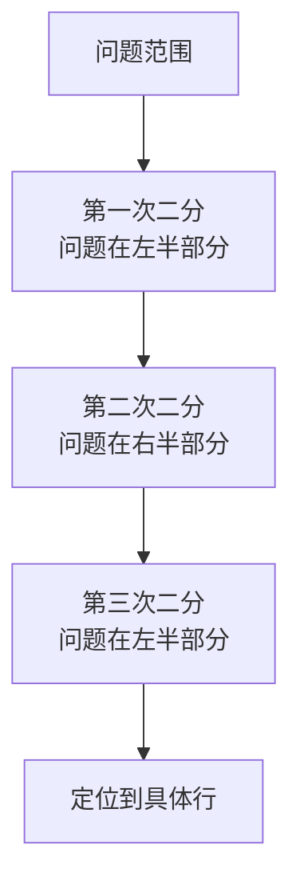

> 阅读建议：调试思想建议在“写过一些代码、遇到过 bug”之后阅读，入门阶段可以先跳过本篇。

## 1. 调试概述

### 1.1 什么是调试

调试（Debugging）是定位和修复程序错误的**系统化过程**。它不仅是技术技能，更是一种**思维方式**：

- **观察**：收集错误现象和上下文信息
- **假设**：基于证据提出可能的原因
- **验证**：通过实验验证或否定假设
- **修复**：确认根因后实施修复
- **反思**：总结经验，防止同类问题复发

### 1.2 Bug 的分类

| 类型           | 特征              | 示例                   |
| :------------- | :---------------- | :--------------------- |
| **语法错误**   | 编译/解析阶段暴露 | 缺少括号、拼写错误     |
| **运行时错误** | 程序执行时崩溃    | 空指针引用、数组越界   |
| **逻辑错误**   | 程序运行但不正确  | 条件判断写反、算法错误 |
| **性能问题**   | 功能正确但太慢    | O(n²) 算法、内存泄漏   |
| **并发问题**   | 间歇性出现        | 竞态条件、死锁         |

### 1.3 调试的黄金法则

1. **不要猜测，要观察**：用数据说话，不要凭直觉修改代码
2. **一次只改一处**：同时修改多处无法确定哪处有效
3. **保持可复现**：确保 Bug 可以稳定复现
4. **从简到繁**：先检查最简单的原因
5. **记录过程**：记录每一步操作和结果

## 2. 断点调试

### 2.1 断点类型

| 断点类型     | 说明               | 适用场景         |
| :----------- | :----------------- | :--------------- |
| **行断点**   | 执行到指定行暂停   | 通用调试         |
| **条件断点** | 满足条件时暂停     | 循环中的特定迭代 |
| **日志断点** | 不暂停，只输出日志 | 不想中断执行流程 |
| **函数断点** | 函数调用时暂停     | 调试第三方库函数 |
| **异常断点** | 抛出异常时暂停     | 捕获未处理的异常 |

### 2.2 VS Code 断点调试

```json
// .vscode/launch.json
{
  "version": "0.2.0",
  "configurations": [
    {
      "type": "chrome",
      "request": "launch",
      "name": "Launch Chrome",
      "url": "http://localhost:5173",
      "webRoot": "${workspaceFolder}/src"
    },
    {
      "type": "node",
      "request": "launch",
      "name": "Launch Node",
      "program": "${workspaceFolder}/src/index.ts",
      "runtimeArgs": ["--loader", "ts-node/esm"]
    }
  ]
}
```

### 2.3 调试控制

| 操作         | 快捷键          | 说明                       |
| :----------- | :-------------- | :------------------------- |
| **继续**     | `F5`            | 运行到下一个断点           |
| **单步跳过** | `F10`           | 执行当前行，不进入函数     |
| **单步进入** | `F11`           | 进入函数内部               |
| **单步跳出** | `Shift+F11`     | 执行完当前函数，返回调用处 |
| **重启**     | `Ctrl+Shift+F5` | 重新开始调试               |
| **停止**     | `Shift+F5`      | 终止调试                   |

### 2.4 调试面板

调试时可以查看以下信息：

- **变量（Variables）**：当前作用域的所有变量值
- **监视（Watch）**：自定义监视表达式
- **调用栈（Call Stack）**：函数调用链
- **断点（Breakpoints）**：所有断点列表

## 3. 日志策略

### 3.1 日志级别

| 级别      | 用途               | 示例                           |
| :-------- | :----------------- | :----------------------------- |
| **ERROR** | 错误，需要立即处理 | 数据库连接失败                 |
| **WARN**  | 警告，潜在问题     | API 响应慢、配置缺失使用默认值 |
| **INFO**  | 关键业务流程       | 用户登录、订单创建             |
| **DEBUG** | 调试信息           | 函数参数、中间变量             |
| **TRACE** | 最详细的追踪       | 每行代码执行记录               |

### 3.2 结构化日志

```typescript
//  非结构化日志
console.log('User logged in: ' + userId);

//  结构化日志
console.log(
  JSON.stringify({
    level: 'info',
    message: 'User logged in',
    userId: userId,
    timestamp: new Date().toISOString(),
    requestId: req.id,
  })
);
```

### 3.3 日志最佳实践

1. **关键路径必打**：用户操作、外部调用、状态变更
2. **包含上下文**：用户 ID、请求 ID、时间戳
3. **避免敏感信息**：不记录密码、Token、个人隐私
4. **控制日志量**：生产环境用 INFO 级别，调试时用 DEBUG
5. **统一格式**：使用日志库而非裸 `console.log`

```typescript
// 使用日志库
import pino from 'pino';

const logger = pino({
  level: process.env.LOG_LEVEL || 'info',
});

logger.info({ userId: 123 }, 'User logged in');
logger.error({ err, path: '/api/users' }, 'Failed to fetch users');
logger.debug({ query, params }, 'Executing database query');
```

### 3.4 浏览器调试日志

```javascript
// 条件断点的日志替代
console.assert(value !== null, 'Value should not be null', { value });

// 分组日志
console.group('API Request');
console.log('URL:', url);
console.log('Method:', method);
console.log('Body:', body);
console.log('Response:', response);
console.groupEnd();

// 性能计时
console.time('database-query');
await db.query(sql);
console.timeEnd('database-query'); // database-query: 45.23ms

// 表格输出
console.table([
  { name: 'Alice', score: 95 },
  { name: 'Bob', score: 87 },
]);
```

## 4. 二分排查法

### 4.1 核心思想

二分排查法借鉴了**二分查找算法**的思想：通过不断缩小问题范围来定位 Bug 的根因。



### 4.2 代码二分法

```bash
# 使用 git bisect 自动化二分排查
git bisect start
git bisect bad                  # 当前版本有 Bug
git bisect good v1.0.0          # v1.0.0 版本正常

# Git 自动切换到中间提交
# 测试后标记
git bisect good                 # 这个版本正常
# 或
git bisect bad                  # 这个版本有 Bug

# 重复直到找到引入 Bug 的提交
# Git 会显示第一个有问题的提交

# 结束
git bisect reset
```

### 4.3 通用二分策略

| 维度     | 二分方法          | 示例                |
| :------- | :---------------- | :------------------ |
| **时间** | git bisect        | 找到引入 Bug 的提交 |
| **代码** | 注释掉一半代码    | 定位到具体模块      |
| **数据** | 使用一半数据集    | 定位触发 Bug 的数据 |
| **配置** | 逐项还原配置      | 定位冲突的配置项    |
| **依赖** | 逐个升级/降级依赖 | 定位问题依赖版本    |

### 4.4 二分排查实例

```bash
# 场景：页面渲染异常，怀疑是最近某次提交引入

# 1. 确认问题范围
git log --oneline -20  # 查看最近20次提交

# 2. 启动二分
git bisect start
git bisect bad HEAD
git bisect good abc1234  # 已知正常的提交

# 3. Git 切换到中间提交，测试
# 如果正常: git bisect good
# 如果异常: git bisect bad

# 4. 重复步骤3，直到找到第一个异常提交

# 5. 查看该提交的变更
git show <commit-hash>

# 6. 结束二分
git bisect reset
```

## 5. 常见调试场景

### 5.1 异步问题调试

```typescript
// 使用 async/await 替代 .then() 链，便于断点调试
async function fetchUserData(userId: string) {
  try {
    const response = await fetch(`/api/users/${userId}`); // 可在此设断点
    if (!response.ok) {
      throw new Error(`HTTP ${response.status}`);
    }
    const data = await response.json(); // 可在此设断点
    return data;
  } catch (error) {
    logger.error({ err: error, userId }, 'Failed to fetch user');
    throw error;
  }
}
```

### 5.2 内存泄漏排查

```javascript
// Chrome DevTools Memory 面板
// 1. 拍摄堆快照（Heap Snapshot）
// 2. 执行操作
// 3. 再次拍摄快照
// 4. 对比两次快照，找出增长的对象

// 常见内存泄漏原因
// - 未移除的事件监听器
// - 闭包引用大对象
// - 未清理的定时器
// - DOM 引用未释放

// 使用 WeakRef 避免内存泄漏
const cache = new Map();
const ref = new WeakRef(largeObject);
```

### 5.3 性能问题调试

```javascript
// Performance API
performance.mark('start');
// ... 执行代码
performance.mark('end');
performance.measure('my-operation', 'start', 'end');
const measure = performance.getEntriesByName('my-operation')[0];
console.log(`Duration: ${measure.duration}ms`);

// Chrome DevTools Performance 面板
// 1. 点击 Record
// 2. 执行操作
// 3. 停止录制
// 4. 分析火焰图（Flame Chart）
```

## 6. 调试工具箱

### 6.1 通用工具

| 工具                 | 用途            | 平台   |
| :------------------- | :-------------- | :----- |
| **Chrome DevTools**  | 前端调试        | Chrome |
| **VS Code Debugger** | 通用断点调试    | 跨平台 |
| **GDB**              | C/C++ 调试      | Linux  |
| **LLDB**             | Swift/ObjC 调试 | macOS  |
| **jdb**              | Java 调试       | 跨平台 |

### 6.2 网络调试

```bash
# 抓包分析
tcpdump -i eth0 port 80        # 捕获 HTTP 流量
wireshark                       # 图形化抓包分析

# HTTP 请求调试
curl -v https://api.example.com # 详细请求/响应信息
httpie                          # 更友好的 curl 替代
```

### 6.3 系统调试

```bash
# 进程监控
strace -p PID                   # 跟踪系统调用
ltrace -p PID                   # 跟踪库函数调用
dtrace                          # 动态追踪（macOS/Solaris）

# 性能分析
perf record -g ./myapp          # Linux 性能分析
Instruments                     # macOS 性能分析
```

## 7. 真实 bug 案例库：用学生代码练「找错眼」

调试方法论要靠真实案例淬炼。下面四个案例全部来自真实学习者代码（Java 入
门作业与课堂笔记），每一条都对应第 1 节 bug 分类表里的一类，读法是：先
自己找错，再看答案。

### 7.1 边界错误：漏掉 12 月

```java
// di-7/src/Test1.java:13（原样摘录）
if (month < 12 && month > 1) {
    // 计算「一年第几天」的大月判断
}
```

错误：月份合法性区间写成了 `(1, 12)` 开区间——**12 月被排除在外**。正确
写法是 `month >= 1 && month <= 12`。

为什么这类错误典型：它编译通过、大多数输入也正确（2 月到 11 月都好
使），只在 12 月这个边界值上出错。第 1.3 节黄金法则「保持可复现」在这里
的教训是：**用边界值做冒烟输入**——`1`、`12`、`13`、`0` 各跑一遍，两分钟
就能拦住它。对应《边界值分析》的等价类方法：合法区间 `[1, 12]` 的上点与
离点必须进用例。

### 7.2 运算符误用：位或当逻辑或

```java
// di-7/src/Test1.java:11（原样摘录）
int big = 1 | 3 | 5 | 7 | 8 | 10 | 12;   // 想表达「月份是大月之一」
```

错误：把位运算符 `|` 当成逻辑或 `||` 用。写这段代码的人想判断「month
是否为 1、3、5、7、8、10、12 之一」，但 `1 | 3 | 5 | 7 | 8 | 10 | 12`
按位或出来是一个固定整数（15），后续 `month == big` 类的比较永远不成立——
程序不会崩（所以不是运行时错误），而是悄悄输出错误结果。

换成别的写法会发生什么：`month == 1 || month == 3 || ...` 罗列正确但啰嗦；
更地道的写法是数组或集合membership：`List.of(1,3,5,7,8,10,12).contains(month)`。
易错点标注：Java 里 `&`/`|` 对整数做位运算、对 boolean 做非短路逻辑运算，
与 `&&`/`||` 的区别是「短路」——这个区别在本例里不是性能问题，而是**语义
完全不同**。对应 bug 分类表里的「逻辑错误」：程序运行但不正确。

### 7.3 死循环：自增被吃掉

```java
// BATM 项目笔记（原样摘录，简化了变量名）
while (true) {
    if (选择 == 1) {
        存款();
    } else if (选择 == 2) {
        取款();
    } else if (选择 == 3) {
        // 本应处理「查询余额后退出循环」的分支
    }
    // 缺 i++（或等价的状态推进），循环条件永远成立
}
```

错误形态：循环体内推进状态的语句缺失（笔记原话是「缺 i++ 的死循环」），
`while` 的退出条件永远无法满足。ATM 菜单循环的实际表现更隐蔽——用户按键
后程序看起来「卡住」，其实是状态机没有前进。

调试它的正确姿势恰好是第 2 节的断点技术：在循环头设**条件断点**（循环第
1000 次才断），观察「哪几个变量该变而没变」。对应分类表的「并发问题」的
近亲——状态推进缺失与竞态一样，都属于「程序没崩但卡住」的间歇性难查问题。

### 7.4 文档型错误：约束标签互换

```text
// 数据库常用指令.txt（课堂笔记，原样摘录两行）
PRIMARY KEY   ——  唯一标识一行，可以为 NULL     ← 错
UNIQUE        ——  每行取值不允许重复，不可为 NULL ← 错
```

错误：笔记里把两个约束的说明写反了。真实语义恰好相反：`PRIMARY KEY`
非空且唯一（NOT NULL + UNIQUE）；`UNIQUE` 约束的列允许多行 NULL（多数
数据库将 NULL 视为互不相等）。

这类错误的价值在于提醒：**调试对象不只是代码**——你引用的文档、笔记、
注释同样可能「有毒」。第 4.3 节的二分策略表里「配置维度」之所以单列，
就是因为排查时默认「文档是对的」会浪费大量时间。验证一条约束语义的最快
方式不是查笔记，是往测试库里插两条相同/NULL 的数据看报错。

### 7.5 案例的共同模式与找错清单

四个案例拼出一张「找错眼」清单，评审他人代码或自查时按序过：

| 检查项 | 案例来源 | 一句话方法 |
| :--- | :--- | :--- |
| 区间边界含不含端点 | 7.1 | 边界值 1/12/13 各跑一遍 |
| 运算符是逻辑还是位 | 7.2 | 看到 `|`/`&` 先确认操作数类型 |
| 循环状态是否推进 | 7.3 | 断点看「该变的变量变没变」 |
| 文档与实现是否一致 | 7.4 | 用最小实验验证笔记说法 |

## 动手实践

**任务**：对一段你半年前写的代码（或第 7 节任一案例）做一次「边界冒烟」
排查，写下三行结论。

提示：
- 先列出该段代码的所有区间/枚举边界；
- 对每个边界构造最小输入，实际运行记录输出；
- 结论格式：「边界 X：输入 Y，期望 Z，实际 W，是否为 bug」。

参考实现（先自己写，再对照）：

```text
对 7.1 的月份边界冒烟（示例答案）：

边界 month=1  ：输入 1，期望「计入大月天数 31」，实际 31，通过
边界 month=12 ：输入 12，期望「计入大月天数 31」，实际 0，BUG
边界 month=13 ：输入 13，期望「提示非法」，实际「提示非法」，通过
边界 month=0  ：输入 0 ，期望「提示非法」，实际「提示非法」，通过

结论：bug 精确锁定在上边界，修复方向 month <= 12；修复后重跑四条，
并顺手把 7.2 的运算符问题一起修掉（同文件同函数）。
```

对照要点：这份记录的价值不止找到 bug——「实际 0」这个观察直接把错误
定位到条件分支而不是天数表，**一次边界冒烟同时完成了定位**，这正是
第 1.3 节「不要猜测，要观察」的实操形态。

## 小结

- 初学者要点：调试的黄金法则「不猜、观察、一次改一处、保持可复现」；
  断点调试先掌握条件断点与日志断点（循环里逐次暂停毫无效率）；日志要
  结构化并带上下文（请求 ID、用户 ID），排查线上问题时它们就是检索键。
- 进阶注意：二分排查是元方法——时间维度（git bisect 定位引入提交）、
  数据维度（一半数据集）、配置维度（逐项还原）通用；内存泄漏靠「两次堆
  快照对比增长对象」而不是读代码猜；异步与并发问题的第一选择是「把时序
  显式化」（日志打点、追踪 ID），而不是反复重跑碰运气；边界值冒烟与
  「该变的变量变没变」是学生代码错误（漏端点、误用位或、缺状态推进、
  约束记反）的四把通用钥匙。
