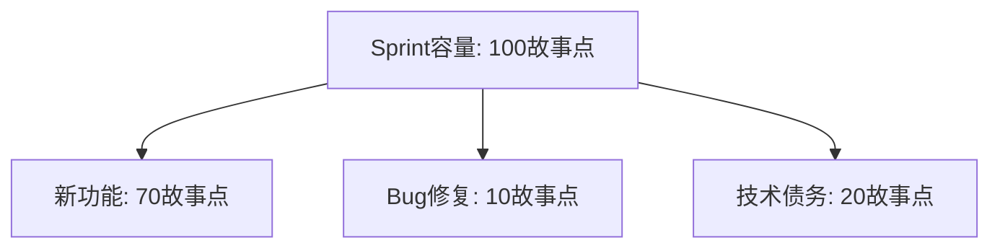

## 1. 从"信用卡欠款"说起

### 1.1 技术债务是什么

想象你用信用卡买了一个新手机。**你用"未来的钱"换来了"今天的方便"**——但欠款有代价：要还利息，而且欠得越久、还起来越痛苦。

**技术债务（Technical Debt）就是软件开发中的"信用卡"**：为了短期利益（赶 deadline、快速上线），你采取了"次优的技术决策"（跳过设计、不写测试、复制粘贴），这些决策累积了**额外的长期维护成本**——就像欠款的"利息"。

> **技术债务 = 快速交付的收益 - 长期维护的额外成本**

### 1.2 一个经典场景

- **场景**：产品经理说"这个功能本周必须上线"
- **选择 A**：先设计、写测试、保证质量 → 上线晚两周
- **选择 B**：跳过设计、不写测试、快速实现 → 本周上线（借了"技术债"）

选择 B 的"利息"会在未来显现：没有测试，改代码总是提心吊胆；设计混乱，加新功能越来越难。**这就是技术债务的"复利效应"——欠得越多，后面还的越多。**

### 1.3 债务的四种类型

| 类型 | 说明 | 示例 |
| :--- | :--- | :--- |
| 有意债务 | 明确权衡后的选择 | 为了赶 deadline 跳过设计 |
| 无意债务 | 不了解最佳实践 | 不知 SOLID 原则而违反 |
| 鲁莽债务 | 知道不对但不管 | 明知该写测试但不写 |
| 谨慎债务 | 知道风险但有意为之 | 原型验证时快速实现 |

**关键区分**：

- **谨慎债务**（原型验证）是合理的——明确知道代价、且有偿还计划
- **鲁莽债务**（知道不对但不管）最危险——既欠债又没计划

## 2. 技术债务的来源与识别

### 2.1 债务来源

| 来源 | 说明 |
| :--- | :--- |
| 时间压力 | 赶进度牺牲质量 |
| 知识不足 | 不了解最佳实践 |
| 需求变更 | 原有设计不再适用 |
| 团队变动 | 人员流动导致知识丢失 |
| 技术演进 | 框架/库版本过时 |
| 缺乏重构 | 从不偿还债务 |

### 2.2 债务识别方法

| 方法 | 说明 | 工具 |
| :--- | :--- | :--- |
| 静态分析 | 自动检测代码问题 | SonarQube、ESLint |
| 代码审查 | 人工发现设计问题 | PR Review |
| 架构评审 | 评估架构合理性 | ADR |
| 开发者调查 | 团队感知的痛点 | 问卷/访谈 |
| 缺陷分析 | 高频修改的模块 | Git 热点分析 |

### 2.3 债务的五个信号

**怎么知道"代码欠债了"**？出现以下信号就要警惕：

| 信号 | 含义 |
| :--- | :--- |
| 修改一个功能需改多个文件 | 高耦合 |
| 新人理解代码需要很长时间 | 可读性差 |
| 添加简单功能需要很长时间 | 设计不灵活 |
| 测试困难 | 依赖过多 |
| 频繁出现回归 Bug | 缺乏测试覆盖 |

## 3. 技术债务的量化：把"感觉"变成"数字"

技术债务最大的问题是"看不见摸不着"。SQALE 方法把它量化为**修复时间**：

### 3.1 SQALE 方法

$$\text{TD} = \sum_{i=1}^{n} \text{RemediationTime}_i$$

（把每一项债务的"修复时间"加起来）

| 质量特性 | 典型债务 |
| :--- | :--- |
| 可测试性 | 缺少测试、依赖难以 Mock |
| 可维护性 | 代码重复、圈复杂度高 |
| 可修改性 | 硬编码、紧耦合 |
| 可靠性 | 未处理异常、资源泄露 |
| 可移植性 | 平台依赖 |

**工具实践**：SonarQube 会自动估算每个问题的"修复时间"，加总后就是"技术债务总额"——**一个可量化的数字**。

### 3.2 债务比率

$$\text{债务比率} = \frac{\text{技术债务（修复时间）}}{\text{开发总投入（时间）}}$$

| 比率 | 等级 | 建议 |
| :--- | :--- | :--- |
| <5% | 优秀 | 保持 |
| 5%~10% | 良好 | 定期偿还 |
| 10%~20% | 警告 | 需要专项偿还 |
| >20% | 危险 | 立即行动 |

**债务比率的含义**：如果债务比率是 20%，意味着"把代码修到干净需要的时间"相当于"全部开发时间的 20%"——这个数字能帮助团队和管理层"看见"债务。

## 4. 偿还策略：怎么还债

### 4.1 偿还的五个原则

| 原则 | 说明 |
| :--- | :--- |
| 童子军规则 | 每次修改让代码比之前更好（"离开时比来时干净"） |
| 渐进式偿还 | 小步持续改进，不搞"大爆炸重构" |
| ROI 优先 | 先偿还"收益最高"的债务 |
| 与功能结合 | 新功能开发时顺便重构（重构时机之一） |
| 定期专项 | 每 Sprint 分配 20% 时间还债 |

### 4.2 偿还计划流程

```
1. 盘点: 列出所有技术债务项
2. 评估: 每项的影响和修复成本
3. 排序: 按 ROI 排序（收益/成本）
4. 计划: 分配到 Sprint Backlog
5. 执行: 按计划偿还
6. 验证: 确认债务已消除
```

### 4.3 技术债务 Backlog

技术债务应该**像功能需求一样进入 Backlog**，有明确的优先级：

| ID | 描述 | 影响 | 修复成本 | ROI | 优先级 |
| :--- | :--- | :--- | :--- | :-- | :--- |
| TD-01 | 订单模块圈复杂度>30 | 高 | 3天 | 高 | P0 |
| TD-02 | 缺少单元测试 | 中 | 5天 | 中 | P1 |
| TD-03 | 日志框架版本过旧 | 低 | 1天 | 中 | P2 |

**关键认知**：技术债务不"排期"就不会被还——它总是被"更重要的新功能"挤掉。**把债务写进 Backlog、排上优先级，是偿还的第一步。**

## 5. 预防机制：如何不欠新债

### 5.1 预防措施

| 措施 | 说明 |
| :--- | :--- |
| 编码规范 | 统一代码风格和最佳实践 |
| 代码审查 | PR 合并前必须审查 |
| 持续集成 | 自动化构建和测试 |
| 静态分析 | 自动检测代码问题 |
| 架构决策记录 | 记录设计决策和权衡（ADR） |
| 技术雷达 | 跟踪技术趋势和风险 |

### 5.2 债务预算

**每个 Sprint 预留固定比例（如 20%）的时间用于偿还技术债务**：



**为什么必须"留预算"**：如果不预留，债务永远没有时间还——就像信用卡月月刷爆、从不还本金，利息越滚越大。

## 6. 常见误区

**误区一：技术债务 = 代码写得烂。** → 技术债务是"权衡的结果"（用质量换速度），不等于能力差。谨慎债务是合理的，问题在于"欠了不还"。

**误区二：技术债务可以永远不还。** → 不还的债务会"利滚利"：代码越来越难改，新功能越来越慢，最终"技术破产"（推倒重写）。

**误区三：重构 = 还清债务。** → 重构是还债的一种方式。但有些债务（如架构选型错误）靠重构也还不清，需要重新设计。

**误区四：技术债务是"技术团队的事"。** → 债务影响的是**交付速度**（新功能越来越慢）——这直接关系到业务。要让管理层"看见"债务（量化成数字），争取还债的资源。

**误区五：还债要"一次性还清"。** → 大爆炸式重构风险极高。**渐进式偿还**（每 Sprint 还一点）更安全、更可持续。

## 7. 与相邻知识的关系

- [软件度量](/software-testing/370-SoftwareMetrics)：度量是债务管理的「计价器」——SQALE 债务总额、债务比率都来自度量体系（圈复杂度、重复率、覆盖率）；没有度量，债务管理退化为「感觉代码很烂」；
- [重构](/software-testing/360-Refactoring)：重构是偿还「代码级债务」的主要手段，但不是唯一手段——架构选型错误这类「结构性债务」靠重构还不清，需要重新设计；两者是「还债动作」与「还债对象」的关系；
- [代码评审清单](/software-testing/460-CodeReviewChecklist)：评审是预防新债的第一道闸门——鲁莽债务大多是在「没有审查的合并」里溜进来的；评审标准里写明「测试缺失、硬编码、复制粘贴」就是把债务信号前置到合并前；
- [敏捷开发](/software-testing/320-AgileDevelopment)：债务预算（每 Sprint 20%）是敏捷节奏里的制度设计——Backlog、Sprint 规划既是功能需求的家，也应该是债务条目的家；
- [质量属性](/software-testing/420-QualityAttribute)：债务的「利息」体现在质量属性的退化上——可维护性下降、可测试性变差；质量属性场景（对某操作修改平均耗时不超过 X）是给债务定「还清标准」的依据。

## 8. 面试题思路

**「什么是技术债务？技术债务一定是坏事吗？」** 先给定义（快速交付的次优决策累积的额外维护成本），再按第 1.3 节的四象限拆解：谨慎债务（有意、有计划）是合理的工程权衡，鲁莽债务（明知不还）才是真正的风险源。落点放在「债务不可怕，无意识的债务与不还的机制才可怕」——这比一句「债务都是坏的」高一个层次。

**「如何让管理层支持还债？」** 按「翻译成业务语言」作答：把债务量化为修复时间（SQALE）或债务比率，再翻译成业务后果——「交付速度逐 Sprint 下降 X%」「生产缺陷 Y% 集中在这些欠债模块」；最后给方案（每 Sprint 预留 20% 债务预算 + 高 ROI 条目优先），让管理层做的是「有数字支撑的取舍」而不是「要不要质量」的道德题。

**「怎么判断一段代码该不该现在还债？」** 展示决策链：先看**变更频率**（Git 热点：经常改的模块债务优先还，从不动的不急）→ 再看**利息大小**（这个债务每次改动多花多少时间/引入多少缺陷）→ 最后对齐**预算与风险**（改动是否高收益低风险）。能主动提到「童子军规则做日常小额偿还 + Backlog 做专项偿还」的组合拳是加分项。

## 9. 动手与遮代码自检

先看任务与提示，自己做完再看参考实现。

### 练习 1：给自己的项目建一份债务登记册（实践题）

任务：对你最近参与的项目跑一次静态分析，把结果整理成第 4.3 节样式的债务 Backlog（至少 3 条，含影响、修复成本、ROI、优先级）。

提示：没有 SonarQube 也可以用 ESLint / Pylint 的告警清单；「影响」一栏写「每次改这里要多花什么」，不要只写「代码不好」。

参考实现：

```bash
# 以 JS 项目为例：先拿客观清单，再人工定级
npx eslint . -f json -o lint-report.json
# 关注三类信号：no-duplicate(重复)、complexity(复杂度)、max-lines(过长文件)
```

```text
| ID   | 描述                          | 影响                     | 修复成本 | ROI | 优先级 |
| TD-01 | 订单服务主文件 1800 行、圈复杂度 25 | 每次改活动逻辑平均 2 天且回归 3 次 | 4 天 | 高 | P0 |
| TD-02 | 支付模块复制粘贴了 3 份对账逻辑     | 改一处漏两处，已引发 1 次生产缺陷   | 2 天 | 高 | P0 |
| TD-03 | 日志框架版本过旧                 | 暂无直接影响，升级窗口越来越小     | 1 天 | 中 | P2 |
```

自检：TD-01、TD-02 的「影响」栏是不是都写了**可观察的代价**（天数、缺陷次数）？只写「难维护」的条目在排期会上活不过第一轮讨论。

### 练习 2：四象限分类（判断题）

任务：给下面四个场景标象限（有意/无意 × 谨慎/鲁莽），并说明各自的处理策略：

1. 为赶周五演示，团队约定先写死配置、下周三补配置中心，登记在 Backlog；
2. 开发不知道「数据库连接应该用连接池」，每次请求新建连接；
3. 明知该写测试，但「反正没人查」就不写；
4. 临时脚本固化成正式服务，谁也没意识到它已经承载了核心流量。

提示：两个维度分别问「知道自己在欠债吗」与「有偿还计划吗」。

参考实现：

```text
1. 有意 × 谨慎：明确权衡 + 有偿还计划（Backlog 可查）——合理债务，
   只需按期偿还并追踪。
2. 无意 × 谨慎（ unaware 但无恶意）：知识不足型——处理靠规范与评审
   （460 的评审清单 + 结对），堵住「不知道」的入口。
3. 有意 × 鲁莽：知道不对且无计划——最危险象限，处理靠制度强制
   （CI 卡点：覆盖率门槛、评审必需），不靠自觉。
4. 无意 × 鲁莽：债务发生了但没人知道它已进入关键路径——处理靠可观测性
   （流量监控标出「意外核心」的组件）+ 定期架构评审盘点。
```

自检：1 和 3 都是「知道」，差别只在有没有偿还计划——这说明「登记进 Backlog」这个动作本身就是象限跃迁的关键。

### 练习 3：计算并解读债务比率（挑战题）

任务：某项目开发总投入 200 人天，SonarQube 估算的债务总额为 30 人天。计算债务比率并给出建议；再假设其中 12 人天集中在下单模块（该模块下季度有大改版），修正你的偿还计划。

提示：先算整体比率定级，再用「变更频率」修正优先级——欠债位置比欠债总量更决定还债顺序。

参考实现：

```text
债务比率 = 30 / 200 = 15% → 落在 10%~20%「警告」区间，需要专项偿还。

修正：下单模块占债务总额的 40%（12/30），且下季度有确定的大改版——
债务利息将在改版期间被放大（在烂地基上盖楼）。修正后的计划：
  1. 改版前专项偿还下单模块的 12 人天债务（约 1.5 人双周冲刺）；
  2. 其余 18 人天按每 Sprint 20% 预算渐进偿还；
  3. 改版的设计评审中把「不再引入同类债务」写进验收标准（防新债）。
```

自检：你的第一版计划是不是「按债务大小从大到小还」？修正的依据是「即将发生变更的模块利息最高」——这把度量（哪里欠债）与业务节奏（哪里要动）连在了一起。
