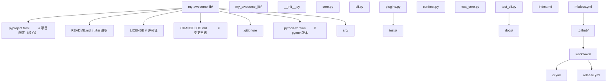
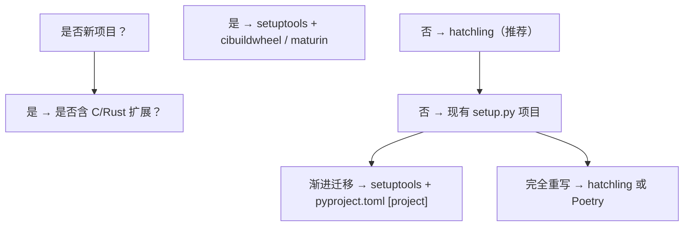

## 1. 概述与定位

Python 打包发布（Packaging and Distribution）是将 Python 代码从开发环境交付到目标用户或生产环境的工程化过程。它涵盖依赖声明、源码分发（sdist）、二进制分发（wheel）、PyPI 上传、版本管理、可信发布等环节。Python 打包生态历经 20 余年演进，从早期的 distutils 到 setuptools、pip、Poetry、hatch、pdm，每一步都伴随 PEP（Python Enhancement Proposal）的标准化推进。

本模块面向已能编写 Python 模块的开发者，系统讲解现代 Python 打包的最佳实践，目标是让读者掌握从零构建可发布包的完整流程，并理解 PEP 517/518/621 等核心标准的设计动机。

### 1.1 模块定位

- 前置：语法速查、模块-包与工程化、Python与虚拟环境
- 平行：Python与设计模式、Python与CI-CD
- 后续：Python与Docker、Python与CLI

### 1.2 阅读约定

- TOML 配置示例标注 `toml` 语言标签
- Python 脚本标注 `python`
- Shell 命令标注 `bash`
- 引用 PEP 时给出编号与官方链接
- Python 版本参考 3.9/3.10/3.11/3.12/3.13/3.14

## 2. 历史动机与演进时间线

### 2.1 打包生态的关键节点

#### 2.1.1 distutils 时代（1998-2008）

1998 年，Python 1.6 引入 distutils 模块，由 Greg Ward 编写，提供基本的 `setup.py` 接口。distutils 是 Python 标准库的一部分，但功能有限：

- 不支持依赖声明
- 无法处理复杂的扩展模块编译
- 缺乏元数据标准化

```python
# distutils 时代的典型 setup.py
from distutils.core import setup
setup(name="mypackage", version="1.0")
```

#### 2.1.2 setuptools 与 easy_install（2004-2013）

2004 年 Phillip Eby 发布 setuptools，作为 distutils 的扩展，引入：

- `entry_points` 机制：自动生成命令行脚本
- 依赖声明：`install_requires`
- egg 格式：早期的二进制分发格式
- easy_install：第一个 Python 包安装器

setuptools 解决了 distutils 的诸多痛点，但 setup.py 同时承担配置与脚本双重职责，导致难以静态分析。

#### 2.1.3 pip 与 wheel 时代（2008-2016）

2008 年 Ian Bicking 创建 pip，替代 easy_install。pip 的关键改进：

- 卸载能力（easy_install 不能卸载）
- 依赖解析
- 不需 sudo 的用户级安装

2012 年 PEP 427 引入 wheel 格式，替代 egg：

- wheel 是预编译二进制分发，安装速度快
- 文件名编码了平台、Python 版本、ABI 信息
- 标准 `.whl` 扩展名，本质是 ZIP 压缩包

#### 2.1.4 pyproject.toml 与 PEP 517/518（2016-2018）

PEP 518（2016）首次引入 `pyproject.toml` 配置文件，核心动机：解决"构建 Python 包本身需要哪些依赖"的鸡生蛋问题。在此之前，构建工具的依赖只能写在 setup.py 中，但运行 setup.py 又需要这些依赖。

PEP 517（2017）进一步定义"构建后端接口"，让构建工具（setuptools、hatch、flit 等）与前端（pip、build）解耦：

- 前端：调用后端 API 完成构建
- 后端：实现约定的 hooks（build_wheel、build_sdist 等）

这一架构使 Python 打包生态进入"前端+后端"分层时代。

#### 2.1.5 PEP 621 与现代打包（2020-至今）

PEP 621（2020）正式标准化 `[project]` 段，将项目元数据（name、version、dependencies 等）从 setup.py 迁移到 pyproject.toml，实现完全声明式配置。同期涌现的构建工具：

- Poetry（2018）：完整开发工作流
- flit（2017）：极简纯 Python 包
- hatch（2021）：现代化全功能工具
- pdm（2020）：符合 PEP 582 标准的依赖管理

### 2.2 Guido van Rossum 与 PEP 治理

Python 增强提案（PEP）是 Python 演进的标准化机制，由 Guido van Rossum 于 2000 年正式确立。PEP 流程类似学术会议同行评审：

1. 起草 PEP 草案（Draft）
2. 社区讨论与修订
3. 指导委员会或 BDFL 决议（Final/Accepted/Rejected）
4. 实现 PR 与文档更新

打包相关 PEP 由 PyPA（Python Packaging Authority）维护，PyPA 是一个独立的组织，负责 pip、setuptools、build、twine 等核心工具。

### 2.3 关键 PEP 速查表

| PEP | 标题 | 年份 | 核心内容 |
|-----|------|------|---------|
| 440 | Version Identification | 2013 | 版本号格式规范 |
| 503 | Simple Repository API | 2015 | PyPI 简单索引协议 |
| 508 | Dependency Specification | 2015 | 依赖声明语法（PEP 508） |
| 517 | Build System Independent | 2017 | 构建后端接口规范 |
| 518 | Build System Requirements | 2016 | pyproject.toml 与 [build-system] |
| 566 | Metadata 2.1 | 2019 | 包元数据格式 |
| 621 | Project Metadata in pyproject.toml | 2020 | [project] 段标准化 |
| 660 | Editable Installs | 2019 | 可编辑安装的 wheel 实现 |
| 691 | JSON-Based API | 2022 | PyPI JSON API |
| 714 | Duplicate Dependencies | 2023 | 移除 dynamic 字段约束 |

## 3. 形式化定义与数学基础

### 3.1 包元数据的形式化

定义 Python 包为一个五元组：

$$
P = (N, V, D, M, A)
$$

其中：

- $N$ 为包名（normalized name，符合 PEP 503 规范）
- $V$ 为版本号（符合 PEP 440 规范）
- $D$ 为依赖集合（dependency specifications，符合 PEP 508）
- $M$ 为元数据集合（metadata，符合 PEP 566）
- $A$ 为归档集合（archives：sdist、wheels）

### 3.2 PEP 440 版本号形式化

PEP 440 定义版本号语法：

$$
\text{Version} = [N!]N(\.N)*[{a|b|rc}N][\.postN][\.devN]
$$

具体规则：

- 主版本.次版本.修订号：`1.2.3`
- 预发布：`1.2.3a1`、`1.2.3b2`、`1.2.3rc1`
- 后发布：`1.2.3.post1`
- 开发版：`1.2.3.dev1`
- 历史版本（epoch）：`1!1.2.3`

版本比较的偏序关系：

$$
1.0.dev1 < 1.0a1 < 1.0b1 < 1.0rc1 < 1.0 < 1.0.post1 < 1!1.0
$$

### 3.3 PEP 508 依赖规范形式化

PEP 508 依赖声明语法：

$$
\text{dep} = \text{name}[\text{extras}] \text{version\_spec}[\text{marker}]
$$

示例：

- `requests>=2.28,<3.0`：版本约束
- `numpy[all]>=1.20`：extras 扩展
- `uvicorn[standard]>=0.29; python_version >= "3.11"`：环境标记

### 3.4 wheel 文件名的形式化

PEP 427 定义的 wheel 文件名格式：

$$
\text{wheel} = \{distribution\}-\{version\}(-\{build tag\})?-\{python tag\}-\{abi tag\}-\{platform tag\}.whl
$$

示例：

- `numpy-1.26.0-cp311-cp311-manylinux_2_17_x86_64.whl`
  - distribution: numpy
  - version: 1.26.0
  - python tag: cp311（CPython 3.11）
  - abi tag: cp311（ABI 兼容 CPython 3.11）
  - platform tag: manylinux_2_17_x86_64（Linux x86_64，glibc 2.17+）

平台标签矩阵：

| Python Tag | 含义 |
|-----------|------|
| py3 | Python 3 通用 |
| py2.py3 | Python 2 与 3 通用 |
| cp311 | CPython 3.11 特定 |
| pp39 | PyPy 3.9 特定 |

| Platform Tag | 含义 |
|-------------|------|
| any | 平台无关 |
| manylinux_2_17_x86_64 | Linux x86_64，glibc 2.17+ |
| macosx_10_9_x86_64 | macOS x86_64，10.9+ |
| win_amd64 | Windows 64 位 |
| musllinux_1_1_x86_64 | Alpine Linux |

### 3.5 哈希与完整性校验

PyPI 下载包时通过哈希校验完整性。SHA-256 是默认算法：

$$
\text{hash} = \text{SHA-256}(\text{file\_content})
$$

`requirements.txt` 中固定哈希：

```
requests==2.31.0 \
    --hash=sha256:58cd2187... \
    --hash=sha256:942c5a82...
```

## 4. 理论推导与算法原理

### 4.1 依赖解析算法

pip 自 23.2 起默认使用 backtracking 解析器（曾用 legacy resolver）。其核心思想是回溯搜索：

1. 从直接依赖出发构建依赖图
2. 选择版本时优先尝试最新版
3. 若发生冲突，回溯到上一节点尝试其他版本
4. 直到找到满足所有约束的解，或证明无解

时间复杂度：最坏 $O(|V|^{|D|})$，其中 $V$ 为每个包的候选版本数，$D$ 为依赖深度。

Poetry 使用更先进的 PubGrub 算法（受 Dart 启发），通过冲突驱动学习加速搜索。

### 4.2 wheel 与 sdist 的对比

| 维度 | sdist | wheel |
|------|-------|-------|
| 格式 | .tar.gz | .whl（ZIP） |
| 内容 | 源码 + setup 配置 | 预编译产物 |
| 安装速度 | 慢（需编译） | 快（直接解压） |
| 跨平台 | 是 | 否（按平台分发） |
| 必要性 | 必备（备份与特殊环境） | 推荐加速 |
| 构建依赖 | 需在目标环境 | 仅在构建环境 |

### 4.3 entry_points 的实现原理

`entry_points` 是 setuptools 引入的脚本生成机制。pyproject.toml 配置：

```toml
[project.scripts]
mycli = "mypackage.cli:main"
```

安装时，pip 在 Python bin 目录生成可执行脚本：

```python
#!/path/to/python
import sys
from mypackage.cli import main
sys.exit(main())
```

这样 `mycli` 命令即可在终端调用。

### 4.4 可编辑安装（PEP 660）

可编辑安装（`pip install -e .`）让源码修改即时生效，无需重新安装。

- PEP 660 之前：setuptools 通过 `.egg-link` 文件 + easy-install.pth 实现
- PEP 660（2019）：定义 `editable_wheel` hook，让构建后端生成特殊的 wheel

```bash
pip install -e .  # 可编辑安装
pip install .     # 普通安装
```

## 5. 核心配置与生产级代码示例

### 5.1 完整的 pyproject.toml 模板

```toml
# ============================================================
# 构建系统配置（PEP 517/518）
# ============================================================
[build-system]
requires = ["hatchling>=1.21"]
build-backend = "hatchling.build"

# ============================================================
# 项目元数据（PEP 621）
# ============================================================
[project]
name = "my-awesome-lib"
version = "1.2.3"
description = "一个示例 Python 库"
readme = "README.md"
requires-python = ">=3.9"
license = { text = "MIT" }
authors = [
    { name = "FANDEX", email = "dev@fandex.io" }
]
keywords = ["example", "tutorial", "fandex"]
classifiers = [
    "Development Status :: 5 - Production/Stable",
    "Intended Audience :: Developers",
    "License :: OSI Approved :: MIT License",
    "Operating System :: OS Independent",
    "Programming Language :: Python :: 3",
    "Programming Language :: Python :: 3.9",
    "Programming Language :: Python :: 3.10",
    "Programming Language :: Python :: 3.11",
    "Programming Language :: Python :: 3.12",
    "Programming Language :: Python :: 3.13",
    "Topic :: Software Development :: Libraries",
]
dependencies = [
    "requests>=2.28,<3.0",
    "pydantic>=2.0",
    "rich>=13.0",
]

# 动态字段示例（从 __init__.py 读取版本）
# dynamic = ["version"]

[project.optional-dependencies]
dev = [
    "pytest>=8.0",
    "pytest-cov>=4.0",
    "ruff>=0.4",
    "mypy>=1.9",
    "build>=1.0",
    "twine>=5.0",
]
docs = [
    "mkdocs>=1.5",
    "mkdocs-material>=9.0",
]

[project.urls]
Homepage = "https://github.com/fandex/my-awesome-lib"
Documentation = "https://my-awesome-lib.fandex.io"
Repository = "https://github.com/fandex/my-awesome-lib"
Issues = "https://github.com/fandex/my-awesome-lib/issues"
Changelog = "https://github.com/fandex/my-awesome-lib/blob/main/CHANGELOG.md"

[project.scripts]
mycli = "my_awesome_lib.cli:main"

[project.gui-scripts]
mygui = "my_awesome_lib.gui:main"

[project.entry-points."fandex.plugins"]
example = "my_awesome_lib.plugins:ExamplePlugin"

# ============================================================
# 工具配置（非 PEP 621 标准段，各工具自定义）
# ============================================================
[tool.hatch.build.targets.wheel]
packages = ["src/my_awesome_lib"]

[tool.hatch.version]
path = "src/my_awesome_lib/__init__.py"

[tool.ruff]
line-length = 100
target-version = "py39"

[tool.ruff.lint]
select = ["E", "F", "I", "N", "W", "UP"]

[tool.mypy]
python_version = "3.9"
strict = true
ignore_missing_imports = true

[tool.pytest.ini_options]
minversion = "8.0"
testpaths = ["tests"]
addopts = "-ra -q --cov=my_awesome_lib"
```

### 5.2 项目目录结构



### 5.3 构建与发布命令

```bash
# 安装构建与发布工具
python -m pip install --upgrade build twine

# 清理旧构建产物
Remove-Item -Recurse -Force dist, build, *.egg-info -ErrorAction SilentlyContinue

# 构建 sdist 与 wheel
python -m build

# 检查包元数据
python -m twine check dist/*

# 上传到 TestPyPI（测试环境，推荐先发布验证）
python -m twine upload --repository testpypi dist/*

# 上传到正式 PyPI
python -m twine upload dist/*

# 验证安装
python -m pip install --index-url https://test.pypi.org/simple/ my-awesome-lib
```

### 5.4 使用 Poetry 构建

Poetry 是一站式开发工具，覆盖依赖管理、构建、发布全流程：

```bash
# 安装 Poetry
pip install poetry

# 初始化新项目
poetry new my-package
cd my-package

# 添加依赖
poetry add requests
poetry add --group dev pytest ruff

# 构建
poetry build

# 发布到 PyPI
poetry publish

# 发布到 TestPyPI
poetry publish --repository testpypi
```

Poetry 的 pyproject.toml 配置示例：

```toml
[tool.poetry]
name = "my-package"
version = "1.0.0"
description = "示例包"
authors = ["FANDEX <dev@fandex.io>"]
readme = "README.md"
packages = [{include = "my_package", from = "src"}]

[tool.poetry.dependencies]
python = "^3.9"
requests = "^2.31"

[tool.poetry.group.dev.dependencies]
pytest = "^8.0"
ruff = "^0.4"

[build-system]
requires = ["poetry-core"]
build-backend = "poetry.core.masonry.api"
```

### 5.5 使用 hatch 构建

hatch 是 PyPA 推荐的现代化工具：

```bash
pip install hatch

# 创建新项目
hatch new my-package

# 进入开发环境
hatch shell

# 构建
hatch build

# 发布到 PyPI
hatch publish
```

### 5.6 包内 Python 代码示例

```python
# src/my_awesome_lib/__init__.py
"""my-awesome-lib: 一个示例 Python 库"""

__version__ = "1.2.3"

from my_awesome_lib.core import greet, calculate

__all__ = ["greet", "calculate", "__version__"]
```

```python
# src/my_awesome_lib/core.py
"""核心功能模块"""
from typing import Sequence

def greet(name: str) -> str:
    """生成问候语

    Args:
        name: 被问候者的名字

    Returns:
        问候字符串

    >>> greet("Python")
        'Hello, Python!'
    """
    return f"Hello, {name}!"

def calculate(values: Sequence[float]) -> dict:
    """计算统计量

    Args:
        values: 数值序列

    Returns:
        包含 mean, max, min 的字典
    """
    if not values:
        raise ValueError("values 不能为空")
    return {
        "mean": sum(values) / len(values),
        "max": max(values),
        "min": min(values),
    }
```

```python
# src/my_awesome_lib/cli.py
"""命令行接口"""
import argparse
import sys

from my_awesome_lib.core import greet, calculate

def main() -> int:
    """命令行入口：解析参数并执行"""
    parser = argparse.ArgumentParser(prog="mycli", description="my-awesome-lib 命令行")
    sub = parser.add_subparsers(dest="command", required=True)

    greet_parser = sub.add_parser("greet", help="打招呼")
    greet_parser.add_argument("name", help="被问候者")

    calc_parser = sub.add_parser("calc", help="计算统计量")
    calc_parser.add_argument("values", type=float, nargs="+", help="数值")

    args = parser.parse_args()

    if args.command == "greet":
        print(greet(args.name))
    elif args.command == "calc":
        result = calculate(args.values)
        print(f"均值: {result['mean']:.4f}")
        print(f"最大值: {result['max']}")
        print(f"最小值: {result['min']}")

    return 0

if __name__ == "__main__":
    sys.exit(main())
```

### 5.7 测试代码示例

```python
# tests/test_core.py
import pytest

from my_awesome_lib.core import greet, calculate

def test_greet_basic():
    """测试问候语生成"""
    assert greet("Python") == "Hello, Python!"

def test_greet_empty():
    """测试空名字"""
    assert greet("") == "Hello, !"

def test_calculate_normal():
    """测试正常计算"""
    result = calculate([1.0, 2.0, 3.0])
    assert result["mean"] == 2.0
    assert result["max"] == 3.0
    assert result["min"] == 1.0

def test_calculate_empty_raises():
    """测试空列表抛出异常"""
    with pytest.raises(ValueError, match="values 不能为空"):
        calculate([])

@pytest.mark.parametrize("values,expected_mean", [
    ([1, 2, 3, 4, 5], 3.0),
    ([10, 20], 15.0),
    ([100], 100.0),
])
def test_calculate_mean(values, expected_mean):
    """参数化测试均值"""
    assert calculate(values)["mean"] == expected_mean
```

## 6. 对比分析

### 6.1 构建后端横向对比

| 工具 | 首发年份 | 后端模块 | 适用场景 | 优势 | 局限 |
|------|---------|---------|---------|------|------|
| setuptools | 2004 | setuptools.build_meta | 兼容性最广 | 老项目支持 | 配置冗长 |
| hatchling | 2021 | hatchling.build | 现代通用 | 简洁、性能好 | 历史项目迁移成本 |
| Poetry | 2018 | poetry.core.masonry.api | 全流程开发 | 一体化 | 标准 PEP 621 支持较晚 |
| flit | 2017 | flit_core.buildapi | 纯 Python 简单包 | 极简 | 不支持 C 扩展 |
| pdm | 2020 | pdm.backend | PEP 582 标准 | 不需虚拟环境 | 社区小 |

### 6.2 前端工具对比

| 前端 | 主要用途 | 命令 |
|------|---------|------|
| pip | 安装包 | `pip install` |
| build | 构建 sdist/wheel | `python -m build` |
| twine | 上传到 PyPI | `twine upload` |
| uv | 下一代快速工具 | `uv pip install` |

### 6.3 与其他语言打包生态对比

#### 6.3.1 Python vs Ruby（RubyGems）

RubyGems 是 Ruby 的标准打包系统：

- 单一工具 rubygems 覆盖构建+发布
- 配置文件 .gemspec 用 Ruby 写
- 中心仓库 rubygems.org

对比：

- Python 通过 PEP 标准化，工具多但更灵活
- RubyGems 集中式，配置更简单
- Python wheel 支持二进制分发，gem 几乎纯源码

#### 6.3.2 Python vs JavaScript（npm）

npm 是 JavaScript 生态标准：

- 单一工具 npm/yarn/pnpm 覆盖全部
- 中心仓库 npmjs.com
- package.json 标准化字段

对比：

- npm 范式更彻底：依赖声明、脚本、版本锁都在 package.json
- Python 历史包袱重，但 pyproject.toml + PEP 621 已接近 npm 体验
- npm 的 lock 文件成熟（package-lock.json），Python 的 uv.lock/poetry.lock 仍在演进

#### 6.3.3 Python vs Go（modules）

Go modules 是 Go 1.11 起的标准：

- 无中心仓库，直接从 Git 拉取
- go.mod 声明依赖
- go.sum 锁定哈希

对比：

- Go 去中心化，更轻量
- Python 依赖 PyPI，但保证可发现性
- Go 的二进制分发天然跨平台，Python wheel 需要按平台构建

#### 6.3.4 Python vs Julia

Julia 的 Pkg 系统：

- Project.toml 类似 pyproject.toml
- Manifest.toml 类似 lock 文件
- 集成在 REPL 中

对比：

- Julia 集成度高，但生态规模小
- Python 工具丰富，社区成熟

#### 6.3.5 Python vs Rust（cargo）

Rust 的 cargo 被认为是包管理的标杆：

- Cargo.toml 类似 pyproject.toml
- crates.io 中心仓库
- cargo 集成构建、测试、发布

对比：

- cargo 设计时学习 npm 等经验，整体更优
- Python 历史包袱重，但通过 PEP 持续改进
- Rust 一开始就考虑二进制分发与跨平台编译

## 7. 常见陷阱与修复

### 7.1 陷阱1：setup.py 与 pyproject.toml 混用

```python
# 错误：同时存在 setup.py 与 pyproject.toml [project]
# setup.py:
from setuptools import setup
setup(name="my-package", version="1.0")  # 与 pyproject.toml 冲突

# 修复：完全迁移到 pyproject.toml，删除 setup.py
# 若必须保留 setup.py（如动态生成字段），使用 dynamic 字段声明
```

### 7.2 陷阱2：版本号不符合 PEP 440

```python
# 错误：使用非标准版本号
# version = "1.0-rc1"  # 不符合 PEP 440，pip 会拒绝
# version = "1.0.0.0.0"  # 段数过多

# 正确：符合 PEP 440
version = "1.0.0"
version = "1.0.0rc1"
version = "1.0.0.post1"
version = "1.0.0.dev1"
```

### 7.3 陷阱3：忘记在 README 中声明

```toml
# 错误：readme 字段未声明，PyPI 页面无描述
[project]
name = "my-package"
version = "1.0.0"

# 正确：声明 readme 文件
[project]
name = "my-package"
version = "1.0.0"
readme = "README.md"
```

### 7.4 陷阱4：缺少长描述（long_description）

```toml
# 即使声明了 readme，也需检查 long_description 是否生效
# PyPI 默认使用 readme 作为 long_description

# 验证命令
# python -m twine check dist/*
# 若提示 warning: long_description missing，检查 readme 路径
```

### 7.5 陷阱5：依赖版本约束过严

```toml
# 错误：使用 == 锁定具体版本，破坏下游兼容性
dependencies = [
    "requests==2.31.0",
    "pydantic==2.6.0",
]

# 正确：使用兼容版本范围
dependencies = [
    "requests>=2.28,<3.0",
    "pydantic>=2.6,<3.0",
]
```

### 7.6 陷阱6：构建包含敏感文件

```toml
# 错误：构建产物包含 .env、.git 等敏感文件
# 需在 pyproject.toml 中显式排除

[tool.hatch.build.targets.sdist]
exclude = [
    ".env",
    ".env.local",
    ".git",
    ".github",
    "tests",
    "docs",
]

[tool.hatch.build.targets.wheel]
packages = ["src/my_package"]
```

### 7.7 陷阱7：未设置 python_requires

```toml
# 错误：不限制 Python 版本，老版本安装报错
[project]
name = "my-package"
version = "1.0.0"
# 缺少 requires-python

# 正确：明确支持的 Python 范围
[project]
name = "my-package"
version = "1.0.0"
requires-python = ">=3.9"
```

### 7.8 陷阱8：使用过时的 python setup.py 命令

```bash
# 错误：使用过时命令
python setup.py sdist
python setup.py bdist_wheel
python setup.py install

# 正确：使用 PEP 517 工具
python -m build
pip install .
```

### 7.9 陷阱9：开发依赖混入运行时依赖

```toml
# 错误：pytest 进入主 dependencies，污染生产环境
[project]
dependencies = ["requests", "pytest"]  # pytest 不应在此

# 正确：开发依赖放 optional-dependencies.dev
[project]
dependencies = ["requests"]

[project.optional-dependencies]
dev = ["pytest", "ruff", "mypy"]
```

### 7.10 陷阱10：上传前未测试 TestPyPI

```bash
# 错误：直接上传 PyPI，发现元数据错误已晚
twine upload dist/*

# 正确：先 TestPyPI 验证
twine upload --repository testpypi dist/*
# 测试安装
pip install --index-url https://test.pypi.org/simple/ my-package
# 验证后再上传正式 PyPI
twine upload dist/*
```

## 8. 工程实践

### 8.1 虚拟环境与依赖锁定

```bash
# 使用 uv（推荐，2024 起 Python 打包新标准）
pip install uv
uv venv .venv --python 3.12
.venv\Scripts\activate  # Windows
source .venv/bin/activate  # Linux/macOS

# uv.lock 锁定完整依赖树
uv pip compile pyproject.toml -o requirements.lock
uv pip sync requirements.lock
```

### 8.2 CI/CD 发布流水线

`.github/workflows/release.yml`：

```yaml
name: Release

on:
  push:
    tags:
      - "v*"

jobs:
  release:
    runs-on: ubuntu-latest
    permissions:
      id-token: write  # Trusted Publishing 所需
    steps:
      - uses: actions/checkout@v4

      - uses: actions/setup-python@v5
        with:
          python-version: "3.12"

      - name: 安装构建工具
        run: pip install build twine

      - name: 构建
        run: python -m build

      - name: 检查
        run: python -m twine check dist/*

      - name: 上传到 PyPI（Trusted Publishing）
        uses: pypa/gh-action-pypi-publish@release/v1
        with:
          password: ${{ secrets.PYPI_API_TOKEN }}  # 或用 OIDC Trusted Publishing

      - name: 创建 GitHub Release
        uses: softprops/action-gh-release@v1
        with:
          files: dist/*
          generate_release_notes: true
```

### 8.3 多平台 wheel 构建（cibuildwheel）

对于含 C 扩展的项目，使用 cibuildwheel 自动构建多平台 wheel：

```yaml
# .github/workflows/wheels.yml
name: Build Wheels

on: [push, pull_request]

jobs:
  build_wheels:
    runs-on: ${{ matrix.os }}
    strategy:
      matrix:
        os: [ubuntu-latest, windows-latest, macos-latest]
    steps:
      - uses: actions/checkout@v4
      - uses: actions/setup-python@v5
        with:
          python-version: "3.12"
      - name: 构建 wheel
        uses: pypa/cibuildwheel@v2.16
        env:
          CIBW_BUILD: "cp39-* cp310-* cp311-* cp312-* cp313-*"
          CIBW_SKIP: "*-musllinux_*"
          CIBW_ARCHS: "auto64"
      - uses: actions/upload-artifact@v4
        with:
          name: wheels-${{ matrix.os }}
          path: wheelhouse/
```

### 8.4 可信发布（Trusted Publishing）

PyPI Trusted Publishing 是 2023 年引入的基于 OIDC 的认证机制，相比传统 API token 更安全：

1. 在 PyPI 项目设置中添加 Publisher（如 GitHub Actions）
2. 配置仓库与工作流名称
3. CI 中使用 `id-token: write` 权限
4. pypa/gh-action-pypi-publish 自动获取临时 token

优势：

- 无长期 token，避免泄露风险
- 自动过期
- 与 GitHub Actions 深度集成

### 8.5 签名与 provenance

```bash
# 使用 sigstore 签名（推荐，2023 起）
pip install sigstore
sigstore sign dist/*.whl
sigstore verify --certificate-identity ci@github.com/fandex/my-package \
    --certificate-oidc-issuer https://token.actions.githubusercontent.com \
    dist/*.whl.sigstore.json

# PyPI 自 2024 起自动收集 provenance（构建出处信息）
# 在项目设置中启用 "Add provenance to published files"
```

### 8.6 版本管理策略

遵循语义化版本（Semantic Versioning）：

- MAJOR：不兼容的 API 变更
- MINOR：向后兼容的功能新增
- PATCH：向后兼容的缺陷修复

```bash
# 使用 bump-my-version 自动管理版本
pip install bump-my-version

# 初始化
bump-my-version bump setup.cfg

# 升级次版本
bump-my-version bump minor

# 升级主版本
bump-my-version bump major
```

### 8.7 变更日志

使用 Keep a Changelog 格式：

```markdown
## [1.2.3] - 2026-07-20

### Added
- 新增 calculate() 函数支持统计计算
- 新增 CLI 子命令 calc

### Changed
- 重构 greet() 支持国际化

### Deprecated
- 弃用 old_greet()，将在 2.0.0 移除

### Removed
- 移除 Python 3.7 支持

### Fixed
- 修复空列表引发的 ZeroDivisionError

### Security
- 升级 requests 至 2.31.0 修复 CVE-2023-32681
```

### 8.8 包的自动化测试

```python
# tests/test_packaging.py
"""验证打包元数据"""
import subprocess
import sys
from pathlib import Path

import pytest

def test_package_metadata():
    """测试包元数据完整性"""
    try:
        import importlib.metadata
        metadata = importlib.metadata.metadata("my-awesome-lib")
    except importlib.metadata.PackageNotFoundError:
        pytest.skip("包未安装")

    assert metadata["Name"] == "my-awesome-lib"
    assert metadata["Version"]
    assert metadata["Summary"]
    assert "Programming Language :: Python :: 3" in metadata.get_all("Classifier")

def test_cli_entry_point():
    """测试 CLI 入口脚本"""
    result = subprocess.run(
        [sys.executable, "-m", "my_awesome_lib.cli", "greet", "World"],
        capture_output=True,
        text=True,
    )
    assert result.returncode == 0
    assert "Hello, World" in result.stdout
```

## 9. 案例研究

### 9.1 案例1：Requests 库的发布策略

Requests 由 Kenneth Reitz 创建，是 Python 最流行的 HTTP 库。其发布特点：

- 历史 setup.py，2023 年起迁移到 pyproject.toml
- 同时发布 sdist 与多平台 wheel
- 使用 GitHub Actions 自动化发布
- 支持 Python 3.8+

工程教训：

- 老项目迁移需渐进式，setup.py 与 pyproject.toml 可共存
- 元数据质量直接影响 PyPI 页面体验
- 版本号严格遵守 PEP 440

### 9.2 案例2：NumPy 的多平台 wheel 构建

NumPy 是科学计算基石，wheel 构建极复杂：

- 使用 cibuildwheel 构建 30+ 个 wheel（多 Python × 多平台）
- OpenBLAS 与 Intel MKL 后端选择
- 跨平台编译需配置 manylinux Docker 镜像
- 通过 GitHub Actions 矩阵并行构建

工程教训：

- 数值计算库的 wheel 构建成本高，需自动化
- cibuildwheel 大幅降低跨平台构建门槛
- 构建产物需单独存储（artifact）

### 9.3 案例3：FastAPI 的现代发布

FastAPI 由 Sebastián Ramírez 维护，发布实践堪称标杆：

- 完全基于 pyproject.toml + hatchling
- 严格语义化版本
- 详细的 CHANGELOG
- 完整文档与多语言支持
- 使用 Trusted Publishing

工程教训：

- 现代化项目应彻底告别 setup.py
- 文档即代码（mkdocs）大幅提升用户体验
- Trusted Publishing 提升供应链安全

### 9.4 案例4：Black 的极端兼容性

Black 是 Python 代码格式化工具，其 wheel 构建特点：

- 包含预编译的 mypyc 扩展（Python 转 C）
- 支持 Python 3.7-3.13
- 跨平台 wheel 通过 cibuildwheel

工程教训：

- 性能关键代码可用 mypyc 加速
- 预编译扩展使安装复杂度上升
- wheel 文件大小是关注的工程指标

### 9.5 案例5： cryptography 库的 Rust 迁移

cryptography 库从 C 扩展迁移到 Rust：

- 使用 maturin 作为构建工具
- PyO3 提供 Rust-Python 绑定
- wheel 构建需 Rust 工具链
- 大幅减少内存安全漏洞

工程教训：

- Rust 在 Python 生态扩展中地位上升
- maturin 是构建 Rust 扩展的标准工具
- 安全敏感场景应考虑 Rust 重写

### 填空题知识点讲解

**习题 11.1**（记忆层）：PEP 518 引入的配置文件名为 ____，其格式为 ____，主要用于声明构建系统依赖。

pyproject.toml；TOML（Tom's Obvious Minimal Language）

**习题 11.2**（理解层）：在 wheel 文件名 `numpy-1.26.0-cp311-cp311-manylinux_2_17_x86_64.whl` 中，`cp311` 表示 ____，`manylinux_2_17` 表示 ____。

Python 实现 = CPython 3.11；目标平台 = manylinux glibc 2.17+ x86_64

**习题 11.3**（应用层）：构建 Python 包的标准命令为 `python -m ____`，上传到 PyPI 的标准命令为 `python -m ____`。

build；twine

### 10.3 代码修正题

**习题 11.6**（应用层）：以下 pyproject.toml 配置无法通过 `python -m build`，请找出三处问题并修正。

```toml
[build-system]
requires = ["setuptools"]
build-backend = "setuptools"

[project]
name = "My Awesome Package"
version = "1.0"
description = "A package"
dependencies = "requests, numpy"
python-requires = ">=3.8"
```

问题1：`build-backend` 应为模块路径 `setuptools.build_meta`，而非 `setuptools`。
问题2：`name` 不能含空格，应改为 `my-awesome-package`。
问题3：`dependencies` 必须是数组 `["requests", "numpy"]`。
问题4：`python-requires` 应为 `requires-python`。
问题5：`version` 应符合 PEP 440，建议 `1.0.0`。

修正：

```toml
[build-system]
requires = ["setuptools>=61.0"]
build-backend = "setuptools.build_meta"

[project]
name = "my-awesome-package"
version = "1.0.0"
description = "A package"
dependencies = ["requests", "numpy"]
requires-python = ">=3.8"
```

**习题 11.7**（分析层）：以下 GitHub Actions workflow 试图发布包到 PyPI，但缺少关键步骤。请描述问题并补充。

```yaml
name: Release
on:
  push:
    tags: ["v*"]
jobs:
  release:
    runs-on: ubuntu-latest
    steps:
      - uses: actions/checkout@v4
      - uses: actions/setup-python@v5
        with:
          python-version: "3.12"
      - run: pip install build
      - run: python -m build
      - run: twine upload dist/*
```

问题：

1. 未安装 twine
2. 未设置 `twine upload` 的认证（API token 或 Trusted Publishing）
3. 未运行 `twine check` 验证元数据
4. 未上传到 TestPyPI 先验证
5. 未设置 `permissions: id-token: write`（若用 Trusted Publishing）

修正：

```yaml
name: Release
on:
  push:
    tags: ["v*"]
jobs:
  release:
    runs-on: ubuntu-latest
    permissions:
      id-token: write
    steps:
      - uses: actions/checkout@v4
      - uses: actions/setup-python@v5
        with:
          python-version: "3.12"
      - run: pip install build twine
      - run: python -m build
      - run: python -m twine check dist/*
      - name: Publish to PyPI
        uses: pypa/gh-action-pypi-publish@release/v1
```

### 10.4 开放性问题

**习题 11.8**（评价层）：评估以下三种依赖版本约束策略的优劣：

- A：`requests==2.31.0`（精确版本）
- B：`requests>=2.28,<3.0`（范围版本）
- C：`requests~=2.31`（兼容版本，等价 `>=2.31,<3.0`）

请从可复现性、兼容性、维护成本三个维度对比，并给出推荐。

| 策略 | 可复现性 | 兼容性 | 维护成本 |
|------|---------|--------|---------|
| A 精确 | 极高 | 极低（依赖地狱） | 高（每次升级需改） |
| B 范围 | 中 | 高 | 低 |
| C 兼容 | 中 | 中 | 低 |

推荐：
- 应用层（最终部署）：A + lock 文件（uv.lock / poetry.lock）
- 库开发（被他人依赖）：B
- 兼容 SemVer 的库：C（仅允许 PATCH 与 MINOR 升级）

**习题 11.9**（创造层）：你是一家初创公司的 Python 工具链负责人，公司有 5 个内部库互相依赖。设计完整的内部包管理方案，包括：

1. 包仓库选型（自建 PyPI、私有 PyPI、Git 直装）
2. 版本管理（内部版本号策略、发布节奏）
3. 依赖管理（开发依赖 vs 运行依赖、跨库版本同步）
4. 安全（私有 token、供应链攻击防护）

1. 仓库：使用 Artifactory 或 Sonatype Nexus 自建 PyPI 镜像；或用 GitLab Package Registry（若已用 GitLab）。
2. 版本：内部库用 `0.x.y`（开发期）→ `1.0.0`（稳定后）；每周发布 PATCH，每月 MINOR。
3. 依赖：内部库依赖用 `>=x.y,<x+1.0` 范围；引入 Renovate / Dependabot 自动升级 PR。
4. 安全：所有上传用 Trusted Publishing；CI 强制签名 sigstore；定期扫描 pip-audit。

**习题 11.10**（分析层）：解释为什么 `pip install .` 与 `python -m build && pip install dist/*.whl` 行为不同，以及为什么后者更推荐。

- `pip install .` 直接在源码目录调用构建后端，可能依赖当前环境，污染构建产物
- `python -m build` 在隔离环境（默认 `build` 目录）中构建，确保构建依赖完整且不污染源码
- 后者生成的 wheel 可缓存、可分发、可重放
- 现代 PEP 517 工具链推荐用 `build` 隔离构建

### 12.1 书籍

- Pine, D. 2022. _Python Packaging User Guide_. PyPA. https://packaging.python.org/ — 官方打包指南。
- Bicking, I. 2020. _The History of Python Packaging_. Blog series. — 历史脉络深入分析。

### 12.2 关键 PEP 完整列表

- PEP 440：版本号规范
- PEP 503：PyPI Simple API
- PEP 508：依赖规范语法
- PEP 517：构建后端接口
- PEP 518：pyproject.toml 与 [build-system]
- PEP 566：元数据 2.1
- PEP 621：[project] 段标准化
- PEP 660：可编辑安装
- PEP 691：JSON API
- PEP 714：依赖去重

### 12.3 开源项目

- pip: https://github.com/pypa/pip
- build: https://github.com/pypa/build
- twine: https://github.com/pypa/twine
- hatch: https://github.com/pypa/hatch
- Poetry: https://github.com/python-poetry/poetry
- pdm: https://github.com/pdm-project/pdm
- flit: https://github.com/pypa/flit
- uv: https://github.com/astral-sh/uv
- maturin: https://github.com/PyO3/maturin
- cibuildwheel: https://github.com/pypa/cibuildwheel

### 12.4 在线课程

- PyPA Tutorials: https://packaging.python.org/en/latest/tutorials/
- hatch Documentation: https://hatch.pypa.io/
- Poetry Documentation: https://python-poetry.org/docs/

### 12.5 标准与规范

- PEP 8：Python 代码风格
- PEP 440：版本号规范
- PEP 517/518：构建系统
- PEP 621：项目元数据
- SemVer：语义化版本

## 13. 术语表

| 术语 | 英文 | 简要说明 |
|------|------|---------|
| 包 | Package | 可分发的 Python 软件单元 |
| 分发 | Distribution | 包的具体形式（sdist/wheel） |
| 源码分发 | Source Distribution (sdist) | .tar.gz 格式源码包 |
| 二进制分发 | Wheel (.whl) | 预编译二进制包 |
| 元数据 | Metadata | 描述包的属性（名称、版本、依赖等） |
| 构建后端 | Build Backend | 实现 PEP 517 hooks 的工具 |
| 构建前端 | Build Frontend | 调用后端的工具（pip、build） |
| 入口点 | Entry Point | 自动生成命令行脚本的机制 |
| 可编辑安装 | Editable Install | 源码修改即时生效 |
| 可信发布 | Trusted Publishing | 基于 OIDC 的认证机制 |
| 依赖规范 | Dependency Specification | PEP 508 定义的依赖语法 |
| 版本规范 | Version Specifier | PEP 440 定义的版本号语法 |
| 锁文件 | Lock File | 固定完整依赖树哈希的文件 |
| extras | Extras | 可选依赖分组 |
| 环境标记 | Environment Marker | 条件依赖的环境判断 |

## 14. 版本演进与兼容性

### 14.1 Python 版本支持矩阵

| Python 版本 | 发布年份 | 状态 | 现代打包支持 |
|------------|---------|------|------------|
| 3.7 | 2018 | EOL | 仅 setuptools 传统模式 |
| 3.8 | 2019 | EOL | 部分支持 |
| 3.9 | 2020 | 安全维护 | 完全支持 |
| 3.10 | 2021 | 安全维护 | 完全支持 |
| 3.11 | 2022 | 安全维护 | 完全支持 |
| 3.12 | 2023 | 主流 | 完全支持 |
| 3.13 | 2024 | 主流 | 完全支持（推荐） |
| 3.14 | 2025 | 新版本 | 推荐使用 |

### 14.2 主要工具版本

- pip 24.0+：默认使用 backtracking resolver
- setuptools 69.0+：原生 PEP 621 支持
- build 1.2+：稳定 PEP 517 实现
- twine 5.0+：支持 Trusted Publishing
- hatchling 1.21+：现代构建后端
- Poetry 1.8+：完整 PEP 621 支持

### 14.3 工具选型决策树



## 15. 总结

本模块系统讲解了 Python 打包发布的完整生态，涵盖以下要点：

1. **历史演进**：从 distutils 到 setuptools 到 pyproject.toml，理解每一步演进的动机。
2. **PEP 标准**：517、518、621、660、440 等关键 PEP 构成现代打包基石。
3. **工具链**：build + twine + PyPI 是发布流水线核心；hatchling 是现代构建后端首选。
4. **生产实践**：CI/CD、Trusted Publishing、sigstore 签名是供应链安全的关键。
5. **真实案例**：Requests、NumPy、FastAPI 等项目展示了不同规模的发布实践。
6. **未来趋势**：uv（10-100x 速度提升）、Trusted Publishing、Rust 扩展代表了演进方向。

打包是软件工程中被低估但极其关键的一环。建议读者从构建一个最简单的纯 Python 库开始，逐步掌握 sdist、wheel、PyPI 发布、CI 自动化，最终能处理多平台扩展模块的复杂场景。

---

最后审阅：2026-07-20 | 审阅人：FANDEX Content Engineering Team
## setuptools 项目配置

**基本写法：pyproject.toml 元数据**
`[project]`
```toml
# 项目基本元数据
[project]
name = "mypackage"
version = "0.1.0"
description = "示例包"
readme = "README.md"
requires-python = ">=3.12"
license = {text = "MIT"}
authors = [{name = "Alice", email = "alice@example.com"}]
```

**基本写法：依赖声明**
`dependencies = [...]`
```toml
# 运行时依赖
dependencies = [
    "requests>=2.31",
    "pydantic>=2.0",
]
```

**基本写法：可选依赖**
`[project.optional-dependencies]`
```toml
# 可选依赖分组
[project.optional-dependencies]
dev = ["pytest>=8.0", "ruff>=0.4"]
docs = ["sphinx>=7.0"]
```

**基本写法：构建系统**
`[build-system]`
```toml
# 声明构建后端
[build-system]
requires = ["setuptools>=68", "wheel"]
build-backend = "setuptools.build_meta"
```

**基本写法：包发现配置**
`[tool.setuptools.packages.find]`
```toml
# 自动发现包
[tool.setuptools.packages.find]
where = ["src"]
```

---

## 版本号管理

**基本写法：静态版本**
`version = "<版本>"`
```toml
# 直接写版本号
version = "1.2.3"
```

**基本写法：动态版本**
`dynamic = ["version"]`
```toml
# 动态读取版本
[project]
dynamic = ["version"]
[tool.setuptools.dynamic]
version = {attr = "mypackage.__version__"}
```

---

## 构建包

**基本写法：安装 build**
`pip install build`
```python
# 安装构建工具
pip install build
```

**基本写法：构建 sdist 与 wheel**
`python -m build`
```python
# 构建源码分发包与 wheel
python -m build
```

**基本写法：仅构建 wheel**
`python -m build --wheel`
```python
# 仅构建 wheel 包
python -m build --wheel
```

**基本写法：仅构建 sdist**
`python -m build --sdist`
```python
# 仅构建源码分发
python -m build --sdist
```

---

## wheel 包结构

**基本写法：查看 wheel 内容**
`python -m zipfile -l <wheel>`
```python
# 查看 wheel 内文件
python -m zipfile -l mypackage-0.1.0-py3-none-any.whl
```

**基本写法：纯 Python wheel**
`py3-none-any.whl`
```python
# 命名约定：{包名}-{版本}-{python}-{abi}-{平台}.whl
# py3-none-any：纯 Python，所有平台
```

**基本写法：平台 wheel**
`cp312-cp312-win_amd64.whl`
```python
# CPython 3.12，Windows x64 平台特定 wheel
```

---

## 发布到 PyPI

**基本写法：安装 twine**
`pip install twine`
```python
# 安装发布工具
pip install twine
```

**基本写法：检查包**
`twine check dist/*`
```python
# 检查包元数据
twine check dist/*
```

**基本写法：上传到 TestPyPI**
`twine upload --repository testpypi dist/*`
```python
# 上传到测试仓库
twine upload --repository testpypi dist/*
```

**基本写法：上传到 PyPI**
`twine upload dist/*`
```python
# 上传到正式 PyPI
twine upload dist/*
```

**基本写法：配置 API Token**
`~/.pypirc`
```ini
# 配置 PyPI 凭据
[pypi]
username = __token__
password = pypi-xxxxxxxxxxxx
```

---

## entry_points 入口点

**基本写法：命令行脚本**
`[project.scripts]`
```toml
# 注册命令行入口
[project.scripts]
mycli = "mypackage.cli:main"
```

**基本写法：GUI 入口**
`[project.gui-scripts]`
```toml
# GUI 应用入口
[project.gui-scripts]
mygui = "mypackage.gui:main"
```

---

## 包内资源

**基本写法：include-package-data**
`[tool.setuptools]`
```toml
# 包含所有版本控制文件
[tool.setuptools]
include-package-data = true
```

**基本写法：MANIFEST.in**
`include <文件模式>`
```text
# 显式声明包含文件
include README.md LICENSE
recursive-include mypackage/data *.json *.txt
```

**基本写法：package-data**
`[tool.setuptools.package-data]`
```toml
# 指定包数据
[tool.setuptools.package-data]
mypackage = ["data/*.json"]
```

---

## 可编辑安装

**基本写法：开发模式安装**
`pip install -e <项目>`
```python
# 可编辑安装，源码修改即时生效
pip install -e .
```

**基本写法：PEP 660 可编辑安装**
`pip install -e . --config-settings editable_mode=compat`
```python
# 标准化可编辑安装
pip install -e .
```

---

## 依赖锁定

**基本写法：pip-tools 锁定**
`pip-compile <文件>`
```python
# 锁定依赖到 requirements.txt
pip install pip-tools
pip-compile pyproject.toml
```

**基本写法：pip-sync 同步**
`pip-sync <文件>`
```python
# 精确同步环境依赖
pip-sync requirements.txt
```

---

## uv 打包

**基本写法：uv build**
`uv build`
```python
# uv 构建包
uv build
```

**基本写法：uv publish**
`uv publish`
```python
# uv 发布到 PyPI
uv publish
```

---

## Poetry 打包

**基本写法：poetry build**
`poetry build`
```python
# poetry 构建包
poetry build
```

**基本写法：poetry publish**
`poetry publish`
```python
# poetry 发布到 PyPI
poetry publish
```

---

## ruff 配置

**基本写法：ruff 配置**
`[tool.ruff]`
```toml
# ruff 代码检查配置
[tool.ruff]
line-length = 100
target-version = "py312"

[tool.ruff.lint]
select = ["E", "F", "I", "UP"]
```
