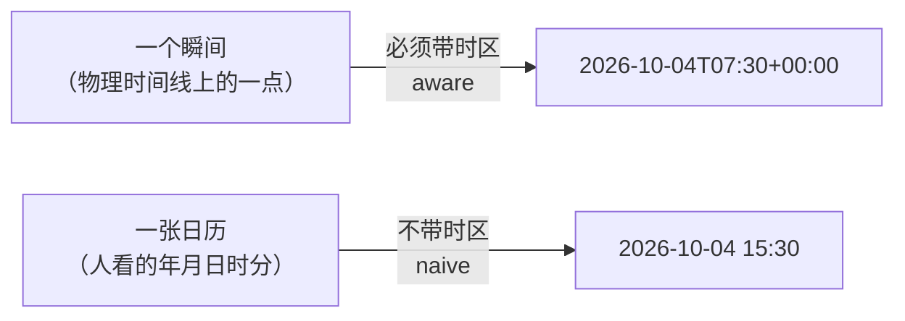

## 前置知识

- [基本数据类型](/python/070-BasicDataType)：熟悉字符串与数字的基本操作；
- 不需要任何时区知识，从零开始。

## 你现在要解决什么问题

设备采集程序在中国跑，每条日志打的是本机时间；同事在纽约的服务器上做数据分析，把两边的日志按时间戳对齐合并。结果两条明明同时发生的记录，时间差了整整 13 个小时（8 小时时区 + 5 小时夏令时）。排查半天，双方都委屈：「我打印的就是真实的当前时间啊」。

问题不在谁写错了代码，而在两个人对「2026-10-04 15:30:00」这串字符的理解不同——它没有携带「这是哪个时区的 15:30」这个信息。Python 标准库的 `datetime` 把这个问题显式建模成了两种对象：**naive（天真）时间不带时区，aware（清醒）时间带时区**。全篇就围绕这一条分水岭展开。

## 先动手：撞一次这个错

```python
from datetime import datetime, timezone

local = datetime.now()                    # naive：不带时区
utc = datetime.now(timezone.utc)          # aware：带 UTC 时区

print(local, "|", utc)
```

```text
2026-10-04 15:30:00.123456 | 2026-10-04 07:30:00.123456+00:00
```

同一个瞬间，两个值差 8 小时，第二个多了个 `+00:00` 尾巴。现在试着比较它们：

```python
print(utc - local)
```

```text
TypeError: can't subtract offset-naive and offset-aware datetimes
```

Python 拒绝比较两种对象——这不是库的缺点，而是**语言在替你挡住歧义**：naive 的 15:30 和 aware 的 07:30 到底是不是同一时刻，只有你（写代码的人）知道语境，Python 不猜。

## 心智模型：一个瞬间 vs 一张日历

理解全部 API 的钥匙是把两种需求分开：



- **aware** 回答「这是什么时候发生的」，可以换算到任何时区，值都指同一个瞬间。做存储、比较、跨系统传输，用它；
- **naive** 回答「日历上写的几点」，比如「每周一早上 9 点开会」。它没有时区语义，只在单一语境里有意义。做纯日历计算（生日、账期），可以容忍它。

**工程纪律一句话：程序内部一律用 aware 且存 UTC，只在展示层转成用户本地时间。**所有「时间对不上」的事故，几乎都源于在某处混入了 naive 时间。

## 标准库四件套与时间戳

`datetime` 模块里真正常用的就四个类型加一个时间戳概念：

```python
from datetime import datetime, date, time, timedelta, timezone

d = date(2026, 10, 4)                     # 只有日期
t = time(15, 30)                          # 只有一天内时刻
dt = datetime(2026, 10, 4, 15, 30)        # 日期 + 时刻（默认 naive）
td = timedelta(hours=3, minutes=20)       # 一段时长，可正可负

now_utc = datetime.now(timezone.utc)      # 当前瞬间（aware，UTC）
ts = now_utc.timestamp()                  # 转成 Unix 时间戳（秒，浮点）
back = datetime.fromtimestamp(ts, tz=timezone.utc)   # 从时间戳回来，必须给 tz
```

四点要知道的机制：

- **`datetime.now()` 不给参数时返回本机时区的 naive 时间**——它其实是「本机时间的日历页」，不是瞬间；
- **`timestamp()` 只对 aware 时间有意义**：naive 时间调它，Python 假设它是本机时区再换算，跨机器跑结果就不同；
- **3.11 起 `timezone.utc` 有更短的名字 `datetime.UTC`**，老代码里的 `timezone.utc` 依然到处都是，两个都要认识；
- **`datetime.utcnow()` 已在 3.12 标记废弃**：它返回的是「假装 UTC 的 naive 时间」，最容易骗人。见到就替换成 `datetime.now(timezone.utc)`。

## 时区库：zoneinfo 与 Windows 的 tzdata 包

时区不是固定偏移量（夏令时会切换），所以标准库 3.9 起提供了基于 IANA 时区数据库的 `zoneinfo`：

```python
from datetime import datetime
from zoneinfo import ZoneInfo

sh = datetime.now(ZoneInfo("Asia/Shanghai"))
ny = sh.astimezone(ZoneInfo("America/New_York"))

print(sh)
print(ny)
```

```text
2026-10-04 15:30:00.123456+08:00
2026-10-04 03:30:00.123456-04:00
```

`astimezone()` 在任意 aware 时间之间转换，同一个瞬间两种写法。三条纪律：

- **时区键用 IANA 名字**（`Asia/Shanghai`、`America/New_York`），不要用「CST」这类三字母缩写——CST 同时是中国、美国中部、古巴的标准时间，歧义到没法用；
- **Windows 上需要先装时区数据**：`pip install tzdata`。Linux/macOS 有系统自带的 IANA 数据库，Windows 没有，`zoneinfo` 找不到数据会抛 `ZoneInfoNotFoundError`。跨平台部署（容器、CI）都建议把 `tzdata` 写进依赖；
- **加减时长不等价于换算瞬间**（下节展开）。

## 算术的暗坑：timedelta 是「日历加法」

对 aware 时间做 `+ timedelta`，Python 加的是**日历上的墙钟时间**，不是绝对秒数。多数时候两者一致，但跨越夏令时切换的那一小时会分岔（2026 年 11 月 1 日凌晨 2 点，纽约把钟从 2:00 拨回 1:00）：

```python
from datetime import datetime, timedelta, timezone
from zoneinfo import ZoneInfo

ny = ZoneInfo("America/New_York")
UTC = timezone.utc
start = datetime(2026, 11, 1, 1, 30, tzinfo=ny, fold=0)   # 01:30，夏令时中

wall = start + timedelta(hours=1)                          # 日历加法
absolute = start.astimezone(UTC) + timedelta(hours=1)      # 先转 UTC 再加

print(start.astimezone(UTC))
print(wall, "->", wall.astimezone(UTC))
print(absolute.astimezone(UTC))
```

```text
2026-11-01 05:30:00+00:00
2026-11-01 02:30:00-05:00 -> 2026-11-01 07:30:00+00:00
2026-11-01 06:30:00+00:00
```

同是「加一小时」：日历加法落到墙钟的 02:30，折成 UTC 是 07:30——由于中间那小时被重复了一次，**实际过去了两个小时**；先转 UTC 再加才是真正的一小时后。要做调度、超时、对账这类「过了多久」的计算，纪律是**先转 UTC 再加减**：

```python
later = start.astimezone(UTC) + timedelta(hours=1)
```

相减也有对称的坑：两个 **同一个 tzinfo 对象** 的 aware 时间直接相减，Python 做的是日历减法（忽略时区偏移），下文 fold 一节那两个「1:30」相减会得 0；先各自转 UTC 再减，才得到真实的 1 小时。一句话：**加减都转成 UTC 再动手**。

## 解析与格式化：isoformat 优先，strptime 兜底

```python
from datetime import datetime

s = "2026-10-04T07:30:00+00:00"
dt = datetime.fromisoformat(s)            # 解析 ISO 8601

print(dt.isoformat())                     # 再转回标准字符串
print(dt.strftime("%Y-%m-%d %H:%M %Z"))   # 自定义格式输出
```

```text
2026-10-04 07:30:00+00:00
2026-10-04 07:30 UTC
```

优先用 `fromisoformat`：它无歧义、带偏移量、还能原样保住精度。版本要点——**3.11 起它接受几乎全部 ISO 8601 写法**，包括 `Z` 后缀（`2026-10-04T07:30:00Z`）；3.10 及以前只认 `isoformat()` 自己产出的格式，解析 `Z` 要手动替换成 `+00:00`。

`strptime` 处理非 ISO 的奇怪格式，两个高频坑：

- **格式符大小写有讲究**：`%Y` 四位年、`%y` 两位年、`%M` 分钟、`%m` 月份。`%M` 和 `%m` 写反是最常见的报错来源；
- **`%Z` 解析时区名基本没用**：它只认 `UTC`、`GMT` 和本机时区名，解析 `EST` 这类缩写会直接失败。带偏移量的时间用 `%z`（小写），不带偏移量的干脆先补全再解析。

## DST 折叠与 fold：一小时真的会出现两次

秋季拨慢那天（2026 年 11 月 1 日，纽约 2:00 拨回 1:00），凌晨 1:30 在当地日历上出现两次。aware 时间用一个整数属性 `fold` 区分：`0` 是第一次（还在夏令时），`1` 是第二次（已回标准时间）：

```python
from datetime import datetime
from zoneinfo import ZoneInfo

ny = ZoneInfo("America/New_York")
first = datetime(2026, 11, 1, 1, 30, tzinfo=ny, fold=0)
second = datetime(2026, 11, 1, 1, 30, tzinfo=ny, fold=1)

print(first.astimezone(ZoneInfo("UTC")))
print(second.astimezone(ZoneInfo("UTC")))
```

```text
2026-11-01 05:30:00+00:00
2026-11-01 06:30:00+00:00
```

日历上同一个「1:30」，对应两个不同的 UTC 瞬间。日常业务很少直接碰 `fold`，但写定时任务、对账逻辑时要知道它存在：**遇到「时间凭空重复/消失一小时」的报告，第一反应就是查这里**。

## 测耗时：墙上时钟不可信，用单调时钟

给代码计时要测「过了多久」，不能用 `datetime.now()` 做差——NTP 校时、夏令时、手动改系统时间都可能让墙上时钟**倒退**，测出负数或超大值。标准库为此提供了单调时钟：

```python
import time

start = time.monotonic()          # 只前进、不受校时影响的秒数
do_something()
print(f"耗时 {time.monotonic() - start:.3f}s")
```

选型口诀：**测耗时用 `monotonic`（要更高精度用 `perf_counter`）；记录事件发生时刻用 `datetime.now(timezone.utc)`**。两者关心的是不同的问题，混用就是下一起事故。（性能测量的完整方法论见 [性能优化](/python/690-PythonPerformance)。）

## 坑点实录

坑一：naive 与 aware 直接比较或相减，`TypeError`。修法不是 `try/except`，而是先统一：补上时区（`replace(tzinfo=ZoneInfo(...))` 适用于「你确知它属于哪个时区」的场景）或转 UTC。

坑二：`datetime.utcnow()`、`utcfromtimestamp()` 这类「utc 但 naive」的历史 API。名字带 utc 却不带时区信息，3.12 起已废弃。替换成 `now(timezone.utc)` 与 `fromtimestamp(ts, tz=timezone.utc)`。

坑三：`replace(tzinfo=...)` 与 `astimezone(...)` 混淆。前者是**重新贴标签**（瞬间可能整个变了），后者是**换算表示**（同一瞬间换个写法）。给 naive 时间补时区用前者，时区之间转换用后者。

坑四：解析带时区的字符串后忘了检查。`fromisoformat("2026-10-04T07:30:00")` 不带偏移量时返回 naive——输入源不保证带时区，解析完用一句 `assert dt.tzinfo is not None` 把假设变成检查。

坑五：数据库与 JSON 的往返丢时区。多数数据库 TIMESTAMP 列与 JSON 都不携带时区，存入前转 UTC、读出后立刻补 `timezone.utc`，别让「隐式本机时区」参与往返。（序列化细节见 [序列化：JSON 与 pickle](/python/310-SerializationJsonAndPickle)。）

坑六：定时任务按本地时间配 cron，夏令时切换当天会漏跑或跑两次。跨时区服务统一用 UTC 调度。

## 官方文档

- datetime 模块：https://docs.python.org/zh-cn/3/library/datetime.html
- zoneinfo 模块：https://docs.python.org/zh-cn/3/library/zoneinfo.html
- PEP 615（zoneinfo 进入标准库）：https://peps.python.org/pep-0615/

## 自我检查

- 能一句话说清 naive 与 aware 的区别，以及各自适用的问题；
- 能解释「内部存 UTC、展示才转本地」这条纪律防住了什么；
- 能写出当前推荐的「当前 UTC 时间」写法，并说出 `utcnow()` 的问题；
- 知道 Windows 上 `zoneinfo` 需要 `tzdata` 包；
- 能说出「日历加法」与「绝对时间加法」的差别和各自写法；
- 知道测耗时为什么必须用 `monotonic` / `perf_counter`。

## 练习

1. 预测题：`datetime.now() - datetime.now(timezone.utc)` 抛什么异常？为什么语言选择报错而不是猜一个答案？先写答案再运行验证。

2. 修改题：下面的日志函数把 naive 本机时间写进日志，请改成输出 UTC aware 的 ISO 字符串：

   ```python
   def log(event: str) -> None:
       print(f"{datetime.now()} {event}")
   ```

3. 实战题：拿到一批形如 `"2026-10-04T15:30:00+08:00"` 与 `"2026-10-04T03:30:00-04:00"` 混合的时间字符串，解析后统一转 UTC 排序输出。注意断言每个解析结果的 `tzinfo` 不为 `None`。

4. 挑战题：用 `ZoneInfo("America/New_York")` 构造 2026-11-01 凌晨 1:30 的两次出现（`fold=0` 与 `fold=1`），各自转 UTC 验证相差一小时；再回答：这两次对应的墙钟时间与 UTC 偏移量分别是什么？

<details>
<summary>点击查看参考实现</summary>

```python
from datetime import datetime, timezone
from zoneinfo import ZoneInfo

# 2. 修改题：日志统一打 UTC
def log(event: str) -> None:
    print(f"{datetime.now(timezone.utc).isoformat()} {event}")

# 3. 实战题：混合字符串统一转 UTC 排序
def parse_all(texts: list[str]) -> list[datetime]:
    result = []
    for s in texts:
        dt = datetime.fromisoformat(s)
        assert dt.tzinfo is not None, f"输入缺少时区偏移: {s}"
        result.append(dt.astimezone(timezone.utc))
    return sorted(result)

# 4. 挑战题：DST 折叠的两个 1:30
ny = ZoneInfo("America/New_York")
first = datetime(2026, 11, 1, 1, 30, tzinfo=ny, fold=0)
second = datetime(2026, 11, 1, 1, 30, tzinfo=ny, fold=1)
print(first.astimezone(timezone.utc))    # 2026-11-01 05:30:00+00:00（EDT，UTC-4）
print(second.astimezone(timezone.utc))   # 2026-11-01 06:30:00+00:00（EST，UTC-5）
print(second.astimezone(timezone.utc) - first.astimezone(timezone.utc))  # 1:00:00
# 注意：second - first 直接相减会得 0——同 tzinfo 对象相减是日历减法
```

</details>

## 下一步

- 时间对象要进出 JSON 时怎么不丢信息：[序列化：JSON 与 pickle](/python/310-SerializationJsonAndPickle)；
- 日志里的时间戳规范：[Python 日志](/python/430-PythonLog)；
- 定时与调度的工程实践（cron、Celery beat）：[Celery 分布式任务队列](/python/860-PythonCeleryDistributedTaskQueue)。
