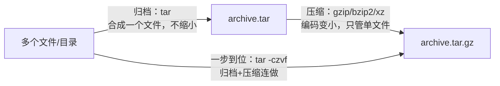

## 真实场景：周五下班前的两个任务

任务一：测试同事在 Windows 上，你要把项目的 `dist/` 产物打包发给他，还得让他能验一下文件没传坏。任务二：服务器磁盘报警，`app.log` 已经 48MB，旧日志该压一压，但偶尔还要查里面的内容。

这两个任务正好覆盖本篇要学的全部命令：tar 打包、gzip 压缩、zip 跨平台、校验与分割。

## 先建心智模型：打包 ≠ 压缩



- **归档（archive）**：把一堆文件合成一个文件（tar），方便传输，体积几乎不减；
- **压缩（compress）**：用编码算法把单个文件变小（gzip/bzip2/xz），只管一个文件；
- `zip`/`7z` 是"归档+压缩"二合一，`tar + gzip` 是两大步骤的经典组合。

理解了这一点，tar 的参数就是两套字母：**动作（c 建 / x 解 / t 看）+ 压缩器（z gzip / j bzip2 / J xz）+ f 文件名**。记不住时只记一条：`tar -xf 任意.tar.*`——现代 tar 自动识别压缩格式。

## 任务一：打包 dist 并交付

### 动手：三动作走一遍

```bash
tar -czvf dist.tar.gz dist/          # 建：打包并 gzip 压缩（v 显示过程）
tar -tzf dist.tar.gz                 # 看：列出内容，不解压
tar -xzf dist.tar.gz -C /tmp/out     # 解：-C 指定目的地（目录需已存在）
tar -xzf dist.tar.gz dist/index.html # 只解压包内指定文件
```

```text
$ tar -czvf demo.tar.gz notes/
notes/
$ tar -tzf demo.tar.gz
notes/
$ tar -xzf demo.tar.gz && ls
demo.tar.gz  notes
```

### 为什么解压前要先 `tar -tf`

网上下载的包内路径可能混乱（"炸弹包"：解压后糊你一脸文件）。现代 tar 解压时默认剥掉绝对路径开头的 `/`，不会写到包外，但**相对路径仍会覆盖当前目录的同名文件**。所以安全姿势是固定两步：先 `tar -tf` 看清单，再解压。

### 打包质量的两个细节

**用 `-C` 打出干净的相对路径**：

```bash
# 坏：包内带绝对路径，解压位置不受控
tar -czf app.tar.gz /var/www/myapp
# 好：-C 先切到父目录，再打包 myapp，解出来就是一个干净的 myapp/ 目录
tar -czf app.tar.gz -C /var/www myapp
```

**排除不该带上的东西**：

```bash
tar -czf app.tar.gz --exclude='.git' --exclude='node_modules' .
```

打包构建产物前先排除 `.git`、`node_modules`、日志与缓存目录——`node_modules` 能让包大十倍。`--exclude` 模式要与实际目录层级匹配，打包后用 `tar -tf | head` 抽查确认。

### 交付给 Windows 同事

tar.gz 在 Windows 上要用额外工具解压，跨平台交换用 zip 更省事：

```bash
zip -r dist.zip dist/                    # 递归压缩目录
zip -r app.zip . -x "*/node_modules/*"   # 排除模式
unzip -l dist.zip                        # 只看内容
unzip dist.zip -d /tmp/out               # 解压到指定目录
```

**经典陷阱：Windows 压的 zip 在 Linux 解出乱码文件名**。Windows 传统工具用本地编码（如 GBK）存文件名，Linux 默认按 UTF-8 解读。交换文件优先用 tar.gz；必须处理乱码 zip 时可借助支持指定编码的解压工具（如 `unzip -O gbk`，以本机版本支持为准）。`zip -e` 能加密码，但 zip 传统加密强度弱，敏感数据慎用。

### 最后一步：给包配上校验

传输完成后**先校验再使用**，这是交付链路的最后一环：

```bash
sha256sum dist.zip > dist.zip.sha256     # 生成校验文件，与包一起发
sha256sum -c dist.zip.sha256             # 对端校验，输出 OK 即完好
md5sum big.iso                           # 用法相同，但安全性弱，仅防传输出错
```

文件太大传不动时分割，收到后按顺序合并：

```bash
split -b 100M big.tar.gz part_     # 每 100MB 切成 part_aa、part_ab...
cat part_* > big.tar.gz            # 合并还原，然后 sha256sum -c 校验
```

## 任务二：收拾 48MB 的旧日志

单个大文件不需要 tar，直接 gzip：

```bash
gzip app.log              # 压缩，原文件被替换为 app.log.gz
gzip -k app.log           # -k 保留原文件（keep），先验证再删
gzip -d app.log.gz        # 解压（或 gunzip app.log.gz）
gzip -9 -k big.csv        # -1~-9 压缩率/速度档位，9 最慢最小
```

```text
$ ls -lh app.log*
-rw-r--r-- 1 user user  48M Sep  9 10:00 app.log
-rw-r--r-- 1 user user 4.2M Sep  9 10:01 app.log.gz
```

48MB 变 4.2MB。关键在于：压完之后偶尔还要查错误，难道每次都解压？不用——`zcat`/`zgrep` 直接操作压缩文件：

```bash
zcat app.log.gz | head          # 不解压直接看
zgrep "ERROR" app.log.gz        # 直接在压缩日志里 grep
```

这一招在日志轮转场景是神器：`/var/log` 里一堆 `.gz` 历史日志，排查上周的故障时全部 `zgrep` 即可。备份库（`backup.sh` 之类）里的 `.tar.gz` 同理可用 `tar -tzf` 验完整性、`tar -xzvf 包名 路径` 只抽出需要的那个文件。

bzip2 与 xz 是 gzip 的"更慢但更小"版本：`bzip2 bigfile.dat`（.bz2，压缩率高于 gzip）、`xz dump.sql`（.xz，压缩率最高、最慢）。数据库导出、发行版镜像这类"压一次、存很久"的文件值得用 xz。

## 工具补全：7z 与 Windows 内置

```bash
# 7-Zip（需安装，跨平台，格式支持最全）
7z a archive.7z src/       # a = 添加
7z x archive.7z            # x = 解压（保留目录结构）
7z l archive.7z            # l = 列出内容
```

```powershell
# Windows 内置（PowerShell 5+），零安装
Compress-Archive -Path src\* -DestinationPath app.zip
Expand-Archive -Path app.zip -DestinationPath .\out
```

PowerShell 的 `Compress-Archive` 只支持 zip 格式，且对大文件（超 2GB）历史上有限制，跨平台交付仍以 tar.gz 为首选。

## 格式选型速查

| 格式 | 命令 | 压缩率 | 速度 | 适用场景 |
| :--- | :--- | :--- | :--- | :--- |
| `.tar.gz` | `tar czf` | 中 | 快 | 通用首选，兼容性最好 |
| `.tar.bz2` | `tar cjf` | 较高 | 慢 | 老旧源码包常见 |
| `.tar.xz` | `tar cJf` | 最高 | 最慢 | 追求极限体积（发行版镜像） |
| `.zip` | `zip -r` | 低-中 | 快 | 与 Windows 用户交换文件 |
| `.7z` | `7z a` | 高 | 中 | 本地归档，需双方装 7-Zip |

经验法则：给别人下载用 `.tar.gz`（人人能解）；自己长期存档且体积敏感用 `.tar.xz`；跟 Windows 同事互传用 `.zip`。

## 坑点与自检

**坑 1：直接解压来路不明的包。** 先 `tar -tf` 看清单，防止覆盖当前目录文件。

**坑 2：打包忘记排除生成物。** 包里带着 `node_modules` 和 `.git`，体积大、内容杂，先 `--exclude` 再打包。

**坑 3：压完原文件就删。** gzip 不加 `-k` 会替换原文件，重要数据先 `-k` 压、校验后再删。

**坑 4：发布压缩包不配校验文件。** 下载方拿到的包坏了要传第三遍；`sha256sum` 一行解决。

自检——能不看文档回答这些吗：

1. 打包和压缩分别解决什么问题？`tar -czvf` 实际是几步？
2. 解压前用什么命令检查包内容？tar 对绝对路径做了什么保护？
3. 48MB 日志压成 4.2MB 后，怎么在不解压的情况下查 ERROR？
4. 交付给 Windows 同事和发布到 Linux 服务器，分别选什么格式？

## 练习

1. 给本仓库（或任一 Git 项目）打包：排除 `.git` 与依赖目录，用 `-C` 技巧打出干净的顶层目录，`tar -tf` 抽查十个条目确认没有混入生成物，最后生成 `.sha256` 校验文件并执行 `-c` 验证。
2. 把任意大文本文件 gzip 后，只用 `zcat`/`zgrep` 完成一次统计（如行数与某关键词出现次数），对比解压后再统计的结果是否一致。
3. 造一个含中文文件名的 zip（Windows 同事视角），在 Linux 上分别用 `unzip` 与 `unzip -O gbk` 解压，记录乱码差异；再用 `tar -czf` 重做一次交付验证无乱码。

## 下一步

- 管道与重定向：`tar`、`gzip` 常与数据流配合使用，见 [管道与重定向](/shell/170-PipeRedirect)；
- 压缩日志的批量分析：[文本处理命令速查](/shell/210-TextProcessing)；
- 把"打包-校验-清理"串成定时任务：[定时任务与调度](/shell/260-CronScheduling)。
