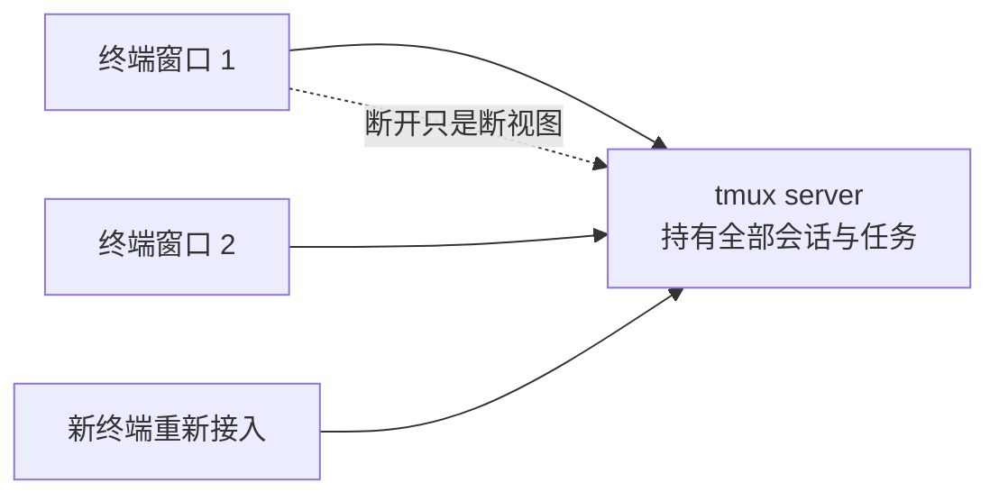
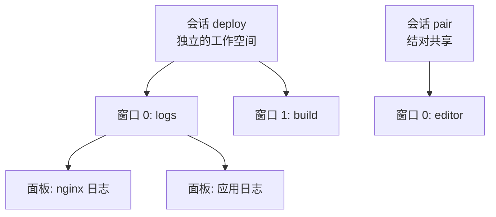

## 知识点地图

- **知识类别**：终端复用器（terminal multiplexer）——tmux 的会话管理、窗口面板布局、断线保持与协作共享。
- **解决什么问题**：SSH 断了跑一半的任务就死了（shell 的生命周期绑在连接上）；同时盯几个日志要开一堆终端窗口（没有布局管理）；结对调试时对方看不到你的终端（没有共享会话）。
- **什么时候用到**：SSH 到服务器跑长任务（部署、数据迁移、训练）、多面板同时监控、远程结对；本机想保持终端布局也可以用。

前置：进程与作业控制（shell/220-ProcessJobControl）——`&`、`jobs`、`nohup` 的机制是理解「tmux 为什么能保活」的基础；远程操作（shell/270-SshRemoteOperations）——tmux 的主战场。

## 1. 心智模型：把 shell 从终端窗口里解耦出来

普通终端里，shell 进程是你终端窗口的子进程：窗口一关（或 SSH 一断），shell 收到 SIGHUP，挂在上面的前台任务跟着死——这是 220 篇讲的进程树关系决定的。

tmux 在中间加了一层：**真正的 shell 与任务跑在 tmux 的服务进程（server）里**，你眼前的终端只是一个「视图客户端」。



推论三连：终端窗口关闭任务不死（server 还在）；断线重连 attach 回来原样恢复（布局、运行状态全在）；多个终端可以同时看同一个会话（结对共享）。这三条正是 nohup/setsid 只能做到第一条、做不到后两条的原因。

与守护进程方案的分工边界（220/230 篇只有两句提及，这里展开）：

| 手段 | 保活 | 可回看 | 可交互 | 适用 |
| :--- | :--- | :--- | :--- | :--- |
| `&` + nohup/setsid | 是 | 只剩日志文件 | 否 | 一次性后台任务 |
| systemd 服务 | 是 | journalctl | 否 | 长期服务、开机自启 |
| **tmux** | 是 | 滚回缓冲完整保留 | **是** | 交互式长任务、现场排障 |

原则：**交付给系统的服务用 systemd，交付给自己的一次性交互任务用 tmux**。把服务塞进 tmux 里跑，服务器重启后没人拉起它；把数据迁移塞进 systemd，中途想看看进度、敲个交互命令都做不到。

## 2. 三层模型：会话、窗口、面板



- **会话（session）**：最大的隔离单位，断线保活的单位，每个会话有名字；
- **窗口（window）**：会话内的「标签页」，占满整个终端视口，编号 0、1、2…；
- **面板（pane）**：窗口内的分屏，同一屏可见，`%` 编号。

概念映射：会话 ≈ 浏览器的独立窗口，窗口 ≈ 标签页，面板 ≈ 标签页里的分栏。tmux 的前缀键默认是 `Ctrl+b`（下文记作 `Prefix`），先按前缀、松开、再按功能键——这是 tmux 与 shell 的边界，所有 tmux 命令都不进 shell 历史。

## 3. 会话操作：attach / detach 与断线续连

```bash
tmux new -s deploy          # 新建名为 deploy 的会话
tmux detach                 # （会话内按 Prefix d）脱离，会话后台保留
tmux ls                     # 列出全部会话

# SSH 断线重连后的标准动作
ssh server
tmux attach -t deploy       # 接回 deploy 会话，一切如初

tmux new -s build 'make all && make deploy'   # 起会话同时跑长命令
tmux kill-session -t build  # 用完清理
```

逐行讲为什么这样用：

- `new -s` 给会话命名是纪律——`tmux ls` 里出现一堆 0、1、2 时你不会记得哪个是哪个；
- `attach -t` 是断线续连的全部秘密：SSH 断了 tmux server 不知道也不关心（它不是 SSH 的子进程，只要 sshd 没杀 server 进程），重连后 attach 就是「重新连显示器」；
- `tmux new -s build '命令'` 的形态适合「明确知道要跑什么」的任务：命令结束会话自动退出（结果看 `_` 后缀的死会话或日志），注意长命令要自己带日志重定向（`'make all > build.log 2>&1'`），否则输出没人接；
- detach（`Prefix d`）与直接关终端的区别：detach 是「礼貌离场」（会话继续跑），关窗口在 tmux 外层也等效 detach，但养成显式 detach 的习惯能避免误把窗口层的东西一起带走。

## 4. 窗口与面板的日常键位

| 操作 | 键位 | 说明 |
| :--- | :--- | :--- |
| 新建窗口 | `Prefix c` | c = create |
| 切换窗口 | `Prefix 0-9` / `Prefix n` / `Prefix p` | 按编号 / 下一个 / 上一个 |
| 列出窗口 | `Prefix w` | 交互式选择（跨会话也能跳） |
| 水平分屏 | `Prefix %` | 左右分 |
| 垂直分屏 | `Prefix "` | 上下分 |
| 切换面板 | `Prefix 方向键` / `Prefix o` | 方向键最直觉 |
| 关闭面板 | `Prefix x` | 会确认，或直接 exit 退 shell |
| 面板全屏切换 | `Prefix z` | 临时放大看日志，再按还原 |

**多面板盯部署的典型布局**：`Prefix %` 左右分出两栏，左边 `tail -f /var/log/nginx/access.log`，右边 `htop`；需要看第三个流再 `Prefix "` 在右侧上下分——一个屏幕同时盯三个信号源，这是「开三个终端窗口来回切」永远做不到的。

**易错点**：面板里跑的是 shell，`Prefix x` 关面板时若有任务在跑会被杀——关之前确认没有长任务；`Prefix z` 的全屏是「临时」的，忘了还原会以为只有单面板（状态栏的面板编号会提示）。

## 5. 复制模式与滚回缓冲

tmux 保留每个窗口的输出历史（滚回缓冲），`Prefix [` 进入复制模式即可翻阅：

```bash
# 进入复制模式后：
# PgUp / PgDn 或 方向键 滚动查看历史输出
# q 退出复制模式
```

与终端自带滚回的区别：tmux 的缓冲属于会话不属于窗口——SSH 断线重连后，**断线期间的输出一条不丢**（只要缓冲没满），普通终端的滚回缓冲在窗口关闭时就没了。这对「跑了一夜的任务早上看日志」是决定性的：attach 回去 `Prefix [` 一直翻到昨晚。

缓冲大小默认 2000 行，跑长任务前调大（配置见第 7 节）。复制模式里还可以按 `Space` 开始选区、`Enter` 复制（进 tmux 粘贴缓冲，`Prefix ]` 粘贴），配合系统剪贴板工具（`pbcopy`/`xclip`）可打通到系统剪贴板。

## 6. 工程场景

### 6.1 场景一：SSH 跑长任务断线重连（270 篇断线场景的正解）

半夜跑数据迁移，预计 3 小时。裸 SSH 的问题：笔记本睡眠、公司 VPN 抖动、Wi-Fi 切换，任何一个断线事件都会杀掉迁移进程（SIGHUP 沿进程树传播，220 篇）。tmux 的做法：

```bash
ssh prod-server
tmux new -s migrate
pg_dump bigdb | psql -h newdb      # 在会话里起迁移

# 半夜断线无所谓，早上：
ssh prod-server
tmux attach -t migrate             # 迁移还在跑，屏幕停在最后的输出
```

为什么不用 nohup：迁移中途想看进度（复制模式翻历史）、想确认卡在哪张表（交互式 `ps`）——nohup 方案只有日志文件可看，交互能力为零。也不是所有任务都值得 tmux：预计几秒的一次性命令直接跑，能幂等重跑的批量任务写脚本进 cron（shell/260），tmux 的价值区间是「长 + 交互式 + 人要盯」。

### 6.2 场景二：多面板同时盯部署日志与进程

发布 night：一个会话四个面板分工——左上 `tail -f app.log`，左上右侧 `tail -f nginx/error.log`，右下 `htop`，右下再一个 `redis-cli MONITOR`（或数据库会话）。发布全程目光不离开一块屏幕；出问题时 `Prefix z` 把可疑面板临时放大。这套布局可以做成脚本一键铺开：

```bash
# deploy-layout.sh：一键铺出监控布局
tmux new-session -d -s deploy
tmux send-keys -t deploy 'tail -f app.log' C-m
tmux split-window -h -t deploy
tmux send-keys -t deploy 'tail -f nginx/error.log' C-m
tmux split-window -v -t deploy
tmux send-keys -t deploy 'htop' C-m
tmux attach -t deploy
```

逐行讲：`new-session -d` 后台起会话不立即 attach；`send-keys` 向指定面板「打字」并回车（`C-m` 即回车键）——这是把 tmux 当自动化工具用的关键命令；`split-window -h/-v` 分屏并返回新面板。把这套脚本进仓库，团队里每个人的发布监控布局就统一了。

### 6.3 场景三：结对调试共享会话

远程结对：两人各自 SSH 到同一台开发机，接同一个会话——

```bash
# 双方各自执行
tmux attach -t pair       # 接到同一个会话，看到完全相同的画面
```

两人的输入都会进入会话、屏幕实时同步，天然适合「你操作我看」的调试协作。比屏幕共享的优势：零带宽、终端级精度、对方网络差也不卡你。配套纪律：共享会话里先说后敲（两个人同时在打字会互相穿插）；敏感环境用只读方式接入（`tmux attach -r`，read-only）防止误操作。

## 7. 最小 .tmux.conf

```bash
# ~/.tmux.conf 最小可用配置
set -g default-shell /bin/bash        # 新面板用哪个 shell
set -g history-limit 50000            # 滚回缓冲行数（默认 2000 太小）
set -g mouse on                       # 支持鼠标滚动、点击切面板、拖拽分屏
set -g base-index 1                   # 窗口编号从 1 起（0 键太远）
setw -g pane-base-index 1             # 面板编号同样从 1 起
set -g prefix2 C-a                    # 保留 Ctrl+b，追加 Ctrl+a 为前缀（顺手）
bind | split-window -h                # 竖线左右分（直觉化）
bind - split-window -v                # 横线上下分
```

逐项讲为什么值得配：`history-limit` 是长任务场景刚需（第 5 节的滚回依赖它）；`mouse on` 让新手上手成本降一半（能滚屏就能用）；`base-index 1` 纯键位人体工学，`Prefix 1` 比 `Prefix 0` 顺手。改完配置 `Prefix :` 输入 `source-file ~/.tmux.conf` 热加载，或重启 tmux server（会杀会话，慎用）。配置可以进 dotfiles 仓库随机器同步——tmux 的配置就几十行，是性价比最高的 dotfile。

## 8. 动手实践

**任务一：断线保活实验。** 本机（或远程）`tmux new -s test` 后跑 `top`；然后直接关掉这个终端窗口；开新窗口 `tmux ls` 再 attach，确认 top 还在跑。再用 nohup 版（`nohup top &`）做对照：关窗口重开，`jobs` 还能看到它吗？怎么再看到它的输出？

<details>
<summary>任务一参考观察</summary>

tmux 版：ls 里 test 会话还在，attach 后 top 画面原样。nohup 版：jobs 是新 shell 的作业表，看不到旧任务；输出进了 nohup.out 文件，且 top 这类全屏交互程序写文件毫无意义——这暴露了 nohup 的适用边界（批量输出型命令可以，交互型不行）。两个方案的实质差异：tmux 把任务挂在独立 server 下，nohup 只是把 SIGHUP 忽略掉，任务还是孤儿进程。
</details>

**任务二：铺一个三面板监控布局并保存成脚本。** 按 6.2 节的脚本骨架改成你自己的三面板布局（比如一个 tail 日志、一个 htop、一个空闲 shell 跑着），跑通后把脚本存进你的项目；再实验 `Prefix z` 放大/还原、`Prefix {` / `}` 交换面板位置。

<details>
<summary>任务二参考观察</summary>

send-keys 的 `C-m` 漏写是脚本最常见的失败原因（命令输入了但没回车）；split-window 不带 `-t` 时从当前面板切分，脚本里始终显式指定目标更稳。`Prefix {`/`}` 的价值在调试布局时不用拆了重来。自查：你的脚本里 attach 前有没有先 `tmux has-session -t xxx 2>/dev/null ||` 判重？重复运行脚本不该报错。
</details>

**任务三：复制模式考古。** 在会话里连续跑一串输出（`for i in (1..5000) echo`或 `seq 1 10000`），把 `history-limit` 分别设为默认 2000 与 50000 各试一次：进复制模式翻到最早能看到的行，验证缓冲大小对「翻历史」的实际影响。

<details>
<summary>任务三参考观察</summary>

2000 行配置下翻到头只有最近的 2000 行输出，更早的直接被丢弃；50000 行下能翻回起点。教训落地：跑长任务（迁移、编译）前先确认 history-limit——「翻不到开头」不是 tmux 的 bug，是缓冲预算问题。这也是 6.1 场景里「跑一夜早上看」必须配大缓冲的原因。
</details>

## 9. 下一步与延伸阅读

- 《进程与作业控制》（shell/220-ProcessJobControl）：SIGHUP 与进程树——理解 tmux 保活机制的底层；
- 《进程管理速查》（shell/230-ProcessManage）：`kill`/`pkill` 等命令速查；
- 《SSH 远程操作》（shell/270-SshRemoteOperations）：tmux 的主战场，断线场景的正解组合；
- 《定时任务 cron》（shell/260-CronScheduling）：不需要交互的周期任务该去的地方。

## 参考与致谢

- tmux 官方手册（man tmux）与 GitHub 仓库 <https://github.com/tmux/tmux>（ISC License），会话/窗口/面板模型与命令行参数；
- 本篇为教学重写；220/230 篇原有的 tmux 两句提及已更新为指向本篇。
