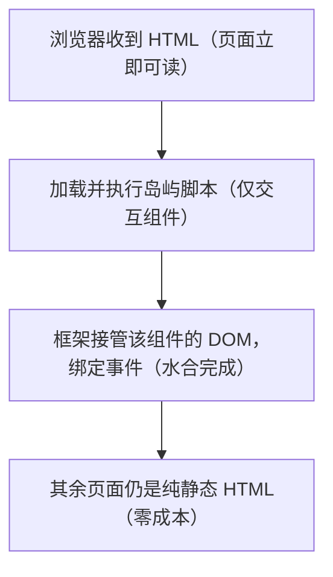

## 0. 开篇：一座冰山和几座浮岛

想象你站在海边看一座冰山。冰山的大部分体积沉在水面之下，安静、稳定、纹丝不动；只有少数几处"浮岛"露出水面——也许是上面停着灯塔、站着海鸟。整座冰山不需要被拖船推着走，只有那些浮岛上的东西才需要"动"。

一个内容型网站（博客、文档站、教程站）和这座冰山一模一样：**绝大部分内容是文字、标题、图片，它们天生就是静态的，不需要任何 JavaScript 参与**。真正需要"动"的，只有少数几个部件——搜索框、主题切换按钮、评论区、目录高亮。传统做法却常常把整座冰山都装上发动机：浏览器先下载几十上百 KB 的框架脚本，再重新"驱动"整页。这就像为了点亮灯塔，给整座冰山配了一艘拖船。

本文从大家最常遇到的一个真实问题出发："为什么我写好的按钮，在页面上完全没反应？"沿着这个问题，逐步揭开 Astro 岛屿架构的面纱，讲清 `client:` 指令全家桶的用法与选择逻辑。

## 1. 问题引入：为什么我的页面没有交互？

### 1.1 一个新手一定会踩的坑

假设你已经会写 Astro 组件了，于是照着 React 的习惯写了一个计数器组件，然后在页面里引用它：

```tsx
// src/components/Counter.tsx（React 组件）
import { useState } from 'react'

export default function Counter() {
  const [count, setCount] = useState(0)
  return (
    <button onClick={() => setCount(count + 1)}>
      点击了 {count} 次
    </button>
  )
}
```

```astro
---
// src/pages/index.astro
import Counter from '../components/Counter.tsx'
---

<Counter />
```

在浏览器里打开页面：按钮老老实实地显示"点击了 0 次"，但**点了完全没反应**。为什么？

### 1.2 诊断：先看它是不是"活"的

原因一句话就能说清：**Astro 组件在构建期/请求期于服务端运行，产出的是纯 HTML 字符串；而 React、Vue、Svelte 这些框架组件默认也只是"被渲染成 HTML"，并没有被打包成浏览器里可运行的脚本。** 页面上那个按钮只是 HTML 的"照片"，不是"活人"。

验证方法很简单，打开浏览器开发者工具：

1. 在 Network 面板中，看页面是否加载了任何 `.js` 脚本（岛屿组件才会产生脚本，纯静态页面经常是零脚本）；
2. 在 Sources 面板搜索组件里的字符串（如"点击了"），找不到就说明这段逻辑根本没进浏览器。

这就是 Astro 最反直觉、也最核心的设计：**一切默认静态，交互必须显式声明**。要"激活"按钮，只需要给组件加上一个 `client:` 指令：

```astro
---
import Counter from '../components/Counter.tsx'
---

<!-- client:load：页面加载后立即下载并激活这个组件 -->
<Counter client:load />
```

刷新页面，按钮活了。至此，"为什么没有交互"的问题有了答案——**你没有告诉 Astro 这是一座需要水合的岛屿**。

## 2. 原理：岛屿架构与水合（hydration）

### 2.1 直观理解：海洋、岛屿与灯塔

把页面想象成一片海洋：

- **海洋**：默认渲染出的静态 HTML。它不需要任何 JavaScript 就能显示、就能被搜索引擎抓取、就能被用户阅读。Astro 组件（`.astro` 文件）永远属于海洋。
- **岛屿**：你显式标记的交互组件。它们浮在海面上，各自带着一座"灯塔"（框架运行时），独立发光。
- **灯塔**：组件真正"活过来"的过程，专业术语叫**水合（hydration）**——浏览器下载该组件的脚本，把服务端渲染好的 HTML 接管过来，绑定事件、初始化状态。

关键规则只有一条：**没有 `client:` 指令的框架组件，永远只是海洋里的一张静态照片；加了指令，它才成为一座会发光的岛屿。**

### 2.2 历史：岛屿架构从哪来

这个思想不是 Astro 发明的，但 Astro 把它做成了主流：

- 2019 年，Etsy 前端架构师 Katie Sylor-Miller 首次提出"component island（组件岛屿）"概念；
- 2020 年 8 月，Preact 作者 Jason Miller 在《Islands Architecture》一文中系统阐述了这套模式，并给出经典定义："在服务端渲染 HTML 页面，在高度动态的区域周围注入占位符或插槽，这些区域随后在客户端被'水合'为小型自包含组件，复用服务端渲染出的初始 HTML"；
- 这种技术也叫**局部水合 / 选择性水合（partial / selective hydration）**；
- Astro 是第一个把"选择性水合"内置为主流能力的 JavaScript Web 框架。

### 2.3 原理：水合时到底发生了什么

以 `<Counter client:load />` 为例，一次完整的水合分四步：

1. **构建期**：Astro 编译页面，把 Counter 渲染成静态 HTML（按钮 + "点击了 0 次"），同时分析出只有这个组件需要客户端脚本，为它单独打包成一个小的 JS chunk；
2. **加载期**：浏览器拿到 HTML，立即渲染出完整页面——此时页面已经可以阅读（无需等待任何 JS）；
3. **脚本期**：浏览器下载并执行 Counter 的 chunk，React 运行时找到服务端渲染出的那个按钮（通过 `data-astro-cid` 之类的标记），把虚拟 DOM 与现有 DOM 对齐；
4. **激活期**：事件绑定生效，`useState` 接管状态，按钮开始响应点击。



### 2.4 对比：岛屿架构 vs 传统 SPA

| 对比项 | 传统 SPA | Astro 岛屿架构 |
| --- | --- | --- |
| 首屏 HTML | 空骨架，靠 JS 渲染出内容 | 完整静态 HTML，JS 无关即可显示 |
| JS 体积 | 全站一个巨型 bundle（常见 100KB+） | 仅岛屿按需分片，纯静态页可为零 |
| 水合范围 | 整页水合 | 仅显式标记的岛屿水合 |
| 搜索引擎/禁用 JS 场景 | 可能看到空白页 | 内容完整可读 |
| 交互成本 | 与页面复杂度成正比 | 与岛屿数量成正比 |

> 需要说明：SPA 没有错，在"整个页面都在频繁变化状态"的应用场景（后台管理、聊天室）里 SPA 依然是最优解。岛屿架构的适用边界是**内容驱动型网站**——大部分内容静态、少数部件交互，这正是 Astro 的定位。选择取决于你的页面形态，而不是谁的宣传语更好听。

## 3. client: 指令全家桶：精确控制水合时机

`client:` 指令不只回答"要不要水合"，还回答"**什么时候**水合"。水合越早，交互响应越快；但脚本下载与执行会抢占主线程，影响首屏渲染。选择水合时机，本质是在"交互及时性"与"首屏性能"之间做权衡。

### 3.1 指令速查表

| 指令 | 水合时机 | 触发机制 | 典型场景 |
| --- | --- | --- | --- |
| `client:load` | 页面加载后立即 | 页面 load 后直接下载执行 | 首屏关键交互（导航搜索框） |
| `client:idle` | 浏览器空闲时 | requestIdleCallback | 非关键但常用的交互（主题切换） |
| `client:visible` | 元素进入视口时 | IntersectionObserver | 页面底部的评论区、轮播图 |
| `client:media="(max-width: 768px)"` | 匹配媒体查询时 | matchMedia | 仅移动端展示的抽屉菜单 |
| `client:focus` | 元素获得焦点时 | focus 事件 | 低优先级、聚焦才用的组件 |
| `client:only="react"` | 仅客户端渲染 | 跳过服务端渲染，直接客户端生成 | 依赖 window/document 的库 |

### 3.2 组合使用示例

```astro
---
// src/pages/blog/index.astro
import SearchBox from '../components/SearchBox.tsx'
import ThemeToggle from '../components/ThemeToggle.vue'
import CommentForm from '../components/CommentForm.svelte'
import MobileMenu from '../components/MobileMenu.tsx'
---

<header>
  <!-- 首屏可见、用户马上要用的搜索框：立即水合 -->
  <SearchBox client:load />

  <!-- 主题切换不阻塞首屏：浏览器空闲时再水合 -->
  <ThemeToggle client:idle />

  <!-- 只在小屏幕上出现的移动端菜单：命中媒体查询才水合 -->
  <MobileMenu client:media="(max-width: 768px)" />
</header>

<main>
  <!-- 正文…… -->
</main>

<footer>
  <!-- 页面底部的评论区：滚动到视口附近才水合 -->
  <CommentForm client:visible />
</footer>
```

### 3.3 三个容易混淆的点

**第一，`client:only` 会跳过服务端渲染。** 其余指令都是在"服务端已渲染出 HTML"的基础上水合；`client:only` 则完全不输出服务端 HTML，组件第一次出现在页面上就是客户端生成的结果。它只用于那些**在服务端无法运行**的组件（依赖 `window`、`document` 的第三方库）。必须显式声明框架名：`client:only="react"`。代价是首屏会短暂空白、SEO 拿不到内容，所以能用普通指令就不要用它。

**第二，`client:` 指令不能通过展开属性传入。** 指令必须能被编译器静态识别，`<Component {...props} />` 这种方式传 `client:load` 是无效的，必须直接写在标签上。

**第三，`client:visible` 不等于"懒加载图片"。** 它是观察组件本身的可见性，触发后组件立即水合，之后即使滚出视口也不会"脱水"。

### 3.4 水合时机选择的心智模型

从轻到重排列，作为默认决策顺序：

```text
能用纯 HTML/CSS 解决（<details>、:hover、CSS 动画）？ → 不引入框架
交互不紧急且在首屏外？ → client:visible
交互重要但不必立即？ → client:idle
首屏关键交互？ → client:load
只依赖浏览器 API、服务端跑不了？ → client:only
```

记住：**每加一个 `client:` 指令，就多一份真实下载与执行的 JS。先问"真的需要吗"，再问"什么时候水合"。**

## 4. 框架集成：React / Vue / Svelte 共存

### 4.1 安装集成

```bash
# 交互式向导：自动安装集成、写入配置、补装 JSX 相关依赖
npx astro add react
npx astro add vue
npx astro add svelte
# 也支持 preact / solid / alpinejs 等
npx astro add preact
```

### 4.2 配置确认

```js
// astro.config.mjs（安装后自动生成）
import { defineConfig } from 'astro/config'
import react from '@astrojs/react'
import vue from '@astrojs/vue'

export default defineConfig({
  // 一个项目可同时注册多个框架集成，按数组顺序生效
  integrations: [react(), vue()],
})
```

### 4.3 同一页面混用多个框架

这是 Astro 区别于"选一个框架"思路的核心能力：每个框架组件都是一座独立岛屿，由各自的运行时各自水合，互不干扰。

```astro
---
// src/pages/index.astro
import ReactCounter from '../components/ReactCounter.tsx'
import VueModal from '../components/VueModal.vue'
import SvelteSlider from '../components/SvelteSlider.svelte'
---

<ReactCounter client:load />
<VueModal client:idle />
<SvelteSlider client:visible />
```

构建产物中会分别出现 React 与 Vue 的运行时 chunk——也就是说**每引入一种框架，就多一份运行时开销**。多框架是"迁移期混用、团队语言不一"时的利器，但生产项目依然建议收敛到一到两种框架。

## 5. 岛屿之间的通信

### 5.1 从页面传入 Props（最常用）

构建期/请求期拿到的数据，可以直接作为 props 传给框架组件。Astro 会把 props 序列化进 HTML（内联 JSON 或 `data-astro-*` 属性），水合时框架读取并恢复。

```astro
---
// src/pages/docs.astro
import SearchBox from '../components/SearchBox.tsx'

const docs = await getCollection('docs')  // 构建期查询内容集合
---

<!-- 静态数据 → 客户端交互组件，数据经序列化传过去 -->
<SearchBox client:load items={docs.map((d) => d.data.title)} />
```

### 5.2 跨岛屿共享状态：nanostores

多个岛屿（甚至跨框架）需要共享同一份状态时，Astro 官方推荐 **nanostores**——一个框架无关的微型状态库（约 1KB）。它的核心思路：状态存在框架之外，各框架通过各自的绑定层订阅。

```ts
// src/stores/cart.ts：定义全局原子状态
import { atom } from 'nanostores'

// 购物车数量：任何岛屿都可读写
export const cartCount = atom(0)

export function addToCart() {
  cartCount.set(cartCount.get() + 1)
}
```

```tsx
// React 岛屿中订阅（@nanostores/react）
import { useStore } from '@nanostores/react'
import { cartCount } from '../stores/cart'

export default function CartBadge() {
  // useStore 让组件随状态变化自动重渲染
  const count = useStore(cartCount)
  return <span>购物车：{count} 件</span>
}
```

```vue
<!-- Vue 岛屿中订阅（@nanostores/vue） -->
<script setup lang="ts">
import { useStore } from '@nanostores/vue'
import { cartCount } from '../stores/cart'

const count = useStore(cartCount)
</script>

<template>
  <span>购物车：{{ count }} 件</span>
</template>
```

Svelte 则原生支持：`import { cartCount } from '../stores/cart'` 后直接用 `$cartCount` 即可自动订阅。这样"加购按钮"（React 岛屿）修改状态，"购物车角标"（Vue 岛屿）自动刷新，两个岛屿之间无需任何 props 传递。

### 5.3 自定义事件

对于一次性、松耦合的通知（如"搜索完成，请滚动到结果区"），可以用浏览器原生 `CustomEvent` 广播，由接收方岛屿监听：

```ts
// 发送方（任意岛屿内）
window.dispatchEvent(new CustomEvent('search:done', { detail: { query } }))
```

```ts
// 接收方（另一座岛屿内）
window.addEventListener('search:done', (e) => {
  console.log('收到搜索完成事件：', e.detail.query)
})
```

选择建议：**父子/兄弟组件之间的数据流用 Props；跨页面、跨框架的全局状态用 nanostores；一次性行为通知用 CustomEvent。**

## 6. 常见错误与对策

| 常见错误 | 典型报错/现象 | 原因 | 解决办法 |
| --- | --- | --- | --- |
| 框架组件没加 `client:` 指令 | 页面正常显示，但点击无任何反应 | 组件只被服务端渲染成 HTML，未打包进浏览器 | 按交互需求加 `client:load` / `client:idle` / `client:visible` 等 |
| `client:only` 忘记写框架名 | 构建报错提示缺少框架参数 | `client:only` 必须显式声明由哪个框架渲染 | 写成 `client:only="react"` |
| 用展开属性传指令 | `<Comp {...{ "client:load": true }} />` 无效 | 指令必须编译期静态可见，不能动态传入 | 直接把 `client:load` 写在标签上 |
| 给 Astro 组件（.astro）加 `client:` | 控制台提示不支持 | `.astro` 组件永远静态渲染，不能水合 | 交互逻辑请写到框架组件中，或用原生 `<script>` |
| 未安装对应框架集成 | 报错 `Cannot find module '@astrojs/react'` 之类 | 只装框架本身没装 Astro 集成 | 运行 `npx astro add react` 安装并配置集成 |
| 无差别给所有组件加 `client:load` | 首屏 JS 体积暴涨、Lighthouse 评分下降 | 水合时机选择过重，脚本抢占主线程 | 按"从轻到重"决策：visible → idle → load 逐级选择 |

## 8. 一句话记忆

**"页面默认是一片静态的海洋，只有显式加上 `client:` 指令的组件，才会变成一座被水合的岛屿——不加指令，就没有交互。"**
