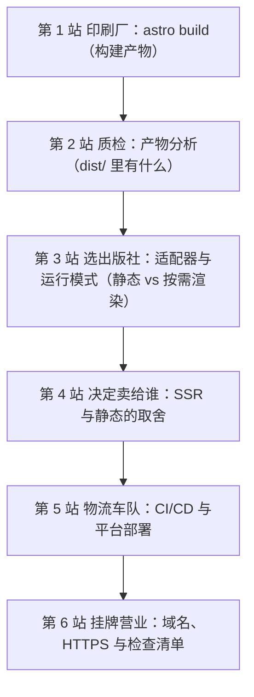
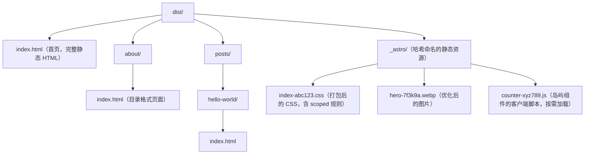

## 0. 开篇：一本书从手稿到书店的旅程

假设你写完了一本书的手稿。接下来会发生什么？手稿要送到**印刷厂**排版印刷，印好的样书要送去**质检**，然后你要选一家**出版社**（决定书的发行渠道），再决定这本书**卖给谁、放在哪个书架的哪个位置**，最后由**物流车队**把书送到全国书店，书店**挂上招牌正式营业**。每一站都有明确的任务，跳过任何一站，书就到不了读者手里。

网站上线是同一趟旅程。本文按"从构建到上线"的完整旅程组织，你跟着走一遍，就能理解 Astro 站点是如何从源代码变成全球可访问的网站的：



## 1. 第 1 站，印刷厂：astro build

### 1.1 构建在做什么

`astro build` 是 Astro 的"印刷车间"。它分两步完成印刷：

1. **打包**：把站点的页面、内容与客户端组件（岛屿）打包成 JavaScript；
2. **生成**：像运行一台小型服务器一样执行打包结果，为每个预渲染页面发起请求、渲染出完整 HTML，输出到 `dist/` 目录。

```bash
npm run build
# 构建完成后：
npm run preview   # 本地模拟生产环境，预览 dist/ 产物的实际效果
```

`preview` 值得养成习惯：它跑在构建产物之上，能发现"开发时正常、构建后异常"的差异（例如绝对路径、资源引用问题）。

### 1.2 构建产物长什么样

一次构建结束后，`dist/` 大致是这样的结构：



### 1.3 构建提速：Astro 7 的"新印刷机"

Astro 7 把印刷车间整体换成了原生性能：`.astro` 编译器重写为 Rust、Markdown 管线替换为 Rust 实现的 Sätteri、打包器升级为 Vite 8（内含 Rust 写的 Rolldown）。官方基准测试显示，真实站点构建提速 **15%-61%**，其中 Markdown 密集的文档站收益最大——例如官方文档站（约 6313 页）从 114.5 秒降到 73.5 秒，Cloudflare 开发者文档站（8431 页）从 386.9 秒降到 261.9 秒。**对你来说，构建命令和产物格式完全不变，只是等的时间变短了。**

## 2. 第 2 站，质检：读懂产物

书要质检，产物要分析。构建完成后做三件事，能避免大部分"上线才发现"的意外。

### 2.1 看结构：页面是否都在

逐个核对 `dist/` 中是否生成了所有预期页面（含动态路由展开后的全部实例）。漏页通常是 `getStaticPaths()` 返回的数据为空导致的。

### 2.2 看体积：有没有"意外的大包"

重点检查 `_astro/` 中最大的几个文件：

```bash
# 查看产物中各文件体积（按从大到小排序，前 20 个）
npx serve dist   # 或用任意静态服务器，打开 DevTools Network 观察
```

- 出现巨型 `.js`：八成是某个岛屿误用了 `client:load`，或第三方库被整包打入。回到 006 的水合决策，把不紧急的岛屿降级为 `client:idle`/`client:visible`；
- 出现巨型图片/字体：检查是否绕过 `<Image />` 原图直出，或 Fonts API 未启用。

### 2.3 看引用：资源路径是否自洽

确认 CSS、JS、图片的引用路径在 `preview` 下全部可访问（DevTools 无 404）。若站点要部署在域名子路径（如 `https://example.com/docs/`），则必须配置 `base`（见第 5 站），否则所有资源路径都会指向错误的根路径。

## 3. 第 3 站，选出版社：适配器与运行模式

书的发行渠道由出版社决定；网站的"运行方式"由**适配器（adapter）**决定。适配器把 Astro 的产物接入特定平台的运行环境（Node 服务器、Serverless 函数、边缘 Worker）。

### 3.1 三种运行模式（注意 5.x 之后的最新变化）

| 模式 | 配置 | 渲染时机 | 适用场景 |
| --- | --- | --- | --- |
| 静态（默认） | `output: 'static'` | 构建期一次性生成 | 博客、文档站、营销页（绝大多数内容站） |
| 服务端按需渲染 | `output: 'server'` + 适配器 | 每次请求 | 登录态、个性化、实时数据 |
| 静态为主 + 个别动态页 | `output: 'server'` + 页面内 `export const prerender = true` | 混合 | 大部分静态 + 少量动态（如登录页） |

需要特别说明：Astro 5 起**移除了独立的 `output: 'hybrid'` 模式**，简化为——静态模式全站静态；服务端模式默认按需渲染，个别页面用 `export const prerender = true` 标记为预渲染。判断一个页面是否预渲染，只需看这一行标记：

```astro
---
// src/pages/profile.astro（server 模式下）
// 默认按需渲染；加上这一行则改回构建期预渲染
export const prerender = true
---
```

### 3.2 安装适配器

```bash
# 官方适配器：Node.js、Netlify、Vercel、Cloudflare（另有 Deno、Bun 等）
npx astro add node
npx astro add netlify
npx astro add vercel
npx astro add cloudflare
```

`astro add` 会自动安装适配器、写入 `astro.config.mjs` 并提示后续步骤。以 Cloudflare 为例：

```js
// astro.config.mjs
import { defineConfig } from 'astro/config'
import cloudflare from '@astrojs/cloudflare'

export default defineConfig({
  output: 'server',
  adapter: cloudflare(),
})
```

### 3.3 本地开发与生产一致（Astro 6+ 的红利）

Astro 6 重构了开发服务器：通过 Vite 的 Environment API，开发环境可以直接运行目标平台的真实运行时。例如 Cloudflare 适配器在**开发、预渲染、生产**全程运行 `workerd` 运行时，本地就能直接使用 KV、D1、R2 等绑定，"本地好好的，上线就挂"这类问题从根上减少。

### 3.4 动态路由的两种命运

同一个 `[id].astro` 动态路由，在两种模式下走向完全不同：

```astro
---
// src/pages/product/[id].astro

// 静态模式：构建期必须通过 getStaticPaths() 枚举所有 id，输出全部页面
// 服务端模式：无需枚举，Astro.params 在请求时按 URL 匹配
const { id } = Astro.params
const product = await fetchProduct(id)  // 静态：构建期执行；服务端：请求期执行
---

<h1>{product.name}</h1>
```

理解这条差异，是排查"动态页面为什么是空的 / 为什么构建报错没有生成页面"的关键。

## 4. 第 4 站，决定卖给谁：SSR 与静态的取舍

选出版社之后要决定"读者是谁、书放哪个书架"。这一站给你一张决策表，避免为了"用上新功能"而给纯内容站强行上 SSR：

| 需求特征 | 推荐模式 | 理由 |
| --- | --- | --- |
| 内容几乎不变（博客、文档、营销页） | 静态 | 零服务器成本、任意静态托管、响应最快、CDN 天然缓存 |
| 每个用户内容不同（登录后个人中心） | 按需渲染（SSR） | 需要请求级数据与 Cookie 能力 |
| 数据偶尔变但不至于每次渲染（文章列表、价格页） | 静态或 SSR + 路由缓存 | "最快的构建是不发生的构建" |
| 大部分静态、少部分动态 | server + `prerender = true` 标记个别页 | 兼得两者优点 |

注意 `site` 配置在两种模式下都重要：

```js
// astro.config.mjs
export default defineConfig({
  output: 'static',
  // 站点正式域名：用于生成规范链接、sitemap 与 Open Graph 绝对地址
  site: 'https://docs.example.com',
  build: { format: 'directory' },  // 页面输出为 /about/index.html（默认）
})
```

## 5. 沿途的快速通道：路由缓存

"最快的构建是不发生的构建"——对按需渲染站点来说，最快的渲染是**不渲染**：命中缓存直接返回。Astro 7 中路由缓存（Route Caching）已稳定，通过 `routeRules` 按 URL 模式声明式配置：

```js
// astro.config.mjs（server 模式项目）
import { defineConfig, memoryCache } from 'astro/config'

export default defineConfig({
  output: 'server',
  cache: { provider: memoryCache() },   // 内置内存缓存提供方
  routeRules: [
    {
      pattern: '/blog/**',
      maxAge: 60 * 60,        // 缓存 1 小时
      swr: 60 * 60 * 24,      // 过期后 24 小时内仍可服务旧内容（Stale-While-Revalidate）
    },
  ],
})
```

缓存语义遵循标准 HTTP 缓存：`maxAge` 对应 `Cache-Control: max-age`，`swr` 对应 `stale-while-revalidate`。缓存命中时源站根本不渲染，高读低写的页面（文档、列表）收益最大。

### 5.1 更进一步的 CDN 缓存提供方（实验特性）

若部署在 Netlify / Vercel / Cloudflare，可把缓存配置下发到平台边缘：

```js
import { defineConfig } from 'astro/config'
import cloudflare from '@astrojs/cloudflare'

export default defineConfig({
  output: 'server',
  adapter: cloudflare({ cdnCache: { provider: 'cloudflare' } }),
})
```

启用后，`routeRules` 的缓存指令映射到平台原生缓存头与失效 API，响应缓存在全球边缘节点就近返回，进一步降低源站压力。

## 6. 第 5 站，物流车队：CI/CD 与平台部署

书的物流是车队，网站的物流是 **CI/CD**——代码一推，自动构建、自动测试、自动上线。

### 6.1 手工部署静态站

静态站点的产物是纯文件，可以部署到任何静态托管：

```bash
npm run build
# 把 dist/ 上传到任意平台：
#   GitHub Pages / 阿里云 OSS / S3 / Nginx 等
```

子路径部署时配置 `base`：

```js
// astro.config.mjs
export default defineConfig({
  base: '/docs/',  // 部署在 https://example.com/docs/ 时必配
})
```

### 6.2 平台一键部署（Netlify / Vercel）

Netlify 与 Vercel 对 Astro 提供第一方支持：在控制台导入 Git 仓库，平台自动识别 Astro 并填入默认参数（构建命令 `npm run build`、输出目录 `dist`）。静态与按需渲染均开箱即用，且支持每次提交的预览部署与一键回滚。

### 6.3 Cloudflare Pages / Workers

```bash
npm run build
# 纯静态：直接上传产物
npx wrangler pages deploy dist
# 使用 @astrojs/cloudflare 适配器的 SSR 站点：部署为 Workers
npx wrangler deploy
```

Astro 6+ 与 Cloudflare 深度合作（官方适配器在开发期即运行 `workerd`），KV/D1/R2 绑定在本地即可使用，上线后行为一致。

### 6.4 用 GitHub Actions 搭一条完整流水线

```yaml
# .github/workflows/deploy.yml（示意）
name: build-and-deploy
on: [push]
jobs:
  build:
    runs-on: ubuntu-latest
    steps:
      - uses: actions/checkout@v4
      - uses: actions/setup-node@v4
        with:
          node-version: 22          # Astro 7 要求 Node 22+
      - run: npm ci                 # 按锁文件精确安装依赖
      - run: npm run build          # 生产构建
      - run: npx astro check        # 类型检查作为质量门禁，失败即阻断
      # 之后可按需上传 dist/ 到 OSS / S3 / 触发平台部署钩子
```

流水线的价值在于**门禁**：安装、构建、类型检查任一环节失败，部署自动阻断，把错误挡在上线之前。FANDEX 的 CI 还包含链接检查与构建统计，保证 2000+ 篇文档构建稳定、无死链。

## 7. 第 6 站，挂牌营业：域名、HTTPS 与收尾检查

### 7.1 域名与 HTTPS

- **自定义域名**：在托管平台把域名解析（CNAME/ALIAS）指向站点，并配置平台侧的自定义域；
- **HTTPS 证书**：Netlify、Vercel、Cloudflare Pages 都提供免费自动证书（Let's Encrypt 类），配置域名后自动签发与续期，无需手动管理；
- **环境变量**：`process.env` / `import.meta.env` 中前缀为 `PUBLIC_` 的变量才会暴露到浏览器端，密钥类变量只能用于服务端代码。SSR 站点的密钥（数据库口令等）务必只存平台环境变量，绝不提交到仓库。

### 7.2 上线前检查清单

第一，`site` 与 `base` 配置正确，sitemap 与规范链接生成无误；

第二，SSR 站点确认适配器与平台运行时匹配（Node 函数 / 边缘 Worker / Serverless 函数）；

第三，动态页面配置 `routeRules` 缓存策略，上线后观察缓存命中率；

第四，构建产物无意外大 JS 包、无 404 资源（按第 2 站质检流程过一遍）；

第五，上线后手动走一遍核心路径：首页、一篇内容页、一个交互岛屿、一个 404 页。

## 8. 常见错误与对策

| 常见错误 | 典型报错/现象 | 原因 | 解决办法 |
| --- | --- | --- | --- |
| 部署后样式/图片全部 404 | 页面 HTML 正常但资源路径错 | 站点部署在子路径，未配置 `base` | `astro.config.mjs` 中设置 `base: '/子路径/'` 后重新构建 |
| 动态路由构建报"没有生成页面" | 报错提示 `getStaticPaths()` 返回空 | 静态模式下动态路由必须枚举所有路径 | 修正 `getStaticPaths()` 数据源；或改用 server 模式按请求渲染 |
| 部署到平台后是空白页 | 平台显示 404 / 无法访问 | 未安装适配器，或输出目录配置不对 | 按平台装对应适配器；确认构建输出目录为 `dist` |
| SSR 站点本地正常、线上异常 | 生产环境报运行时错误 | 平台运行时与本地 Node 环境差异（老版本尤其常见） | 升级 Astro 6+ 并确认适配器在开发期即运行目标运行时；核对 Node 版本 22+ |
| `npm run build` 在 CI 中失败 | 构建命令报错退出 | CI 环境 Node 版本过低（Astro 7 要求 Node 22+） | `actions/setup-node` 指定 `node-version: 22` |
| 缓存策略不生效 | 页面每次都重新渲染 | 未配置 `cache.provider`，或只配了 `routeRules` 没开 provider | 配置 `cache: { provider: memoryCache() }`（或平台 CDN provider） |

## 10. 一句话记忆

**"构建是印刷、产物要质检、适配器定发行渠道、缓存是快速通道、CI 是物流车队、域名与 HTTPS 是最后挂牌——上线是一趟从 dist/ 到全球 CDN 的完整旅程。"**
