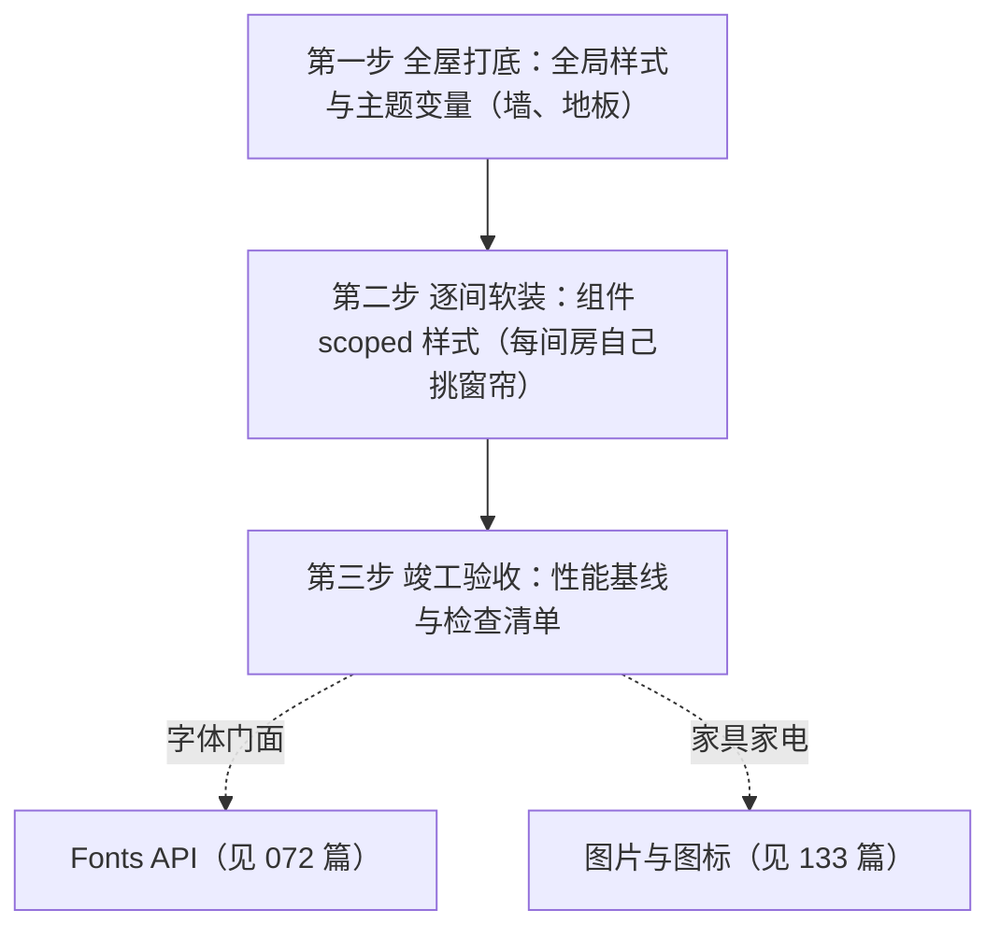

## 前置知识

- [Astro 岛屿架构与客户端指令](/astro/060-IslandsClientComponents)：建议先完成前一篇的学习；
- 了解 CSS 变量（`--var` / `var(--var)`）的基本写法。

> 分工声明：本系列原为一篇（样式、字体、图片混排），字体已拆至 [Fonts API](/astro/072-AstroFontsApi)，图片与图标已并入 [图片与图标资产](/astro/133-AstroImagesPipeline)。本篇只讲样式体系一件事：全局打底、scoped 软装、逃逸与全家桶选型。

## 知识点地图

- **知识类别**：Astro 样式体系——全局样式、组件 scoped 样式、样式逃逸与各样式方案对比，对应 Astro 官方文档 Styles & Scripts 指南。
- **解决什么问题**：多组件站点的样式冲突（两个组件都写 `.card` 互相污染）、主题不统一（各页面颜色各写各的）、以及「第三方内容/富文本吃不到样式」这三类日常问题。
- **什么时候用到**：任何页面与组件的样式编写；搭建全站主题（暗色模式、品牌色）；给 Markdown 渲染的富文本正文套样式。
- **本篇主线**：「装修」心智——全局样式是刷墙（统一、集中、只写一份），scoped 样式是每间房的窗帘（互不影响），`:global()` 是开在窗帘上的小窗（受控逃逸）。字体与图片两步装修已迁出本篇，按需跳读姊妹篇。
- **本篇不讲**：字体接入（见 [Fonts API](/astro/072-AstroFontsApi)）；图片优化与图标选型（见 [图片与图标资产](/astro/133-AstroImagesPipeline)）；组件 props 与 Slot 的结构化复用（见 040 篇）。

## 学习目标

- 能说清"全局样式管主题基调、组件 scoped 样式管细节"的分工，并解释 Astro 样式作用域隔离的实现原理；
- 能正确使用 `is:global` 与 `:global()` 处理逃逸场景，并说出两者的适用差别；
- 能在全家桶对比表（style 标签、全局文件、CSS Modules、Sass、Tailwind）中为项目做出样式方案选型；
- 能为一个真实站点按"打底、软装、验收"的顺序落地样式方案，并知道每一步的常见坑。

## 0. 开篇：装修一套房子，先打底还是先挂画？

想象你要装修一套房子。有经验的工长绝不会让你先挂装饰画、再选窗帘、最后才想起刷墙——那会让前面所有努力都作废。正确的顺序是：**先全屋打底（刷墙、铺地板、定水电），再逐间软装（挑家具、窗帘），最后才是点缀（挂画、摆件）**。这个顺序的背后是依赖关系：打底定了全屋的基调，局部要服从整体，点缀品不承担结构功能。

给 Astro 网站加样式，和装修是同一套逻辑。本篇按"装修流程"组织成一条完整的操作链：



每一步都可以独立使用，但理解了顺序，你才知道"全局样式应该放哪、为什么组件样式不会互相污染"。

## 1. 第一步，全屋打底：全局样式与主题变量

装修先刷墙。网站的"墙"是全局样式：字体基调、颜色体系、间距、浏览器默认样式重置（Reset）。它们决定全站的长相，所以必须**统一、集中、只写一份**。

### 1.1 用 CSS 变量定主题

主题类的内容（颜色、字号、间距）用 CSS 自定义属性（变量）定义在 `:root`，全站通过 `var(--xxx)` 引用。这样"改主题=改一个文件"，而不是全站搜索替换颜色值。

```css
/* src/styles/global.css */
:root {
  /* 品牌色系 */
  --color-primary: #2563eb;
  --color-primary-hover: #1d4ed8;
  --color-text: #1f2937;
  --color-text-muted: #6b7280;
  --color-bg: #ffffff;
  --color-border: #e5e7eb;
  /* 字体与圆角 */
  --font-sans: 'Inter', system-ui, sans-serif;
  --radius-md: 8px;
  /* 间距刻度 */
  --space-1: 0.25rem;
  --space-4: 1rem;
  --space-8: 2rem;
}

/* 最简单的 Reset：去掉默认外边距，统一行高 */
body {
  margin: 0;
  font-family: var(--font-sans);
  color: var(--color-text);
  line-height: 1.7;
  background: var(--color-bg);
}

/* 标题统一排版 */
h1, h2, h3, h4, h5, h6 {
  line-height: 1.25;
  margin: 0 0 var(--space-4) 0;
}
```

### 1.2 在哪里引入全局样式

全局样式**只在布局组件中引入一次**（推荐），Astro 构建时会对重复 import 做去重合并，不会出现重复代码：

```astro
---
// src/layouts/Layout.astro
import '../styles/global.css'
---
```

注意引入顺序的直观含义：全局样式先于页面内容输出，主题变量早于组件渲染生效。**不要在每个组件里都 import global.css**——虽然不会重复打包，但会让"全局样式在哪"变得难以维护。

### 1.3 为什么不用"全局选择器"乱写

很多新手习惯直接写 `div { ... }`、`p { ... }` 这类全局选择器。这等于给全屋只刷一种颜色：后续任何组件想有自己的样子，都得和全局规则"打架"（优先级之争），越改越乱。正确的分工是：**变量与 Reset 留在全局，组件细节一律走 scoped 样式**（下一步）。

## 2. 第二步，逐间软装：组件 scoped 样式

每间房可以挑自己的窗帘，但绝不能影响隔壁房间。Astro 的 `<style>` 标签天然就是"每间房的窗帘"——**默认作用域隔离（scoped）**。

### 2.1 基本写法

```astro
---
// src/components/Card.astro
---
<div class="card">
  <h2 class="title">卡片标题</h2>
  <p class="desc">卡片描述</p>
</div>

<style>
  .card {
    border: 1px solid var(--color-border);
    border-radius: var(--radius-md);
    padding: var(--space-4);
  }
  .title {
    margin: 0 0 var(--space-1) 0;
    font-size: 1.25rem;
    color: var(--color-primary);
  }
</style>
```

### 2.2 作用域隔离的原理：哈希属性

构建时，Astro 会给组件里的元素与选择器都加上一个唯一的哈希标记，例如：

```html
<!-- 构建后输出的 HTML -->
<div class="card" data-astro-cid-7f3k9a>
  <h2 class="title" data-astro-cid-7f3k9a>卡片标题</h2>
</div>
```

```css
/* 构建后输出的 CSS：选择器带上了属性标记 */
.card[data-astro-cid-7f3k9a] { ... }
.title[data-astro-cid-7f3k9a] { ... }
```

效果：就算另一个组件里也有一个 `.card`，两个选择器带不同的哈希，互不干扰。**删除组件时样式自动消失，没有样式泄漏，没有全局污染**。这就是"每间房的窗帘不影响隔壁"的实现细节。

### 2.3 需要"通向外面的样式"怎么办：is:global 与 :global()

两种写法作用相同，选择取决于你想表达的范围：

```astro
<!-- 方式一：整块样式全局化 -->
<style is:global>
  body { background: #f8fafc; }
</style>

<!-- 方式二：scoped 块内局部逃逸 -->
<style>
  .prose { max-width: 720px; margin: 0 auto; }
  /* 只让 .prose 内部的链接走全局规则 */
  .prose :global(a) { color: var(--color-primary); text-decoration: none; }
</style>
```

使用原则：**尽量用 `:global()` 缩小逃逸面**，把全局影响限制在一个范围内（如富文本正文 `.prose` 内的 `a` 标签），而不是整个 `<style>` 直接 `is:global`。逃逸面越小，越不容易踩到其他组件的样式。富文本场景是最典型的必逃逸区：Markdown 渲染出来的元素不带组件哈希，scoped 选择器够不着它们——给 `.prose` 容器套 `:global()` 子选择器是唯一正解。

### 2.4 全家桶横向对比

| 方案 | 写法 | 作用域 | 适用场景 |
| --- | --- | --- | --- |
| `<style>` | 组件内标签 | 自动 scoped | 组件局部样式（首选） |
| 全局样式文件 | `import './global.css'` | 全局 | 主题变量、Reset、字体基调 |
| `<style is:global>` | 显式声明 | 全局 | 覆盖第三方注入内容（如富文本正文） |
| CSS Modules | `*.module.css` | scoped（类名哈希） | React/Vue 等框架组件内部 |
| 预处理器 Sass/Less | `npm i sass` 后直接写 `lang="scss"` | 同左 | 需要嵌套、变量、mixin 的场景 |
| Tailwind | `npx astro add tailwind` | 按类名 | 工具类优先的项目 |

其中 Tailwind 与 Sass 属于"升级项"：Sass 只需 `npm install sass` 即可在 `<style lang="scss">` 中使用（Astro 开箱支持）；Tailwind 通过 `npx astro add tailwind` 一键集成——注意该命令自 Astro 5 起安装的是 Tailwind 4 的官方 **Vite 插件 `@tailwindcss/vite`**，旧的 `@astrojs/tailwind` 集成仅服务 Tailwind 3 兼容场景。

## 3. 竣工验收：性能基线与检查清单

装修完要验收，样式侧按下面两条基线自查：

第一，**主题走变量，细节走 scoped**：全局选择器只保留 Reset 与 `:root` 变量，组件样式全部 scoped，禁止滥用 `is:global`；

第二，**验收指标**：用浏览器 DevTools 的 Coverage 面板确认没有"未被使用的 CSS"大量堆积（scoped 样式天然裁剪到最小，若发现全局样式膨胀，优先怀疑 `is:global` 滥用）。字体与图片的验收基线分别在 [Fonts API](/astro/072-AstroFontsApi) 与 [图片与图标资产](/astro/133-AstroImagesPipeline) 各自的实践节。

## 4. 动手实践

任务：给一个三组件页面建立「主题变量 + scoped + 受控逃逸」的完整样式结构。

1. 建立全局样式：按 1.1 节写 global.css（色板与间距刻度可自定），只在 Layout 引入一次；然后在两个不同组件里各写一个 `.card` 类但样式不同，验证互不污染；
2. 修一个「样式够不着」现场：给页面加一段 Markdown 渲染的富文本（或任意动态 HTML），在组件里用 scoped 选择器给其中 `a` 标签换色，观察失效；再用 `.prose :global(a)` 修复，对比两种写法的产物 CSS（DevTools 里看选择器形态）；
3. 制造一次「逃逸泄漏」：把修复方案改成整块 `<style is:global> a { ... }`，打开页面里所有其他组件的链接样式，记录污染范围，再改回 `:global()` 收窄。

<details>
<summary>参考现象与解释（先自己试，再展开对照）</summary>

第 1 题：两个 `.card` 的规则在构建产物里分别带各自的 `data-astro-cid-*` 属性选择器，互不命中——这就是 2.2 节哈希机制的可视证据。

第 2 题：scoped 选择器失效是因为富文本元素没有该组件的哈希属性，选择器 `.prose a[data-astro-cid-x]` 匹配不到；`:global()` 版本的产物选择器退化为 `.prose[data-astro-cid-x] a`——哈希只留在容器上，内部元素放开，这正是「受控逃逸」的实现。

第 3 题：`is:global` 的 `a { ... }` 作用于全站所有链接（导航、页脚、卡片全部变色）——逃逸面从「一个容器」扩大到「整站」。规则：`is:global` 只留给真正全局的东西（如第三方组件的主题覆盖），内容域样式一律 `:global()` 收窄。

</details>

## 5. 常见错误与对策

| 常见错误 | 典型报错/现象 | 原因 | 解决办法 |
| --- | --- | --- | --- |
| 组件样式"串"到别的组件 | 某组件样式影响全站 | 误用了全局选择器或 `is:global` | 去掉 `is:global`，改用 scoped 选择器；需要外溢时用 `:global()` 收窄范围 |
| `import '../styles/global.css'` 重复引入 | 样式重复出现（通常无报错） | 在每个组件里都导入了全局样式 | 只在布局组件中引入一次，其余组件靠变量与 scoped 样式 |
| 富文本/Markdown 内容吃不到组件样式 | 正文链接、列表样式失效 | 动态渲染的元素没有组件哈希 | `.prose :global(...)` 受控逃逸（2.3 节） |
| 全局样式膨胀、Coverage 大量未用 CSS | 首屏 CSS 体积异常 | `is:global` 滥用或全局选择器堆砌 | 变量留全局、细节回 scoped；按第 3 节基线自查 |

字体与图片相关的常见错误（`@font-face` 404、图片放错目录等）分别在 [Fonts API](/astro/072-AstroFontsApi) 与 [图片与图标资产](/astro/133-AstroImagesPipeline) 的对策表里。

## 6. 一句话记忆

**"全局样式刷墙、scoped 样式软装：变量与 Reset 只写一份，组件细节各回各家；逃逸用 `:global()` 开小窗，不拿 `is:global` 拆整面墙。"**

（系列的另外两句在姊妹篇：字体是门面交给 Fonts API——见 072；图片交给 astro:assets——见 133。）

## 参考与致谢

本文 scoped 样式机制、`is:global`/`:global()` 语义与样式方案对比参考 Astro 官方文档（MIT 许可）整理改写。来源：https://docs.astro.build/en/guides/styling/
