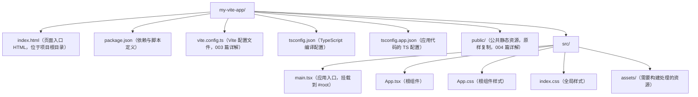
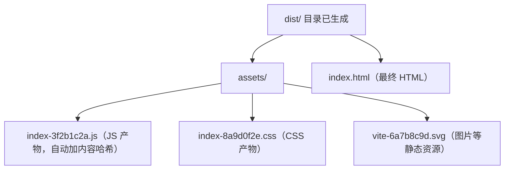

## 1. 写在前面：像第一次开火做饭一样开始

想象你第一次进厨房做饭。你不需要先成为大厨，只需要按步骤来：开火（点火）、热锅（预热）、下食材（倒入代码）、起锅（产出结果）。做饭最怕的不是"不会做"，而是**在错误的环节做错误的事**——比如菜还没熟就关火，或者油锅还没热就下菜。

跑通一个 Vite 项目也是如此。本文是一篇**操作向导**，不追求一次讲透所有原理，而是带你按 7 个步骤亲手跑通"创建项目 → 启动开发 → 修改页面 → 生产构建 → 本地预览"的完整流程。跟着做一遍，比读十遍理论有用。阅读本文前建议先通读 001 篇《Vite 构建工具概述》，了解基本概念；本系列采用 Vite 8（2026 年 3 月发布的最新大版本）。

## 2. 第 0 步：检查灶台——环境准备

做饭前要先确认炉子能点火。动手之前，请先确认环境满足两个条件：

| 环境项 | 要求 | 说明 |
| --- | --- | --- |
| Node.js | 20.19+ 或 22.12+ | Vite 8 要求较新的 Node 版本，用 `node -v` 检查 |
| 包管理器 | pnpm 9+ / npm 10+ / yarn 4+ | 本文统一使用 pnpm |

在终端中依次执行检查命令：

```bash
node -v        # 应输出 v20.19.0 或更高（如 v22.x）
pnpm -v        # 应输出 9.x 或更高；若提示不存在，先安装 Node 后执行 corepack enable
```

如果 `pnpm` 不可用（常见于 Windows 环境），安装 Node.js 之后执行一次 `corepack enable` 即可启用 Node 内置的 pnpm。

## 3. 第 1 步：点火——创建项目

使用官方脚手架 `create-vite`，一行命令即可创建项目。有两种方式：

```bash
# 方式一：交互式创建（推荐新手）
# 会依次提示输入项目名、选择框架与 TypeScript 选项
pnpm create vite my-vite-app

# 方式二：直接指定模板，跳过交互
pnpm create vite my-vite-app --template react-ts
```

官方支持的模板预设（create-vite 9.x）：

| JavaScript | TypeScript | 说明 |
| --- | --- | --- |
| vanilla | vanilla-ts | 纯原生 JavaScript/TypeScript，无框架 |
| vue | vue-ts | Vue 3 框架 |
| react / react-compiler | react-ts / react-compiler-ts | React 框架（compiler 为开启 React Compiler 的变体） |
| preact | preact-ts | 轻量级 React 兼容框架 |
| lit | lit-ts | Lit Web Components |
| svelte | svelte-ts | Svelte 框架 |
| solid | solid-ts | Solid 框架 |
| qwik | qwik-ts | Qwik 框架 |

讲解：`pnpm create vite` 会拉取官方模板代码到 `my-vite-app` 目录。如果希望在当前目录就地创建，可以用 `.` 作为项目名（`pnpm create vite .`）。本文以下操作以 `react-ts` 模板为例，但你完全可以选择 `vanilla` 或 `vue-ts`——核心步骤完全一致。

## 4. 第 2 步：热锅——安装依赖

进入项目并安装依赖：

```bash
cd my-vite-app
pnpm install
```

讲解：脚手架只生成项目骨架（源码 + 配置文件），第三方依赖需要单独安装。执行 `pnpm install` 后，终端会输出依赖解析与安装进度，完成后项目即可运行。此时可以打开编辑器（如 VS Code / Trae IDE）把项目目录加进来，方便后续编辑。

## 5. 第 3 步：认识厨房布局——项目目录结构

以 `react-ts` 模板为例，核心文件如下：



请特别注意：**`index.html` 位于项目根目录，而不是 `src` 内**。这是 Vite 与传统脚手架（如 Create React App）的重要差异。`index.html` 是整个应用的入口，其中通过 `<script type="module">` 引用源码入口：

```html
<!-- index.html（模板默认内容节选） -->
<!doctype html>
<html lang="zh-CN">
  <body>
    <div id="root"></div>
    <!-- type="module" 告诉浏览器：这是 ES 模块，按模块规范加载 -->
    <script type="module" src="/src/main.tsx"></script>
  </body>
</html>
```

讲解：`type="module"` 让浏览器以原生 ES Module 方式加载脚本。`src/main.tsx` 中再通过 `import` 递归引用其他模块，浏览器按需发起请求，Vite 的开发服务器会拦截并即时转换这些请求（原理详见 001 篇第 4 节）。

## 6. 第 4 步：下食材——启动开发服务器

```bash
pnpm dev
```

启动成功后，终端会输出类似下面的信息：

```text
  VITE v8.x.x  ready in 300 ms

  Local:   http://localhost:5173/
  Network: http://192.168.1.5:5173/
```

在浏览器打开 `http://localhost:5173/`，你会看到模板默认页面。此时做两件事：

1. **观察终端**：访问时终端会打印请求日志（如 `→ /src/main.tsx`），这就是"浏览器按需请求、Vite 逐个转换"的现场；
2. **观察端口**：如果 5173 被占用，Vite 会自动改用 5174、5175……无需手动处理。

```bash
# 其他常用启动选项
pnpm dev --port 3000     # 指定端口
pnpm dev --open          # 启动后自动打开浏览器
pnpm dev --host          # 允许局域网其他设备通过 IP 访问
```

## 7. 第 5 步：调口味——修改第一个页面

打开 `src/App.tsx`，替换为以下内容（JS 项目则对应编辑 `src/App.js`）：

```tsx
// src/App.tsx
import './App.css'

function App() {
  return (
    <div className="card">
      <h1>Hello Vite</h1>
      <p>保存文件后，浏览器会自动热更新，无需手动刷新。</p>
    </div>
  )
}

export default App
```

保存文件，然后观察浏览器：页面内容**即时更新**，且输入框内容、滚动位置等页面状态不会丢失——这正是 Vite 的 HMR（模块热替换）特性，其原理见 001 篇第 6 节，深入内容见 006 篇。

再做一个实验：把 `<h1>` 的文本改回来，再改一下 `src/App.css` 中的背景色，体会"改代码 → 保存 → 页面秒变"的开发节奏。

## 8. 第 6 步：起锅——生产构建

开发模式追求"快"，生产模式追求"优"。当你的应用开发完成准备上线时，执行：

```bash
pnpm build
```

构建完成后，终端会输出产物清单与体积报告：



讲解：`pnpm build` 调用 Rolldown（Vite 8 的统一打包引擎）对全部源码做打包、代码分割、压缩与 Tree Shaking，输出到 `dist/` 目录。文件名中的哈希基于内容生成——内容不变文件名不变，配合服务器缓存即可实现"内容更新后用户自动加载新版本"。

## 9. 第 7 步：试菜——本地预览构建产物

```bash
pnpm preview
```

讲解：`preview` 启动一个静态文件服务器（默认端口 4173）来模拟生产环境，专门用于**检查 build 产物是否正确**——资源路径、分包结果、CDN 部署效果等。它能帮你避免"本地正常、上线 404"的经典事故。它与 `dev` 的本质区别：dev 提供的是源码转换服务，preview 提供的是 `dist/` 的静态托管。

## 10. 三个核心命令总览

脚手架在 `package.json` 中预置了脚本，全部围绕三个命令展开：

```json
{
  "scripts": {
    "dev": "vite",
    "build": "vite build",
    "preview": "vite preview"
  }
}
```

| 命令 | 对应脚本 | 作用 | 端口 | 产物 |
| --- | --- | --- | --- | --- |
| `pnpm dev` | `vite` | 启动开发服务器（按需编译 + HMR） | 5173 | 无（内存中运行） |
| `pnpm build` | `vite build` | 生产构建（打包、压缩、优化） | 无 | `dist/` 目录 |
| `pnpm preview` | `vite preview` | 本地预览构建产物 | 4173 | 读取 `dist/` |

三者关系可以用一句话概括：**开发用 dev，上线前 build，验证产物用 preview**。这是 Vite 项目日常开发的黄金三步。

## 11. 为什么快：一次看懂 ESM 与依赖预构建

（详见 001 篇第 4-5 节，这里只做操作视角的速览。）

- **按需编译**：浏览器原生 ESM 支持让 dev server 只需转换"当前请求的文件"，冷启动与项目规模无关；
- **依赖预构建**：`node_modules` 中的依赖在启动时被 Rolldown 预合并为 ESM 并缓存到 `node_modules/.vite`，浏览器一次请求即可加载；
- **HMR**：只推送被修改模块的新代码，改动秒级生效。

排查问题时可以记住两个"重来"命令：

```bash
pnpm dev --force     # 强制重新预构建依赖（解决依赖缓存异常）
rm -rf node_modules/.vite   # Windows 下用 Remove-Item -Recurse -Force
pnpm dev             # 删除缓存目录后重启，效果同上
```

## 12. 常见错误与对策表

| 序号 | 报错/现象 | 原因 | 解决办法 |
| --- | --- | --- | --- |
| 1 | `'pnpm' 不是内部或外部命令` | pnpm 未启用（Windows 常见） | 安装 Node.js 后执行 `corepack enable` |
| 2 | 提示 Node 版本过低，创建或启动失败 | Node 版本低于 20.19+ / 22.12+ | 升级 Node 到受支持版本（建议 LTS 22.x） |
| 3 | 端口被占用 | 5173 已被其他进程使用 | 无需处理，Vite 会自动顺延端口；或 `pnpm dev --port 3000` 指定 |
| 4 | 编辑器报"找不到模块 react" | 依赖未安装或编辑器未重新加载 | 确认 `pnpm install` 成功；重启编辑器让 TS 服务重新加载 |
| 5 | 页面打不开 `http://localhost:5173/` | dev server 未启动成功，或浏览器代理设置异常 | 查看终端输出确认 `ready`；检查代理软件是否拦截 localhost |
| 6 | build 产物部署后白屏/404 | `base` 未按部署路径配置 | 在 `vite.config.ts` 设置 `base: '/子路径/'`，见 004 篇 |
| 7 | 模板默认内容太多 | 脚手架自带演示页面与 logo | 按需删除 `src` 下不需要的文件与 `public/vite.svg`，保持目录干净 |

## 14. 一句话记忆

**创建项目、安装依赖、`pnpm dev` 开发、`pnpm build` 上线、`pnpm preview` 验货——Vite 项目的日常就是这"三令五步"，而它的快来自浏览器原生 ESM 的按需加载**。
