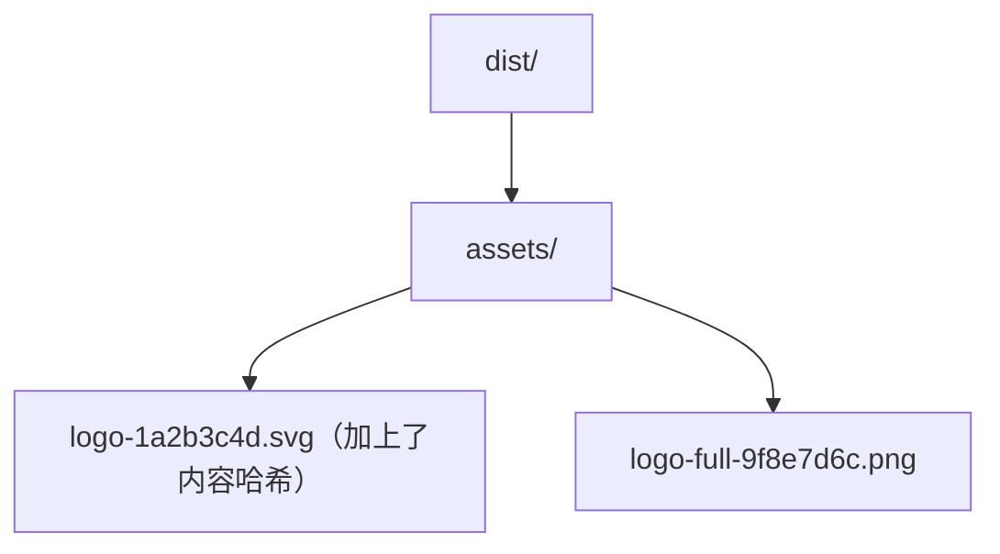
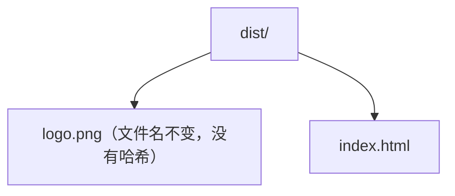

## 1. 从仓库货架管理说起

想象你是一家电商公司的仓库管理员。仓库里有两种货架：

- **A 类货架（加工区）**：商品进来后要重新贴标、称重、打包，贴上新的批次编号，再发往门店。好处是每件商品都有唯一追踪码，门店退货时能精确知道是哪一批货。
- **B 类货架（整存区）**：一些商品原箱不动、原样摆放，门店要什么就直接按原箱号取走。好处是省事，但无法做精细化的批次管理。

Vite 里的静态资源（图片、字体、SVG、JSON 等）也分两种存放方式，对应这两类货架：

| 货架 | 对应 Vite 位置 | 处理方式 |
| --- | --- | --- |
| A 类（加工区） | `src/` 下任意位置，用 `import` 引入 | 参与构建：加内容哈希、可压缩、可内联、可被插件处理 |
| B 类（整存区） | `public/` 目录 | 原样复制，不做任何加工 |

本文采用**场景驱动**的写法：跟随"一个 Logo 从设计师交付到网站上线"的完整旅程，把两条路径、各种特殊后缀、字体与 favicon、部署路径（base）全部串起来。跟着走一遍，你就能彻底搞懂"图片该放哪、路径该怎么写"。

## 2. 场景开幕：设计师交付了一个 Logo

设计师发来两个文件：

```text
logo.svg        # 网站的 Logo 图标
logo-full.png   # 首页横幅大图（约 2MB）
```

现在你是前端工程师，要把它们放进网站。请记住两条黄金法则，贯穿全文：

```text
法则一：凡是由代码引用的资源（组件里用、CSS 背景图用）——放 src/，用 import 引入
法则二：凡是不被代码引用、需要保持原名的资源（favicon、robots.txt）——放 public/
```

## 3. 场景一：把 Logo 交给"加工区"（import 引入）

把两个文件放进 `src/assets/`，然后在代码中引入：

```ts
// src/components/Header.tsx
import logo from '../assets/logo.svg'
import logoFull from '../assets/logo-full.png'

// import 返回的是"处理后的 URL 字符串"
console.log(logo)      // 开发时：/src/assets/logo.svg
console.log(logoFull)  // 开发时：/src/assets/logo-full.png
```

```tsx
// 在 React 组件中直接用作 img 的 src
import logo from '../assets/logo.svg'

export function Header() {
  return (
    <header>
      
    </header>
  )
}
```

生产构建时，这两个文件会怎样？看 `pnpm build` 的输出：



讲解：`import` 引入的静态资源会**参与构建**：自动追加内容哈希（内容不变文件名不变，配合服务器 `Cache-Control: immutable` 可实现永久缓存；内容一改，哈希变化，浏览器自动加载新文件），小于阈值（默认 4096 字节，约 4KB）的还会被**内联为 base64** 直接嵌入代码，减少一次网络请求。Vite 自动识别常见类型：图片（png/jpg/gif/svg/webp/avif）、字体（woff/woff2/eot/ttf/otf）、媒体（mp4/webm/ogg/mp3/wav）以及 JSON。

CSS 中的 `url()` 引用走同样的管线：

```css
/* src/components/Hero.css */
.hero {
  /* 相对路径，构建时同样加哈希、可内联 */
  background-image: url('../assets/bg.svg');
  background-size: cover;
}
```

## 4. 场景二：误入"整存区"（public 目录）

假如你把 Logo 放进了 `public/` 目录：

```text
public/
└── logo.png        # 放进了 public
```

那么它构建后会**原样复制**到产物根目录，不做任何处理：



引用方式必须是**根绝对路径**（以 `/` 开头，不能是相对路径）：

```html
<!-- index.html 或任何代码中 -->

```

```ts
// JS 中也用绝对路径字符串，不能 import（public 中的文件不支持 import）
const img = document.createElement('img')
img.src = '/logo.png'
```

### public 目录适合放什么

| 场景 | 示例 | 为什么 |
| --- | --- | --- |
| 不需要加工的文件 | `robots.txt`、`favicon.ico`、`site.webmanifest` | 原样提供，无需哈希 |
| 必须保持原名的文件 | 第三方要求固定路径的脚本/验证文件 | 文件名不能变 |
| 不想走 import 管线的文件 | 少数历史遗留资源 | 直接取 URL |

官方文档的建议是：**除非特别需要 public 提供的保证（原名、不被引用、直接取 URL），否则优先使用 import 引入资源**——因为加工区能拿到哈希缓存、内联、按需加载等全部优化能力。若项目需要改 public 目录名，可用 `publicDir` 配置：

```ts
// vite.config.ts
export default defineConfig({
  publicDir: 'static',   // 把 public 目录改名为 static
})
```

## 5. 场景三：Logo 需要用"特殊工艺"加工（特殊后缀）

Vite 提供几个"加工工艺"后缀，用 `?` 附加在导入路径后，精准控制单个文件的处理方式：

```ts
// ?url：强制按 URL 处理（不参与其他转换）
// 适合导入 Vite 不认识的自定义格式，或 Web Worker 脚本
import workletUrl from './border-worklet.js?url'

// ?inline：强制转成 base64 字符串内联进代码
// 适合小体积、高频使用的资源，减少请求数
import tinyIcon from './icon.svg?inline'

// ?no-inline：强制不内联（即使小于 4KB 也生成独立文件）
import bigSvg from './bg.svg?no-inline'

// ?raw：把文件内容读成原始字符串
// 适合 GLSL 着色器、HTML 片段等文本资源
import shaderCode from './shader.glsl?raw'

// ?worker：把脚本作为 Web Worker 导入（构建时会单独分包）
import Worker from './data-processor.js?worker'
const worker = new Worker()
```

讲解：默认规则是"小于 4KB 内联、大于 4KB 生成文件"，可通过 `build.assetsInlineLimit` 调整阈值；`?inline` / `?no-inline` 则是在单文件层面**覆盖**默认规则，优先级最高。`?url` 常用于 Houdini Paint Worklet、Web Worker 等必须拿到真实文件地址的场景。

```ts
// vite.config.ts：调整内联阈值（单位：字节）
export default defineConfig({
  build: {
    assetsInlineLimit: 8192,   // 小于 8KB 的资源内联为 base64
  },
})
```

## 6. 场景四：Logo 是动态拼接的（动态路径）

当图片路径无法静态写死（比如图标名由变量决定）时，`import` 就无能为力了。用原生 `new URL(url, import.meta.url)` 方案：

```ts
// 动态生成图片 URL（此模式 Vite 会自动处理生产构建）
function getIconUrl(name: string) {
  // import.meta.url 是当前模块的 URL，new URL 基于它解析相对路径
  return new URL(`./icons/${name}.png`, import.meta.url).href
}

// 使用：getIconUrl('home') -> /src/icons/home.png（开发时）
```

讲解：`import.meta.url` 是 ESM 的原生功能，暴露当前模块的 URL；与原生 `URL` 构造器结合即可用相对路径解析静态资源。开发时浏览器原生支持这段代码，Vite 无需处理；生产构建时 Vite 会扫描并生成对应资源。注意：此模式不支持"子目录外的任意路径"（如 `../` 向上穿越或完全动态的任意文件），路径需可被静态分析。

另一种批量场景用 `import.meta.glob`（例如目录下所有多语言文件、所有路由组件）：

```ts
// 批量导入 src/pages 下所有 .ts 模块（懒加载）
const modules = import.meta.glob('./pages/*.ts')

// 遍历执行（modules[path] 是返回 Promise 的加载函数）
for (const path in modules) {
  modules[path]().then((mod) => {
    console.log('已加载', path, mod.default)
  })
}

// 需要同步导入时加 eager: true
const syncModules = import.meta.glob('./locales/*.json', { eager: true })
```

## 7. 场景五：Logo 的兄弟——SVG 图标库与字体

### SVG 的三种玩法

| 方式 | 代码 | 适用场景 |
| --- | --- | --- |
| import 引入 | `import icon from './icon.svg'` | 常规图标，构建时哈希 + 内联 |
| `?inline` 内联 | `import icon from './icon.svg?inline'` | 高频小图标，避免请求 |
| 直接写进组件 | `<svg>...</svg>` | 需要改颜色/动画的图标 |

讲解：SVG 是文本格式，天然适合内联。如果图标需要跟随主题色变化（如 hover 变色），"直接写在组件里的 JSX SVG"是最灵活的方式（可继承 CSS 颜色）；静态图标用 import 即可。注意：在 JS 中手动拼接 SVG 的 `url()` 背景图时，变量要加双引号：`background: url("${imgUrl}")`。

### 字体加载

字体推荐使用 woff2 格式（体积最小、兼容现代浏览器），放 `src/assets/fonts/` 并通过 CSS `@font-face` 引入：

```css
/* src/styles/fonts.css */
@font-face {
  font-family: 'FANDEX-Font';
  /* Vite 自动处理 url()，构建时加哈希并输出到 assets/ */
  src: url('../assets/fonts/fandex-regular.woff2') format('woff2');
  font-weight: 400;
  font-display: swap;   /* 字体加载期间先用系统字体占位，避免白屏 */
}

body {
  font-family: 'FANDEX-Font', system-ui, sans-serif;
}
```

```ts
// 入口引入字体样式
import './styles/fonts.css'
```

讲解：`font-display: swap` 是字体体验的关键——字体未下载完成时先用后备字体渲染文本，下载完成后无缝切换，避免"文字不可见"的白屏期。中文站点的字体文件通常较大，建议使用字体子集化（按用到的字符裁剪）或 CDN 托管。

## 8. 场景六：favicon 与 index.html 的静态资源

favicon（浏览器标签页小图标）通常不需要构建处理，放在 `public/` 并用绝对路径引用：

```text
public/
└── favicon.svg
```

```html
<!-- index.html -->
<!doctype html>
<html lang="zh-CN">
  <head>
    <link rel="icon" type="image/svg+xml" href="/favicon.svg" />
    <title>FANDEX 编程学习平台</title>
  </head>
</html>
```

讲解：favicon、`robots.txt`、`manifest.webmanifest` 这类"与代码无关、必须保持原名"的文件，正是 public 目录的标准用法。`index.html` 本身位于项目根目录，是构建的 HTML 入口，其中的资源引用（`<script>`、`<link>`、``）都会被 Vite 扫描处理。

## 9. 场景七：上线部署——base 与资源路径

Logo 终于要上线了。此时出现最后一个关键问题：**网站部署在什么路径？** 这由 `base` 配置决定，它控制所有资源引用的公共前缀：

```ts
// vite.config.ts
export default defineConfig({
  // 部署到域名根路径（默认值）
  base: '/',
  // 部署到 https://example.com/fandex/ 子路径
  // base: '/fandex/',
  // 部署到 CDN（资源全部走 CDN 域名）
  // base: 'https://cdn.example.com/fandex/',
})
```

| 部署场景 | base 取值 | 产物中资源路径 |
| --- | --- | --- |
| 域名根路径 | `/` | `/assets/app-xxx.js` |
| 子路径 | `/fandex/` | `/fandex/assets/app-xxx.js` |
| CDN 绝对地址 | `https://cdn.xxx.com/fandex/` | `https://cdn.xxx.com/fandex/assets/...` |

讲解：`base` 必须是绝对路径或完整 URL，且**以 `/` 结尾**。import 引入的资源会自动拼接 base；`public/` 中的文件按绝对路径（`/favicon.svg`）引用时，Vite 构建时也会自动拼上 base。**不要**在源码里手动拼接 base 前缀，否则会双写前缀（如 `/fandex/fandex/assets/...`）。子路径部署是最常见的 404 事故来源：部署在 `/repo-name/` 下却用默认 `base: '/'`，资源全部 404。

## 10. 常见错误与对策表

| 序号 | 报错/现象 | 原因 | 解决办法 |
| --- | --- | --- | --- |
| 1 | `Cannot find module './assets/logo.png'` 或类型报错 | TypeScript 不识别图片导入类型 | 确认 `src/vite-env.d.ts` 中包含 `/// <reference types="vite/client" />` |
| 2 | 尝试 import `public/` 中的文件报错 | public 目录不支持 import | 移到 `src/assets/` 用 import；或继续用绝对路径 `/xxx.png` 引用 |
| 3 | 部署后资源全部 404 | `base` 与部署路径不匹配（子路径部署未配 base） | 设置 `base: '/子路径/'`，重新构建 |
| 4 | public 文件路径变成双前缀（如 `/fandex/fandex/xxx`） | 源码手动拼接了 base 前缀 | public 文件用 `/xxx.png` 引用即可，Vite 自动拼接 base |
| 5 | 大图（如 2MB 横幅）拖慢首屏 | 资源过大未做压缩/懒加载 | 图片走 `src/assets` + import 后用插件压缩，或转 WebP/AVIF、用 CDN |
| 6 | 动态拼接路径拿不到图片 | 字符串变量路径无法被静态分析 | 改用 `new URL(name, import.meta.url)` 或 `import.meta.glob` |
| 7 | 字体加载导致文字闪烁/白屏 | 未设置 `font-display` | `@font-face` 加 `font-display: swap`，并考虑字体子集化 |

## 12. 一句话记忆

**图片字体走 `src/` 的 import（有哈希、可内联、可优化），`favicon`、`robots.txt` 这类"不加工、要原名"的走 `public/`，部署子路径就设 `base`——资源路径问题的答案，永远在这三句话里**。
