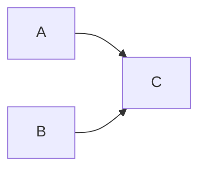

## 1. 从"指路"说起：为什么需要 workspace 协议

### 1.1 一个联调场景

假设 `@fandex/web`（应用）要使用 `@fandex/utils`（同仓库的共享库）。你第一反应是写：

```json
{
  "dependencies": {
    "@fandex/utils": "^1.0.0"
  }
}
```

**问题来了**：pnpm 看到 `^1.0.0`，会去 npm registry 查找 `@fandex/utils@^1.0.0`。如果这个包从未发布，安装直接失败；即便发布过，版本也可能与本地源码不同步——你改了 utils 的代码，web 引用的却是 registry 上的旧版。

**我们需要的是**："web 引用仓库里那个 utils，而不是 registry 上的 utils"。这就是 `workspace:` 协议存在的意义。

### 1.2 什么是 workspace 协议

**`workspace:` 是 pnpm（以及 yarn berry）在 package.json 中声明"依赖本仓库内另一个包"的专用协议**。它让包之间的引用在开发时解析到**本地源码目录**，而不是去 npm registry 下载。

## 2. 协议形式与语义

| 形式 | 语义 | 开发时解析 | 发布时转换 |
| ---- | ---- | ---- | ---- |
| `workspace:*` | 任意本地版本 | 本地包 | 替换为当前精确版本号，如 1.2.3 |
| `workspace:^` | 兼容范围内最新 | 本地包 | 替换为 `^1.2.3` |
| `workspace:~` | 补丁范围内最新 | 本地包 | 替换为 `~1.2.3` |

```json
{
  "dependencies": {
    "@fandex/utils": "workspace:*",
    "@fandex/tokens": "workspace:^"
  }
}
```

**三种形式的异同**：

- **开发阶段**：三者行为一致，都解析到本地包
- **发布之后**：`workspace:*` 变成精确版本 `1.2.3`；`workspace:^` 变成 `^1.2.3`（允许小版本升级）；`workspace:~` 变成 `~1.2.3`（只允许补丁升级）
- **最常用**：`workspace:*`，表示"只要本地有这个包就用它"

## 3. 本地包引用实战

### 3.1 添加内部依赖

```bash
# 语法：pnpm add <包名> --filter <目标包>
pnpm add @fandex/utils --filter @fandex/web
```

pnpm 检测到 `@fandex/utils` 是工作空间内的包，会自动写入 `workspace:*`，并把 node_modules 中对应目录符号链接到本地源码，改动即时生效。

### 3.2 引用共享包代码

```text
packages/
  utils/                 # @fandex/utils，导出工具函数
    package.json
    src/index.ts
  web/                   # @fandex/web，引用 utils
    package.json
    src/main.ts
```

```ts
// packages/web/src/main.ts：直接 import 共享包源码
import { formatId } from '@fandex/utils';
```

**要点**：

- 无需构建 utils 即可被 web 引用——只要构建工具（Vite、tsc）能解析符号链接到源码即可
- 若共享包需要先编译（如发布 CommonJS），则需要 `--topological build` 保证依赖先构建

### 3.3 peerDependencies 场景

库类包（被他人安装的包）用 workspace 协议引用兄弟包时，更推荐放在 `peerDependencies` 中，避免打包进自己的产物，由使用者提供实现：

```json
{
  "peerDependencies": {
    "react": "^19.0.0"
  },
  "devDependencies": {
    "react": "workspace:*"
  }
}
```

**解读**：peer 依赖声明"我要求对方环境里有 react"；devDependencies 中的 workspace 引用用于本地开发测试。

## 4. 发布时版本转换

运行 `pnpm publish` 或 `pnpm pack` 时，pnpm 会把 package.json 中的 `workspace:` 协议替换为实际版本：

```json
// 发布前（仓库内）
"@fandex/utils": "workspace:*"
```

```json
// 发布后（registry 上的产物）
"@fandex/utils": "1.2.3"
```

**这套机制的价值**：

- **开发时**：用本地（改完即生效）
- **发布后**：用真实版本（消费者可正常安装）
- **转换只发生在发布产物中，仓库内文件不会被改写**
- 消费者用 npm/yarn/pnpm 都能正常解析（因为是标准语义化版本）

## 5. 内部依赖与幽灵依赖

工作空间包之间同样遵循严格隔离（见 002 篇）：web 引用 utils，但 **utils 依赖的 lodash 对 web 不可见**。web 若直接 import lodash，必须在自己的 package.json 中显式声明：

```bash
# 正确做法：谁使用谁声明
pnpm add lodash --filter @fandex/web
```

**关键认知**：包间依赖是"代码依赖"与"依赖关系"两层。

- 即便 utils 被链接到 web 的 node_modules（代码依赖成立）
- utils 的依赖树也不会向 web 暴露（依赖关系不成立）
- 保持每个包依赖自包含，是避免 Monorepo 幽灵依赖的关键

## 6. 常见问题与陷阱

### 6.1 循环依赖

**现象**：A 依赖 B、B 依赖 A，拓扑构建无法排序。

**解决**：重新分层，抽取共同依赖到更底层的 C：



### 6.2 误用 file: 协议

```json
// 错误：file: 是复制/链接目录的快照语义
"@fandex/utils": "file:../utils"
```

**问题**：

- `file:` 发布时不会转换版本
- 会破坏符号链接结构（按目录快照处理）

**正确做法**：内部引用一律使用 `workspace:`。

### 6.3 版本不一致告警

多个包声明了不同版本的同一共享包：

```bash
# 排查来源
pnpm why <包名>
```

再用 catalog 统一（见 005 篇）。

### 6.4 共享包改了不生效

**现象**：改了 utils 源码，web 里没反应。

**可能原因**：

- web 的构建工具没有解析符号链接到源码（需要配置 alias）
- 共享包需要先构建（tsc 输出 dist），web 引用的是 dist 而非 src
- 缓存未清除

**排查**：先确认 web 的 import 路径指向哪里（源码 or dist），再检查构建配置。
