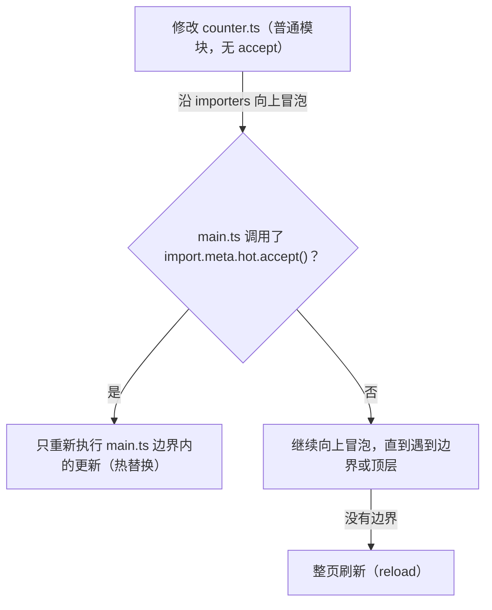

## 知识点地图

- **知识类别**：Vite HMR（Hot Module Replacement，模块热替换）——原理机制与 `import.meta.hot` 手写 API，对应 vite.dev 的「Features: HMR」与「API: import.meta.hot」章节。
- **解决什么问题**：改一行代码就要整页刷新，输入框内容、滚动位置、弹窗状态全部丢失；框架项目的组件热更新是插件给的，而工具函数、状态库、JSON 资源想「热起来」必须自己声明热更新边界。理解机制才能解释「为什么这次变成整页刷新了」。
- **什么时候用到**：排查「保存后页面闪一下（退化为整页刷新）」；给自研模块/本地数据文件接热更新；读懂脚手架里 `if (import.meta.hot)` 的代码；配置 WebSocket 被代理或内网拦截时的 HMR 连接。
- **本篇不讲**：dev server 本身的启动、端口、代理配置（见 [开发服务器与代理](/vite/070-DevServerAndProxy)）；依赖预构建（见 [依赖预构建与 optimizeDeps](/vite/065-DepPrebundlingOptimizeDeps)）。

预计 35 到 50 分钟。

## 1. 一个类比：餐厅后厨的"尝菜"

想象你开了一家餐厅。客人点了一桌菜，如果每次厨师调整一道菜的咸淡，都要把**整桌菜**重新端出去，客人的体验会非常糟糕。真正的大厨是**在后厨先尝一口**：哪道菜咸了，只回锅重做那一道，其他菜原封不动，客人正在进行的交谈也不被打断。

Vite 开发服务器里的 HMR（Hot Module Replacement，模块热替换）干的正是这件事：

- **你写的代码 = 后厨的菜**
- **浏览器里的页面 = 客人的餐桌**
- **HMR = 后厨尝菜**：哪一行代码改了，只把"那一道菜"（那一个模块）端回后厨重做，再送回去
- **整页刷新 = 把整桌菜撤掉重上**：页面状态（输入框内容、滚动位置、弹窗）全部丢失

如果你给手机换过电池，对这个概念会更有体感：换电池是"模块级替换"，手机不需要重启；而"整页刷新"相当于关机再开机。Vite 的目标，就是让你在开发时永远只"换电池"，不"关机重启"。

## 2. 初体验：改一行代码，页面瞬间更新

先不聊原理，动手体验一次。用《Vite 快速上手与项目结构》的方式创建一个 Vite 项目并启动：

```bash
# 创建项目（以 vanilla-ts 模板为例）
pnpm create vite my-hmr-demo --template vanilla-ts
cd my-hmr-demo
pnpm install
pnpm dev
```

浏览器打开 `http://localhost:5173`，然后修改 `src/main.ts` 中的任意一行文本，保存。你会看到：

```text
终端输出：
[vite] hmr update /src/main.ts
页面表现：内容立即变化，页面没有闪烁、没有重新加载
```

此时打开浏览器开发者工具的 Network 面板，切到 WS（WebSocket）标签，可以看到一条条类似下面的消息：

```json
{ "type": "update", "updates": [{ "type": "js-update", "path": "/src/main.ts" }] }
```

这就是 HMR 的全部"魔法"入口：**文件一保存，一条 WebSocket 消息就从服务器推到了浏览器**。接下来我们一层层拆开，看看消息发出前后到底发生了什么。

## 3. HMR 原理：从"尝菜"到"换菜"

### 3.1 三个关键角色

HMR 能成立，靠的是三个角色各司其职：

```text
1. 文件监听器（chokidar）
   监听磁盘上的文件变化，一保存就触发

2. 模块图（ModuleGraph）
   记录"谁 import 了谁"的依赖关系，决定影响范围

3. WebSocket 通道
   服务器与浏览器之间的"对讲机"，负责推送更新消息
```

### 3.2 模块图：谁依赖谁

服务器内部维护着一张"模块关系网"。Vite 用 `ModuleGraph` 数据结构保存四类映射：

```text
urlToModuleMap      按请求 URL 找模块（如 "/src/main.ts?v=123"）
idToModuleMap       按解析后的模块 ID 找模块（绝对路径）
fileToModulesMap    按文件路径找模块（一个文件可能产生多个模块，如 .module.css）
etagToModuleMap     按 ETag 找模块（用于协商缓存，避免重复转换）
```

每个模块节点（ModuleNode）记录两条方向的边：

```text
importedModules  指向"这个模块 import 了谁"（向下依赖）
importers        指向"谁 import 了这个模块"（向上引用）
```

这两条边是 HMR 的核心。**文件变化时，Vite 沿着 `importers` 向上走**，寻找"愿意接受热更新"的边界；找到就只更新边界之下的模块，找不到就整页刷新。由于只向上走有限的层数，HMR 的耗时取决于模块深度（O(深度)）而不是项目总模块数（O(总数)），所以项目再大也能保持即时。

### 3.3 热替换 vs 整页刷新：accept 边界

"能不能热替换"取决于模块是否声明了"我接受热更新"。Vite 内部用 `isSelfAccepting`（模块自己调用了 `import.meta.hot.accept()`）和 `acceptedHmrDeps`（声明接受了哪些依赖的更新）两个标记来判断：



各类型模块的默认更新方式：

| 模块类型 | 更新方式 | 原因 |
| --- | --- | --- |
| CSS / SCSS | 样式热替换，不刷新 | 浏览器直接替换 `<link>` 标签 |
| React / Vue 组件 | 组件级热更新，状态保留 | 框架插件提供 Fast Refresh |
| 普通 JS 模块（无 accept） | 递归更新依赖它的模块，必要时整页刷新 | 没有声明更新边界 |

### 3.4 完整更新流程

把以上串起来，一次保存动作的完整链路是：

1. 你保存文件
2. chokidar 监听到文件变化
3. 服务器在 ModuleGraph 中定位受影响的模块并使其失效
4. 服务器沿 importers 向上寻找 accept 边界，计算出"更新范围"
5. 服务器通过 WebSocket 推送 { type: 'update', updates: [...] } 消息
6. 浏览器端 @vite/client 收到消息
7. 浏览器用 import() 以 "原路径?t=时间戳" 重新拉取模块（时间戳用于绕过浏览器缓存）
8. 执行对应模块的更新逻辑（React Fast Refresh / Vue 重渲染 / 你的 accept 回调）
9. 页面其余部分原封不动

注意第 7 步：浏览器重新加载模块时在 URL 后面加了时间戳参数（如 `main.ts?t=1785700000000`），这是为了防止浏览器缓存机制拦截到旧版本代码。

## 4. HMR API：import.meta.hot

框架项目里，React/Vue 插件的 HMR 是开箱即用的。但如果你在写工具函数、状态库、原生 JS 模块，想让它们也"热起来"，就需要手动接入 HMR API。

### 4.1 核心 API 一览

| API | 作用 |
| --- | --- |
| `import.meta.hot.accept(deps?, cb)` | 接受自身或指定依赖的热更新，声明"热更新边界" |
| `import.meta.hot.dispose(cb)` | 模块被替换前清理副作用（定时器、事件监听、全局变量） |
| `import.meta.hot.prune(cb)` | 模块从页面中消失（不再被任何模块引用）时清理副作用 |
| `import.meta.hot.invalidate(msg?)` | 使当前模块失效，强制走整页刷新 |
| `import.meta.hot.data` | 跨热更新保存数据的容器，状态在替换前后共享 |

### 4.2 完整示例一：可热更新的计数器

```ts
// counter.ts
// 需求：页面上的计数器在热更新后继续累加，而不是从 0 开始
let count = 0

// 从上一次热更新的 data 中恢复状态（首次加载时没有）
if (import.meta.hot && import.meta.hot.data.count !== undefined) {
  count = import.meta.hot.data.count
}

export function inc() {
  return ++count
}
export function getCount() {
  return count
}

// 声明：本模块接受热更新
if (import.meta.hot) {
  // 模块被替换前执行：把当前状态存进 data，留给新模块
  import.meta.hot.dispose(() => {
    import.meta.hot.data.count = count
  })

  // 新模块加载完成后的回调（可选，用于触发页面重新渲染）
  import.meta.hot.accept((newModule) => {
    if (newModule) {
      console.log('counter.ts 已热更新，当前计数：', newModule.getCount())
    }
  })
}
```

讲解：`dispose` 里保存状态，`accept` 回调里重新渲染——这是手写 HMR 的标准套路。`import.meta.hot.data` 在旧模块与新模块之间共享同一个对象，所以状态能"接力"。

### 4.3 完整示例二：清理定时器防泄漏

```ts
// timer.ts
// 需求：热更新时旧的定时器必须清掉，否则会出现多个定时器叠加
let seconds = 0

const timer = setInterval(() => {
  seconds++
  console.log(`已运行 ${seconds} 秒`)
}, 1000)

if (import.meta.hot) {
  // 每次热更新前清理旧定时器，防止内存泄漏和重复输出
  import.meta.hot.dispose(() => {
    clearInterval(timer)
    console.log('旧定时器已清理')
  })
}
```

### 4.4 三个容易踩的规则

1. **`accept()` 必须是字面量调用**。Vite 通过静态分析源码判断模块是否可热更新，`import.meta.hot.accept (`（带空格）或把调用包进函数再导出，都可能不被识别。
2. **`hot.data` 不能被重新赋值**。`import.meta.hot.data = {}` 是无效的，应修改其属性：`import.meta.hot.data.count = 1`。
3. **生产环境没有 `import.meta.hot`**。所有 HMR 代码必须包在 `if (import.meta.hot)` 里，这样生产构建时能被 tree-shaking 整段删掉。

## 5. forwardConsole：日志转发

Vite 8 新增的 `server.forwardConsole` 会把**浏览器控制台输出与未捕获错误转发到终端**，开发调试时不用在浏览器和终端之间来回切换。它的取值是布尔值或对象，默认行为是"auto"：检测到 AI 编码代理接入时自动开启，否则关闭：

```ts
// vite.config.ts
export default defineConfig({
  server: {
    // boolean | { unhandledErrors?: boolean, logLevels?: ('error'|'warn'|'info'|'log'|'debug')[] }
    // true：转发未捕获错误 + console.error / console.warn
    // 对象：按需选择转发哪些错误与日志级别
    // false / 省略：默认关闭（检测到编码代理时自动开启）
    forwardConsole: true,
  },
})
```

典型场景：移动端真机调试、iframe 内日志、SSR 场景——这些情况下 DevTools 不方便打开，日志直接看终端最省事；编码代理（AI 结对）场景下 Vite 会自动开启，让代理直接"看到"浏览器报错。觉得刷屏就显式设为 `false`。

## 6. 工程场景三：给本地 i18n JSON 做热更新

真实背景：国际化项目的文案放在 `locales/zh.json` 里，改一个错别字要整页刷新、再手动点回出问题的页面才能看到效果。用 `accept` 的依赖版本 API 让字典文件独立热更新：

```ts
// src/i18n.ts
import zh from './locales/zh.json'

let dict: Record<string, string> = zh

export function t(key: string): string {
  return dict[key] ?? key
}

// 扫描所有 data-i18n 属性，用当前字典替换文本
export function applyI18n(root: ParentNode = document) {
  root.querySelectorAll<HTMLElement>('[data-i18n]').forEach((el) => {
    el.textContent = t(el.dataset.i18n as string)
  })
}

if (import.meta.hot) {
  // 关键：accept 的第一个参数指定"我接受谁的更新"
  // zh.json 变化时只执行回调，i18n.ts 自身不重新执行，页面不刷新
  import.meta.hot.accept('./locales/zh.json', (newZh) => {
    if (!newZh) return
    dict = (newZh as { default: Record<string, string> }).default
    applyI18n() // 新字典生效后，立即刷新页面上已渲染的文案
    console.log('[i18n] 字典已热更新')
  })
}
```

逐段解释：

- **`accept('./locales/zh.json', cb)` 与 `accept(cb)` 是两个重载**：前者是「依赖更新」模式——只声明接受这个依赖的变化，`i18n.ts` 本身不重新执行；后者是「自接受」模式——模块整体重跑。字典场景用依赖模式更稳：`i18n.ts` 的顶层副作用（如果有）不会反复执行；
- 回调参数 `newZh` 是重新 import 的新模块对象，JSON 模块的导出挂在 `default` 上。**不判空直接解构**会在模块更新失败（如 JSON 语法写坏）时抛出二次异常，Vite 会把这种情况升级为整页刷新——判空是为了优雅降级；
- `applyI18n()` 是「热更新后的重渲染」：HMR 只负责把新代码/新数据送进浏览器，**界面上的旧内容不会自动变**，需要你的 accept 回调主动刷一遍 DOM。这与 4.2 计数器示例里 accept 回调中重新渲染是同一个套路；
- `main.ts` 里正常 `import { applyI18n } from './i18n'` 并在启动时调用一次即可。此后改 `zh.json` 保存，页面上所有文案瞬时更新、输入框焦点与路由状态原封不动；
- 换成默认写法（不写 accept）会发生什么：zh.json 是普通 JSON 模块、无 accept 边界，更新沿 importers 冒泡——`i18n.ts` 重跑、`main.ts` 重跑，直到入口触发整页刷新，改一个错别字的代价回到原点。

## 7. 动手实践：亲手造一次 HMR 边界

HMR 的九步链路看懂不难，难点是「accept 边界」「副作用清理」「状态接力」这三个概念的体感。以下任务在一个干净的 Vite 原生 TS 项目里完成（`pnpm create vite` 选 vanilla-ts），合计约 45 分钟。

**任务一：先制造「整页刷新」的现场，再收拢边界（约 15 分钟）**

写一个 `src/state.ts`，顶层声明 `export let appState = { clicks: 0 }`，在 `main.ts` 里渲染点击次数并给按钮绑定点击事件。启动 dev server，先连点按钮积累几次点击，然后修改 `state.ts`（比如给对象加一个字段）并保存，观察：页面是否整页刷新、点击数是否归零。

提示：没有 accept 边界时，更新会沿 importers 一路冒泡到入口模块，入口的变更 Vite 无法热替换，只能触发 full reload——这就是对策表第 2 条的成因现场。参考检查点：在 `state.ts` 末尾加上 `if (import.meta.hot) { import.meta.hot.accept() }` 后重复实验，确认不再整页刷新；再打开 DevTools 的 Network/WS 面板找到 WebSocket 连接，亲眼看一条 `{"type":"update",...}` 消息飞过——九步链路的第 5、6 步从此有了实物。

**任务二：用 hot.data 完成状态接力（约 15 分钟）**

把任务一的 `appState` 改成「热更新后点击数不丢」：模块被替换前把 `clicks` 存进 `import.meta.hot.data`，新模块初始化时从那里恢复（对照 4.2 节计数器的写法先自己写，卡住再看）。

提示：结构是「顶层读 data → dispose 写 data → accept 声明」。参考检查点：连续做三轮「改代码 - 保存 - 验证点击数保留」，中途把某轮的 dispose 故意注释掉，观察状态在第几轮丢失——丢失的机制是「新模块初始化时 data 里没有上一轮存的值」，这个反证能帮你把 dispose 与 accept 的先后关系想透。

**任务三：定时器泄漏的观察与清理（约 15 分钟）**

新建 `src/ticker.ts`，顶层 `setInterval` 每秒打印一次计数；在 main.ts 引入后，连续修改该文件三次保存，观察控制台：打印频率变成了每秒多次——三个旧定时器都还活着。然后按 4.3 节用 `hot.dispose` 清理，重复实验确认每轮只有一个定时器。

提示：这个任务是「副作用未清理」最直观的显形——逻辑错误不明显（计时还在走），但资源在泄漏、输出在重复，正是真实项目里最难排查的一类 HMR 问题。参考检查点：能回答「为什么 dispose 而不是 prune」——模块还在被引用、只是内容被替换，触发的是 dispose；prune 是模块彻底不再被引用时的清理钩子，两者别混用。做完三个任务，把「边界、接力、清理」六个字写在笔记上，这就是手写 HMR 的全部骨架。

<details>
<summary>任务二参考实现（先自己写，再展开对照）</summary>

```ts
// src/state.ts
// 顶层先声明，再从 data 恢复——顺序不能反
export let appState = { clicks: 0 }

if (import.meta.hot) {
  // 新模块初始化前，data 里可能已有上一轮的值
  if (import.meta.hot.data.appState !== undefined) {
    appState = import.meta.hot.data.appState
  }

  import.meta.hot.dispose(() => {
    // 替换发生前一刻，把最新状态存进 data
    import.meta.hot.data.appState = appState
  })

  import.meta.hot.accept()
}
```

两个易错点：恢复语句必须放在模块顶层（新模块执行的第一件事就是恢复，放进函数里就来不及了）；`accept()` 无参版本表示「自身更新我自己处理」，配合顶层恢复逻辑正好构成闭环。

</details>

## 8. 常见错误与对策（HMR 相关）

| 现象 / 报错信息 | 常见原因 | 解决办法 |
| --- | --- | --- |
| 修改 `vite.config.ts` 或新增插件后 HMR 失灵 | 配置文件与插件列表变更不会触发 HMR，需重启 | 手动重启 dev server：`pnpm dev` |
| 热更新变成了整页刷新（页面闪一下） | 修改的模块没有 accept 边界，冒泡到了顶层 | 给模块加 `import.meta.hot.accept()`，或用框架插件（React/Vue） |
| React 组件热更新后 state 丢失 | 缺少 `@vitejs/plugin-react`，无法获得 Fast Refresh | 安装并注册 `@vitejs/plugin-react` |
| 网络面板 WS 一直报错、页面不更新 | 代理配置把 HMR 的 WebSocket 请求拦走了 | 代理中为 HMR 路径放行，或配置 `server.hmr` 的端口/协议 |
| `Failed to connect websocket` 或公司网络下 HMR 失效 | 内网拦截了 WebSocket 长连接 | 配置 `server.hmr: { protocol: 'wss' }` 等，或改用 `--host` 直连 |
| 修改普通 `.ts` 工具模块后状态初始化了 | 模块自身的顶层副作用在热更新时重新执行 | 用 `hot.data` 保存状态、`hot.dispose` 清理旧副作用 |

## 9. 一句话记忆

HMR 就是"后厨尝菜"：保存文件后，Vite 沿着模块图向上找到 accept 边界，只把改动的模块通过 WebSocket 换掉，页面状态原封不动——把整页刷新留给实在热不起来的模块。

## 参考与致谢

本文 HMR 原理、`import.meta.hot` API 语义与对策条目参考 Vite 官方文档（HMR、import.meta.hot、Troubleshooting 页），按 MIT 许可使用并重新组织改写。来源：https://vite.dev/guide/features （License: https://github.com/vitejs/vite/blob/main/LICENSE）。
