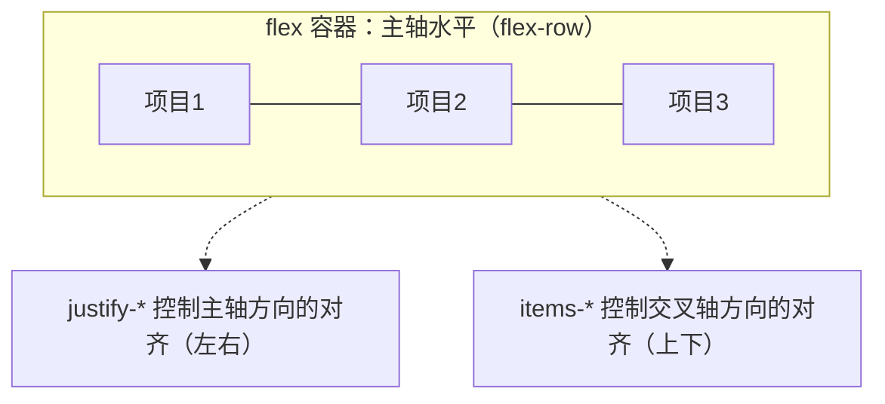

## 知识点地图

- 知识类别：CSS Flexbox（弹性盒子）一维布局在 Tailwind 里的工具类表达——容器属性、项目伸缩、间距与对齐。
- 解决什么问题：一排东西怎么排：导航栏左右分布、卡片行换行、三栏弹性伸缩、纵向卡片内容贴底——凡"沿一条线排列"的场景。
- 什么时候用到：布局的第一主力。先想"这是一排还是一块版面"：一排用 Flex（本篇），一块版面用 Grid（见[Grid 网格布局](/tailwind/043-GridLayout)）。
- 盒子自己的尺寸与 margin 间距地基见[盒模型、间距与尺寸](/tailwind/040-BoxModelSpacingSizing)。

## 前置知识

- [盒模型、间距与尺寸](/tailwind/040-BoxModelSpacingSizing)：文档流、display 与 border-box，本篇的盒子地基

## 学习目标

- 建立"主轴/交叉轴、容器/项目"两个心智模型，能用 `justify-*`、`items-*`、`flex-1`、`shrink-0` 完成一维布局。
- 能按场景选对居中方式：文字用 `text-center`、块级容器用 `mx-auto` + 定宽、双轴居中用 `flex items-center justify-center`。
- 说清 `flex-1` 与 `flex-auto` 的一字之差在什么场景下产生肉眼可见的差别。
- 能用 Flex 完成"导航栏、等高三栏、内容贴底卡片、聊天输入条"四个高频工程布局。

## 0. 一串珠子的一维世界

[盒模型、间距与尺寸](/tailwind/040-BoxModelSpacingSizing)的开头有个摆积木类比：第一盒是"串珠"——一根绳子把珠子一颗颗穿进去，顺序固定、方向单一，只能排成一列或一串。这就是 Flex 的世界观：**沿一条轴排列**。

Flex（Flexible Box，弹性盒子）解决的是**一维**排布：元素沿一条"主轴"排列，辅以一条"交叉轴"控制对齐。网页里凡是"横着一排"或"竖着一列"的部件——导航栏、按钮组、表单行、卡片里的图标 + 文字——都是 Flex 的领地。至于"横竖都要管"的整块版面，那是[Grid 网格布局](/tailwind/043-GridLayout)（底板）的活。本篇采用"原理驱动"的写法：先立心智模型，再过容器类与项目类两张清单，最后用工程示例串联。

## 1. Flex 原理：主轴、交叉轴与容器/项目

### 1.1 两个核心概念

第一，**主轴与交叉轴**。Flex 容器里有两条轴：主轴（main axis）决定元素的排列方向，默认水平向右；交叉轴（cross axis）垂直于主轴。设置 `flex-row`（默认）主轴为水平，`flex-col` 主轴为垂直——两条轴随之互换。

第二，**容器与项目**。给父元素加 `flex`，它就是"容器"（flex container），直接子元素成为"项目"（flex item）。**容器管整体排布，项目管自身伸缩**。这是 Flex 最重要的心智模型：对齐类（`justify-*`、`items-*`）写在容器上，伸缩类（`flex-1`、`grow`、`shrink`）写在项目上。



### 1.2 容器类：控制整体排布

| 工具类 | CSS 属性 | 效果 |
| --- | --- | --- |
| `flex-row` | flex-direction: row | 主轴水平（默认） |
| `flex-col` | flex-direction: column | 主轴垂直 |
| `flex-wrap` | flex-wrap: wrap | 空间不足时换行 |
| `justify-center` | justify-content: center | 主轴居中 |
| `justify-between` | justify-content: space-between | 主轴两端对齐，中间均匀留白 |
| `justify-end` | justify-content: flex-end | 主轴末尾对齐 |
| `items-center` | align-items: center | 交叉轴居中（垂直居中神器） |
| `items-start` / `items-end` | align-items: flex-start/end | 交叉轴顶部 / 底部 |
| `gap-4` | gap: 1rem | 项目之间的间距 |

```html
<!-- 导航栏标准布局：左 logo、右按钮，垂直居中 -->
<nav class="flex items-center justify-between bg-gray-900 px-6 py-4 text-white">
  <span class="text-lg font-bold">FANDEX</span>
  <button class="rounded-md bg-blue-600 px-4 py-2 text-sm">登录</button>
</nav>

<!-- 三张卡片水平排列，间距 16px，换行时自动折行 -->
<div class="flex flex-wrap gap-4">
  <div class="w-48 rounded-lg border border-gray-200 p-4">卡片一</div>
  <div class="w-48 rounded-lg border border-gray-200 p-4">卡片二</div>
  <div class="w-48 rounded-lg border border-gray-200 p-4">卡片三</div>
</div>

<!-- 垂直布局：纵向排列 + 居中 -->
<div class="flex flex-col items-center gap-2">
  
  <p class="text-sm text-gray-500">居中排列的头像与说明</p>
</div>
```

讲解：`justify-between` + `items-center` 是导航栏的"黄金组合"——主轴两端各放一端内容，交叉轴垂直居中。`flex-col items-center` 则是"纵向堆叠 + 水平居中"的标配，几乎每个页面都有。`flex-wrap` 是"卡片行"的保险丝：不写它，窄屏下整行被压扁变形；写了它，放不下的卡片自动折到下一行。

### 1.3 项目类：控制自身伸缩

| 工具类 | CSS 值 | 效果 |
| --- | --- | --- |
| `flex-1` | flex: 1 | 等分剩余空间（可伸展可收缩） |
| `flex-auto` | flex: 1 1 auto | 伸展收缩，但按内容宽度分配 |
| `flex-none` | flex: none | 不伸缩，保持固有尺寸 |
| `shrink-0` | flex-shrink: 0 | 禁止收缩（固定宽度元素） |
| `grow` | flex-grow: 1 | 允许伸展 |
| `basis-1/3` | flex-basis: 33.33% | 项目基础宽度 |
| `order-1` | order: 1 | 调整项目顺序 |

```html
<!-- 经典三栏：左右固定，中间弹性 -->
<div class="flex gap-4">
  <aside class="w-48 shrink-0 bg-gray-100 p-4">侧边栏（固定 192px）</aside>
  <main class="flex-1 bg-white p-4">主内容区（占满剩余空间）</main>
  <aside class="w-40 shrink-0 bg-gray-100 p-4">广告栏（固定 160px）</aside>
</div>

<!-- 三个 flex-1 项目：等分宽度 -->
<div class="flex gap-4">
  <div class="flex-1 rounded bg-blue-100 p-4">33.3%</div>
  <div class="flex-1 rounded bg-blue-100 p-4">33.3%</div>
  <div class="flex-1 rounded bg-blue-100 p-4">33.3%</div>
</div>

<!-- order 调整顺序：视觉上把第二项移到最前 -->
<div class="flex gap-2">
  <div class="order-2 rounded bg-gray-200 p-4">视觉第二</div>
  <div class="order-1 rounded bg-gray-200 p-4">视觉第一</div>
</div>
```

讲解：`flex-1` 是"均分剩余空间"的速记（等价于 `flex: 1 1 0%`），用在三栏布局的中间栏；`shrink-0` 保护固定宽度元素不被压缩。`order-*` 只改变视觉顺序，不改 DOM 结构，移动端适配时常用于"内容优先、视觉后置"。

### 1.4 易错点：flex-1 与 flex-auto 的一字之差

两者都"可伸展可收缩"，差别在 flex-basis：`flex-1` 的基准宽度是 **0%**（先清零再平分剩余空间），`flex-auto` 的基准是 **auto**（先按内容占位，再把多余空间分掉）。内容长度悬殊时肉眼可见：

```html
<!-- flex-1：三项内容长短不一，但宽度严格相等（内容被 0 基准抹平） -->
<div class="flex gap-2">
  <div class="flex-1 rounded bg-blue-100 p-2">短</div>
  <div class="flex-1 rounded bg-blue-100 p-2">这是一段很长的标签内容</div>
  <div class="flex-1 rounded bg-blue-100 p-2">中</div>
</div>

<!-- flex-auto：内容长的分得宽，内容短的分得窄（先按内容算基准） -->
<div class="flex gap-2">
  <div class="flex-auto rounded bg-emerald-100 p-2">短</div>
  <div class="flex-auto rounded bg-emerald-100 p-2">这是一段很长的标签内容</div>
  <div class="flex-auto rounded bg-emerald-100 p-2">中</div>
</div>
```

选择口诀：**要"等宽分栏"用 `flex-1`，要"按内容分空间"用 `flex-auto`**。表格工具栏、标签组的分宽用后者更自然；等高卡片列、表单网格用前者更整齐。

### 1.5 一句话总结 Flex

**容器定方向与对齐，项目定伸缩与占比**——记住这一句，Flex 已掌握八成。

## 2. 间距与居中：布局的"呼吸感"

布局不止于排列，还包括间距与居中两大细节。

### 2.1 gap：项目之间的专用间距

`gap-*` 是 Flex 和 Grid 容器共有的间距类，作用于项目之间，不产生"外边距合并"问题，是布局间距的首选：

```html
<!-- 行列间距一致：gap-4（16px） -->
<div class="grid grid-cols-3 gap-4">...</div>

<!-- 行距列距不同：gap-x-2 gap-y-4 -->
<div class="flex flex-wrap gap-x-2 gap-y-4">
  <span class="rounded bg-gray-100 px-3 py-1">标签一</span>
  <span class="rounded bg-gray-100 px-3 py-1">标签二</span>
  <span class="rounded bg-gray-100 px-3 py-1">标签三</span>
</div>
```

口诀：**兄弟之间用 gap，自己与外部用 margin**。`gap` 与 `space-y-*` 的取舍（后者在换行布局下的缺陷）见[盒模型、间距与尺寸](/tailwind/040-BoxModelSpacingSizing)第 3 节。

### 2.2 居中三兄弟

元素居中有三种情况，对应三个工具类：

| 需求 | 工具类 | 说明 |
| --- | --- | --- |
| 文字居中 | `text-center` | 文本水平居中 |
| 块级元素水平居中 | `mx-auto` + 定宽 | 左右外边距自动平分 |
| Flex 内垂直水平居中 | `flex items-center justify-center` | 双轴居中 |

```html
<!-- 文字居中 -->
<h1 class="text-center text-2xl font-bold">居中标题</h1>

<!-- 块级容器水平居中：max-w 限宽 + mx-auto -->
<main class="mx-auto max-w-7xl px-6">
  <p>内容在 1280px 以内水平居中，两侧保留 24px 内边距</p>
</main>

<!-- 双轴居中：弹窗内容 -->
<div class="flex h-64 items-center justify-center rounded-xl bg-gray-50">
  <p class="text-sm text-gray-500">上下左右完全居中</p>
</div>
```

讲解：`max-w-7xl`（1280px）是页面级内容区的常见宽度。v4 中旧式 `container` 类已改为用 `@utility` 定义，官方推荐直接用 `max-w-*` + `mx-auto` 组合，更直观可控。双轴居中是"垂直居中"问题的终解——`items-center` 只在容器有高度时才有意义，"居中失效"九成是容器没高度（`h-screen`、`h-64`、`min-h-dvh` 先给上）。

## 3. 布局综合示例：完整导航栏

把本篇的能力组合起来，完成一个真实页面部件。横向一排的部件用 Flex 足矣：

```html
<nav class="sticky top-0 z-50 flex items-center justify-between bg-white/80 px-6 py-3 shadow-sm backdrop-blur">
  <!-- 左侧：logo + 菜单 -->
  <div class="flex items-center gap-8">
    <span class="text-lg font-bold text-gray-900">FANDEX</span>
    <ul class="hidden items-center gap-6 text-sm text-gray-600 md:flex">
      <li class="hover:text-blue-600">课程</li>
      <li class="hover:text-blue-600">题库</li>
      <li class="hover:text-blue-600">社区</li>
    </ul>
  </div>
  <!-- 右侧：操作按钮 -->
  <div class="flex items-center gap-3">
    <button class="rounded-md px-3 py-2 text-sm text-gray-600 hover:bg-gray-100">登录</button>
    <button class="rounded-md bg-blue-600 px-4 py-2 text-sm text-white hover:bg-blue-700">注册</button>
  </div>
</nav>
```

逐层拆解：外层 `sticky top-0 z-50` 是吸顶（定位体系详见[定位与层叠上下文](/tailwind/044-PositioningAndStacking)）；`flex items-center justify-between` 一行完成"左右分布 + 垂直居中"；左侧的 `hidden md:flex` 让菜单在窄屏隐藏。嵌套的第二层 `flex items-center gap-8` 说明 Flex 可以层层嵌套：外层管"左右两大块"，内层管"每块内部的一排小件"。

## 4. 常见错误与对策

| 错误场景 | 表现 | 原因 | 解决办法 |
| --- | --- | --- | --- |
| justify 与 items 混淆 | 想垂直居中却水平居中了 | 主轴与交叉轴概念不清 | 先确定方向：flex-row 时 justify 管左右、items 管上下；flex-col 时相反 |
| 垂直居中失效 | `items-center` 无效果 | 容器没有高度，交叉轴无从居中 | 给容器显式高度（如 `h-screen`、`h-64`）再居中 |
| 项目被压缩 | 固定宽度元素被挤压 | 默认 `flex-shrink: 1` | 固定元素加 `shrink-0` |
| 忘了 gap | 项目紧贴没有间距 | margin 与 gap 混用导致不一致 | 容器用 `gap-*` 统一管理兄弟间距 |
| 弹性栏被长内容撑爆 | 长 URL/长单词顶破中间栏 | `flex-1` 的子内容 min-width 默认 auto，拒绝收缩 | 内容所在栏加 `min-w-0`，长词再配 `break-words` |
| 等宽期待落空 | 想等宽却随内容变宽 | 用了 `flex-auto`（basis 为内容宽） | 要严格等宽换 `flex-1`（basis 0%） |

## 5. 动手实践

**任务一：圣杯布局的 Flex 版。** 用 Flex 实现"左栏 160px 固定、中栏弹性、右栏 200px 固定"，三栏等高（拉伸到与最高栏一致）。提示：容器 `flex` + 项目默认 `items-stretch`；想想哪几栏需要 `shrink-0`。

**任务二：会员卡纵向布局。** 实现一张会员卡：标题在上、描述居中、按钮永远贴卡片底部，卡片高度随同级最高卡片一致。提示：卡片本体 `flex flex-col`，描述段落 `flex-1`，按钮区自然贴底。

**任务三：聊天输入条固定底部。** 实现一个"占满视口高"的聊天界面：消息列表占满剩余空间并自身滚动，输入框 + 发送按钮一行固定在最底部，按钮不随消息条数变化被挤走。提示：外层 `flex h-dvh flex-col`；消息列表 `flex-1 overflow-y-auto`；输入行 `shrink-0`。

先自己写，再对照参考实现：

<details>
<summary>任务一参考实现</summary>

```html
<div class="flex min-h-40 gap-4">
  <aside class="w-40 shrink-0 rounded-lg bg-gray-100 p-4">左栏 160px</aside>
  <main class="min-w-0 flex-1 rounded-lg bg-white p-4 shadow-sm">中栏弹性，占满剩余</main>
  <aside class="w-50 shrink-0 rounded-lg bg-gray-100 p-4">右栏 200px</aside>
</div>
```

`items-stretch` 是 Flex 默认值，等高不用写任何类；`min-w-0` 给中栏兜底，防止长单词/长 URL 把弹性栏撑爆（内容溢出时首查它）。左栏不加 `shrink-0` 时窄屏下会先被压扁——固定宽度元素的一对标配是 `w-*` + `shrink-0`。
</details>

<details>
<summary>任务二参考实现</summary>

```html
<div class="flex items-stretch gap-4">
  <div class="flex w-72 flex-col rounded-xl border border-gray-200 bg-white p-5">
    <h3 class="text-lg font-bold text-gray-900">月度会员</h3>
    <p class="mt-2 flex-1 text-sm text-gray-500">
      全站课程任学，含答疑服务。描述文字长短不一，按钮依然贴底。
    </p>
    <button class="mt-4 rounded-lg bg-gray-900 px-4 py-2 text-sm text-white hover:bg-gray-700">
      立即开通
    </button>
  </div>
  <div class="flex w-72 flex-col rounded-xl border border-gray-200 bg-white p-5">
    <h3 class="text-lg font-bold text-gray-900">年度会员</h3>
    <p class="mt-2 flex-1 text-sm text-gray-500">更划算。</p>
    <button class="mt-4 rounded-lg bg-blue-600 px-4 py-2 text-sm text-white hover:bg-blue-700">
      立即开通
    </button>
  </div>
</div>
```

`flex-1` 写在描述段落上而不是按钮上——弹性空间给"可长可短"的内容，固定气质的按钮贴底。若把 `flex-1` 写到按钮上，描述段落下方会出现一大段空隙、按钮被顶到中间，这是同族错误里最高频的一种。
</details>

<details>
<summary>任务三参考实现</summary>

```html
<div class="flex h-dvh flex-col">
  <!-- 消息列表：占满剩余空间，超出部分自身滚动 -->
  <div class="flex-1 space-y-3 overflow-y-auto bg-gray-50 p-4">
    <div class="max-w-[75%] rounded-xl bg-white p-3 text-sm shadow-sm">今天下午三点开会？</div>
    <div class="ml-auto max-w-[75%] rounded-xl bg-blue-600 p-3 text-sm text-white">好的，会议室见。</div>
    <!-- 消息条数随意增减，输入条始终贴底 -->
  </div>
  <!-- 输入行：shrink-0 保证不被压缩 -->
  <div class="flex shrink-0 items-center gap-2 border-t border-gray-200 bg-white p-3">
    <input
      type="text"
      placeholder="输入消息"
      class="min-w-0 flex-1 rounded-lg border border-gray-300 px-3 py-2 text-sm"
    />
    <button class="shrink-0 rounded-lg bg-blue-600 px-4 py-2 text-sm text-white hover:bg-blue-700">
      发送
    </button>
  </div>
</div>
```

三段式的职责分配：外层 `h-dvh flex-col` 立起"满屏高的纵轴"；消息列表 `flex-1` 吃掉输入条之外的全部高度，`overflow-y-auto` 让它内部滚动而不是把输入条推出视口；输入行 `shrink-0` 是整题题眼——不写它，当输入框内容变长或视口变矮时，浏览器会按默认 `shrink: 1` 先压缩输入行。输入框自身再套一层 `min-w-0 flex-1`，长文本输入也不会顶飞按钮。`h-dvh`（动态视口高度）比 `h-screen` 更适合移动端：地址栏收起/展开时高度自适应。
</details>

## 6. 一句话记忆

一排东西交给 Flex：容器管方向（`flex-row`/`flex-col`）与对齐（`justify-*` 主轴、`items-*` 交叉轴），项目管伸缩（`flex-1` 等宽分、`flex-auto` 按内容分、`shrink-0` 护住固定栏），间距用 `gap`，双轴居中一句 `flex items-center justify-center`。

## 7. 相关阅读

- 盒子的尺寸与 margin 间距地基：[盒模型、间距与尺寸](/tailwind/040-BoxModelSpacingSizing)
- 二维版面（Grid、命名区域、auto-fill 卡片墙）：[Grid 网格布局](/tailwind/043-GridLayout)
- 导航栏吸顶用到的定位体系：[定位与层叠上下文](/tailwind/044-PositioningAndStacking)
- 断点前缀的完整原理（`md:flex` 这类响应式写法）：[响应式与暗色模式](/tailwind/060-ResponsiveDark)
