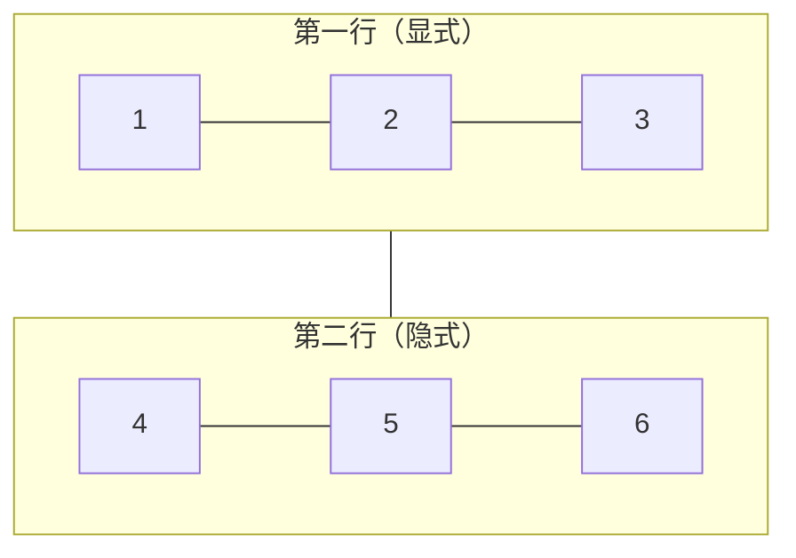

## 知识点地图

- 知识类别：CSS Grid 二维布局在 Tailwind 里的工具类表达——网格轨道、跨列跨行、命名区域、自动填充。
- 解决什么问题：一维 Flex 排不出的"行列同时受控"版面：卡片墙、后台骨架、杂志式拼版、卡片数量未知的响应式列表。
- 什么时候用到：搭整页骨架、做不限卡片个数的响应式卡片墙、需要命名区域的大版面。悬浮层与吸附（角标、吸顶、弹窗遮罩）是另一套体系，见[定位与层叠上下文](/tailwind/044-PositioningAndStacking)。
- 一维排布见[Flexbox 一维弹性布局](/tailwind/041-FlexboxLayout)，盒子尺寸与间距地基见[盒模型、间距与尺寸](/tailwind/040-BoxModelSpacingSizing)。

## 前置知识

- [Flexbox 一维弹性布局](/tailwind/041-FlexboxLayout)：主轴/交叉轴、容器/项目的心智模型
- [盒模型、间距与尺寸](/tailwind/040-BoxModelSpacingSizing)：display 与文档流基础

## 学习目标

- 理解网格线、网格轨道与隐式网格，能用 `grid-cols-*`、`col-span-*`、`gap-*` 搭出二维页面骨架。
- 能用任意值写出 `grid-template-areas` 命名区域布局，并让移动端与桌面端各排各的。
- 能用 `auto-fill` + `minmax` 写出"不管塞多少卡片都自动换列"的响应式卡片墙。
- 能说清 Flex 与 Grid 的分工：一排东西用 Flex，一块版面用 Grid，两者经常嵌套。

## 0. 从一串珠子到一块底板

[盒模型、间距与尺寸](/tailwind/040-BoxModelSpacingSizing)里有个摆积木的类比：串珠是**一维**排布，只能排成一列。本篇的主角是第二盒积木——**底板**：一块带凸点的塑料板，积木可以横着放、竖着放、跨两格、占满一行，这是**二维**排布。

Flex 沿一条主轴排列，Grid 同时控制行与列。网页里"整块版面"几乎都是 Grid 的领地：卡片墙、后台侧栏 + 内容区、杂志式首页。Grid 搭好骨架之后，悬浮角标与吸顶元素交给[定位与层叠上下文](/tailwind/044-PositioningAndStacking)——两件事经常配合：Grid 搭骨架，定位放角标。

## 1. Grid 原理：二维排布的底板

Grid（网格）解决的是**二维**排布：同时控制行与列。如果说 Flex 是"一串珠子"，Grid 就是"一块带网格线的底板"。

### 1.1 三个核心概念

第一，**网格线与网格轨道**。网格由水平与垂直两组"网格线"划分成一个个单元格。两列三行的网格有 3 条竖线、4 条横线。列线之间是"列轨道"，行线之间是"行轨道"。

第二，**显式网格与隐式网格**。你显式声明了 3 列（`grid-cols-3`），第 4 个及之后的子元素会自动"挤"到下一行——这新出现的一行是"隐式网格行"，高度由内容决定（`auto`）。

第三，**网格区域**。通过 `col-span-2`、`row-span-2` 可以让一个元素横跨多列/多行，占据一块矩形"区域"。



### 1.2 容器类：定义网格骨架

| 工具类 | CSS 值 | 效果 |
| --- | --- | --- |
| `grid-cols-2` | grid-template-columns: repeat(2, minmax(0, 1fr)) | 两列等宽 |
| `grid-cols-4` | 同上，4 列 | 四列等宽 |
| `grid-rows-2` | grid-template-rows: repeat(2, ...) | 两行 |
| `gap-4` | gap: 1rem | 行列间距 |
| `gap-x-4` / `gap-y-2` | column-gap / row-gap | 仅列距 / 仅行距 |
| `grid-flow-col` | grid-auto-flow: column | 子元素沿列方向填充 |

```html
<!-- 六张卡片，三列等宽，自动排成两行 -->
<div class="grid grid-cols-3 gap-4">
  <div class="rounded-lg bg-gray-100 p-4">1</div>
  <div class="rounded-lg bg-gray-100 p-4">2</div>
  <div class="rounded-lg bg-gray-100 p-4">3</div>
  <div class="rounded-lg bg-gray-100 p-4">4</div>
  <div class="rounded-lg bg-gray-100 p-4">5</div>
  <div class="rounded-lg bg-gray-100 p-4">6</div>
</div>

<!-- 响应式网格：移动端 1 列，md 2 列，lg 3 列 -->
<div class="grid grid-cols-1 gap-6 md:grid-cols-2 lg:grid-cols-3">
  <div class="rounded-xl border border-gray-200 p-6">课程卡片</div>
  <!-- 重复多张卡片 -->
</div>

<!-- 照片墙：子元素沿列方向填充，两列 -->
<div class="grid grid-flow-col grid-cols-2 gap-2">
  <div class="h-24 rounded bg-gray-200">照片 1</div>
  <div class="h-24 rounded bg-gray-200">照片 2</div>
  <div class="h-24 rounded bg-gray-200">照片 3</div>
</div>
```

讲解：`grid-cols-3` 中的 3 直接生成"repeat(3, minmax(0, 1fr))"，即三列等宽、列宽自适应。响应式只需叠加断点前缀：`grid-cols-1 md:grid-cols-2 lg:grid-cols-3` 一条链完成"手机 1 列、平板 2 列、桌面 3 列"。

### 1.3 项目类：控制跨列跨行

| 工具类 | CSS 值 | 效果 |
| --- | --- | --- |
| `col-span-2` | grid-column: span 2 | 横跨两列 |
| `col-span-full` | grid-column: 1 / -1 | 占满整行 |
| `row-span-2` | grid-row: span 2 | 横跨两行 |
| `col-start-2` | grid-column-start: 2 | 从第 2 列线开始 |
| `row-start-1` | grid-row-start: 1 | 从第 1 行线开始 |

```html
<!-- 通栏横幅：col-span-full 占满整行 -->
<div class="grid grid-cols-4 gap-4">
  <div class="col-span-2 rounded-lg bg-gray-100 p-4">占两列</div>
  <div class="col-span-2 rounded-lg bg-gray-100 p-4">占两列</div>
  <div class="col-span-full rounded-lg bg-blue-100 p-4">通栏横幅</div>
</div>

<!-- 侧边栏 + 主内容：经典后台骨架 -->
<div class="grid grid-cols-1 gap-6 md:grid-cols-3">
  <aside class="md:col-span-1 rounded-lg bg-gray-100 p-6">侧边栏导航</aside>
  <main class="md:col-span-2 rounded-lg bg-white p-6">主内容区</main>
</div>
```

讲解：`col-span-*` 让元素跨越指定数量的列轨道，配合 `grid-cols-*` 即可拼出任意版面。"侧边栏 + 主内容"（1:2 或 1:3）是后台系统最常用的骨架，改动数字即调整比例。

### 1.4 一句话总结 Grid

**容器定行列轨道，项目定跨列跨行**——二维版面用 Grid，一维排列用 Flex，两者各有分工、经常嵌套使用。

## 2. 工程实战一：grid-template-areas 命名区域

跨列跨行靠数格子，格子一多就容易数错。`grid-template-areas` 允许给每块区域起名字，像画地图一样排版——这是大版面（整页骨架、仪表盘）最可读的写法。

Tailwind v4 没有为它提供预设刻度类，用**任意属性语法**直接写（下划线代表空格）：

```html
<!-- 桌面端：三行两列的杂志式版面 -->
<div
  class="grid grid-cols-[240px_1fr] grid-rows-[auto_1fr_auto]
         gap-6 min-h-screen p-6
         [grid-template-areas:'header_header''sidebar_main''footer_footer']"
>
  <header class="rounded-lg bg-gray-900 p-4 text-white [grid-area:header]">站点头部</header>
  <aside class="rounded-lg bg-gray-100 p-4 [grid-area:sidebar]">侧栏</aside>
  <main class="rounded-lg bg-white p-4 shadow-sm [grid-area:main]">主内容</main>
  <footer class="rounded-lg bg-gray-50 p-4 text-sm text-gray-500 [grid-area:footer]">页脚</footer>
</div>
```

讲解：`[grid-template-areas:'header_header''sidebar_main''footer_footer']` 里每一对引号是**一行**的地图，行内每个名字占一列，同名格子连成一块区域；子元素用 `[grid-area:header]` 认领自己的地盘。写错时会得到一整行"名字对不上"的报错级空白（CSS 直接不生效，区域名为矩形才合法），排查时先把地图打印成等宽文本核对。

命名区域的真正威力在响应式——**HTML 不动，换个断点换张地图**：

```html
<div
  class="grid grid-cols-1 gap-4
         md:grid-cols-[220px_1fr] md:grid-rows-[auto_1fr]
         [grid-template-areas:'header''sidebar''main']
         md:[grid-template-areas:'header_header''sidebar_main']"
>
  <header class="bg-gray-900 p-4 text-white [grid-area:header]">头部</header>
  <aside class="bg-gray-100 p-4 [grid-area:sidebar]">侧栏（移动端排在头部之下、主内容之上）</aside>
  <main class="bg-white p-4 [grid-area:main]">主内容</main>
</div>
```

讲解：移动端地图是单列三行（header / sidebar / main 依次往下排），`md:` 之后换成两列两行、侧栏靠左。四个子元素的类名一个没改——这就是"布局即数据"的思路：改地图，不改 DOM。

## 3. 工程实战二：auto-fill 响应式卡片墙

`grid-cols-1 md:grid-cols-2 lg:grid-cols-3` 有个痛点：列数是你"猜"的，商品数量一变、屏幕宽度一变就可能出半空行。`repeat(auto-fill, minmax(最小宽, 1fr))` 让浏览器自己决定塞几列——**卡片数量与屏幕宽度都不用你操心**：

```html
<!-- 商品列表：每张卡最小 220px，能塞几列塞几列 -->
<section
  class="grid gap-4 p-6
         [grid-template-columns:repeat(auto-fill,minmax(220px,1fr))]"
>
  <article class="rounded-xl border border-gray-200 p-4">
    <h3 class="font-semibold">无线鼠标</h3>
    <p class="mt-1 text-sm text-gray-500">静音微动，续航 90 天</p>
  </article>
  <!-- 卡片数量随意：3 张时单行三列，20 张时自动折行，永不出现断档空列 -->
</section>
```

讲解：`auto-fill` 在容器里"能塞多少列就塞多少列"，塞不下的整体换行；`minmax(220px, 1fr)` 约束每列"最窄 220px，多余空间平分"。与手写三档断点相比，它是连续自适应的——中间宽度（如 900px）也能精确利用。两个易错点：写成 `auto-fit` 时列数相同、但卡片不足时已有列会**拉伸占满**整行（适合"最后一行也撑满"的场景，两者按需求选）；忘记 `1fr` 只写 `minmax(220px, 220px)` 则列宽永远不会撑开。

## 4. 布局综合示例

把 Grid 与 Flex 的能力组合起来，完成两个真实页面骨架。

### 4.1 课程卡片墙

```html
<section class="grid grid-cols-1 gap-6 p-6 md:grid-cols-2 lg:grid-cols-3">
  <!-- 卡片：纵向 flex 布局 + flex-1 让按钮贴底 -->
  <article class="flex flex-col overflow-hidden rounded-xl border border-gray-200 bg-white shadow-sm transition-shadow hover:shadow-md">
    
    <div class="flex flex-1 flex-col p-5">
      <h3 class="text-base font-semibold text-gray-900">JavaScript 入门</h3>
      <p class="mt-1 flex-1 text-sm text-gray-500">从零开始掌握变量、函数与对象，最终完成一个小项目。</p>
      <div class="mt-4 flex items-center justify-between">
        <span class="rounded bg-blue-50 px-2 py-1 text-xs text-blue-700">初级</span>
        <button class="rounded-md bg-gray-900 px-4 py-2 text-sm text-white hover:bg-gray-700">开始学习</button>
      </div>
    </div>
  </article>
  <!-- 其余卡片结构相同，省略 -->
</section>
```

### 4.2 后台页面骨架

```html
<div class="grid min-h-screen grid-cols-1 md:grid-cols-4">
  <!-- 侧边栏 -->
  <aside class="hidden bg-gray-900 p-6 text-white md:block">
    <p class="mb-6 text-lg font-bold">管理后台</p>
    <ul class="space-y-3 text-sm text-gray-300">
      <li class="hover:text-white">课程管理</li>
      <li class="hover:text-white">用户管理</li>
      <li class="hover:text-white">数据统计</li>
    </ul>
  </aside>
  <!-- 主区域：顶部栏 + 内容 -->
  <div class="flex flex-col md:col-span-3">
    <header class="flex items-center justify-between border-b border-gray-200 bg-white px-6 py-3">
      <h1 class="text-lg font-semibold">课程管理</h1>
      <button class="rounded-md bg-blue-600 px-4 py-2 text-sm text-white">新建课程</button>
    </header>
    <main class="grid flex-1 grid-cols-1 gap-4 bg-gray-50 p-6 lg:grid-cols-2">
      <div class="rounded-lg bg-white p-4 shadow-sm">课程列表</div>
      <div class="rounded-lg bg-white p-4 shadow-sm">统计数据</div>
    </main>
  </div>
</div>
```

两个示例展示了核心套路：**整块版面用 grid + 断点，卡片内部用纵向 flex + flex-1 贴底**。Flex 与 Grid 的分工可以记成：一排东西用 Flex，一块版面用 Grid。

## 5. 常见错误与对策

| 错误场景 | 表现 | 原因 | 解决办法 |
| --- | --- | --- | --- |
| 网格溢出 | 卡片挤到网格外 | 内容最小宽度超过列轨道宽度 | 给项目加 `min-w-0` 或改用 `minmax(0,1fr)` 思路（Tailwind 默认已是） |
| areas 地图不生效 | 区域布局整块失效 | 地图中同名格子不构成矩形，或行列数与 grid-cols/rows 对不上 | 把地图写成等宽文本逐行核对：每行名字个数一致、同名格子连成矩形 |
| auto-fill 拉伸过头 | 卡片很少时每张被拉得很宽 | 用了 `auto-fit`（列数少时拉伸占满） | 需要"保持卡片宽度"就换 `auto-fill` |
| 响应式断点写反 | 移动端也显示多列 | 忘记"移动优先"：基础类先写移动端样式 | 基础写单列，`md:`/`lg:` 前缀逐级增强 |
| 卡片高度参差 | 同一行卡片高矮不一 | Grid 默认行轨道 auto，各行独立 | 卡片内部用 `flex flex-col` + `flex-1` 贴底（见 4.1） |

## 6. 动手实践

**任务一：命名区域整页骨架。** 用 `grid-template-areas` 实现"顶栏 / 侧栏 / 主内容 / 页脚"四块版面：移动端单列（顶栏、主内容、侧栏、页脚），桌面端侧栏在左、其余在右。提示：两套地图分别用基础类与 `md:` 前缀写，子元素只用 `[grid-area:*]` 认领。

**任务二：不限数量的标签墙。** 把一组 8 个标签做成响应式卡片墙：每个标签最小 160px，容器宽度变化时自动增减列数，不允许出现拉伸变形。提示：`[grid-template-columns:repeat(auto-fill,minmax(160px,1fr))]`。

**任务三：仪表盘十二宫格。** 用 Grid 搭一个统计仪表盘：四张统计卡各占 1 格、一张图表占 2x2、一张列表通栏占满整行，移动端全部退化为单列。提示：外层 `grid-cols-4` + 断点退化；图表卡 `col-span-2 row-span-2`，列表 `col-span-full`。

先自己写，再对照参考实现：

<details>
<summary>任务一参考实现</summary>

```html
<div
  class="grid min-h-dvh grid-cols-1 gap-4 p-4
         [grid-template-areas:'header''main''sidebar''footer']
         md:grid-cols-[220px_1fr] md:grid-rows-[auto_1fr_auto]
         md:[grid-template-areas:'header_header''sidebar_main''footer_footer']"
>
  <header class="rounded-lg bg-gray-900 p-4 text-white [grid-area:header]">顶栏</header>
  <aside class="rounded-lg bg-gray-100 p-4 [grid-area:sidebar]">侧栏</aside>
  <main class="rounded-lg bg-white p-4 shadow-sm [grid-area:main]">主内容</main>
  <footer class="rounded-lg bg-gray-50 p-3 text-sm text-gray-500 [grid-area:footer]">页脚</footer>
</div>
```

移动端地图特意把 `main` 排在 `sidebar` 前面——内容优先、导航殿后，是移动端信息层级的常识。地图改一行顺序就完成换位，DOM 一字未动。`min-h-dvh`（动态视口高度）比 `min-h-screen` 更稳，移动端地址栏收展时不会留白。
</details>

<details>
<summary>任务二参考实现</summary>

```html
<div class="grid gap-2 [grid-template-columns:repeat(auto-fill,minmax(160px,1fr))]">
  <span class="rounded-full border border-gray-200 px-4 py-2 text-center text-sm">Vue</span>
  <span class="rounded-full border border-gray-200 px-4 py-2 text-center text-sm">React</span>
  <span class="rounded-full border border-gray-200 px-4 py-2 text-center text-sm">Svelte</span>
  <span class="rounded-full border border-gray-200 px-4 py-2 text-center text-sm">SolidJS</span>
  <span class="rounded-full border border-gray-200 px-4 py-2 text-center text-sm">Astro</span>
  <span class="rounded-full border border-gray-200 px-4 py-2 text-center text-sm">Qwik</span>
</div>
```

验证方式：拖动浏览器窗口宽度，列数应连续变化（不只在 768px/1024px 两个断点跳变）。若改用 `auto-fit`，把标签删到只剩 2 个观察差异——`auto-fit` 会把两列拉到无限宽，`auto-fill` 保持 160px 的最小列并把空位留给网格。这就是"内容固定宽度选 auto-fill、内容要占满选 auto-fit"的取舍依据。
</details>

<details>
<summary>任务三参考实现</summary>

```html
<div class="grid grid-cols-1 gap-4 p-4 sm:grid-cols-2 lg:grid-cols-4">
  <div class="rounded-xl bg-white p-4 shadow-sm">新增用户</div>
  <div class="rounded-xl bg-white p-4 shadow-sm">活跃度</div>
  <div class="rounded-xl bg-white p-4 shadow-sm">收入</div>
  <div class="rounded-xl bg-white p-4 shadow-sm">转化率</div>
  <!-- 图表：lg 下占 2x2 -->
  <div class="rounded-xl bg-white p-4 shadow-sm lg:col-span-2 lg:row-span-2">周趋势图表</div>
  <!-- 列表：通栏 -->
  <div class="rounded-xl bg-white p-4 shadow-sm lg:col-span-full">最近订单列表</div>
</div>
```

`lg:col-span-2 lg:row-span-2` 让图表卡在四列网格里吃掉一个 2x2 的区域，两张统计卡与列表自动绕行填充——Grid 的自动放置算法按 DOM 顺序把每个项目放进第一个放得下的格子。注意"通栏列表"要写在图表之后：若写在中间，它会把后面还想占整行的项目挤到下一行，排查"顺序怎么乱了"时先看 DOM 顺序与 span 的乘积是否越过了列数。
</details>

## 7. 一句话记忆

Grid 是"行列同时受控"的底板：容器定轨道（`grid-cols-*`）、项目定跨越（`col-span-*`）、大版面画地图（`[grid-template-areas:...]`）、卡片数量未知用 `auto-fill + minmax`；一排东西仍归 Flex 管（见[Flexbox 一维弹性布局](/tailwind/041-FlexboxLayout)）。

## 8. 相关阅读

- 一维排布（容器/项目、flex-1 家族）：[Flexbox 一维弹性布局](/tailwind/041-FlexboxLayout)
- 脱离正常流的角标、吸顶侧栏与弹窗遮罩：[定位与层叠上下文](/tailwind/044-PositioningAndStacking)
- 断点体系的完整原理：[响应式与暗色模式](/tailwind/060-ResponsiveDark)
- 容器查询：以"容器宽度"而非"视口宽度"切换布局的进阶方案：[容器查询](/tailwind/110-TailwindContainerQueries)
