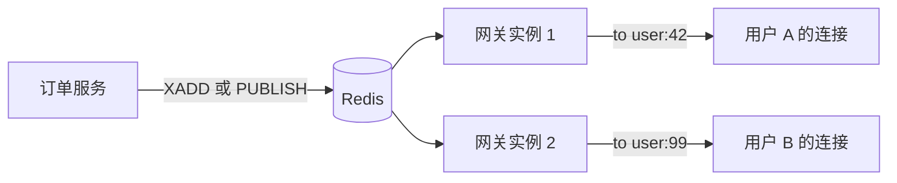

## 知识点地图

- **知识类别**：实时通信——WebSocket 网关（Gateway）：服务端主动推送与双向长连接。
- **解决什么问题**：HTTP 是「请求-响应」，服务端不能主动说话；行情推送、协作光标、聊天室这类「状态一变就要通知在线者」的场景需要长连接。网关让 WebSocket 也享受 Nest 的依赖注入与模块组织。
- **什么时候用到**：在线协作、行情/订单推送、客服聊天、通知中心；反过来，低频的状态同步轮询就够时不要上 WebSocket（连接维护本身有成本）。

前置：认证（nestjs/205-AuthJwtAndPassport）——握手鉴权要解析 token；微服务传输层（nestjs/240）——第 5 节选型对比；Bun 原生 WebSocket（nestjs/130-BunWebSocketFrontendDev）——无框架的裸写形态作对照。

## 1. 心智模型：网关是「另一类控制器」

HTTP 控制器：一个 URL 一个方法，请求来了处理、响应即结束。WebSocket 网关：**一个连接一个生命周期，连接建立后可多次双向通信**。两者在 Nest 里平级——都是 Provider、都能注入 Service，区别在协议与生命周期：

| 维度 | HTTP 控制器 | WebSocket 网关 |
| :--- | :--- | :--- |
| 单位 | 请求（无状态） | 连接（有状态） |
| 入口 | 路由匹配 | 事件名匹配（`@SubscribeMessage`） |
| 鉴权 | 每次请求带头 | **握手时一次**，之后靠连接本身 |
| 失败 | 异常过滤器接住 | 异常只作用于单个事件回调 |
| 主动发起 | 不行（响应即终止） | 随时 `server.emit` |

「有状态」是网关一切复杂性的来源：连接会断、断线要重连、状态要同步——第 3 节的房间管理与第 5 节的多实例广播都由此而来。

## 2. 最小网关与连接生命周期

```bash
npm i @nestjs/websockets @nestjs/platform-socket.io socket.io
```

```typescript
// src/events/events.gateway.ts
import {
  WebSocketGateway,
  SubscribeMessage,
  OnGatewayConnection,
  OnGatewayDisconnect,
  WebSocketServer
} from "@nestjs/websockets"
import { Server, Socket } from "socket.io"

@WebSocketGateway({ cors: { origin: "*" } })       // 端口默认同 HTTP
export class EventsGateway
  implements OnGatewayConnection, OnGatewayDisconnect
{
  @WebSocketServer()
  server: Server                                   // 框架注入 Socket.IO 实例

  handleConnection(client: Socket) {
    console.log(`连接进入: ${client.id}`)          // 握手完成、连接可用
  }

  handleDisconnect(client: Socket) {
    console.log(`连接断开: ${client.id}`)          // 主动断开或网络断
  }

  @SubscribeMessage("message")                     // 客户端 emit("message", ...)
  handleMessage(client: Socket, payload: { text: string }) {
    return { event: "message", data: payload }     // 返回值回给发送者（ack 语义）
  }
}
```

逐项讲解：

- `@WebSocketGateway()` 不带参数时随 HTTP 端口监听；网关作为普通 Provider 注册进模块（`providers: [EventsGateway]`）；
- `@WebSocketServer()` 是框架的属性注入点：Socket.IO 的 server 实例在网关初始化后被赋上，广播（`this.server.emit`）全靠它——在构造函数里用它拿不到（此时还没注入），**要放进生命周期钩子用**；
- `handleConnection/handleDisconnect` 是两个可选的生命周期接口：连接建立/断开时各触发一次，是在线名单维护（第 3 节）的钩子；
- 事件处理器**返回值即确认（ack）**：只回给发送者；要广播全量用 `this.server.emit`、要广播除自己外的房间用 `client.to(room).emit`。

与 Bun 裸写的对照（nestjs/130）：裸 WebSocket 要自己管理 `ws.on("connection")` 与消息分发，网关的 `@SubscribeMessage` 把「事件名 -> 处理器」变成声明式、依赖注入可用——框架的价值在连接数多、事件类型多的项目里才体现；单房间十个连接的小玩具，裸写更简单。

## 3. 房间与在线名单

房间（room）是 Socket.IO 的分组原语：同一个 server 上的连接可以加入多个房间，广播按房间投递。

```typescript
// 在线名单服务：连接 <-> 用户 的映射
@Injectable()
export class PresenceService {
  private readonly userToSockets = new Map<string, Set<string>>()  // 一用户可多端

  join(userId: string, socketId: string) {
    const set = this.userToSockets.get(userId) ?? new Set()
    set.add(socketId)
    this.userToSockets.set(userId, set)
  }

  leave(userId: string, socketId: string) {
    this.userToSockets.get(userId)?.delete(socketId)
    if (this.userToSockets.get(userId)?.size === 0) {
      this.userToSockets.delete(userId)            // 最后一端离线才算离线
      return true                                  // 返回「用户完全离线」
    }
    return false
  }

  onlineUsers(): string[] {
    return [...this.userToSockets.keys()]
  }
}
```

```typescript
// 网关里接住生命周期与房间
@WebSocketGateway({ cors: { origin: "*" } })
export class EventsGateway {
  @WebSocketServer() server: Server

  constructor(private readonly presence: PresenceService) {}

  handleConnection(client: Socket) {
    const userId = client.data.userId              // 握手鉴权写入（第 4 节）
    this.presence.join(userId, client.id)
    client.join(`user:${userId}`)                  // 按用户建房间：私发有落点
    this.server.emit("presence", this.presence.onlineUsers())
  }

  handleDisconnect(client: Socket) {
    const wentOffline = this.presence.leave(client.data.userId, client.id)
    if (wentOffline) this.server.emit("presence", this.presence.onlineUsers())
  }

  @SubscribeMessage("join:doc")
  onJoinDoc(client: Socket, docId: string) {
    client.join(`doc:${docId}`)                    // 协作文档房间
  }
}
```

设计要点：

- **房间命名即投递语义**：`user:{id}` 房间让「给某用户推送」（通知中心）有稳定落点，业务代码只 `server.to("user:42").emit(...)`，不用自己查 socketId；
- **多端登录**：一个用户两个标签页是两个连接——`Map<string, Set>` 的 Set 结构就是为这个；离线判定以「最后一个连接断开」为准；
- **presence 广播的节流**：高频进出（刷新页面）会让 presence 广播刷屏，生产上对广播做去抖（如 500ms 合并）再发。

## 4. 握手鉴权：连接层与 HTTP 层的分界

WebSocket 的鉴权时机只有**握手一次**——HTTP 的守卫/拦截器体系管不到 WS 事件。标准做法是 Socket.IO 中间件在握手阶段验证 JWT（令牌来自 205 篇的签发体系）：

```typescript
import { verifyAsync } from "../auth/jwt.utils"

@WebSocketGateway({ cors: { origin: "*" } })
export class EventsGateway implements OnGatewayConnection {
  constructor(private readonly jwtGuard: JwtAuthGuard) {}

  afterInit(server: Server) {
    // 握手中间件：不通过则拒绝建连
    server.use(async (socket, next) => {
      try {
        const token =
          socket.handshake.auth?.token ??          // 推荐：auth 载荷
          socket.handshake.headers.authorization?.split(" ")[1]
        if (!token) throw new Error("缺少令牌")
        socket.data.userId = (await verifyAsync(token)).sub   // 挂到连接上
        next()                                     // 放行建连
      } catch {
        next(new Error("未认证"))                  // 拒绝：客户端收到 connect_error
      }
    })
  }

  handleConnection(client: Socket) {
    // 走到这里的一定是已认证连接
  }
}
```

三个安全决策：

1. **token 放 `handshake.auth` 而不是 URL 查询串**：URL 会进访问日志与代理日志，token 进日志就是泄漏；从查询串迁移的旧客户端是排期改造项，不是默认；
2. **握手后不再验 token**：连接一旦建立，token 过期连接仍然活着（这是 WS 的常态，浏览器标签页开着几小时很常见）——敏感操作的兜底是「事件处理时再校验一次」或对长连接做定期重认证；
3. **拒绝要给可读错误**：`next(new Error("未认证"))` 让客户端收到 `connect_error` 事件，能区分「没登录」与「网络不通」，重连策略才能分流（未认证去重新登录、网络错误做指数退避重连）。

## 5. 与拦截器/异常过滤器的语义差异、与微服务的选型

### 5.1 管线组件在网关里的适用面

| 组件 | HTTP 控制器 | WebSocket 网关 |
| :--- | :--- | :--- |
| 守卫 | 可用 | 可用（但握手鉴权已前置） |
| 拦截器 | 可用 | **仅对 `@SubscribeMessage` 事件生效**（WebSocketInterceptor） |
| 管道 | 可用 | 可用（校验事件 payload） |
| 异常过滤器 | 兜底全局 | 兜底事件回调，**影响面是单事件** |

关键差异在异常过滤器：HTTP 的异常变成一次 500 响应，请求结束；WS 的异常如果只影响单个事件回调，**连接还活着**——没被处理的异常甚至可能无声吞掉（客户端看不到失败）。因此网关的事件处理器约定「有 ack 的返回错误对象、无 ack 的要 emit error 事件」，异常过滤器只是兜底不是契约。

### 5.2 与微服务传输层的选型（衔接 240）

两个「双向通信」的方案常被混为一谈，分界一句话：**WebSocket 连的是浏览器（前端 <-> 后端），微服务传输层连的是服务（后端 <-> 后端）**。

| 你的问题 | 答案 |
| :--- | :--- |
| 服务器要通知浏览器 | WebSocket 网关（本篇） |
| 服务 A 调服务 B / 服务间事件 | 微服务传输层（nestjs/240） |
| 服务内部要通知「在线用户」（经浏览器） | 服务事件 -> Redis pub/sub -> 网关广播 |

第三行是多实例部署的关键链路（下一节展开）：用户 A 的下单请求打到实例 1，订单状态要推给正连着实例 2 的用户 A——跨实例的桥必须落在共享设施上。

## 6. 工程场景

### 6.1 场景一：在线协作 presence（光标与名单）

协作文档：每人光标位置实时同步、页面显示在线名单。落地：光标消息走 `socket.to("doc:123").emit("cursor", ...)`（房间广播、发者不收自己的）；名单走第 3 节的 presence 服务（按 docId 维度建 Map）。**易错点**：光标消息全量广播（每秒几十次 x 十几人）会打爆带宽——节流到 30ms 一条 + 只发增量位移，是协作产品的标配优化；断线重连后客户端要重发一次全量光标（服务器不保留历史光标，last-write-win）。

### 6.2 场景二：行情/订单推送（Redis 桥接多实例）

交易系统：订单状态变化要实时推给用户，部署 4 个网关实例。链路设计：



实现上用 Socket.IO 的 **Redis adapter**：`io.adapter(redisAdapter)` 一行让所有实例共享房间拓扑——实例 1 上 `to("user:42")` 的广播，会经 Redis 转发到实例 2 上的同名房间。**多实例不配 adapter 是 WebSocket 第一事故**：单机联调一切正常、上生产后「有时收得到有时收不到」（取决于你的连接落在哪个实例），这类「概率性丢推送」的根因排查应先查 adapter。推送语义的兜底：WebSocket 只保证「在线即时性」，离线期间的消息要靠通知表 + 登录后拉取补齐（推送与轮询是互补不是替代）。

### 6.3 场景三：客服聊天室

双人会话（用户-客服）：双方进 `chat:{sessionId}` 房间；「对方正在输入」走轻量事件（300ms 节流）；消息持久化在 HTTP 接口完成（`POST /messages`）成功后再 emit 到房间——**写库走 HTTP、通知走 WS**，让消息的可靠性归 HTTP 体系（重试、幂等，nestjs/235 的思路），WS 只做「告诉对方有新消息」。反过来「消息直接从 WS 事件写库」会把可靠性问题重新引入长连接层：断线时刻正在发的消息、重连后的重复消息都要自己重新解决一遍。

## 7. 动手实践

**任务一**：跑通带鉴权的最小网关。要求：握手中间件校验 JWT（无效拒绝建连）；登录用户连上后进 `user:{id}` 房间；写一个测试页面（或用 socket.io 客户端脚本）验证「无 token 连不上、带 token 能收房间消息」。

<details>
<summary>任务一参考观察</summary>

无 token 时客户端收到 `connect_error: 未认证`，带有效 token 建连成功；`server.to("user:42").emit("notify", {...})` 只有该用户的连接收到。自查：token 放 `auth` 载荷时，客户端初始化写法是 `io(url, { auth: { token } })`——放查询串的写法（`?token=...`）虽然能跑，但 token 进了服务器日志（第 4 节决策 1）。
</details>

**任务二**：给聊天室加「正在输入」与离线兜底。要求：typing 事件 300ms 节流（服务器端也要防抖，不能只靠客户端）；消息持久化走 HTTP，emit 只在持久化成功后发生；断线重连后客户端拉一次离线消息（HTTP 接口）再恢复 WS。

<details>
<summary>任务二参考设计</summary>

服务器端防抖：`Map<socketId, timer>` 记录上次 typing 时间，间隔不足 300ms 的直接丢弃——只信客户端节流的话，恶意客户端可以绕过打爆房间。持久化与通知的顺序不能反（emit 成功但写库失败 = 对方看到消息但历史里没有）；重连后的补拉接口返回「服务器最后确认的消息 ID」之后的部分，幂等键用消息的客户端 UUID 防重复提交。
</details>

**任务三**：多实例广播实验。本地起两个网关实例（端口 3000/3001）共享同一个 Redis，两个客户端分别连两个实例，验证「实例 1 的连接发的消息，实例 2 的连接能收到」（配 Redis adapter）；然后去掉 adapter 重复实验，记录「收不到」的现象。

<details>
<summary>任务三参考观察</summary>

配 adapter：房间拓扑经 Redis 共享，两个实例的 `to()` 互通；去掉 adapter：消息只在发送者所在实例的房间内投递，另一实例的连接永远收不到——这就是第 6.2 节「概率性丢推送」的最小复现。实验结论固化成部署检查项：**网关多实例部署清单第一行是 Redis adapter 配置**。
</details>

## 8. 下一步与延伸阅读

- 《认证与授权：Passport 与 JWT》（nestjs/205-AuthJwtAndPassport）：握手校验的令牌从哪来；
- 《微服务与消息模式》（nestjs/240-MicroservicesAndHealth）：服务间通信与 WebSocket 的选型边界（第 5.2 节）；
- 《Bun WebSocket 与前端开发服务器》（nestjs/130-BunWebSocketFrontendDev）：无框架裸写 WebSocket 的对照形态；
- 《缓存与消息队列》（nestjs/230-CachingAndQueues）：「在线即时 + 离线补齐」里补齐一侧的队列思路。

## 参考与致谢

- NestJS 官方文档 WebSockets (Gateways)：<https://docs.nestjs.com/websockets/gateways>；
- Socket.IO 官方文档（rooms、middleware、redis adapter）：<https://socket.io/docs/v4/>；
- 本篇正文为教学重写；@WebSocketGateway 与生命周期钩子的语义沿用官方文档的通行用法。
