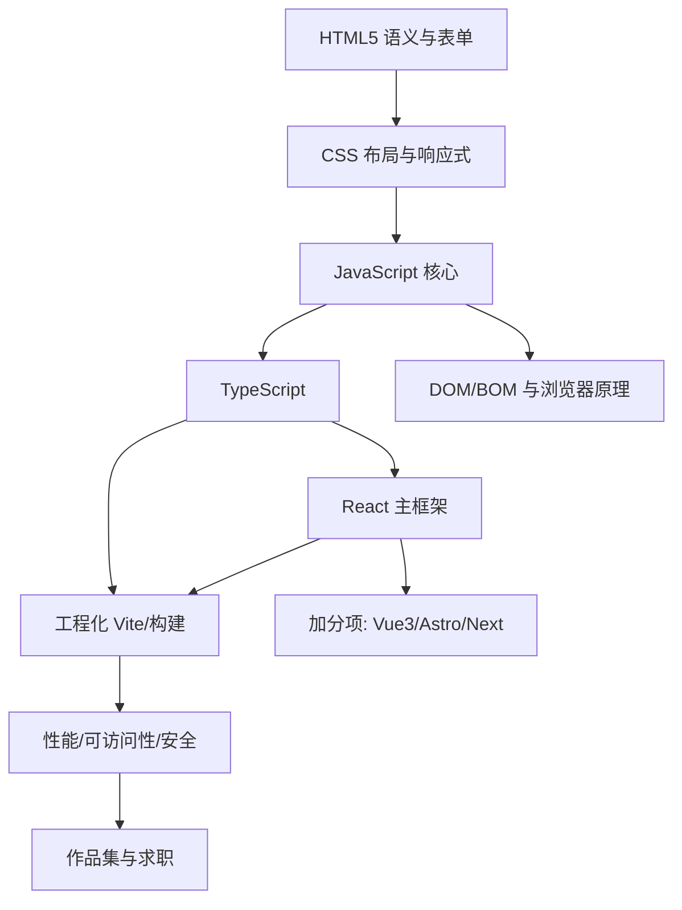

## 岗位画像

前端工程师负责"用户看到和摸到的一切"：网页、小程序、Hybrid APP 的界面层。日常工作是把设计稿变成可交互的页面、调接口渲染数据、优化加载与操作性能。

2026 年市场概况：前端仍是初级岗位供给最多的方向（约五分之一的招聘面向 entry level），React 需求显著高于 Vue，TypeScript 已是大厂默认配置，AI 辅助开发成为默认技能。薪资阶梯大致为：实习/初级（会框架能干活）→ 中级（独立负责模块、懂工程化）→ 高级（架构选型、性能与稳定性负责人）。

这条路线的产物是**四个可以点开就用的网页项目**，全部部署上线、代码在 GitHub 上。

## 技能树

必学主线：HTML5 → CSS → JavaScript → TypeScript → React → Vite。加分项按兴趣二选一深学（Vue3 或 Next.js），其余了解即可。

## 阶段 1（第 1 到 3 个月）：三件套地基

**第 1 个月：HTML5 与 CSS 入门**

- [HTML5 模块](/html5/010-WhatIsWebpage) 前三个学习阶段：语义标签、图文列表、表单媒体；
- [CSS 模块](/css/010-WhatIsCSS) 前两个阶段：盒模型、选择器、文字颜色背景；
- 并行：git 模块阶段 1，从此所有练习代码进 GitHub；
- 检验项目一：**纯 HTML/CSS 复刻一个你常用的页面**（如某官网首页的静态版）。要求：语义化标签占比高、不用任何框架、手机上打开不破版。

**第 2 个月：CSS 进阶与 JS 启动**

- CSS 模块后三阶段：Flex 与 Grid 两套布局、过渡动画、响应式（媒体查询与移动优先）；
- [JavaScript 模块](/javascript/010-WhatIsJavaScript) 前半：语法、函数、对象、数组方法；
- 检验项目二：**Todo List（原生 JS 版）**。要求：增删改查、localStorage 持久化、无框架、代码用函数组织。

**第 3 个月：JS 核心 hard parts**

- JavaScript 模块中段：原型与 this、闭包、事件循环与异步（Promise/async-await）、DOM 事件机制；
- 每天 1 道 [算法模块](/algorithm/010-AlgorithmAnalysisBasics) 简单题（数组与字符串为主）；
- 阶段验收：能对着 DevTools 讲清"一段 JS 是怎么被解析执行的""一个点击事件从发生到响应的完整旅程"。

## 阶段 2（第 4 到 6 个月）：框架与类型系统

**第 4 个月：TypeScript 与 React 入门**

- [TypeScript 模块](/typescript/010-WhyTypeScript) 前两阶段：基础类型标注、接口与泛型入门；
- [React 模块](/react/010-OverviewEnvSetup) 前两阶段：组件、JSX、状态与 Hooks；
- 把项目二用 React 重写一遍，体会"框架帮你管理了什么"。

**第 5 个月：React 深入与数据流**

- React 模块后两阶段：副作用与生命周期、路由（React Router）、Context、性能优化（memo/useMemo）、服务端组件认知；
- 接入真实公开 API（如天气、影视数据）练习数据获取、加载态、错误态三件套；
- 检验项目三：**数据驱动的中型应用**（如影单/记账/看板）。要求：TS 编写、路由分页、请求封装与错误处理、响应式布局。

**第 6 个月：工程化**

- [Vite 模块](/vite/010-ViteOverview) 全读：构建、环境变量、代理、产物分析；
- [Tailwind 模块](/tailwind/010-TailwindOverview) 通读并用于项目三的样式重构（原子化 CSS 是当前主流工程实践）；
- ESLint + Prettier 统一规范，给项目补 README 与部署（GitHub Pages 或 Vercel）；
- 阶段验收：项目三完成"从本地到上线"全流程，手机可访问。

## 阶段 3（第 7 到 12 个月）：深度、广度与求职

**第 7 到 8 个月：浏览器原理与性能**

- HTTP 与浏览器：[networking 模块](/networking/010-NetworkBasicsAndProtocol) 的 HTTP/HTTPS/缓存部分 + 浏览器渲染流程（cs-fundamentals 相关篇）；
- 性能优化实战：用 Lighthouse 对项目三做体检，落实懒加载、代码分割、图片优化，记录优化前后数据；
- 加分项启动：二选一——[Vue3 模块](/vue3/010-OverviewEnv)（国内市场补充）或 [Next.js 模块](/nextjs/010-NextJS16Overview)（全栈化方向）。

**第 9 到 10 个月：检验项目四（作品集主项目）**

自选一个有真实用户的完整产品，要求：Next.js 或 React + TS + Tailwind + 真实后端（Supabase 之类的 BaaS 也算）、登录态、CRUD、响应式、Lighthouse 性能分 85 以上、部署上线、README 含截图与架构说明。可选方向：个人知识库、二手交易板、社区打卡站。

**第 11 到 12 个月：求职冲刺**

- 简历：以项目为骨架（每个项目三行：做了什么、怎么做的、量化结果）；
- 面试八股按本库索引复习：JS 高频（闭包/原型/事件循环）、CSS 布局原理、React 渲染机制、HTTP 缓存、算法 200 题量级；
- 模拟面试：让 AI 扮演面试官按八股与项目深挖（AI 教练角色的求职应用）。

## 常见弯路

1. **CSS 没练够就冲框架**：布局手感不足的人在框架里只会抄样式，遇到自定义布局立刻瘫痪。阶段 1 的两个项目不许跳；
2. **JS 半吊子直接上 React**：闭包与异步没通，hooks 的心智模型就是玄学。JS 模块的中段是整个路线最不能省的部分；
3. **收藏教程当学习**：看 10 个视频不如做 1 个项目。路线中每个项目的完成标准都写死了，按标准来；
4. **React 和 Vue 同时学**：初学阶段组件化思想学一遍就够，双框架是进阶后的广度扩展；
5. **项目躺在 localhost 里**：没有线上地址的项目在简历上等于不存在。部署是肌肉记忆，第 6 个月起每个项目都上线。

## 求职准备清单

- GitHub 三个以上绿色仓库，README 规范（截图、技术栈、本地运行说明）；
- 线上作品集站点（它本身就是项目四）；
- 算法：LeetCode 简单题 100 道以上 + 中等题 50 道的量级；
- 八股：JS/CSS/React/HTTP 四大块的本库对应文档通读并自测；
- 每次投递后复盘面试题，补进自己的错题本。

## 下一步

按阶段 1 第 1 周计划开始：今天就读 [HTML 是什么](/html5/010-WhatIsWebpage)。若你更适合服务端方向，转看 [Java 后端路线](/roadmap/030-BackendJavaRoute) 或 [Go 后端路线](/roadmap/040-BackendGoRoute)。
