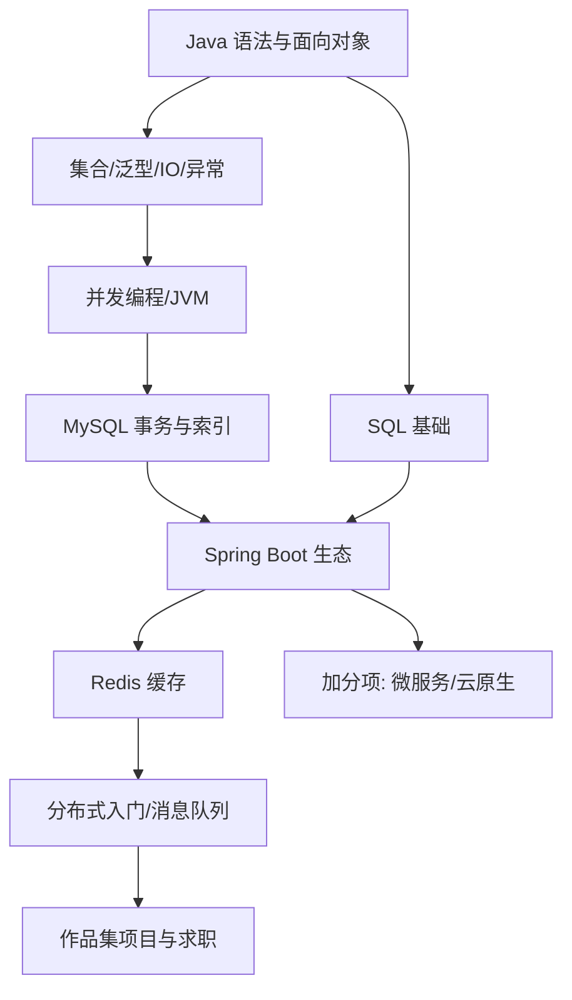

## 岗位画像

Java 后端工程师的工作，藏在每次"提交订单后银行扣了款、页面却转圈"的时刻背后：处理业务逻辑、设计数据库、对外提供接口、保证并发与稳定。你在手机上点一杯奶茶，订单进队列、库存被扣减、支付被回调——这条链路的每一环，大概率都跑在 Java 服务上。国内银行、保险、政务、电商、大数据基建的存量系统绝大多数是 Java 写的，岗位绝对数量长期居后端首位。

2026 年现状：初级岗位竞争激烈，企业筛选更看重"基础 + 项目"双硬——JVM/并发/MySQL 是面试三座大山，框架只是入场券。同时，超过一半的技术岗位默认你会用 AI 协作开发（协作纪律见 [AI 协作开发指南](/roadmap/150-AICollabWorkflow)）。这条路线的产物是**一个完整上线的 Spring Boot 项目加扎实的八股底座**。

## 技能树

```mermaid
flowchart TD
    A[Java 语法与面向对象] --> B[集合/泛型/IO/异常]
    B --> C[并发编程/JVM]
    C --> D[MySQL 事务与索引]
    A --> E[SQL 基础]
    D --> F[Spring Boot 生态]
    E --> F
    F --> G[Redis 缓存]
    G --> H[分布式入门/消息队列]
    H --> I[作品集项目与求职]
    F --> J[加分项: 微服务/云原生]
```

必学主线：Java → SQL/MySQL → Spring Boot → Redis。加分项：消息队列、微服务、Docker 部署。

## 阶段 1（第 1 到 3 个月）：语言地基

**第 1 个月：第一小时 + 语言核心启动**

先花一小时确认"这条路你走得动"：装好 JDK（[Java 模块](/java/010-WhatIsJava) 环境篇），终端运行 `java --version`，再打开 `jshell`（JDK 自带的交互式解释器）敲下 `2 + 3` 与 `"abc".length()`。十分钟的黑窗体验胜过十分钟的纠结。然后：

- Java 模块阶段一：语法、流程控制、方法与数组，每天手敲 30 行以上；
- 并行：[git 模块](/git/010-Git) 阶段 1——从第一天起，所有练习代码进自己的 GitHub 仓库，commit 历史就是未来的协作素养证明。

**第 1 到 2 个月：面向对象与集合（Java 核心）**

- Java 模块前半（对应学习路径阶段一、二）：面向对象三特性、常用 API、集合框架、异常、泛型、IO；
- 动手项目：**Git 提交记录分析器**（命令行版 → 文件版）。读一个仓库的提交历史，统计每位作者的提交数与活跃时段，输出 CSV 报告。命令行版练面向对象拆分（Commit、Author、Report 各管各的），文件版练 IO 与集合综合。它比传统"管理系统"课设更接近真实工程：数据是活的、需求是你自己的；
- 并行：SQL 模块第一、二阶段（后端面试 SQL 是必考且必拿分的部分）。

**第 3 个月：进阶语言特性**

- Java 模块中段：多线程基础（Thread/synchronized）、JVM 内存区域与垃圾回收初步、Lambda 与 Stream；
- [算法模块](/algorithm/010-AlgorithmAnalysisBasics) 保持每周 3 题（Java 实现）；
- 阶段验收：能手写生产者消费者模型，能画出 JVM 运行时数据区，能解释 ArrayList 与 LinkedList 的取舍——三个都说清，才算阶段 1 毕业。

## 阶段 2（第 4 到 6 个月）：数据库与框架

**第 4 个月：MySQL 体系化**

- [MySQL 模块](/mysql/020-Roadmap) 按学习路径全读：设计范式、存储引擎、索引原理（B+ 树）、事务与锁、执行计划调优；
- 检验项目一：**设计一个电商订单库**（表结构 + 索引设计文档 + 10 个典型查询的 EXPLAIN 分析）。这是面试里"讲讲你的索引设计"的弹药库，写完让 AI 按面试官视角连环追问（追问纪律见 [AI 协作开发指南](/roadmap/150-AICollabWorkflow)）。

**第 5 到 6 个月：Spring Boot 上手与首个 Web 项目**

- Java 模块的 Web/Spring 相关章节（学习路径阶段五起）：Spring IoC/AOP 心智模型、Spring MVC、MyBatis 或 Spring Data JPA、参数校验与全局异常；
- 检验项目二：**稍后读（书签收藏）服务后端**——注册登录 JWT、书签 CRUD、标签与全文检索、分页、参数校验、统一响应结构、OpenAPI 接口文档。它是你每天真的会用的工具，比"博客系统"多一个真实需求：URL 去重与过期链接清理，正好练定时任务。要求用 Postman 全量自测，接口文档可交付。

## 阶段 3（第 7 到 12 个月）：并发、缓存、分布式与求职

**第 7 到 8 个月：并发与 JVM 深入**

- 并发：线程池、锁、CAS、并发容器、volatile 与内存可见性（Java 模块并发章节 + cs-fundamentals 的并发模型篇对照阅读）；
- JVM：类加载、GC 算法与收集器、内存排查工具（jmap/jstat，以及 Arthas 在线诊断的认知级使用）；
- 每天 1 算法题，开始覆盖高频数据结构（链表/二叉树/哈希）。

**第 9 个月：Redis 与接口进阶**

- [Redis 模块](/redis/010-OverviewCoreDataStructure) 核心章节：五大数据结构与场景、持久化、缓存三大问题（穿透/击穿/雪崩）与一致性方案；
- 给项目二的稍后读服务接入 Redis：热门书签缓存、登录态、接口限流；
- 检验项目三：**缓存改造报告**（改造前后的压测数据对比 + 缓存策略说明文档）。没有数据对比的报告，在面试里只是作文。

**第 10 个月：检验项目四（作品集主项目）**

二选一，都要求：Spring Boot 3 + MySQL + Redis + 消息队列（RabbitMQ 或 RocketMQ 入门级使用）+ Docker Compose 一键启动 + 完整 README（架构图、表设计、压测数据、踩坑记录），部署到一台云服务器（devops 模块的 Linux 与 Docker 章节支持）：

- **选项 A：限量抢购后端**——库存预热、请求削峰（消息队列）、防超卖（数据库乐观锁或 Redis 原子操作）、压测报告。这是并发三件套的最小完整闭环；
- **选项 B：AI 应用网关**——API Key 管理、按用户的配额与限流、调用计费与用量报表、上游大模型接口的代理与重试。2026 年企业真实在建的系统，简历差异化极强。

**第 11 到 12 个月：求职冲刺**

- 八股复习地图：Java 基础 → 集合 → 并发 → JVM → MySQL → Redis → Spring → 计算机网络（TCP/HTTP）→ 操作系统常识，全部指向本库对应文档；
- 算法累计 150 题量级（简单 100 + 中等 50）；
- 项目深挖演练：让 AI 对项目四连环追问（"为什么用 B+ 树""缓存不一致怎么办""消息丢了怎么办"），直到每个设计都能自圆其说。

## 常见弯路

1. **只背八股不写代码**：八股是复习工具不是学习工具。顺序必须是"项目先行、八股复盘"，反过来就是背了忘忘了背；
2. **跳过 SQL 与 MySQL 原理**：很多自学者 MyBatis 用得飞起但解释不了索引下推。后端面试的分水岭恰恰在数据库底层；
3. **并发与 JVM 一开始就啃书**：没有多线程代码体感前读《深入理解 JVM》必弃。正确顺序是先让代码出问题、再带着问题学原理；
4. **项目停留在课设水平**：管理系统类项目人人都有。差异化的下限是"带并发/缓存元素的主项目"，上限是选项 B 这种新场景项目；
5. **不用 git、不写文档**：后端工程师的协作素养从第一天就该体现在 commit 历史与 README 里。

## 求职准备清单

- 一个 Docker 化部署、可公网访问的主项目；
- 数据库设计文档与压测报告各一份（项目一、三的产物）；
- 八股错题本（按上面九大块组织，全部链接到本库文档）；
- 算法 150 题量级 + 手写单例/生产者消费者/快排不出错；
- 简历每条项目描述都有量化数据（QPS、响应时间、缓存命中率）。

## 下一步

从 [Java 是什么](/java/010-WhatIsJava) 开始进入语言地基。若想要更简洁的语言与云原生生态，看 [Go 后端路线](/roadmap/040-BackendGoRoute)；偏好数据与 AI 方向看 [Python 与 AI 路线](/roadmap/050-BackendPythonAIRoute)。
