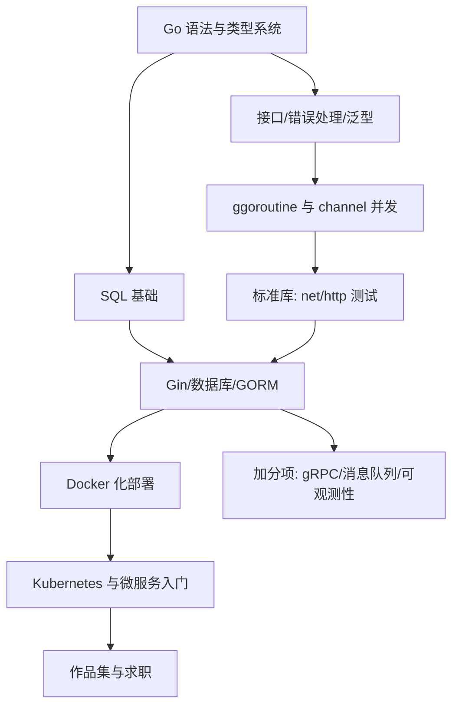

## 岗位画像

Go 后端工程师写高并发服务与基础设施：API 网关、微服务、中间件、云原生工具链。Go 语法极简（规范只有 25 个关键字量级）、并发模型直观、编译产物是单个二进制文件，天然贴合 Docker 与 Kubernetes 生态。

2026 年现状：Go 岗位集中在云厂商、基础设施公司、出海企业与量化金融，总量小于 Java 但竞争者也更少、技术栈更新。适合人群：喜欢简洁设计、对底层与云原生有兴趣、愿意在"岗位少一点但纵深一点"的市场竞争的人。路线产物：**一个容器化部署的 Go 服务加对云原生工具链的实操认知**。

## 技能树

必学主线：Go → SQL/MySQL → Web 框架 → Docker/K8s 入门。加分项：gRPC、可观测性（日志/指标/链路）。

## 阶段 1（第 1 到 3 个月）：语言与工程习惯

**第 1 个月：Go 基础**

- [Go 模块](/go/010-WhatIsGo) 前半：语法、切片与映射、结构体与方法、错误处理哲学（错误是值）；
- 动手项目：命令行 Todo（文件持久化）→ 简单爬虫（练 goroutine 基础并发抓取）；
- 并行：git + [SQL 模块](/sql/010-WhatIsDatabase) 第一、二阶段。

**第 2 个月：并发模型（Go 的灵魂）**

- Go 模块并发章节全读：goroutine 调度直觉、channel 通信、select、sync 包、context 取消传播；
- cs-fundamentals 的并发模型篇对照阅读（理解 CSP 与共享内存两大学派的差异）；
- 检验项目一：**并发文件处理器**——并发扫描目录、统计词频，要求：可控并发数（worker pool）、context 超时、无数据竞争（用 `go run -race` 验证）。

**第 3 个月：工程化 Go**

- 接口设计、泛型使用边界、测试（表驱动测试）、模块管理（go.mod）、项目布局规范；
- 算法每周 3 题（Go 实现）；
- 阶段验收：能解释"不要通过共享内存来通信"并给出代码例子；能给自己的包写出表驱动测试。

## 阶段 2（第 4 到 6 个月）：Web 服务与数据库

**第 4 个月：标准库 Web 与 MySQL**

- net/http 标准库先手写一个极简服务（理解 Handler 与中间件本质）；
- [MySQL 模块](/mysql/020-Roadmap) 索引、事务、调优核心章节；
- 动手：手写路由 + 手写日志/恢复中间件各一个，再用框架对比。

**第 5 个月：Gin 与完整服务**

- Gin 框架：路由分组、中间件、参数绑定校验；GORM 或 sqlx 选其一深入；
- JWT 鉴权、统一错误响应、优雅关闭（信号处理）；
- 检验项目二：**短链接服务**——缩短/跳转/访问统计/过期，MySQL 存储 + Redis 缓存热点，压测（wrk 或 hey）并记录 QPS 数据。

**第 6 个月：容器化与 CI**

- [devops 模块](/devops/010-OverviewLinuxBasics) Linux 与 Docker 章节：为项目二写多阶段构建 Dockerfile（产物镜像压到 20MB 内）、写 Compose 编排（app + MySQL + Redis）、配一条 GitHub Actions 自动测试与构建；
- 阶段验收：项目二在新电脑上用 `docker compose up` 一条命令跑起来。

## 阶段 3（第 7 到 12 个月）：微服务、云原生与求职

**第 7 到 8 个月：服务治理入门**

- gRPC 与 protobuf（对比 REST 的场景取舍）、服务间通信、配置管理（viper）、结构化日志（slog/zap）；
- 网络必修：[networking 模块](/networking/010-NetworkBasicsAndProtocol) 的 TCP/HTTP/负载均衡部分（写基础服务的人必须懂下层）；
- 检验项目三：**把短链服务拆成两个 gRPC 服务**（生成服务 + 统计服务），含服务发现的最简实现（或引入 Consul/etcd 认知级使用）。

**第 9 个月：Kubernetes 入门**

- devops 模块 K8s 章节 + cloud-computing 模块容器编排部分：Pod/Deployment/Service/Ingress 四件套，用 kind 或 minikube 本地集群把项目三部署上去；
- 可观测性三件套认知：Prometheus 指标、结构化日志聚合、分布式追踪概念。

**第 10 个月：检验项目四（作品集主项目）**

自选方向（API 网关、分布式任务调度、简易对象存储、高并发计数服务），要求：Go 1.2x + gRPC 或 HTTP + MySQL + Redis + Docker Compose 或 K8s 部署清单 + 压测报告 + 架构决策记录（为什么这么设计、放弃了什么方案）。

**第 11 到 12 个月：求职冲刺**

- 八股地图：Go 运行时（调度/GC/内存）、并发原语、slice/map 底层、MySQL、Redis、网络、Docker/K8s 原理，链接本库文档逐块过；
- 算法 150 题量级；手写跳表概念、限流器、连接池等 Go 风格手撕题；
- 用 AI 面试官深挖项目四的每一个技术选型。

## 常见弯路

1. **用其他语言的直觉写 Go**：Java 习惯的继承式设计、异常式错误处理在 Go 里都是反模式。入乡随俗：组合优于继承、错误显式返回；
2. **goroutine 滥用**：以为开得越多越快，不懂 worker pool 与背压控制，项目一就是纠正这个认知的；
3. **跳过标准库直接框架**：net/http 没写过的人学 Gin 只会配路由，中间件与上下文机制全靠猜；
4. **忽视云原生配套**：Go 的市场溢价一大半来自"会部署会运维"。Docker 与 K8s 不是加分项，是这个方向的基本功；
5. **不写压测数据**：Go 面试官最爱问"多快、怎么证明"。benchmark 与压测报告从项目二开始积累。

## 求职准备清单

- 一个 K8s 或 Compose 部署的主项目 + 压测报告；
- 并发正确性证明习惯（-race 全绿）；
- Go 运行时与并发的自测笔记（链接本库文档）；
- 算法 150 题量级；
- 简历项目描述带 QPS/P99 延迟/镜像体积等硬数据。

## 下一步

从 [Go 是什么](/go/010-WhatIsGo) 开始。若岗位数量优先，转 [Java 后端路线](/roadmap/030-BackendJavaRoute)；对基础设施本身更着迷，看 [云与运维路线](/roadmap/090-DevOpsCloudRoute)。
