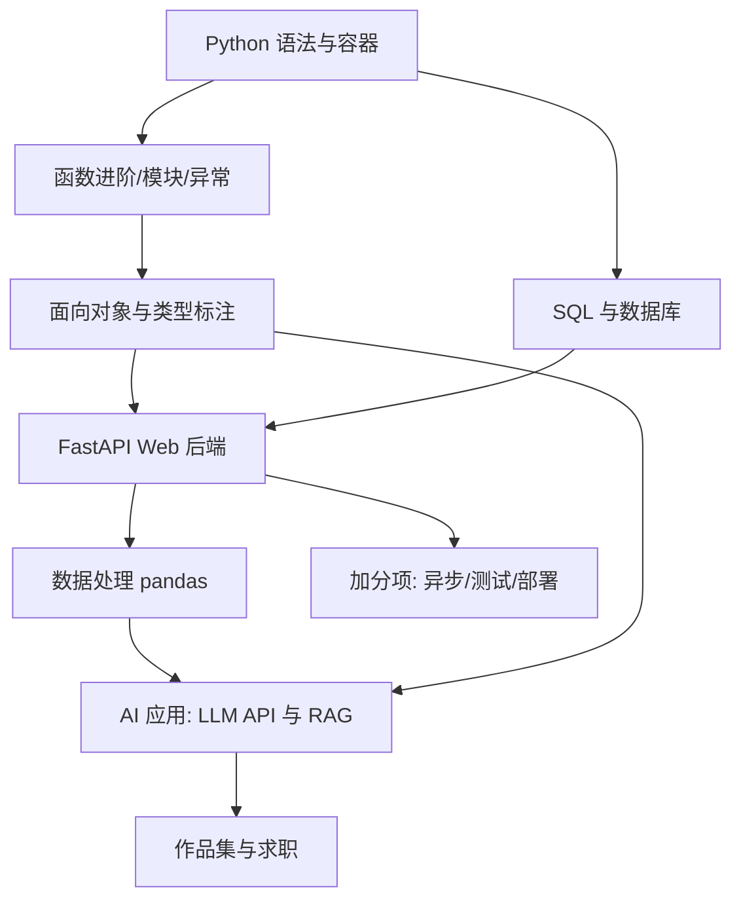

## 岗位画像

Python 方向岗位分三块：Web 后端（Django/FastAPI）、数据处理与分析（爬虫/ETL/BI）、AI 应用开发（调用大模型 API 构建产品、RAG 系统、Agent 工作流）。2026 年的现实分工：模型训练研究岗集中在硕博与工程化能力双强的人群，而 **AI 应用开发岗对普通开发者打开**——把 LLM 能力组装进产品，恰恰考验的是后端工程与数据功底。

本路线定位：以 Python 后端与数据能力为主干，AI 应用为差异化武器。产物：**两个数据驱动的实用系统加一个上线的 AI 应用**。

## 技能树

必学主线：Python → SQL → FastAPI → pandas → LLM 应用开发（API 调用、提示工程、RAG、评测）。加分项：爬虫合规实践、异步编程、模型微调认知。

## 阶段 1（第 1 到 3 个月）：Python 地基与数据入场

**第 1 到 2 个月：语言核心**

- [Python 模块](/python/010-WhatIsPython) 前半：语法、容器（列表/字典/集合/元组）、函数进阶（参数解包、装饰器直觉）、模块与包、异常、文件处理、面向对象基础；
- 动手项目：命令行记账（若未做）→ 批量文件整理器（按规则重命名/归档几百个文件，体验自动化威力）；
- 并行：git + [SQL 模块](/sql/010-WhatIsDatabase) 第一、二阶段。

**第 3 个月：进阶与数据初体验**

- 类型标注（typing，AI 时代的协作刚需）、虚拟环境（venv）与 pip、标准库精选（pathlib、collections、itertools）；
- pandas 入门：读写 CSV/Excel、筛选、分组聚合——用一份公开数据集（如某城市房价）完成一份分析报告；
- 检验项目一：**数据清洗与分析报告**——原始脏数据进，干净数据与图表结论出，全程脚本化可复现（数据文件 + 脚本 + 结论 README 入库）。

## 阶段 2（第 4 到 6 个月）：Web 后端与数据库

**第 4 个月：MySQL 与建模**

- [MySQL 模块](/mysql/020-Roadmap) 设计、索引、事务核心章节；SQL 模块收尾（窗口函数）；
- 动手：把项目一的数据入库，用 SQL 重做同样的分析（对比 pandas 与 SQL 的思维方式）。

**第 5 个月：FastAPI 后端**

- [Python 模块](/python/010-WhatIsPython) Web 章节：FastAPI 路由、Pydantic 校验、依赖注入、SQLAlchemy/数据库会话、JWT 鉴权、自动接口文档；
- 动手：给项目一的分析能力包一层 API（上传数据、异步任务、查询结果下载）。

**第 6 个月：工程化与检验项目二**

- pytest 测试、日志、配置分离、Docker 化部署（devops 模块配套）；
- 检验项目二：**迷你 BI 平台**——数据上传、SQL 查询工作台、图表看板、用户登录。要求：FastAPI + MySQL + 前端可用任意方案（模板或简单 React），部署上线，README 完整。

## 阶段 3（第 7 到 12 个月）：AI 应用与求职

**第 7 个月：AI 基础与 LLM API**

- cs-fundamentals 的 [AI 基础](/cs-fundamentals/610-AIFundamentals) 打底；了解大模型能力边界（上下文、幻觉、成本）；
- 动手：直接调 OpenAI 兼容 API（国内可用各家兼容端点）实现：多轮对话、流式输出、结构化输出（JSON mode）、函数调用（tools）。

**第 8 个月：RAG 与 Agent**

- 提示工程系统方法：角色、约束、少样本、思维链；建立自己的提示模板库；
- RAG 全流程：文档切分、向量化、相似检索、重排、引用溯源（用 FAISS 或 pgvector，认知向量库原理即可）；
- Agent 工作流：工具调用循环、任务分解、失败重试；
- 检验项目三：**个人知识库问答（RAG）**——导入自己的笔记/PDF，带引用来源的问答系统，评测 20 个问题的准确率并记录。

**第 9 到 10 个月：检验项目四（作品集主项目）**

自选一个真实场景的 AI 应用（简历分析器、合同要点提取、客服工单分流、学习教练 Bot），要求：FastAPI + MySQL（业务数据）+ 向量检索 + LLM 编排 + 前端界面（可用 Next.js 或 Gradio）+ 成本与延迟预算（每次调用的 token 与耗时统计）+ 评测集（30 条用例的通过率报告）+ 部署上线。

**第 11 到 12 个月：求职冲刺**

- 方向对口的复习地图：Python 高频（GIL、装饰器、生成器、异步）、SQL 与 MySQL、FastAPI、pandas、LLM 原理常识（Transformer 直觉、RAG 调优、幻觉抑制）；
- 算法 120 题量级（该方向面试算法权重略低于 Java/Go，但 SQL 手写题权重高）；
- 项目深挖：让 AI 按"为什么选 RAG 不选微调""怎么处理幻觉""成本怎么算"连环追问。

## 常见弯路

1. **在 NumPy 手写算法层起步**：零基础直接学机器学习数学，三个月后弃坑。本路线刻意把 AI 放在第 7 个月之后——先有工程底座，AI 才是能力放大器；
2. **爬虫当主业**：爬虫技能在 2026 年是辅助技能，且合规风险高（违法抓取是法律红线，见 [网络安全模块](/cybersecurity/010-SecurityBasicsDefense)）。会爬、懂合规、不主打；
3. **AI 应用只调 API 不做评测**：没有评测集的 AI 项目在面试里一问就露馅。评测意识是这个方向最稀缺的素养；
4. **忽视 SQL**：数据方向面试 SQL 手写是必考且最容易拿的分；
5. **pandas 当 Excel 用**：会 read_csv 不等于会数据分析，分析思维（假设、验证、可视化叙事）才是内核。

## 求职准备清单

- 一个上线 AI 应用 + 评测报告；一个数据项目 + 可复现分析仓库；
- 提示工程与 RAG 的自建模板库（这就是面试作品）；
- SQL 手写熟练（窗口函数、分组 TopN）；
- 算法 120 题量级；
- 简历量化：数据规模、准确率提升、成本节省、延迟数据。

## 下一步

从 [Python 是什么](/python/010-WhatIsPython) 开始。若只想做纯后端且偏好类型严格的生态，看 [Node 全栈路线](/roadmap/060-FullStackNodeRoute)；对模型底层好奇者并行推进 [系统编程路线](/roadmap/080-SystemRoute) 的基础段。
