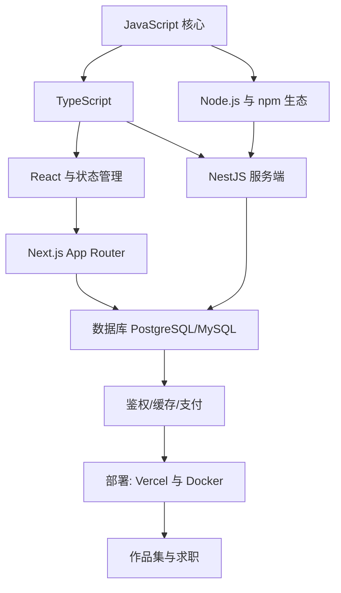

## 岗位画像

Node 全栈工程师用同一种语言（TypeScript）覆盖前端与后端：React/Next.js 做界面，Node/NestJS 做服务，一个数据库加一个部署平台交付完整产品。2026 年市场里这是组合需求最大的技能包（React + TS + Node 长期霸榜），尤其受小团队、初创公司与出海产品欢迎——它们需要"一个人能扛一条产品线"的人。

与 [前端路线](/roadmap/020-FrontendRoute) 的分工：前端路线到 80 分（界面层精通），本路线追求 60 + 60（前后端都能独立交付）。适合人群：想快速做出完整产品、对创业或独立开发有兴趣、或目标中小厂全栈岗的人。产物：**两个上线运行的完整产品**。

## 技能树

必学主线：JS → TS → React → Next.js → NestJS → SQL → 部署。加分项：Prisma/Drizzle ORM、Redis、支付集成。

## 阶段 1（第 1 到 3 个月）：同构语言地基

**第 1 个月：JS 与 Node 环境**

- [JavaScript 模块](/javascript/010-WhatIsJavaScript) 前半（语法、函数、对象、数组方法）+ Node 基础（模块系统、文件操作、npm 脚本）；
- 动手：命令行小工具两个（Markdown 转 HTML 雏形、批量重命名）——Node 直接操作文件与系统，全栈感从这里开始；
- 并行：git + [Markdown 模块](/markdown/010-SyntaxGuide)（本路线要写大量文档）。

**第 2 个月：TypeScript 与异步**

- [TypeScript 模块](/typescript/010-WhyTypeScript) 前两阶段：类型标注、接口、泛型、类型收窄；全栈路线 TS 是硬门槛（前后端共享类型是这个路线的核心红利）；
- JS 模块异步章节：事件循环、Promise、async/await——前后端通吃的核心机制；
- 检验项目一：**全栈 Todo API + CLI 客户端**——Node + TS 写一个 REST API（内存存储即可），再写一个命令行客户端调用它，两端共享同一套类型定义。

**第 3 个月：React 与数据库入门**

- [React 模块](/react/010-OverviewEnvSetup) 前两阶段 + [Vite 模块](/vite/010-ViteOverview)；
- [SQL 模块](/sql/010-WhatIsDatabase) 第一、二阶段 + PostgreSQL 或 MySQL 二选一（本路线推荐 PostgreSQL，[模块入口](/postgresql/010-OverviewInstallConfig)）；
- 阶段验收：能把项目一的内存存储换成真数据库，用 SQL 完成全部数据操作。

## 阶段 2（第 4 到 6 个月）：框架双修

**第 4 个月：Next.js 全栈框架**

- [Next.js 模块](/nextjs/010-NextJS16Overview) 前半：App Router 路由、服务端组件与客户端组件心智模型、数据获取与缓存、Server Actions 表单；
- 动手：把 React 版 Todo 迁移到 Next.js，体会"前后端在一个仓库里"的体验。

**第 5 个月：NestJS 服务端**

- [NestJS 模块](/nestjs/150-NestJSOverview) 前半：模块/控制器/提供者、依赖注入、DTO 与校验管道、TypeORM 或 Prisma 连库、JWT 鉴权；
- 理解 Next 直连数据库与独立后端服务的边界：什么规模该拆出 NestJS。

**第 6 个月：检验项目二**

- 完整产品：**团队任务看板**（类似轻量 Trello）——Next.js 界面 + NestJS API + PostgreSQL + JWT 登录 + 拖拽看板 + 邮箱注册验证；
- 工程要求：接口文档自动生成、错误统一处理、Docker Compose 本地一键起、部署上线（Vercel + 托管数据库，或一台 VPS 全自管）。

## 阶段 3（第 7 到 12 个月）：产品化能力与求职

**第 7 到 8 个月：生产级课题**

- 缓存与性能：Redis 入门（会话/热点缓存/限流）+ Next.js 缓存策略调优 + Lighthouse 性能达标；
- 网络与安全必修：[networking 模块](/networking/010-NetworkBasicsAndProtocol) HTTP/HTTPS 部分 + [cybersecurity 模块](/cybersecurity/010-SecurityBasicsDefense) 的 Web 安全（OWASP 常见项在自家项目里自查修复）；
- 检验项目三：**项目二的生产化改造报告**——安全清单修复、缓存前后压测对比、错误监控接入（Sentry 类工具）。

**第 9 到 10 个月：检验项目四（作品集主项目）**

自选真实需求产品（预订系统、二手市场、在线教育小站、AI 套壳应用皆可），要求：Next.js + NestJS + PostgreSQL + Redis + 支付沙箱或第三方登录 + 移动端适配 + 全链路部署（前后端分离部署）+ README 含架构图与决策记录。加分：给项目写一份"从 0 到 1"复盘文档。

**第 11 到 12 个月：求职冲刺**

- 复习地图：JS/TS 高频、React 渲染与状态、Next 缓存与渲染策略、Nest 依赖注入与生命周期、SQL、HTTP、常见安全项；
- 算法 120 题量级 + 手写 Promise.all 限流、深拷贝、防抖节流；
- 全栈面试的差异化武器：现场讲清"一个请求从浏览器到数据库再回来的完整旅程"（把网络、框架、数据库串成一条线，本库文档全部能支撑）。

## 常见弯路

1. **前后端都是半吊子**：全栈路线最大的风险是两头都不深。对策：阶段 2 起明确"界面用 Next 惯例、后端按 Nest 规范"，各按其生态最佳实践写，不发明土框架；
2. **Next.js 当万能药**：服务端组件心智没建立就上手，缓存行为全是玄学。Next 模块的渲染策略章节必须精读；
3. **跳过 SQL 用 ORM 到黑盒**：ORM 是效率工具不是认知替代品，面试与排障最终都要回到 SQL；
4. **不部署**：全栈路线的说服力全在"能访问的 URL"上，localhost 项目对本方向杀伤力最大；
5. **UI 自己瞎设计**：用成熟组件库（shadcn/ui 之类）快速起步，把时间花在业务与工程上。

## 求职准备清单

- 两个线上可访问的完整产品（项目二、四）；
- 一份生产化改造报告（安全 + 性能 + 监控）；
- 全链路请求旅程的自述笔记；
- 算法 120 题量级；
- 简历按产品维度组织（每个产品：业务、架构、量化指标）。

## 下一步

从 [JavaScript 是什么](/javascript/010-WhatIsJavaScript) 开始。若更想在某一层做深（纯前端或纯后端），回看 [前端路线](/roadmap/020-FrontendRoute) 与各后端路线；对产品上线与运维更有兴趣则加看 [云与运维路线](/roadmap/090-DevOpsCloudRoute)。
