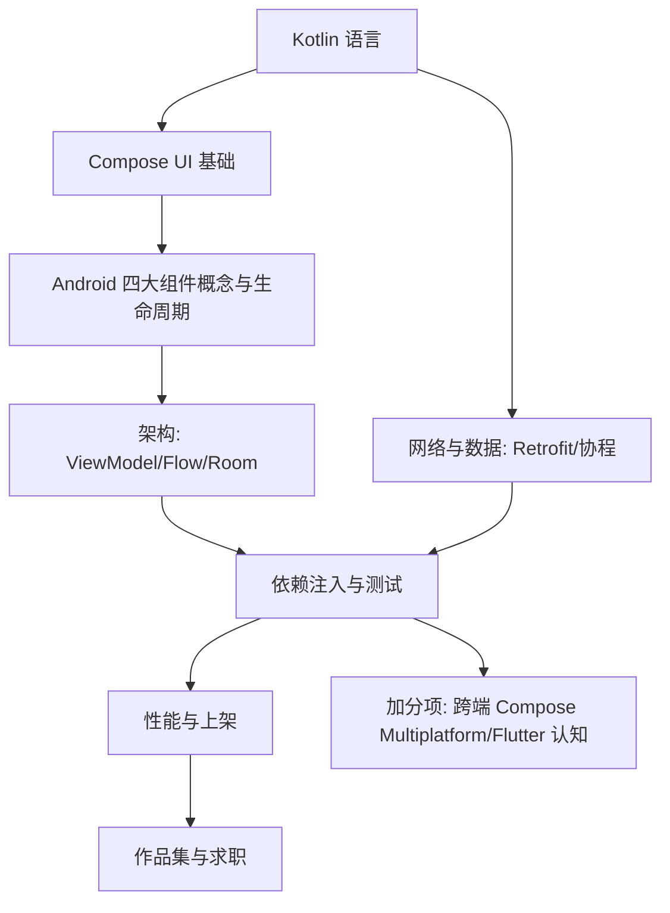

## 岗位画像

移动端工程师开发手机 APP。2026 年的市场格局：Android 岗位以 Kotlin + Jetpack Compose 为现代标配（Java 代码存量仍大但增量项目基本是 Kotlin），iOS 岗位要求 Swift + SwiftUI 与 macOS 设备。国内 Android 岗位量约为 iOS 的两倍以上，且安卓学习成本低（无需苹果设备），**本路线以 Android 为主线，iOS 与跨端作为延伸**。

适合人群：对手机应用有产品热情、能接受"UI 细节打磨占大量时间"的人。产物：**三个能装在自己手机上日常使用的 APP，其中一个上架应用市场或分发渠道**。

## 技能树

必学主线：Kotlin → Compose → Android 架构 → 网络 → 上架流程。加分项：跨端认知、CI 打包、性能剖析。

## 阶段 1（第 1 到 3 个月）：Kotlin 与第一屏

**第 1 个月：Kotlin 语言**

- [Kotlin 模块](/kotlin/010-WhatIsKotlin) 前半：语法、空安全（ Compared to Java 的最大心智差异）、函数与 Lambda、数据类、集合操作；
- 有 Java 基础者可加速（Kotlin 与 Java 同在 JVM，[Java 模块](/java/010-WhatIsJava) 前半可作背景）；零基础者直接以 Kotlin 入门完全可行；
- 动手：命令行版记账/TODO（复用 001-start 的项目思路，用 Kotlin 重写）。

**第 2 个月：Android 环境与 Compose 入门**

- Android Studio 安装、模拟器与真机调试（开发者模式 + USB 调试）；
- Compose 声明式 UI：组合函数、状态（State）与重组、布局三剑客（Column/Row/Box）、Material 3 组件；
- 动手：静态个人名片页 → 计数器 → 多页面导航（Navigation Compose）。

**第 3 个月：状态与生命周期**

- Activity 生命周期、配置变更与状态保存；ViewModel 存活机制；Flow 响应式数据流入门；
- 检验项目一：**本地记账 APP**——Compose 界面 + Room 数据库 + ViewModel 架构，支持增删查、月度汇总、数据导出 CSV。装到自己手机上用两周，记下所有不顺手的地方（这就是真实需求清单）。

## 阶段 2（第 4 到 6 个月）：联网 APP 与架构

**第 4 个月：网络与数据层**

- Retrofit + OkHttp 网络栈、协程（Kotlin 模块协程章节全读：挂起函数、结构化并发、异常传播）；
- JSON 序列化、错误处理与重试策略；[SQL 模块](/sql/010-WhatIsDatabase) 第一、二阶段（Room 的 SQL 基础）；
- 动手：接一个公开 API（天气/新闻）做成完整 APP。

**第 5 个月：架构与依赖注入**

- 官方推荐架构分层（UI 层/领域层/数据层）、Repository 模式、Hilt 依赖注入、数据流单向流动（UDF）；
- 测试入门：单元测试 ViewModel 与 Repository（[software-testing 模块](/software-testing/010-TestBasicsMethod) 基础章配合阅读）。

**第 6 个月：检验项目二**

- **资讯/内容类 APP**：接真实内容 API 或 RSS，要求：登录（JWT）、列表分页与缓存、收藏离线可用（Room）、深色模式适配、崩溃不上报的稳定版本；
- 阶段验收：给朋友安装使用并收集 5 条反馈，修复后发一个 v1.1。

## 阶段 3（第 7 到 12 个月）：产品化与求职

**第 7 到 8 个月：深度课题**

- 性能：启动优化、列表流畅度（LazyColumn 性能）、内存排查（Profiler）、包体积优化；
- 工程化：多模块拆分认知、GitHub Actions 自动打包（配合 devops 模块 CI 章节）、签名与混淆；
- 后端配合：自己用 [Node 全栈路线](/roadmap/060-FullStackNodeRoute) 的 NestJS 或任意 BaaS 给 APP 配一个私有后端（全栈化是移动端工程师的强差异化）。

**第 9 到 10 个月：检验项目三与四**

- 项目三：**一个解决自己真实需求的 APP**（如习惯打卡、账单导入分析、家庭共享清单），完整走：需求 → 设计 → 迭代两个版本 → 收集真实用户（应用市场或分发渠道上架，或至少 20 个真实用户安装）；
- 项目四（求职主项目）：在项目三基础上完成**作品集级工程**——完整 README（截图、架构图、技术决策）、单元测试覆盖核心逻辑、CI 自动构建、性能数据（启动时间、帧率）。

**第 11 到 12 个月：求职冲刺**

- 复习地图：Kotlin 高频（协程原理、Flow、空安全实现）、Compose 重组机制、Android 生命周期与进程、Room/网络栈、性能优化案例、Java 基础（部分公司仍考）；
- 算法 120 题量级（Android 面试算法权重中等，项目细节追问权重大）；
- 用 AI 面试官对项目四连环深挖：为什么用 Flow 不用 LiveData、Room 缓存一致性怎么保证、启动为什么快了 40%。

## 跨端与 iOS 延伸

- **iOS**：需要 Mac 设备，路线同构：Swift → SwiftUI → 架构 → 上架 App Store，本库暂未覆盖 Swift，可按官方 Apple 教程平移本路线的阶段结构；
- **跨端认知**：Flutter（Dart）与 React Native（JS）各占一方，Compose Multiplatform 是 Kotlin 生态的新选项。策略：**先原生后跨端**——原生功底决定跨端排障上限，跨端是广度扩展不是入门捷径。

## 常见弯路

1. **XML 旧教程当主线**：搜索到的中文教程大量仍是 View 体系。认准 Compose 教学资源，旧体系了解即可（存量代码要能读懂，新代码写 Compose）；
2. **跳过 Kotlin 直接拖控件**：把 Android 当拼图游戏，语言功底为零，协程与架构一问就倒；
3. **不做真机验证**：模拟器流畅不代表真机流畅，低端机是性能问题的照妖镜。第 2 个月起就真机调试；
4. **APP 只是课设水平**：没有真实用户与迭代的 APP 说服力有限。上架与真实反馈是本路线的差异化核心；
5. **忽视后端**：只会调别人 API 的移动工程师天花板明显。会写后端（哪怕简单）的 Android 工程师在中小团队极受欢迎。

## 求职准备清单

- 三个 APP（其中至少一个有真实用户数据或上架记录）；
- 完整 README 与架构图、CI 构建徽章、性能数据；
- Kotlin/Compose/Android 原理自测笔记（链接本库文档）；
- 算法 120 题量级；
- 简历按"产品 + 工程深度"双线组织。

## 下一步

从 [Kotlin 是什么](/kotlin/010-WhatIsKotlin) 开始。若你同时想掌握产品全链路，组合 [Node 全栈路线](/roadmap/060-FullStackNodeRoute) 的阶段 2；对界面设计本身更有热情的，可并行 [前端路线](/roadmap/020-FrontendRoute) 的 CSS 部分。
