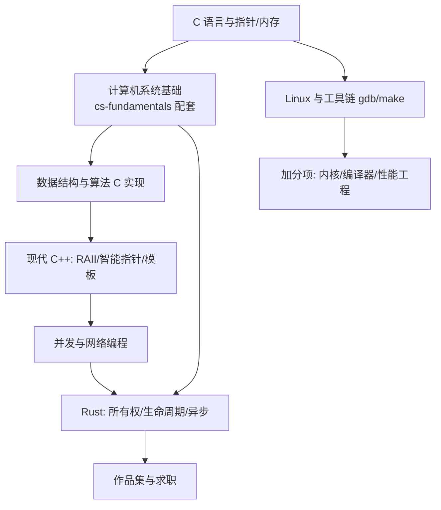

## 岗位画像

系统编程工程师工作在离硬件最近的应用层：嵌入式、操作系统与驱动、数据库内核、编译器与运行时、高性能网络服务、游戏引擎。这是天花板最高、成才周期最长、护城河也最深的方向。

2026 年现状：C/C++ 岗位集中在嵌入式、车机、基础软件与游戏行业；Rust 经历多年爬坡后在系统工具链、区块链、云基础设施与汽车软件领域站稳，岗位量小于 C++ 但增速与人均稀缺度更高。适合人群：科班学生、对"东西到底怎么跑起来的"有执念的人、愿意为长期竞争力忍受前期陡峭曲线的人。

**学习策略前置声明**：本路线以 C 建立内存与机器模型 → 以现代 C++ 进入工程实战 → 以 Rust 建立安全并发的现代范式，三门语言互补而非互斥。若只选一门深耕：嵌入式选 C/C++，基础设施新项目选 Rust。

## 技能树

必学主线：C → cs-fundamentals 系统篇 → C++ → 网络/并发 → Rust（或 C++ 深耕二选一）。加分项：Linux 内核阅读、LLVM 认知、性能剖析。

## 阶段 1（第 1 到 3 个月）：C 与机器模型

**第 1 到 2 个月：C 语言与底层直觉**

- [C 模块](/c/010-CZeroBasisStart) 前半：语法、指针与数组、内存布局（栈/堆/全局区）、字符串与结构体、文件 IO；
- 同步精读 cs-fundamentals 的 [组成原理基础](/cs-fundamentals/080-ComputerArchitectureBasics)、[数据表示](/cs-fundamentals/060-NumberRepresentationEncoding)、[存储系统](/cs-fundamentals/120-StorageSystem)——C 的每个知识点在硬件层都有对应物，两边对照学效率翻倍；
- 动手：手写动态数组、链表、简单内存池（malloc/calloc/free 全程手动管理）。

**第 3 个月：工具链与数据结构**

- Linux 环境（WSL2 或虚拟机）、gcc 编译四阶段、Makefile、gdb 调试、valgrind 查内存错误；
- [算法模块](/algorithm/010-AlgorithmAnalysisBasics) 数据结构部分全部用 C 手写实现（哈希表、二叉树、堆）；
- 检验项目一：**C 实现的简易键值存储**——内存哈希表 + 文件持久化 + REPL 交互，用 valgrind 证明零泄漏。这个项目的每个 bug 都是宝藏（段指针、越界、泄漏各来一次你就懂了）。

## 阶段 2（第 4 到 6 个月）：现代 C++ 与网络并发

**第 4 个月：C++ 现代核心**

- [C++ 模块](/cpp/010-WhatIsCpp) 核心：RAII 与智能指针（unique/shared）、移动语义、引用与值语义、lambda、STL 容器与算法；
- 心法：C++ 学习主线是"资源管理自动化"，把 C 阶段的手动 free 痛感转化为对 RAII 的深刻认同。

**第 5 个月：并发与操作系统**

- cs-fundamentals 的 [操作系统](/cs-fundamentals/150-OperatingSystem)、[进程线程](/cs-fundamentals/170-PCBThreadTCB)、[IPC](/cs-fundamentals/260-IPC) 精读；
- C++ 线程（std::thread/mutex/atomic/条件变量）；系统调用、文件描述符、IO 多路复用（select/poll/epoll 概念与用法）；
- [networking 模块](/networking/010-NetworkBasicsAndProtocol) TCP 部分精读。

**第 6 个月：检验项目二**

- **C++ 高并发 Echo/Web 服务**：手写 epoll 事件循环（或用 asio 理解原理）、线程池、优雅关闭、ab/wrk 压测出 QPS 与 P99；
- 阶段验收：能画出"一个 HTTP 请求在 Linux 上的完整旅程"（网卡 → 内核 → epoll → 线程 → 响应）。

## 阶段 3（第 7 到 12 个月）：Rust 或 C++ 深耕 + 求职

**第 7 到 8 个月：Rust 通道（C++ 深耕者见下方替代方案）**

- [Rust 模块](/rust/010-WhatIsRust) 全读：所有权与借用、生命周期、Trait、错误处理、智能指针、并发（无数据竞争的编译期保证，与 C++ 阶段的血泪互为印证）、async/Tokio；
- 心法：把 C/C++ 阶段真实踩过的内存 bug 列成清单，逐个思考 Rust 的编译器如何拦截——这是理解 Rust 设计哲学的最短路径。

**C++ 深耕替代通道**：模板元编程进阶、CMake 工程化、性能剖析（perf/VTune 认知）、一个大型开源库源码阅读（如 fmt/asio）。

**第 9 个月：Rust 检验项目三**

- **Tokio 并发服务**：Rust 重写项目二的并发服务（对比内存安全与开发体验），或写一个简易 Redis（RESP 协议 + 异步网络 + 内存存储）；
- 阶段验收：`cargo clippy` 零警告、能解释每个生命周期标注的含义。

**第 10 个月：检验项目四（作品集主项目）**

方向三选一（对应三类岗位）：
- 嵌入式向：单片机（STM32/ESP32）项目——传感器采集 + 通信协议 + 低功耗设计；
- 基础软件向：Rust 实现的存储引擎/代理服务器（如简易 KV、HTTP 代理），含基准测试与设计文档；
- 高性能服务向：C++ 或 Rust 的网络中间件（限流器/连接池/协议转换），含完整压测报告。

要求（通用）：Makefile/Cargo 完整构建、测试覆盖核心路径、README 含架构图与内存/并发模型说明、基准数据与调优记录。

**第 11 到 12 个月：求职冲刺**

- 复习地图：C 内存模型、C++ 对象模型与移动语义、操作系统（进程调度/内存管理/中断）、网络协议栈、并发原语对比（三语言横评是杀手锏）、数据库或编译器常识按目标岗位补；
- 算法 150 题量级（该方向手写链表/树操作与位运算权重高）；
- 项目深挖：让 AI 按"这段代码有没有 UB""这里为什么不用锁""内存布局画一下"连环追问。

## 常见弯路

1. **三门语言齐头并进**：系统方向的陡峭曲线经不起分散火力。严格串行：C 站稳再 C++，C++ 有体感再 Rust（或直接 C++ 深耕）；
2. **只在 Windows 上学 C**：系统方向的事实标准环境是 Linux（或 WSL2），工具链与系统调用生态都在 Unix 世界；
3. **跳过 cs-fundamentals 直接刷语言**：语言只是表面，这个方向面试考的是"语言之下的系统"。理论模块不是选修；
4. **不调试只重跑**：gdb 与 printf 的差别就是工程师与玩家的差别。每个 core dump 都值得解剖；
5. **Rust 当语法糖学**：不从内存模型与所有权动机切入，Rust 学习必然卡死在借用检查器。动机先行，语法其次。

## 求职准备清单

- 两个有压测/基准数据的项目（内存或并发项目至少一个）；
- 三语言并发与内存管理的横评笔记（面试大杀器）；
- Linux 工具链熟练度（gdb、perf、valgrind 至少各一次实战记录）；
- 算法 150 题量级；
- 简历突出：底层原理 + 性能数据 + 一个有纵深的主项目。

## 下一步

从 [C 是什么](/c/010-CZeroBasisStart) 开始（C++ 起点看 [C++ 是什么](/cpp/010-WhatIsCpp)，Rust 起点看 [Rust 是什么](/rust/010-WhatIsRust)）。需要岗位数量的安全感兜底，可并行 [Java 后端路线](/roadmap/030-BackendJavaRoute) 阶段 1。
