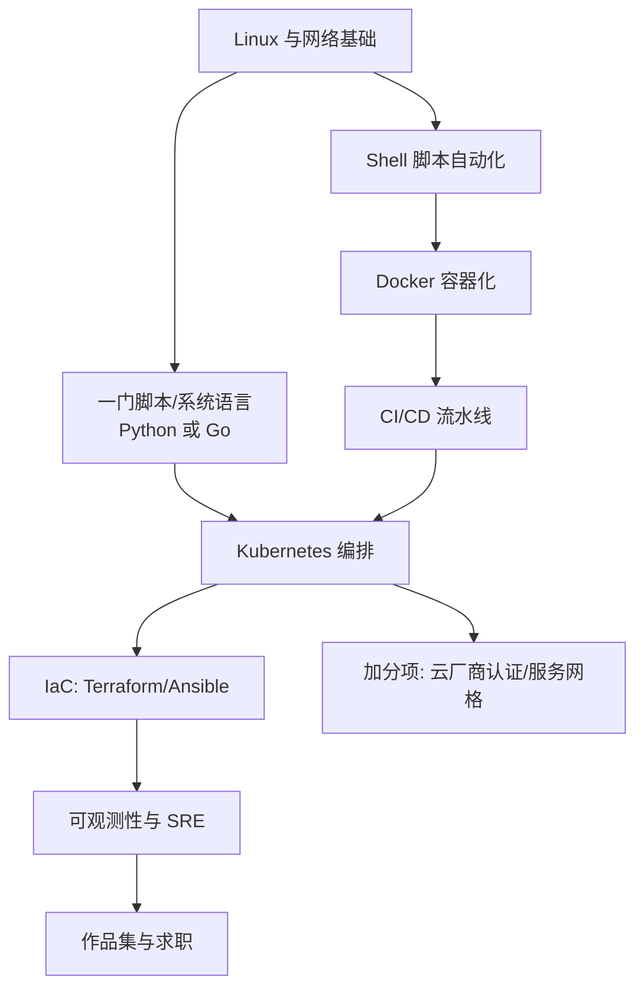

## 岗位画像

DevOps/运维工程师负责"系统从代码到稳定运行的全链路"：CI/CD 流水线、容器化与编排、监控告警、成本与稳定性优化。2026 年的岗位形态：传统运维持续萎缩，**平台工程与 SRE 型岗位是主流**——用代码与自动化管理基础设施（IaC），用可观测性体系保障 SLO。

适合人群：喜欢全局视角、对自动化有执念、能承受"线上出事要第一时间响应"责任的人。入行友好度中上：初中级岗位常从"运维开发/交付工程师"切入。产物：**一条完整的 CI/CD 流水线加一套自建的可观测 Kubernetes 集群**。

## 技能树

必学主线：Linux → Shell → Docker → CI/CD → K8s → IaC → 可观测性。加分项：云厂商实践（阿里云/AWS 任一）、Go 运维工具开发。

## 阶段 1（第 1 到 3 个月）：Linux 与自动化地基

**第 1 个月：Linux 与网络**

- [devops 模块](/devops/010-OverviewLinuxBasics) Linux 章节 + [shell 模块](/shell/010-DevEnvSetup) 前半：文件系统、权限、用户、软件包、systemd 服务管理；
- [networking 模块](/networking/010-NetworkBasicsAndProtocol) 基础部分：IP/路由/端口/DNS/HTTP——排障的底层语言；
- 实操环境：一台云服务器（各厂商新用户活动机即可，或本地虚拟机），**从此所有练习都在真机上做**；
- 动手：从裸机部署一个静态网站（Nginx）+ 配置 SSH 密钥登录 + 防火墙只开必要端口。

**第 2 个月：Shell 与网络进阶**

- [shell 模块](/shell/010-DevEnvSetup) 后半：脚本语法、文本三剑客（grep/sed/awk）、计划任务；
- [git 模块](/git/010-Git) 阶段 3（分支协作）——运维的每个变更都该有版本记录；
- 检验项目一：**服务器初始化脚本集**——新装一台 Linux，跑一个脚本完成：用户与密钥、时区与内核参数、防火墙、Nginx、日志轮转、基础监控探针。写 README 记录每个步骤"为什么"。

**第 3 个月：一门系统语言**

- Python 或 Go 二选一（推荐 Go，运维工具生态主语言；参考 [Go 后端路线](/roadmap/040-BackendGoRoute) 阶段 1 压缩到基础语法与脚本化使用）；
- 动手：把项目一的初始化脚本用 Go 重写为 CLI 工具（cobra 或标准 flag），体验"基础设施即代码"的工程化跃迁。

## 阶段 2（第 4 到 6 个月）：容器与流水线

**第 4 个月：Docker**

- devops 模块容器章节 + [cloud-computing 模块](/cloud-computing/010-CloudComputingBasics) 容器部分：镜像分层、Dockerfile 最佳实践、网络与存储卷、Compose 编排；
- 动手：把自己服务器上的 Nginx 静态站迁进容器；给一个开源 Web 应用写多阶段构建 Dockerfile 并把镜像从 1GB 压到 100MB 内（记录每步优化数据）。

**第 5 个月：CI/CD**

- devops 模块 CI/CD 章节：以 GitHub Actions 为主（本库自身就用它构建三端，可以参考 .github/workflows 真实配置），概念覆盖 Jenkins/GitLab CI 的迁移认知；
- 流水线要素：构建、测试、镜像打包、推送仓库、部署触发、回滚策略；
- 检验项目二：**完整交付流水线**——给一个带测试的后端项目（可选 [Java 后端路线](/roadmap/030-BackendJavaRoute) 或 [Node 全栈路线](/roadmap/060-FullStackNodeRoute) 的项目二）搭建：push 即测 → 测过即构建镜像 → 自动部署到服务器 → 失败自动回滚。附流程图与一次真实回滚记录。

**第 6 个月：Kubernetes 入门**

- devops 模块 K8s 章节 + cloud-computing 编排部分：用 kubeadm 或 k3s 自建集群（理解优于托管），覆盖 Pod/Deployment/Service/Ingress/ConfigMap/Secret/HPA；
- 动手：把项目二的流水线部署目标改为 K8s（kubectl set image 或 Helm 模板化）；
- 阶段验收：能在 10 分钟内把一个新服务从"有镜像"到"集群里可访问"。

## 阶段 3（第 7 到 12 个月）：IaC、可观测性与求职

**第 7 到 8 个月：IaC 与配置管理**

- Terraform（声明式开云资源：VPC/服务器/数据库，先用云厂商免费额度）与 Ansible（配置漂移治理）；
- 环境分层（dev/staging/prod）与变更评审流；
- 检验项目三：**一键环境**——`terraform apply` + `ansible-playbook` + K8s manifest 三层叠加，从零云账号到完整可用环境，全程无人手工操作，附演示录像。

**第 9 个月：可观测性与 SRE 实践**

- 监控栈自建：Prometheus + Grafana + Alertmanager，指标（RED/USE 方法）、日志（Loki 认知）、告警分级与值班表；
- SRE 概念落地：给自家集群定 SLO（如可用性 99.9%）、错误预算、一次完整的故障演练（kill 掉服务看告警是否触发）；
- 检验项目四（作品集主项目）：**小而全的自运维平台**——前五个月所有产物集成：IaC 建环境、流水线部署、K8s 运行、Prometheus 监控、Grafana 看板截图、告警到手机、一份 2000 字 SRE 手册（架构、SLO、故障处理预案）。这个"平台"就是你的简历。

**第 10 到 12 个月：求职冲刺**

- 复习地图：Linux 深水区（内存/CPU 排查三板斧）、网络排障路径、Docker 原理（namespace/cgroup）、K8s 原理（调度/网络/存储）、CI/CD 设计题、一次故障复盘叙述；
- 故障排查实战演练：让 AI 扮演"故障生成器"出场景（CPU 飙高/磁盘满/DNS 异常），你口述排查路径；
- 加分动作：任一云厂商associate 级认证备考、开源一个运维小工具；
- 简历：全部用"稳定性与效率"语言组织（部署时间从 X 降到 Y、故障发现从人工到 2 分钟）。

## 常见弯路

1. **命令背多不建系统**：运维的核心是"把重复的事自动化"，不是背 500 条命令。每个手工操作重复第二次就该脚本化；
2. **本地 Docker 当实战**：没有真服务器与公网环境，网络、安全、成本感全是空白。云服务器是这个方向最值的投入（几百元级）；
3. **K8s 直接上托管**：没自建过集群就直接用云托管，排障时对 kubelet/etcd 一无所知。先自建再托管；
4. **安全意识缺位**：开放全部端口、密码登录、明文密钥进 git——运维事故的头号来源。项目一的安全基线是底线；
5. **忽视开发能力**：2026 年运维岗的面 试已明显 Go/Python 化。没有一门系统语言，天花板立刻触顶。

## 求职准备清单

- 自运维平台项目（含 SRE 手册与故障演练记录）；
- 镜像优化与流水线提速的量化数据；
- Linux/K8s 排障路径的自测笔记（链接本库文档）；
- 任一云认证（可选）或开源运维工具（可选）；
- 简历以 SLO、MTTR、部署频率等指标说话。

## 下一步

从 [DevOps 概述](/devops/010-OverviewLinuxBasics) 与 [Linux 基础](/shell/010-DevEnvSetup) 开始。偏应用开发视角的组合路线是 [Go 后端路线](/roadmap/040-BackendGoRoute)（Go + 云原生高度重叠）。
