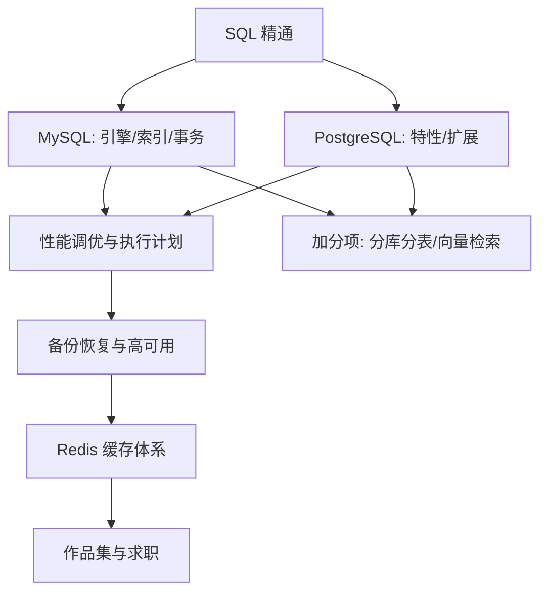

## 岗位画像

数据库方向的岗位分三层：应用开发者的数据库技能层（所有后端岗位的必考项）、专职 DBA（运维数据库：调优/备份/高可用/故障处理）、数据工程（数据管道与仓库）。2026 年趋势：云托管数据库让"手工运维 DBA"收缩，但**"懂数据库内核与调优的开发者/平台工程师"溢价上升**；PostgreSQL 在 AI 向量检索（pgvector）带动下持续扩张，与 MySQL 双栈人才最抢手。

本路线定位：以后端级数据库功力为底座，向 DBA 或数据工程延伸。适合人群：严谨细致、喜欢和数据与性能较真的人。产物：**一套双数据库的调优报告加一个高可用数据平台**。

## 技能树

必学主线：SQL → MySQL → PostgreSQL → 调优 → 高可用 → Redis。加分项：分库分表、pgvector、数据库内核认知。

## 阶段 1（第 1 到 3 个月）：SQL 与 MySQL 地基

**第 1 到 2 个月：SQL 精通**

- [SQL 模块](/sql/010-WhatIsDatabase) 全读：从环境与首查，到多表连接、聚合、子查询、窗口函数；
- 练习平台策略：每天 2 到 3 题（LeetCode 数据库题 + sqlzoo 类练习），累计 100 题以上；
- 动手：装 [MySQL](/mysql/020-Roadmap)，导入一个真实规模数据集（如公开的订单数据，百万行级），所有练习在真数据上做——小数据练语法，大数据才见性能。

**第 3 个月：MySQL 体系化**

- [MySQL 模块](/mysql/020-Roadmap) 核心：存储引擎（InnoDB 结构）、索引原理（B+ 树、聚簇与二级索引、覆盖索引）、事务与隔离级别、锁机制；
- 检验项目一：**索引设计实战报告**——给百万行订单库设计索引方案，10 个典型慢查询的 EXPLAIN 前后对比，含"为什么这么设计"的推导（选择性、最左前缀、回表成本）。

## 阶段 2（第 4 到 6 个月）：PostgreSQL 与调优

**第 4 个月：PostgreSQL 双栈**

- [PostgreSQL 模块](/postgresql/010-OverviewInstallConfig) 核心：MVCC 实现（与 InnoDB 对比）、VACUUM 机制、丰富索引类型（B-tree/GIN/GiST/部分索引）、JSONB、扩展生态；
- 动手：同一数据集迁入 PostgreSQL，把 MySQL 的 10 个查询翻译过来，写**双库行为对比笔记**（隔离级别实现差异、EXPLAIN 输出差异、JSON 处理差异）——双栈视角是面试的强差异化。

**第 5 个月：性能调优体系**

- 慢查询治理流程：慢日志 → 执行计划 → 索引/SQL 改写 → 参数层面（内存配置、连接池 PgBouncer/ProxySQL 认知）；
- [Redis 模块](/redis/010-OverviewCoreDataStructure) 缓存体系：数据结构场景化、缓存穿透/击穿/雪崩、与数据库的一致性策略；
- 检验项目二：**调优工程包**——一个故意劣化的应用（可自写或改造开源 demo），完成：慢日志定位、五处优化（索引两处、SQL 改写一处、缓存一处、参数一处）、压测前后对比报告（QPS 与 P99 提升倍数）。

**第 6 个月：备份恢复与高可用**

- 备份：mysqldump/xtrabackup 认知、pg_basebackup、时间点恢复（PITR）；**恢复演练比备份本身重要**；
- 高可用：主从复制原理、半同步、MGR/ Patroni 认知、故障切换流程；
- 检验项目三：**灾难恢复演练报告**——搭建主从复制，人为删库，用备份 + binlog 恢复到删除前一刻，全程录像并写成 runbook。

## 阶段 3（第 7 到 12 个月）：纵深与求职

**第 7 到 8 个月：分库分表与规模化**

- 读写分离接入、分库分表方案（ShardingSphere 认知级）、分布式 ID、跨分片查询的代价与取舍；先问"真的需要分库分表吗"（多数业务到不了），方案设计题是重点；
- pgvector 向量检索实践（结合 AI 数据场景）；
- 数据工程视角：一条 ETL 管道（业务库 → CDC（binlog/逻辑解码）→ 分析库），认知级实现。

**第 9 到 10 个月：检验项目四（作品集主项目）**

**双栈数据平台**：一个完整的"数据库即服务"迷你平台（自用级）——Docker Compose 编排 MySQL 主从 + PostgreSQL 主从 + Redis + 监控（mysqld_exporter/postgres_exporter + Prometheus + Grafana 看板）+ 备份定时任务与恢复脚本 + 一份包含 SLO、容量规划、故障预案的运维手册。附：三个真实故障案例的完整复盘（现象、定位、根因、改进）。

**第 11 到 12 个月：求职冲刺**

- 复习地图：索引与执行计划（手画 B+ 树）、事务与 MVCC、锁与死锁排查、日志体系（redo/undo/binlog）、Redis 原理、双库差异、分库分表设计题；
- 手写 SQL 强化：窗口函数、分组 TopN、连续问题类，让 AI 出题并限时；
- 项目深挖：让 AI 按"为什么选这个隔离级别""恢复到一半 binlog 坏了怎么办"连环追问；
- 简历量化：QPS/P99 提升倍数、恢复时长、空间节省。

## 常见弯路

1. **SQL 会写就停**：会 SELECT 与精通索引隔着整个性能世界。SQL 是门槛，调优才是岗位价值；
2. **只用图形工具不用命令行**：DBA 的战场在终端。从第一天起 mysql/psql 客户端为主；
3. **背八股不懂原理**：隔离级别四级背诵人人会，MVCC 的 ReadView 机制能讲清的人凤毛麟角——分水岭在这；
4. **不演练恢复**："备份成功"与"能恢复"是两回事。未演练过恢复的备份等于没有备份；
5. **MySQL/PG 站队互斥**：双栈视角（尤其 MVCC 实现差异）本身就是高级感的来源，二选一是自我设限。

## 求职准备清单

- 索引设计报告 + 调优工程包 + 灾难演练报告 + 双栈对比笔记（四份文档就是面试弹药）；
- 手写 SQL 100 题量级；
- 数据平台项目（含监控看板截图与运维手册）；
- 简历全部用性能与可靠性数据说话。

## 下一步

从 [SQL 是什么](/sql/010-WhatIsDatabase) 开始。若目标是后端开发而非专职数据库，本路线阶段 1 加 2 的调优部分已够用，其余作为在职进阶；运维视角的完整体系见 [云与运维路线](/roadmap/090-DevOpsCloudRoute)。
