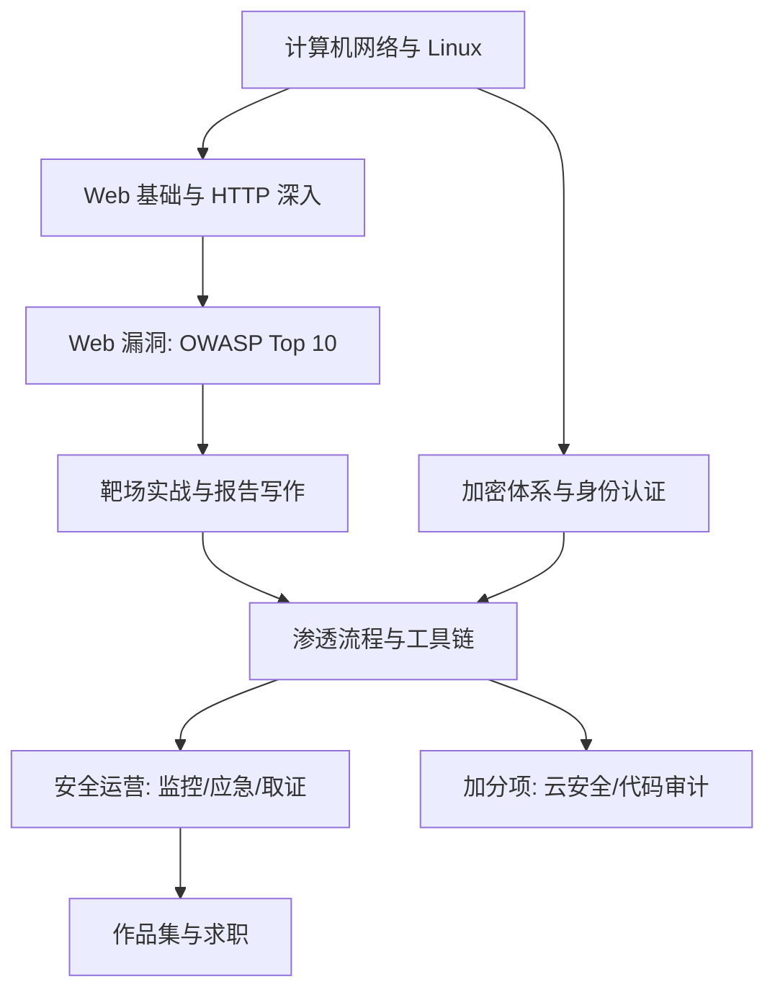

## 岗位画像

安全岗位分三块：渗透测试（以攻击者视角找漏洞并报告）、安全运营（SOC 监控告警、应急响应）、安全开发/DevSecOps（把安全内建进研发流程）。2026 年格局：攻防演练常态化让实战化岗位增加，云安全与 AI 安全成为新增长点，合规驱动（等保、数据安全法）让企业安全预算稳定。

**合规红线前置声明（必读）**：未经授权对任何系统进行扫描、探测、利用都是违法行为。本路线的全部攻击技术练习**只在靶场环境**（自建虚拟机、官方练习平台）进行。合法与违法的分界线就是"书面授权"，这条线要刻进职业本能。适合人群：攻防思维强、耐心细致、对规则有敬畏心的人。

## 技能树

必学主线：网络 → Web 原理 → Web 漏洞 → 加密 → 渗透流程 → 运营防御。加分项：云安全配置审查、代码审计、二进制入门。

## 阶段 1（第 1 到 3 个月）：基础与 Web 漏洞

**第 1 个月：网络与系统底座**

- [networking 模块](/networking/010-NetworkBasicsAndProtocol) 全读（安全是网络知识的最大买家）：协议栈、TCP/UDP、HTTP/HTTPS、DNS、抓包分析；
- [cybersecurity 模块](/cybersecurity/010-SecurityBasicsDefense) 基础部分：安全三要素、常见攻击面、防御理念；
- Linux 基础（参考 [云与运维路线](/roadmap/090-DevOpsCloudRoute) 阶段 1）；
- 动手：搭自己的靶场——虚拟机装 OWASP Juice Shop 与 DVWA，配好快照习惯。

**第 2 个月：Web 漏洞核心（OWASP Top 10）**

- [cybersecurity 模块](/cybersecurity/010-SecurityBasicsDefense) Web 漏洞章节逐个攻破：SQL 注入、XSS、CSRF、SSRF、文件上传、反序列化概念、越权访问、认证缺陷；
- 每个漏洞按"原理 → 在靶场复现 → 手动利用 → 修复方案"四步走，写漏洞笔记（这就是未来的作品集）；
- SQL 基础必须同步补（[SQL 模块](/sql/010-WhatIsDatabase) 前半）——不懂 SQL 的人学注入是背咒语。

**第 3 个月：加密与认证**

- 加密体系：对称/非对称/哈希/签名、TLS 握手与证书体系、密码存储（bcrypt/argon2）、JWT 与会话安全；
- cs-fundamentals 的 [信息安全基础](/cs-fundamentals/550-InformationSecurityBasics) 对照；
- 检验项目一：**漏洞笔记库（20 篇）**——20 个靶场漏洞的完整复现报告（每个含：漏洞类型、原理、复现步骤、payload 分析、修复建议）。这份文档的深度决定你阶段 2 的上限。

## 阶段 2（第 4 到 6 个月）：渗透流程与工具链

**第 4 个月：渗透方法论与工具**

- 标准流程：信息收集 → 漏洞发现 → 利用 → 后渗透 → 报告；授权与范围管理的职业规范；
- 工具链：Burp Suite（核心，必须精通）、nmap、dirsearch、sqlmap 的手动能力边界（工具只是加速器，原理在手才能脱离工具）；
- 动手：把 Juice Shop 当作"一个客户"，完整走一遍渗透流程并输出专业报告（范围、方法、发现、风险评级、修复建议）。

**第 5 个月：进阶漏洞与代码视角**

- 逻辑漏洞（越权、支付篡改、验证码绕过——企业实战最高频）、SSRF 进阶、注入进阶（堆叠、带外）；
- 学一点代码审计：能读 PHP/Java/Python 的简单 Web 代码找漏洞点（白盒视角）；
- 检验项目二：**综合靶场渗透报告**——选一个综合靶场（如 HackTheBox 简单机或 VulnHub 镜像），从零拿到权限，报告完整复盘思路链（每个转折点"为什么想到这么试"）。

**第 6 个月：防御视角与安全开发**

- 防御体系：WAF 原理、安全开发生命周期（SDL）、依赖漏洞管理、容器与云的安全基线（配合 [云与运维路线](/roadmap/090-DevOpsCloudRoute) 安全部分）；
- DevSecOps：把 SAST/DAST/依赖扫描接进 CI 流水线（GitHub Actions 实操）；
- 阶段验收：给一个真实开源项目做安全配置审查并提交 issue（脱敏后收入作品集）。

## 阶段 3（第 7 到 12 个月）：运营实战与求职

**第 7 到 8 个月：安全运营（SOC）**

- 日志与检测：日志采集（配合 [云与运维路线](/roadmap/090-DevOpsCloudRoute) 监控栈）、常见攻击的检测规则（SQL 注入特征、暴力破解模式、异常登录）、SIEM 认知（Wazuh 开源自建）；
- 应急响应流程：准备 → 检测 → 遏制 → 根除 → 恢复 → 复盘；取证常识（内存/磁盘镜像、时间线分析）；
- 检验项目三：**SOC 迷你平台与蓝队手册**——Wazuh + 自建服务，制造 5 类攻击（靶场内），验证告警触发，写出每类的检测规则与响应手册。

**第 9 到 10 个月：检验项目四（作品集主项目）**

方向二选一：
- 攻向：**综合渗透作品集**——3 台不同难度的靶机完整报告（信息收集全景图、利用链推导、提权路径、专业格式报告），加 1 次 CTF 比赛复盘；
- 守向：**企业级安全加固方案**——给一个虚构中小企业的全栈（网站 + 服务器 + 云账号）做安全评估与加固，交付评估报告、加固清单、检测规则、应急预案四件套。

**第 11 到 12 个月：求职冲刺**

- 复习地图：OWASP 全谱（原理级复述）、加密协议细节、网络协议与流量分析、Linux 提权套路、常见中间件漏洞史（-struts/log4j/fastjson 一句话讲清原理）、等保与合规常识；
- 实战履历：CTF 平台（如 BUUCTF）刷题记录、SRC（企业漏洞响应平台）合法提交记录（有就是最强证明，没有不硬凑）；
- 项目深挖：让 AI 按"这个 payload 为什么有效""绕过 WAF 的思路""误报怎么处理"连环追问；
- 简历红线：只写授权范围内的实践，语法上明确"靶场/授权测试"。

## 常见弯路

1. **工具脚本小子化**：只会 sqlmap 一键跑，原理讲不出，面试立刻现形。每个工具动作都要能手动复现；
2. **跳过网络与系统**：Web 安全是冰山水面部分，水面下是网络与操作系统的功底；
3. **对未授权目标手痒**：技术好奇心越过授权线就是犯罪记录，这不是危言耸听而是行业真实的淘汰原因；
4. **只攻不守**：企业安全预算大头在防御。只学攻击的人岗位面窄，攻防双视角才是完整能力；
5. **轻视报告写作**：渗透的价值交付物是报告。写作能力差的安全工程师晋升最慢。

## 求职准备清单

- 漏洞笔记库 20 篇以上 + 综合靶场报告 3 份以上；
- SOC 手册或加固方案（守向作品）；
- CTF/SRC 记录（可选但有力）；
- 网络与加密原理自测笔记（链接本库文档）；
- 简历以"授权实践 + 报告质量"组织。

## 下一步

从 [网络安全概述](/cybersecurity/010-SecurityBasicsDefense) 与 [网络概述](/networking/010-NetworkBasicsAndProtocol) 双线开始。基础设施功底想更厚，并行 [云与运维路线](/roadmap/090-DevOpsCloudRoute) 阶段 1。
