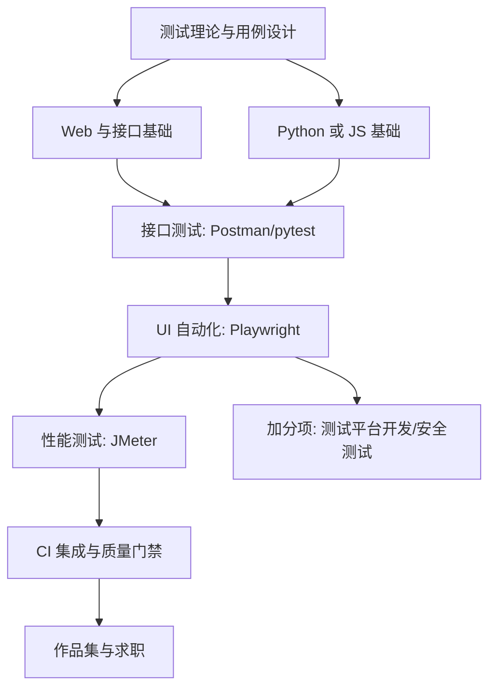

## 岗位画像

测试工程师保障软件质量：设计用例、执行验证、自动化回归、性能压测、质量门禁。2026 年的形态分化明显：纯手工功能测试岗位持续收缩，**"会写代码的测试"（自动化/测开）供需两旺**——用代码写测试、搭测试平台、做质量效能工具。

本路线是转行友好度最高的方向之一：入门门槛相对低（理论与工具先行），天花板靠代码能力撑起。适合人群：细心、有怀疑精神、沟通表达好的人；已有其他行业经验想切入 IT 的人。产物：**一套自动化测试工程加一份性能测试报告**。

## 技能树

必学主线：测试理论 → 接口测试 → 代码基础 → UI 自动化 → 性能 → CI。加分项：测试平台开发、安全测试认知。

## 阶段 1（第 1 到 3 个月）：理论、接口与代码地基

**第 1 个月：测试理论与被测对象理解**

- [软件测试模块](/software-testing/010-TestBasicsMethod) 前半：测试分类、测试级别、用例设计方法（等价类、边界值、场景法、判定表）、缺陷生命周期；
- 同步理解被测对象：[HTML5](/html5/010-WhatIsWebpage) 与 [HTTP/网络基础](/networking/010-NetworkBasicsAndProtocol)（不懂 Web 结构的人测 Web 是盲测）；
- 动手：给一个开源应用（如待办类 Web 应用）写 50 条用例并执行，输出规范缺陷报告 10 份（缺陷报告写作是被低估的硬技能）。

**第 2 个月：接口测试**

- 接口测试体系：HTTP 方法与状态码、请求响应结构、Postman 全功能（集合、断言、环境变量、Mock）；
- [SQL 模块](/sql/010-WhatIsDatabase) 第一、二阶段（测试要查库验证数据落库正确性）；
- 动手：对一个公开 API 或本地 demo 服务做全量接口测试，用例覆盖正常/边界/异常三类。

**第 3 个月：代码地基**

- Python 或 JavaScript 二选一（推荐 Python，测试生态最顺）：[Python 模块](/python/010-WhatIsPython) 前半 + pytest 入门（fixture、参数化、断言）；
- 用 pytest 重写第 2 个月的接口用例（requests 库），体会"手工 50 条 vs 脚本一键回归"的效率差；
- 检验项目一：**接口自动化测试工程**——分层设计（用例/业务层/工具层）、参数化数据驱动、HTML 报告、README 完整。这是测开岗位的第一块敲门砖。

## 阶段 2（第 4 到 6 个月）：UI 自动化与性能

**第 4 个月：UI 自动化（Playwright）**

- Playwright（当前主流）：元素定位策略、等待机制（智能等待优于 sleep）、断言、Page Object 模式；
- 动手：给第 1 个月的 Web 应用搭 UI 回归套件，覆盖核心流程（注册、登录、增删改查）。

**第 5 个月：性能测试**

- 性能体系：指标（并发、TPS、RT、资源利用率）、场景设计（基准/负载/压力/稳定性）、JMeter 实操（线程组、断言、监听器、分布式认知）；
- 服务端配合观察：Linux 资源命令（配合 [shell 模块](/shell/010-DevEnvSetup)）+ 数据库慢查询联动分析（[MySQL 模块](/mysql/020-Roadmap) 调优章配合）；
- 检验项目二：**性能测试报告**——对 demo 服务做完整压测：场景表、梯度加压数据、RT/TPS 曲线、瓶颈定位（应用/SQL/配置至少定位出一处）、调优前后对比。

**第 6 个月：CI 集成与工程化**

- [git 模块](/git/010-Git) + GitHub Actions：把接口与 UI 套件接进流水线，PR 触发冒烟、夜间全量、失败通知；
- 用例管理平台认知（开源 TestLink 或表格方案）、pytest 插件生态（失败重试、并发）；
- 阶段验收：一条"代码合并 → 自动测试 → 质量报告"的完整流水线可演示。

## 阶段 3（第 7 到 12 个月）：测开纵深与求职

**第 7 到 8 个月：测试平台与效能工具**

- 用已会的前端 + 后端技术栈（FastAPI 或 NestJS + 简单前端）开发**迷你测试平台**：用例管理、定时执行、报告聚合、环境配置；
- 或方向替代：深入一个专项（App 测试入门/契约测试/混沌工程认知/安全测试入门配合 [安全路线](/roadmap/110-SecurityRoute)）；
- 检验项目三：**测试平台 v1**（或专项深研报告）——能被团队真实使用级别的完成度。

**第 9 到 10 个月：检验项目四（作品集主项目）**

**完整质量工程案例**：选一个开源项目（中等规模 Web 应用），交付全套质量方案——测试策略文档（风险分析 + 分层策略）、接口/UI/性能三套自动化、CI 门禁、一次完整版本的测试总结报告（用例数、缺陷分布、逃逸分析）。这份"全家桶"直接对标企业真实岗位工作内容。

**第 11 到 12 个月：求职冲刺**

- 复习地图：用例设计方法（现场出题设计是必考）、HTTP 与接口、pytest/Playwright 细节、SQL、Linux、性能指标解释、自动化框架设计题（"你的框架怎么分层、失败怎么排查"）；
- 手写代码 80 题量级（测开面试有编程环节，简单到中等为主）；
- 项目深挖：让 AI 按"UI 自动化不稳定怎么办""怎么说服开发重视你提的 bug""压测数据怎么归因"连环追问；
- 简历：以"效率提升"量化（回归时间从 2 天到 20 分钟、缺陷前置发现率）。

## 常见弯路

1. **死守手工测试**：功能测试经验有价值，但 2026 年的岗位筛选已经默认要求自动化能力。代码基础是这个方向不可绕的课；
2. **自动化当录放机**：只会录制回放（selenium IDE 式）不算自动化。分层设计与稳定性工程才是内核；
3. **UI 自动化铺太广**：什么都想自动化，维护成本爆炸。原则：UI 只测核心流程，接口与单元层才是主力（测试金字塔）；
4. **性能测试只会压**：不会看服务端指标与慢查询的压测是"开盲盒"。JMeter 之外的系统视角决定报告价值；
5. **与开发对立沟通**：质量工程师的影响力来自"帮团队更快更稳"，而非"抓到你的错"。沟通与文档是被低估的核心技能。

## 求职准备清单

- 接口自动化工程 + 性能测试报告 + 测试平台（三件套）；
- 完整质量工程案例（项目四全家桶）；
- pytest/Playwright/SQL/Linux 自测笔记（链接本库文档）；
- 代码 80 题量级；
- 简历以质量效能指标说话。

## 下一步

从 [软件测试概述](/software-testing/010-TestBasicsMethod) 开始。若代码兴趣浓，可与 [Python 与 AI 路线](/roadmap/050-BackendPythonAIRoute) 阶段 1 共用语言地基，未来转测开或开发都顺滑。
