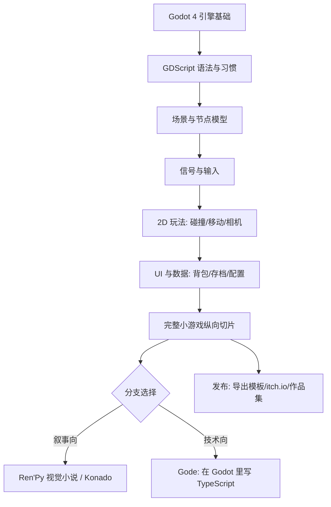

## 岗位画像

游戏开发负责「玩家玩到的一切」：玩法逻辑、关卡与手感、界面与反馈、存档与数值。与 Web 开发最大的差异是——**产物是体验而不是页面**，帧率与手感是硬指标，「好不好玩」进入验收标准。

2026 年市场概况：游戏行业初级岗位总量少于 Web 后端，但结构性机会清晰——独立游戏与中小团队持续活跃，Godot 等开源引擎的生态份额明显上升（本仓库的整个游戏板块就构建在 Godot 4 之上），休闲/视觉小说/独立游戏赛道对个人开发者最友好。技能迁移性是该路线的隐藏优势：游戏脚本、UI 系统、数据驱动的配置表，与前端和工具链开发高度相通。

这条路线的产物是**两个可以真正玩到的游戏**：一个纵向切片小游戏和一个有完整菜单/存档/发布流程的作品，全部发布上线（itch.io 或类似平台）、源码在 GitHub 上。

## 技能树

必学主线：godot 模块 → gdscript 模块 → 2D 玩法与 UI → 纵向切片。分支在阶段 3 按兴趣二选一深学（叙事向选 renpy/konado，技术向选 gode/TypeScript），另一条了解即可。

## 阶段 1（第 1 到 3 个月）：引擎地基与第一个游戏

**第 1 到 2 个月：Godot 与 GDScript 入门**

- [Godot 模块](/godot/010-GodotOverviewAndSetup) 前三个学习阶段：引擎安装与界面、场景与节点、信号机制；
- [GDScript 模块](/gdscript/010-GDScriptLanguageOverview) 前两个阶段：语法基础与面向过程部分（有 Python 经验的话一周可过）；
- 并行：git 模块阶段 1，游戏项目从第一天就进 GitHub；
- 检验项目一：**复刻一个经典小游戏**（贪吃蛇或打砖块）。要求：不用教程工程模板、从空项目开始、玩家死亡与重开一局完整可用。参考实现可对照作者的开源项目 [geometric-construct](https://github.com/fanquanpp/geometric-construct)（Godot 4.7 速度肉鸽）的项目组织方式。

**第 3 个月：数据与界面**

- GDScript 后续阶段：字典驱动的角色配置、信号连接 UI、场景切换；
- godot 模块 UI 与数据相关篇目（背包/属性系统文档）；
- 检验项目二：给检验项目一**加一套游戏菜单**——主菜单、暂停、设置（音量/按键），全部用场景与信号实现，不硬编码。

## 阶段 2（第 4 到 6 个月）：纵向切片与第一次发布

- 把前面所有能力组装成一个 **10 到 15 分钟的纵向切片**：开场标题 → 核心玩法两关 → 结算与存档 → 再来一局。存档用 Godot 的文件 API（JSON 序列化玩家进度），数值配置全部外置成数据文件；
- 全程用 git 管理版本，按功能分支提交；
- 检验项目三：**把纵向切片发布到 itch.io**。要求：HTML5 或桌面导出均可、有截图与说明页、发一条开发日志。做不出来就不进阶段 3——「能发布」与「能运行」是两种能力。

## 阶段 3（第 7 到 12 个月）：分支深入与作品集

**叙事向：视觉小说**

- [Ren'Py 模块](/renpy/010-RenPyOverviewAndSetup) 全程：剧本语言、角色与立绘、分支与变量、存档回滚；
- [Konado 模块](/konado/010-KonadoOverviewAndInstall) 选学：基于 Godot 的对话框架，适合想把视觉小说做进自己游戏的人；
- 检验项目四：**一部 30 到 60 分钟的完整短篇视觉小说**并发布。多结局、存档可回滚、至少一处需要玩家选择影响走向。汉化与本地化的工程视角可参考作者的开源项目 [ZATO-CN-Patch](https://github.com/fanquanpp/ZATO-CN-Patch)（全文本双语对照补丁）。

**技术向：引擎深水区与 TypeScript**

- [Gode 模块](/gode/010-GodeOverviewAndInstallation)：在 Godot 里用 TypeScript 写游戏逻辑（内嵌 Node 运行时）；
- 结合 JavaScript/TypeScript 模块阶段 1-2，把游戏逻辑层迁移到 TS；
- 检验项目四：把检验项目三的切片中的**一个子系统**（如背包或对话）用 Gode/TS 重写，并在 README 里写清两种方案的取舍。键盘交互类玩法可参考作者开源项目 [quaver](https://github.com/fanquanpp/quaver)（GDScript + gode/TypeScript 的桌面音乐工具）。

**公共收尾（两条分支都要做）**

- 素材：用免费素材起步，进阶可看作者的 [pixel-vault](https://github.com/fanquanpp/pixel-vault)（MIT 许可的像素素材与 Aseprite 源文件）学习素材工程化；
- 作品集页：两个游戏 + 源码仓库 + 一篇开发复盘（做了什么、砍了什么、学到什么）。

## 动手验证：第一周用三个动作确认这条路

游戏路线最特殊的决策风险在于：很多人喜欢的其实是「玩游戏」而不是「做游戏」——两者隔着一整个开发枯燥区。第一周用三个低成本动作完成验证，成本合计约 6 小时：

1. **装引擎跑官方 demo（约 2 小时）。** 从 godotengine.org 下载 Godot 4 稳定版，按官方文档跑通「Dodge the Creeps」入门教程（2D 小游戏，官方提供逐步指导与免费素材）。验收标准不是"跑起来了"，而是：能不看书解释场景树里每个节点的职责、知道主场景与实例化场景的关系。跑不通官方教程的同学，这条路要先缓一缓——它是本路线最平缓的一段。
2. **改一次别人的游戏（约 2 小时）。** 打开 demo 工程，做三处修改：把玩家速度调快一倍玩 5 分钟、把敌人刷新频率改慢、把背景色换掉。每处修改前先预测"改成什么样"，改后对比预期。这个小练习模拟的是游戏开发最日常的循环「调参数 - 试玩 - 再调」，也让你第一次感受"手感"这个抽象词背后的具体参数。
3. **写一页设计草案（约 2 小时）。** 为你将来的检验项目一（复刻小游戏）写一页纸：核心玩法一句话、玩家操作、胜负条件、你认为最难实现的一点。不用画图，文字即可。这页纸是第一个检验项目的需求文档——游戏路线从第一天就在练"把想法写成可实现的设计"。

三个动作的产物：一个被你改过的 demo 工程、一页设计草案、以及最重要的——一个诚实的回答：改参数试玩的两小时里，你感到的是兴奋还是烦躁。烦躁不代表不能走这条路，但意味着你要靠检验项目的成就感而不是过程愉悦来支撑，节奏要按这个现实来排。

## 从 Web 到游戏：心智迁移的四个落差

本路线大量读者来自 Web 背景（这也是游戏脚本、UI 与数据能力可迁移的原因）。迁移不是无缝的，有四个必须主动完成的认知切换：

1. **从"响应请求"到"每帧执行"。** Web 代码的执行由事件驱动、两次请求之间可以休息；游戏主循环每秒把 `_process` 跑 60 遍，任何一次超时都是肉眼可见的卡顿。写游戏代码时要问的第一句话从"什么时候调用它"变成"它每帧做多少事"——每帧里做文件读写、做大量对象创建，都是性能事故。
2. **从"状态在数据库"到"状态在内存"。** Web 应用的状态持久化是基础设施自带的（数据库、缓存），游戏状态默认活在内存里，断电即失。存档系统因此成为游戏开发的"数据库课程"：什么时候存、存哪些字段、坏档怎么办。这也是为什么本路线把存档系统列为阶段 2 的必修——它是游戏开发里最接近后端工程的环节。
3. **从"组件树"到"场景树加信号"。** 前端组件树的通信主流是单向数据流加状态库；Godot 的场景树靠信号（观察者模式的原生形态）解耦，父节点发信号、子节点各自响应，没有中央 store。习惯"所有状态收归一处"的前端同学，需要练习"让节点自己管理自己，用信号通知外界"的分布式思路——两种范式各有代价，游戏里的粒度更细。
4. **从"版本发布"到"手感调优"。** Web 的验收是功能正确；游戏的验收多一条"好不好玩"，而好不好玩只能靠反复试玩逼近。这决定了游戏开发的工作节奏：写一小时代码、试玩十分钟不是摸鱼，而是必要工序。阶段 1 的复刻项目里请刻意保留这个节奏，把"每次试玩记录一个手感问题"变成习惯——这份记录就是将来面试时谈"游戏体验打磨"的素材。

四个落差对应的能力在 godot 与 gdscript 模块的文档里都有承接：主循环与 `_process` 见引擎基础篇，信号见信号机制篇，存档见数据篇。迁移期不必一次切换到位，每进入一个新阶段，回头检查对应的落差是否已经跨过。

## 常见弯路

1. **引擎换换党**：Unity/Unreal/Godot 反复横跳。选 Godot 就走完 12 个月——引擎思维是通的，语法不是重点；
2. **第一个项目就做大 RPG**：开放世界梦是新手坟场。纵向切片纪律是这条路线的生命线；
3. **只跟教程不动手**：看十期教程不如复刻一个贪吃蛇。每个检验项目必须真的可玩；
4. **美术完美主义**：程序能跑之前，方块就是合法美术资源。素材升级放在玩法验证之后；
5. **不做存档**：存档系统是游戏开发里最接近「真实工程」的环节，跳过它等于跳过数据能力。

## 求职准备

- 作品集即简历：两个可玩游戏链接 + 源码仓库 + 复盘文章，比任何自述都有说服力；
- 独立开发者的现实组合拳：游戏作品集 + 前端/工具链技能（本仓库 JavaScript/TypeScript 主线）双修，就业面宽一倍；
- 参加一次 Game Jam（如 Ludum Dare / GMTK）：48 小时做出一个小游戏，是最快的成长与最好的面试故事；
- 面试高频：场景与节点模型的取舍、信号与事件解耦、存档的数据设计、性能（draw call 与对象池的概念）——都在本仓库游戏模块的文档范围内。
