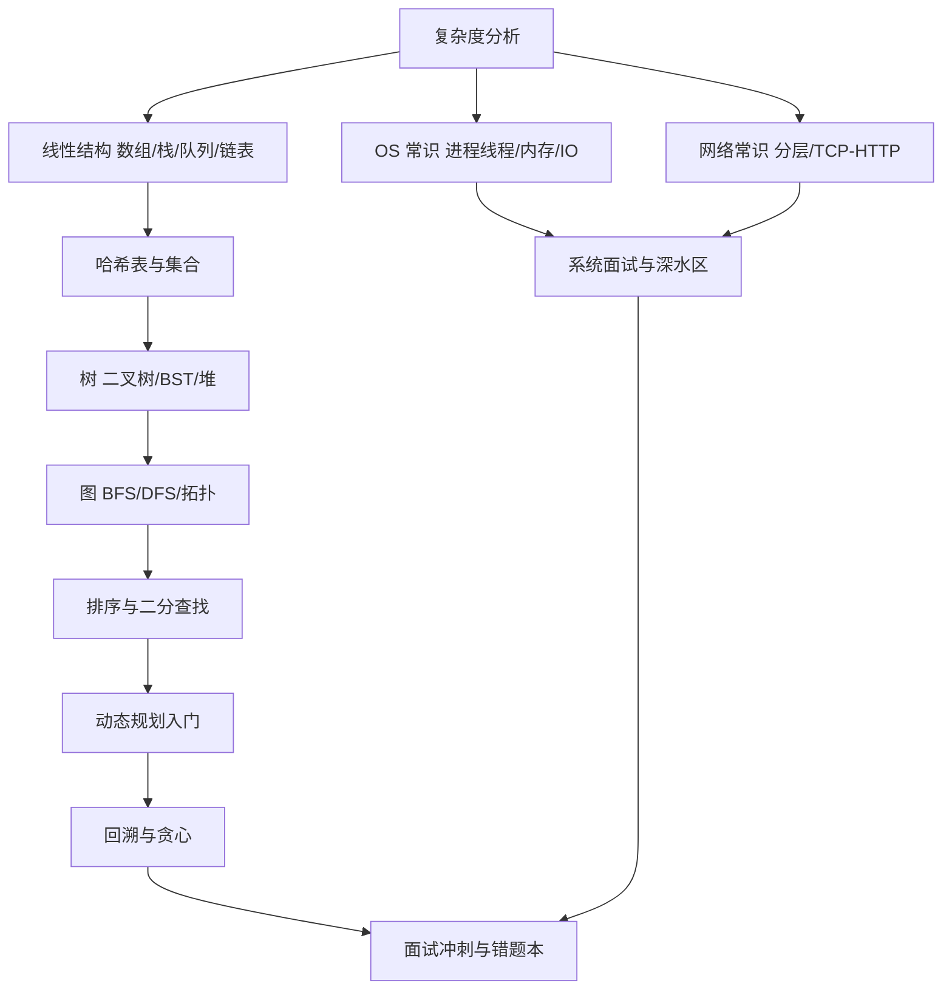

## 知识点地图

- **知识类别**：计算机科学与算法基础——不是一条独立就业路线，而是所有技术路线共享的底层能力层：数据结构、算法、复杂度分析、操作系统与网络常识。
- **解决什么问题**：面试白板题写不出来、代码写出去了不知道为什么慢、报错出在系统层就束手无策、"会用框架但换一个问题域就瘫痪"这类根本性短板。
- **什么时候用到**：三处——求职季的算法面试（硬门槛）；日常开发的性能与正确性判断（为什么这段代码 O(n²) 会拖垮接口）；以及任何一门后端/系统方向路线的阶段 3 深水区。本篇与其他路线篇的关系是"公共底座的加深版"：[总览](/roadmap/010-RoadmapOverview) 把算法列进公共底座，本篇告诉你怎么把它从"每周几题"扩成一条完整路线。

一个常见误解是"CS 基础是科班的专利"。事实是：面试算法题的题型是有限的（百余道核心题型覆盖九成场次），操作系统的常考概念是有限的（进程线程、内存管理、IO 模型），网络的分层模型是有限的——这正是自学者的机会：用一年时间，按题型和考点把有限集合覆盖掉。本篇的三阶段就是按"题型覆盖率"而不是"书页进度"设计的。

## 岗位画像

这个方向不对应某个具体岗位，而是给两类人准备的：

- **以算法为跳板的求职者**：国内后端/客户端/数据岗的技术面几乎必考算法（LeetCode 中等难度为主），系统面必考 OS 与网络。这块能力不决定你能不能做这份工作，但决定你能不能拿到 offer；
- **想走系统方向的深耕者**：性能工程、基础设施、嵌入式、数据库内核——这些岗位的日常就是和数据结构、内存、并发、网络协议打交道，CS 基础是主业而非跳板。

对应的日常工作场景差异很大：求职者一周刷 10 题、月底模拟面试一次；深耕者更多在读源码、做 benchmark、排查线上性能问题。本篇的检验项目按求职为主线设计，深耕者把检验项目换成"读一本内核书并写笔记"即可，阶段划分通用。

这条路线的产物是**一个 500 题量级的刷题记录仓库 + 一套能给别人讲课的操作系统与网络笔记**。

## 技能树



必学主线：复杂度 → 线性结构 → 哈希 → 树 → 图 → 排序二分 → 动态规划。旁支：回溯贪心按题感补。底层常识：OS 与网络各安排一个月滚动读。深读路标（可选）：C 语言模块帮你建立"内存到底发生了什么"的直觉，是读 OS 材料前的最好热身。

## 阶段 1（第 1 到 3 个月）：结构在手，题能落笔

**第 1 个月：复杂度与线性结构**

- [算法分析基础](/algorithm/010-AlgorithmAnalysisBasics)：大 O 记号、最好最坏均摊、常见复杂度排行。判据：能脱口说出"嵌套两层数组遍历是 O(n²)、好的哈希查找是 O(1)"，并解释为什么；
- [数组与动态数组](/algorithm/020-ArrayAndDynamicArray)、[栈与队列](/algorithm/040-StackAndQueue)、[链表](/algorithm/060-LinkedList)：每个结构配 10 到 15 道题（双指针、滑动窗口、栈匹配、链表反转是四大基本功）；
- 刷题节奏立规矩：每天 1 到 2 题，每题先自己想 30 分钟，想不出看题解，看完**关掉题解凭记忆重写**——重写不出等于没会。

**第 2 个月：哈希与树**

- 哈希表与集合：两数之和系列、字符统计系列，体会"用空间换时间"的第一课；
- [二叉树](/algorithm/030-SortAlgorithm) 之外的树专题：本仓库算法模块的树形结构篇 + 堆：前 K 大、合并 K 个链表这类"堆专练"；
- 检验项目一：**把 3 个月内的每道题按题型归类建索引**（题型、核心思路、易错点、日期）。这份索引就是后来的面试错题本原型，从第一天就开始攒，比考前突击整理强十倍。

**第 3 个月：图入门与阶段验收**

- BFS/DFS 模板题：岛屿数量、层序遍历、课程表（拓扑排序）；
- 阶段验收（可执行的标准）：随机抽 LeetCode 简单题 5 道 + 中等题 2 道，40 分钟内写出 6 道且全部通过——达不到就加练两周再进阶段 2，这个门槛写在前面就是为了防止"感觉会了"式前进。

## 阶段 2（第 4 到 6 个月）：算法思想与底层常识并进

**第 4 个月：排序、二分与查找**

- [排序算法](/algorithm/030-SortAlgorithm) 与 [进阶排序](/algorithm/035-AdvancedSortAndLinearSort)：手写快排与归并（白板高频）、理解各排序稳定性与适用场景；
- [二分查找](/algorithm/050-SearchAlgorithm)：二分不再只是"有序数组找数"——左边界右边界、旋转数组、求平方根，核心是"循环不变量"思维；
- 每天 1 题保持手感，题目来源从"按标签刷"换成"随机刷"。

**第 5 个月：操作系统与网络常识（面试四件的另两件）**

- OS：进程与线程的区别与通信方式、死锁四条件、虚拟内存与页表、用户态内核态、IO 多路复用（select/poll/epoll 的差别能讲一句即可）。素材：[cs-fundamentals 模块](/cs-fundamentals/010-ComputerOverview) 的计算机组成与原理篇目；
- 网络：[网络基础与协议](/networking/020-OSITCPIPModel) + [OSI 与 TCP/IP 模型](/networking/020-OSITCPIPModel)：三次握手四次挥手、TCP 与 UDP 区别、从输入 URL 到页面显示的全链路（面试万年高频）；
- 本月刷题降到每周 3 题保持手感，把时间让给八股理解——**八股不是背，是能画出图讲出来**。

**第 6 个月：动态规划入门**

- [动态规划](/algorithm/160-DynamicProgramming) 与 [DP 进阶模式](/algorithm/165-DPAdvancedPatterns)：从爬楼梯、打家劫舍到背包问题，按"状态定义 → 转移方程 → 初始化 → 遍历顺序"四步法练 20 到 30 道；
- DP 的过关线不是会背状态转移，而是**能对一道新题说清"状态是什么、为什么这样定义"**；
- 检验项目二：**模拟面试一场**。找朋友或让 AI 扮演面试官（用法见 [AI 协作开发指南](/roadmap/150-AICollabWorkflow)），45 分钟两道题 + 追问，全程开口讲思路。录音回放，统计自己"沉默超过 20 秒"的次数——这就是下阶段要练掉的东西。

## 阶段 3（第 7 到 12 个月）：深度、广度与实战

**第 7 到 8 个月：回溯贪心与题型收尾**

- 回溯（全排列、子集、N 皇后）与贪心（区间调度、跳跃游戏）各两周；
- 把题库按题型覆盖率过一遍：常见面试题型（数组、字符串、树、图、DP、回溯、贪心、二分、栈堆）各保证 20 题以上；
- 深读路标（可选但强烈推荐）：[C 语言模块](/c/010-CZeroBasisStart) 的指针与内存篇——理解栈帧、堆分配之后，你对"递归为什么爆栈""链表节点为什么不能存在栈上"会有物理层面的直觉，这是做题家和工程师的分水岭。

**第 9 到 10 个月：冲刺复习体系**

- 面试白板题的复习节奏定量化：每周 2 场模拟面试（可用 AI 扮演），每场后把卡壳题标回错题本；错题本二刷只刷"标记过 2 次以上"的题；
- 复习周期用间隔重复：第 1 天、第 3 天、第 7 天、第 21 天各回看一次错题思路（不用重写代码，能默写核心思路即可）；
- 系统设计常识起步：短链接系统、限流器这类入门题，把 OS/网络/数据结构知识串起来用。

**第 11 到 12 个月：求职实战**

- 简历技术面准备：每个写上简历的项目都准备一个"技术难点故事"（遇到什么问题、怎么定位、怎么解决），算法能力最终要在项目叙事里落地；
- 真实面试节奏管理：一天最多面两家，每场面试后 30 分钟内把被问到的题记进错题本（面过的题大概率还会被问）；
- 面试前一周：只过错题本和八股笔记，不做新题——新题徒增焦虑，旧题重建信心。

## 常见弯路

1. **按题号从头刷到尾**：题号顺序不是学习顺序。按题型分组刷，同题型连做 10 道才能形成肌肉记忆，穿插刷等于每道题都从零开始；
2. **看题解觉得"懂了"就跳过重写**：眼会手不会是刷题第一大坑。判据很硬：关掉题解 15 分钟内写出来并跑通，才算这一题过关；
3. **只刷题不学八股，或只背八股不刷题**：算法面和知识面是两场独立的考核，时间分配大致 6:4，两头都不能空；
4. **DP 上来就背状态转移方程**：背方程的带宽是无限大的，考场上遇到新题必死。永远从"状态定义"开始推；
5. **把刷题量当成就感**：500 道半懂不如 200 道全通。检验标准永远是"随机抽题能过"，不是"我刷到了第 N 题"。

## 动手练习

练习一（考试大纲式自查，纸面任务）。任务：把本篇技能树抄成一张表格，每行一个知识点，三列分别填"能给别人讲清/能自己写对/完全不会"，诚实标注后统计三档数量。参考判断口径：拿"二分查找"检验——能否不看资料写出左闭右闭模板并解释循环不变量？能则是第一档。这张表就是你的个人大纲，每月重测一次，看第一档怎么扩张。

练习二（错题本的最小可用版本）。任务：给刷题仓库建一个 `NOTEBOOK.md`，为每道错题记录四行——题型、一句话核心思路、卡壳的具体位置（是想不到思路，还是思路对写不对）、复习日期队列。提示：卡壳位置的区分最重要，它决定重练的方式；想不出思路的题要背"套路"，写不对的题要练"手熟"，处理方式完全不同。

<details>
<summary>参考模板（先自己定格式，再展开对照）</summary>

```markdown
## 2026-10-06 无重复字符的最长子串（中等）
- 题型：滑动窗口
- 核心思路：右指针扩张，遇重复字符时左指针收缩到重复字符的下一位，用哈希表记字符最后位置
- 卡壳点：思路对，但左指针收缩写成了逐位移动导致超时——应直接跳到 last[c] + 1
- 复习队列：10-09 / 10-13 / 10-27
```

对照要点：卡壳点那一行是整条记录的价值所在——三个月后重刷时，"当时为什么错"比"这道题怎么做"有用得多；复习队列三档间隔对应间隔重复的 3/7/21 天节奏，用日期工具或日历提醒都比"想起来再刷"可靠。

</details>

练习三（把 OS 知识讲出来）。任务：选"进程与线程的区别"这个万年高频题，写一份 3 分钟的口头讲解稿，要求必须包含一个生活类比、一张你自己画的图、一个"所以呢"（这个区别导致工程上什么现象，比如线程切换便宜但共享内存要加锁）。提示：写完后对着手机录一遍，回放时凡是卡壳的句子就是没真懂的地方。

## 求职准备清单

- 刷题记录仓库公开（README 写明刷题量、题型分布、错题本链接）；
- 错题本 NOTES 完整，"标记 2 次以上"的高频错题全部二刷；
- OS 与网络笔记成体系，每篇配手绘图（面试现场能画出来才算会）；
- 3 场以上模拟面试录音，沉默时长呈下降趋势；
- 每个项目配套一个技术难点故事，通过率达 100%。

## 下一步

今天就把练习一的自查表做出来。若你尚未选定主线方向，先回 [路线总览](/roadmap/010-RoadmapOverview) 做三问决策；若已有主线，把本篇的阶段 1 嵌进主线路线的空档（主线 80% + 本路线 20% 的配比同样适用）。
