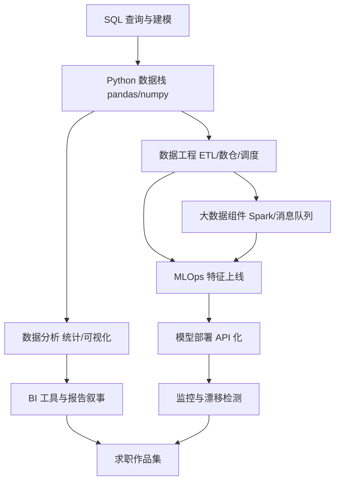

## 知识点地图

- **知识类别**：数据方向就业路线——横跨数据分析（看懂数据）、数据工程（搬运加工数据）、MLOps（把模型养在生产环境）三个职业带。
- **解决什么问题**：想跟数据打交道但分不清"数据分析师、数据工程师、算法工程师"到底差在哪、该学什么；以及避免与 [Python/AI 后端路线](/roadmap/050-BackendPythonAIRoute) 混为一谈——那篇的主线是"用 Python 写服务端"，本篇的主线是"围绕数据本身工作"。
- **什么时候用到**：三条触发线——喜欢从数字里找结论（分析）；更喜欢造让数据流动的系统（工程）；想投身 AI 落地但又不想卷模型研究（MLOps）。

三个职业带的关系像一家餐厅：数据分析师是研究菜谱和食客反馈的人（下结论），数据工程师是把菜从仓库清洗、切配、传到灶台的流水线建设者（供数据），MLOps 是让招牌菜每天稳定出品并盯住口味变化的后厨主管（模型上线与监控）。数据工程是另外两段的公共底座——所以本篇阶段 1 花在 SQL 与 Python 上，是给三个方向共同打地基。

## 岗位画像

**数据分析师**：业务部门的"翻译官"。日常是写 SQL 拉数、用 Python/Excel 做统计、出可视化报表、回答"上周转化率为什么掉了"。一天的工作：上午被运营追着要一版活动数据，下午发现两个系统的口径对不上要拉齐定义，傍晚把结论写成三页幻灯片讲给非技术同事。门槛在三个方向里最低，转行友好，但薪资天花板取决于业务理解深度而非工具。

**数据工程师**：数据平台的建造者。日常是维护 ETL 管道（把业务库、日志、第三方数据抽到数仓）、做数据质量校验、给分析师供数。一天的工作：早上一条夜间任务挂了先修管道，中午和业务方确认新表的分区与保留策略，下午给一条百万行级的数据同步做性能优化。岗位量小于分析但供给更少，后端经验可直接迁移。

**MLOps 工程师**：模型与生产环境之间的桥。日常是把算法同事训好的模型包装成服务、做特征上线、监控预测质量漂移、管理训练与部署的自动化流水线。一天的工作：上午发现线上模型的预测延迟超了预算要查特征读取链路，下午配合算法侧把 A/B 实验的新模型灰度 5% 流量，晚上给训练任务补监控告警。这是 AI 热潮下增长最快的岗位带，且更吃工程能力而非论文能力。

市场概况：分析师岗位量大但竞争也大；数据工程在数字化程度高的行业（金融、零售、物流）需求稳定；MLOps 随企业 AI 落地扩张，"会部署会监控模型"的候选人长期紧缺。三个方向共同的入场券是 SQL 与 Python——这决定了本篇阶段 1 的形态。

这条路线的产物是**一个公开的数据项目集**：一个带自动调度的小型数仓管道、一份完整的数据分析报告、一个部署上线且带监控的模型服务。

## 技能树



必学主线：SQL → Python 数据栈 → 按方向分叉（分析走统计可视化，工程走管道调度，MLOps 在工程底座上加部署监控）。大数据组件（Spark、Kafka）与云数仓是工程带的进阶项，不必在阶段 1 碰。

## 阶段 1（第 1 到 3 个月）：SQL 与 Python 双地基

**第 1 个月：SQL 到能干活**

- [SQL 模块](/sql/010-WhatIsDatabase)：查询基础、过滤聚合、[连接查询](/sql/150-JoinQuery)——分析师 80% 的日常就是各种 JOIN 加 GROUP BY；
- 用 [MySQL 模块](/mysql/010-HowToUseThisCourse) 搭一个本地库练习；判据：给一张订单表一张用户表，能不看资料写出"每月每城市的新客数与复购率"；
- 每天一题 SQL 练习（LeetCode 数据库题或自找数据集），保持到求职季。

**第 2 个月：Python 数据栈**

- [Python 模块](/python/010-WhatIsPython) 语法主干 + pandas/numpy 数据处理（读清洗变换导出四步）；
- matplotlib 或任意主流可视化库画图入门；理解"图表是论证的一部分，不是装饰"——每张图都要能回答一个问题；
- 小项目：找一个公开数据集（城市天气、电影票房、校园消费均可），做一次完整的"提问 → 清洗 → 分析 → 三张图 → 一段结论"。

**第 3 个月：分岔口与方向试水**

- 三个方向各做一次 10 小时试水：分析——给第 2 个月的数据集写一份带业务建议的报告；工程——用 Python 写一个定时脚本把 CSV 增量搬到 SQLite 并记录搬运日志；MLOps——跑通一个现成模型（如 scikit-learn 自带的分类器）的本地训练与推理调用；
- 检验项目一：**课程作业数据集练手**——拿一门课的大作业（或公开竞赛的新手赛）当真实需求做：先写三句"业务问题"，再决定表结构，最后产出代码与报告。这三句业务问题写不出来，说明还停留在"处理数据"而不是"用数据回答问题"。

## 阶段 2（第 4 到 6 个月）：选主方向，做真管道

**第 4 到 5 个月：主方向深入（三选一）**

- **分析向**：统计学补课（假设检验、置信区间、相关与因果的区别——"相关不等于因果"要能举出业务例子）；BI 工具任选其一上手；检验项目二：给一个真实业务问题（自己所在社团的报名数据、公开电商数据）产出一份 10 页分析报告，含至少一个反直觉结论及其数据论证；
- **工程向**：数仓建模常识（维度建模的星型模型能画出来）；调度工具（Airflow 或轻量替代如 cron + 脚本起步）把阶段 1 的搬运脚本改造成带依赖、带重试、带日志的管道；数据质量校验（行数、主键唯一、空值率三条基线）；
- **MLOps 向**：先补工程底座——API 框架把模型包成服务、Docker 容器化、训练脚本参数化；了解特征存储要解决什么问题（训练与推理的特征口径一致性）。

**第 6 个月：集成项目**

- 检验项目三：**一条端到端的小管道**——数据落地（模拟业务库或爬虫/公开 API）→ 定时抽取 → 清洗入仓 → 一个报表或一个模型服务消费它。要求：任何一环挂了有日志可查、能重跑；README 画清数据流图；
- 这个项目是三个方向的共同检验项目，只是侧重不同：分析向重点在消费端的结论质量，工程向重点在管道的可靠性，MLOps 向重点在消费端是模型服务且有基础监控。

## 阶段 3（第 7 到 12 个月）：深度、规模与求职

**第 7 到 8 个月：规模与工程化**

- 工程与 MLOps 向：接触分布式处理概念（Spark 的适用边界——什么时候单机 pandas 就够、什么时候必须上集群）；消息队列在数据管道中的角色；调度与回填（backfill）的工程细节；
- 分析向：AB 实验方法论（分流、显著性、辛普森悖论）、指标体系设计（北极星指标与护栏指标）；
- 共同必修：数据治理常识——数据血缘、口径管理、权限分层。面试里"你怎么保证两个团队看同一个指标不会打架"比任何工具题都高频。

**第 9 到 10 个月：作品集冲刺**

- 检验项目四（方向主项目）：
  - 分析向：完整行业分析或用户行为分析，交付物是报告 + 可复现的 notebook + 一页式结论摘要；
  - 工程向：把管道搬上云或用容器编排跑起来，加上数据质量告警，README 记录一次"管道挂掉与修复"的真实事故复盘；
  - MLOps 向：模型服务部署上线（哪怕只是部署在免费云主机），带预测日志、延迟与数据漂移两个监控项，README 记录"模型为什么要重训"的判断依据；
- 从「写报表」到「建管道」的两年路径参考：第一年用 SQL 加 Python 建立数据处理手感并出报表；第二年把重复劳动管道化、把一次性的模型持续化——本篇的三阶段就是这条路径的教学压缩版。

**第 11 到 12 个月：求职实战**

- 简历按"数据规模、可靠性、业务结论"三要素改写：每条经历都量出"多大数据量、稳定跑了多久/故障率多少、支撑了什么决策"；
- 面试三大块：SQL 手写题（窗口函数必考）、统计与指标题（口径与因果）、场景设计题（"给你一份千万行日志你怎么算留存"）；
- MLOps 面试加练：特征上线与模型监控的分工——特征平台保证"训练时和预测时看到同一个世界"，监控系统负责发现"世界变了模型没跟上"（漂移），两句话讲不清就会在系统设计题里失分。

## 常见弯路

1. **一上来就学大数据组件**：Hadoop/Spark/Flink 名字吓人，但 90% 的入门岗位场景一张 PostgreSQL 加 Python 就能覆盖。先把单机做到熟练，集群是需求逼出来的；
2. **只学工具不学统计**：pandas 用得再熟，分不清统计显著与业务显著，报告就是危险的。分析向尤其要把统计当主业；
3. **MLOps 只会训练不会部署**：训模型在本地谁都能跑通，面试和工作的分水岭是"怎么让它在生产稳定出预测"——部署、监控、重训触发这三个工程问题才是 MLOps 的本体；
4. **报表做成数字堆砌**：给老板看的报表第一页必须有结论与建议，图表是论证过程。练习方法：每张图强制配一句话标题（"转化率连续三周下滑"而不是"转化率趋势图"）；
5. **管道没有质量校验**：上游改个字段名，下游安静地算出全错的数。行数对账与关键字段空值检查是管道的第一行代码，不是锦上添花。

## 动手练习

练习一（口径拉齐演练，纸面任务）。任务：假设运营定义"活跃用户"为"当天打开过 APP"，数据组定义为"当天产生过任意事件"，老板问"上月活跃用户数"时两个口径差了 15%。写一份 200 字的说明给老板，讲清为什么会有两个数、建议以后用哪个、为什么。提示：好的答案不选边，而是指出"指标要有唯一定义owner"并给出本次以哪个口径为准的临时裁决。

练习二（给管道加质量闸门）。任务：给一个"CSV 搬运到数据库"的脚本加三条校验——源行数与目标行数一致、主键无重复、金额字段无负值，任何一条不过就中止并打印明确的错误信息。提示：校验要在"写库之后"用查库结果做，而不是信任内存变量，这样才能发现数据库端的意外。

<details>
<summary>参考实现（先自己写，再展开对照）</summary>

```python
def validate_load(conn, table, src_count: int, key: str, amount_col: str) -> None:
    row = conn.execute(
        f"SELECT COUNT(*), COUNT(DISTINCT {key}), "
        f"SUM(CASE WHEN {amount_col} < 0 THEN 1 ELSE 0 END) FROM {table}"
    ).fetchone()
    dst_count, distinct_keys, negative_amounts = row
    assert dst_count == src_count, f"行数不一致: 源 {src_count} 目标 {dst_count}"
    assert distinct_keys == dst_count, f"主键重复: {dst_count - distinct_keys} 条"
    assert negative_amounts == 0, f"负值金额 {negative_amounts} 条"
```

对照要点：三条校验合成一次查询往返，千万行表上省的是一次全表扫描；错误信息带上两个具体数字而不是笼统的"校验失败"，值班的人凌晨看到日志才能直接定位；COUNT(DISTINCT) 在超大表上有成本，主键本身有唯一索引时可以退化为依赖建表约束。

</details>

练习三（模型监控的最小实现）。任务：给一个已部署的分类模型服务加一条漂移监控——记录每次预测的输入特征分布（比如某数值特征的均值），每日汇总一次，与训练时的均值对比，偏离超过 20% 打告警日志。提示：真实系统的漂移监控分特征级与预测级两层，本练习做特征级即可，关键在于"基准值从哪来"（训练时固化下来，而不是线上现算）。

## 求职准备清单

- 公开数据项目集：一条带日志与重跑的管道、一份带结论的分析报告、（MLOps 向）一个上线且有监控的模型服务；
- SQL 手写熟练：窗口函数、多级聚合、去重计数不看资料写对；
- 指标口径笔记：能把"活跃、留存、转化"三个指标的定义、常见坑、口径争议讲 5 分钟；
- 每个项目 README 有数据流图与事故/复盘记录；
- 面试场景题清单：留存计算、指标异动排查、管道挂了怎么应急，各准备一个完整叙事。

## 下一步

先做完阶段 1 第 1 周的事：装好数据库、跑通第一句 JOIN。若你更想写服务端而不是围着数据转，回看 [Python/AI 后端路线](/roadmap/050-BackendPythonAIRoute) 或 [Java 后端路线](/roadmap/030-BackendJavaRoute)；若数据库本身让你着迷，可加看 [数据库路线](/roadmap/100-DatabaseRoute)。
