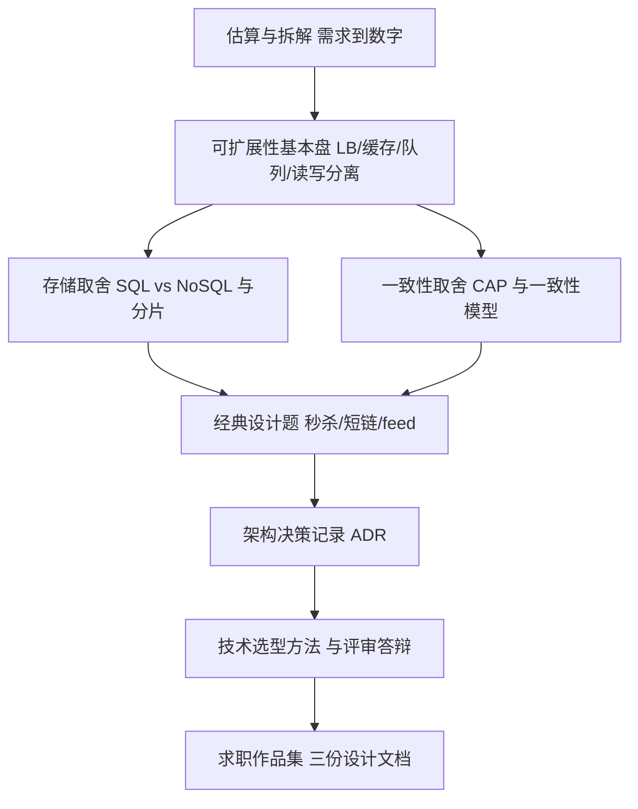

## 知识点地图

- **知识类别**：软件架构与系统设计（含软件设计）——从"功能写得出来"到"系统扛得住流量、经得起演进"，外加架构师的核心方法论：技术选型与架构决策记录。
- **解决什么问题**：面试里"设计一个短链服务你会怎么做"答不上层次；工作中"要不要上微服务""这个选型为什么定了"没有依据可讲。本仓库其他路线都在讲"怎么实现"，本篇讲"怎么在动手前想清楚"。
- **什么时候用到**：三条触发线——准备后端中高级面试的系统设计环节；项目从单机走向"用户多了会崩"；开始需要在团队里为技术决策负责。

一家外卖平台的类比：功能开发是"把一道菜做出来"，系统设计是"设计让十万单同时出餐的后厨"——传菜动线（负载均衡）、备菜冰箱（缓存）、前厅后厨之间的单据台（消息队列）、两个灶台分工（读写分离）。架构师则是定动线、开单据台的人，并且要在老板问"为什么这么定"时拿出站得住的理由。

## 岗位画像

**系统设计师视角（高级工程师的日常）**：接到需求先问量级——多少用户、多少 QPS、数据多久翻倍；画出模块图与数据流；识别单点与瓶颈并给出"第一版够用、第二版可扩"的方案。一天的工作：上午评审一个新服务的接口契约，下午和 DBA 确认订单表的分片键，晚上在一页文档里写清"为什么选 Redis 而不是本地缓存"。

**架构师视角**：比系统设计师多两件事——跨系统的取舍（一致性、可用性、成本之间的天平）与决策的沉淀（让团队三个月后还记得"当时为什么这么选"）。一天的工作：上午给三个业务线定统一的认证方案并写成 ADR，下午评估"自建网关还是买云网关"的成本曲线，傍晚否决一个"为了简历好看而引入 Kafka"的方案并给出替代。

市场概况：系统设计是中高级后端面试的必考环节（一面手撕代码、二面几乎必考设计题）；架构师岗位通常要求 5 年以上经验与"扛过事故"的履历。它不是一个"学完"的方向，而是后端/运维/数据库经验的**整合层**——这也是它被单独列为一篇的原因：其他路线给你零件，本篇教你装配。

这条路线的产物是**三份可讲述的设计文档**：一个秒杀系统、一个短链服务、一个信息流 feed，每份含架构图、估算、取舍说明与 ADR。

## 技能树



必学主线：先会"估"（把需求变成 QPS、存储量、带宽数字），再掌握四件基本盘武器，然后用三道经典题反复演练，最后补上"决策留痕"的架构师方法论。CDN、一致性哈希、限流、长轮询/WebSocket/SSE 是题库里的常客，随题目引入即可。

## 阶段 1（第 1 到 2 个月）：可扩展性基本盘

**第 1 个月：会估算，认识四件武器**

- 估算法（back-of-envelope calculation）：从"日活 100 万"推出峰值 QPS（日请求按流量曲线集中到高峰 10%）、存储量（每条记录大小 x 条数 x 副本数）、带宽。判据：面试官说"设计一个朋友圈"，你 3 分钟内列出要问的量级问题而不是直接画框图；
- **负载均衡**：为什么单机有连接数上限；四层（转发 TCP 包）与七层（看 HTTP 路径）的区别；轮询、加权、最少连接三种策略各自适合什么后端。动手：用 Nginx 把两个本地服务配成一个入口；
- **缓存**：为什么数据库先于代码成为瓶颈；旁路缓存（cache-aside）的读路径与过期策略；缓存三大经典病——穿透（查不存在的 key）、击穿（热点 key 过期瞬间）、雪崩（大量 key 同时过期）及各自一招解法。深入见 [Redis 模块](/redis/010-OverviewCoreDataStructure)；
- **消息队列**：削峰（把瞬时洪峰摊成匀速消费）、解耦（下单与发短信互不等待）、异步（先受理后处理）。理解"消息丢了怎么办"引出确认与重试机制。

**第 2 个月：存储横向扩展与读多写少**

- **读写分离与主从复制**：为什么 80% 的流量是读；主库写、从库读的分工；复制延迟带来"刚下单查不到订单"的经典问题及应对（关键读走主库）。[MySQL 模块](/mysql/010-HowToUseThisCourse)补充动手细节；
- **分库分表与分片键**：数据量过了单机 B+ 树的舒适区怎么办；为什么分片键的选择决定一切（按用户分片则跨用户查询贵）；
- **SQL vs NoSQL 取舍框架**：结构化与事务要 SQL；海量写入与灵活 schema 可考虑 NoSQL——先问访问模式再问技术名字；
- 检验项目一：给一个"日活 10 万的博客站"写一页估算与架构图，标出每一层的单点风险。

## 阶段 2（第 3 到 5 个月）：一致性取舍与三道经典题

**第 3 个月：CAP 与一致性模型**

- CAP 定径的正确用法：网络分区（P）是分布式系统绕不开的事实，取舍发生在分区发生时**保可用还是保一致**——CP 系统（银行转账）拒绝服务保正确，AP 系统（社交点赞）继续服务保体验；
- 一致性阶梯：强一致（任何读都读到最新写）→ 读己之写（自己发的帖子自己立刻可见）→ 最终一致（几秒内全网一致）。学会给每个业务场景**指定**所需的一致性级别，而不是笼统说"要一致"；
- 幂等性：重试、消息重复消费的前提——同一操作执行多次与一次结果相同（唯一请求号 + 去重表是最朴素实现）；
- 动手：写一个带重试的客户端调用一个"偶尔重复下发"的模拟接口，用幂等设计保证结果正确。

**第 4 到 5 个月：三道经典题轮训**

每道题按固定五步作答：澄清需求与量级 → 估算 → 画架构与数据流 → 深挖一个难点 → 讲取舍与演进。这是面试答题的肌肉记忆，也是检验项目二的标准格式。

- **短链服务**：难点在 ID 设计（自增 ID 泄露量级、哈希会冲突）与重定向性能（301/302 的语义差异、缓存命中）；追问常在"怎么统计点击量"（异步落库、防止刷量）；
- **秒杀系统**：难点在"挡量"——前端静态化、网关限流、队列削峰层层漏斗，最终只有少量请求打到数据库；库存扣减的原子性（Redis 预扣 + 数据库最终扣减）与超卖问题；
- **信息流 feed**：推模式（发布时写进所有粉丝的收件箱，读快写贵）与拉模式（读时聚合关注列表，写快读贵），大 V 用推拉结合；这一题考"读扩散还是写扩散"的权衡意识；
- 微服务与单体、网关、限流、熔断这些落地组件的工程细节，本仓库 [Spring Cloud 模块](/spring-cloud/010-FromMonolithToMicroservices) 从单体到微服务、[API 网关](/spring-cloud/060-ApiGateway)与[熔断限流](/spring-cloud/070-ResilienceSentinel)三篇可直接配套阅读。

## 阶段 3（第 6 到 12 个月）：架构决策与方法论

**第 6 到 8 个月：ADR 与技术选型**

- **架构决策记录（ADR）**：用一页短文档沉淀一个重要决策——背景（为什么现在要决策）、选项（至少两三个）、决策与理由、后果（代价与回退方式）。格式不限，关键是"后来的人不用考古就知道为什么"；
- 技术选型方法：先写**约束**（团队语言栈、运维能力、预算）再比**候选**；用"换掉它的成本"评估锁定风险；警惕"简历驱动开发"——为技术栈好看引入的组件是团队的长期税；
- 架构演进观：好架构不是一步到位的架构，而是"当前最简单且留了拆分缝"的架构。模块化单体往往是百万日活以下的最优解，拆微服务的时机由组织规模与部署频率触发，不是由流行度触发；
- 检验项目三：给阶段 2 的秒杀方案补写两份 ADR——一份"为什么用 Redis 预扣库存"，一份"为什么消息队列选型 A 而不是 B"。

**第 9 到 12 个月：答辩演练与求职**

- 白板演练：每周一道新题限时 35 分钟，按五步格式作答并录音回听——多数人第一次听自己"跳过估算直接画框图"会当场警醒；
- 把三份设计文档整理成作品集（博客或公开仓库），面试前半小时重读自己的 ADR 而不是刷新题；
- 面试三大块：估算与口径（数据存什么算什么）、难点深挖（面试官一定挑你图上最弱的组件追问）、取舍叙事（"如果流量小十倍你的方案会怎么简化"是好答案的分水岭）。

## 常见弯路

1. **直接背架构图**：背下"标准答案图"的人答不了追问，面试官换一个约束（"缓存预算只有 1G"）就露馅。正确姿势是练估算与取舍的推导过程，图是推出来的不是背出来的；
2. **每个系统都上微服务**：三个开发者的项目拆八个服务，得到的只有分布式调试成本。先模块化单体，等部署节奏与团队规模真正需要时再拆——[单体到微服务](/spring-cloud/010-FromMonolithToMicroservices)讲的就是这个时机判断；
3. **把 CAP 理解成"三选二"**：分区不发生时 C 和 A 可以兼得；CAP 是"分区发生时保哪个"的预案，不是日常的永久取舍。面试里把这句话讲对就能超过一半候选人；
4. **缓存当万能药**：只管加缓存不管失效路径，换来的是"改了配置页面不更新"与雪崩事故。加缓存前先想清楚：这个数据多久变一次、变了谁能感知；
5. **决策不留痕**：半年后新人问"为什么用 RabbitMQ 不用 Kafka"，没人答得上来，于是有人提议"重构一下"——没有 ADR 的团队注定反复重付决策成本。

## 动手练习

练习一（估算热身，纸面任务）。任务：为"校园二手书交易平台"估算峰值 QPS、日新增数据量与首年存储量，写出每一步换算假设。提示：先问自己三个问题——活跃用户数、人均操作次数、高峰集中度；写假设比算对数字更重要，面试官看的就是假设是否合理。

练习二（幂等下单接口）。任务：实现一个下单接口，网络重试可能导致同一请求到达两次，要求两次调用只生成一单。提示：客户端生成唯一请求号，服务端用"请求号唯一索引 + 插入失败即视为重复"处理。

<details>
<summary>参考实现（先自己写，再展开对照）</summary>

```sql
CREATE TABLE orders (
    id           BIGINT PRIMARY KEY AUTO_INCREMENT,
    request_id   VARCHAR(64) NOT NULL,
    user_id      BIGINT NOT NULL,
    sku_id       BIGINT NOT NULL,
    UNIQUE KEY uk_request (request_id)
);
```

```java
// Spring 服务层：插入冲突即视为重复请求，返回既有订单
public Order createOrder(CreateOrderCmd cmd) {
    try {
        orderMapper.insert(cmd.toOrder());          // uk_request 保证幂等
        return orderMapper.selectByRequestId(cmd.requestId());
    } catch (DuplicateKeyException e) {
        return orderMapper.selectByRequestId(cmd.requestId()); // 重试路径
    }
}
```

对照要点：幂等的承担方是**数据库唯一索引**而不是业务代码里的"先查后插"——查与插之间存在并发窗口，两个请求可以同时通过检查再各自插入。唯一索引是原子闸门；`DuplicateKeyException` 捕获后回查既有订单，让重试方拿到与首次调用相同的结果。面试官追问"那 Redis 能不能做幂等"，答案是能（SET NX 请求号），但要回答"Redis 与数据库之间仍有不一致窗口"，所以落库层兜底不可省。
</details>

练习三（写一份 ADR）。任务：为你最近参与的项目选一个已定的技术决策（缓存、框架、部署方式均可），补写一页 ADR：背景、两个被否掉的选项及否决理由、最终决策、后果。提示：被否选项的"否决理由"是 ADR 的灵魂；写不出两条理由说明当时是跟风选型，正好借这份文档补课。

## 求职准备清单

- 三份设计文档：秒杀、短链、feed，每份含估算过程、架构图、难点深挖与至少一份 ADR；
- 估算肌肉记忆：日活到 QPS、记录大小到存储量、对象大小到带宽，三组换算各练到 1 分钟内；
- 概念连环答：缓存三病、CAP 与一致性阶梯、推拉模式、幂等实现，每个能讲 3 分钟带例子；
- 一个真实事故或压测复盘（哪怕是课程项目的并发 bug），能按"现象、定位、修复、预防"四段讲清；
- 白板工具顺手：在线共享白板或纸笔都练过，画图顺序固定为"客户端 → 网关 → 服务 → 缓存 → 队列 → 数据库"。

## 下一步

先把练习一的估算写出来——它是后面一切的地基。若你走 Java 后端，把本篇与 [Java 后端路线](/roadmap/030-BackendJavaRoute)、[Spring Cloud 模块](/spring-cloud/010-FromMonolithToMicroservices)串成主线；若对底层网络细节（TCP 连接、DNS、CDN 原理）感兴趣，[OSI 与 TCP/IP 模型](/networking/020-OSITCPIPModel)、[TCP/UDP 机制](/networking/025-TCPUDPProtocolMechanics)与[负载均衡技术](/networking/200-LoadBalanceTech)补齐系统设计题的底层视角。

## 参考与致谢

- 本篇的知识类别框架对照 [roadmap.sh](https://roadmap.sh) 的 System Design 与 Software Architect 两条公开路线的主题目录组织（负载均衡、缓存、CAP、一致性模式、消息队列、估算等主题顺序有参考），内容为全部重写并映射本仓库模块文档。roadmap.sh 的路线内容以 CC BY-SA 4.0 许可开放（源码 MIT），特此致谢：https://github.com/KamranAhmedse/developer-roadmap
- 三道设计题是业界通用面试题型，题面表述为本仓库自己的讲法；幂等与秒杀的实现细节参考了各公开工程实践的通行做法后重写。
