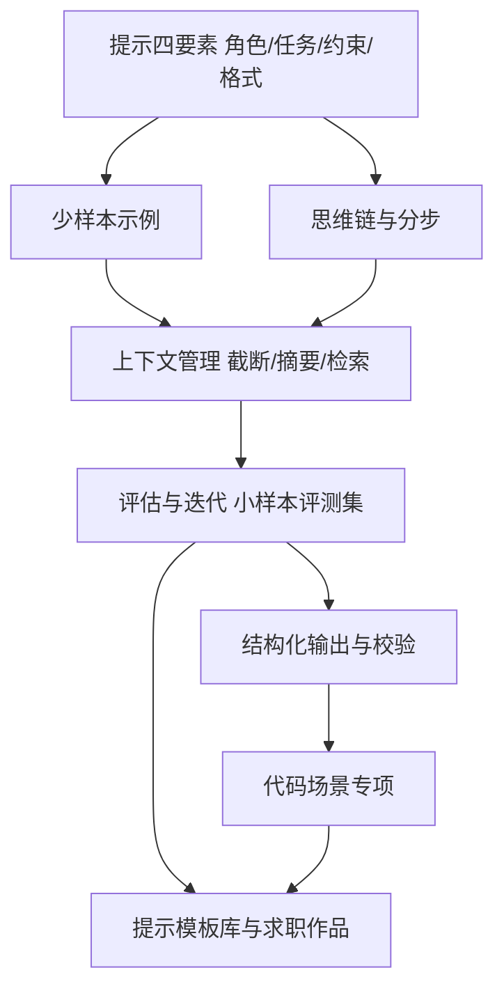

## 知识点地图

- **知识类别**：提示工程（Prompt Engineering）——面向大语言模型的输入设计方法论：怎么组织指令、示例、约束与上下文，让模型的输出稳定、可验证、可交付。
- **解决什么问题**：「AI 回答得忽好忽坏」「改一句话结果全变了」「没法判断这次提示到底改好了没有」——把碰运气的对话变成可复现的工程流程。
- **什么时候用到**：用 AI 辅助写代码、做代码审查、答疑、整理文档的每一天；以及在 2026 年的招聘市场里，"能把任务拆给 AI 并验证其产出"已是多数技术岗位的默认要求。

与 [AI 协作开发指南](/roadmap/150-AICollabWorkflow) 的分工先说清：那篇讲**流程与纪律**——学习的边界（AI 出题不代写）、生成代码的审查清单、什么不该交给 AI；本篇讲**提示本身的知识体系**——一个提示为什么有效、怎么系统地改进它、怎么证明改进有效。两篇是一套：先立纪律，再练手艺。本篇的检验项目都以"提示模板 + 评估记录"为产物，这是它区别于普通教程的地方。

## 岗位画像

提示工程不是多数公司的独立岗位（独立岗位集中在模型公司与平台团队），而是**长在既有岗位上的能力带**：

- **所有开发者的日常**：代码生成、审查、测试用例补全、文档撰写——提示质量直接决定你从 AI 身上榨出的生产力；
- **AI 应用开发者**：把模型调用嵌进产品（智能客服、文档问答、代码助手）的人，提示是他们的"业务逻辑层"，调提示就是他们的日常开发；
- **内容与知识工作者**：用模型压缩长文档、生成学习卡片、结构化资料的人——非程序员群体里提示能力的天花板差距极大。

这个方向的一条硬道理：模型越强，"随便问"与"会问"的差距反而在**可靠性**上拉大——强模型对模糊输入也会给出流畅但不可控的答案，而工程场景要的是"每次都一样好"。这就是为什么提示工程值得当成一条路线系统练。

这条路线的产物是**一套带评估记录的个人提示模板库**：每个模板都注明适用场景、失败案例与迭代历史。

## 技能树



必学主线：四要素 → 示例与推理技巧 → 上下文管理 → 评估迭代。代码场景专项（审查、生成、重构三类提示）与 [AI 协作开发指南](/roadmap/150-AICollabWorkflow) 的审查清单对接。

## 阶段 1（第 1 到 3 个月）：结构与基准

**第 1 个月：提示四要素与最小对比实验**

- 掌握四要素框架：**角色**（"你是一个严谨的代码审查者"设定视角与标准）、**任务**（一句话说清要做什么）、**约束**（不许做什么、边界在哪、以什么为准）、**输出格式**（表格、JSON、固定小节——格式要求是让输出可比较的前提）；
- 做第一组对照实验：同一个任务（比如"把这段报错解释给我听"），分别用"一句话随口问"与"四要素完整版"提问，各跑 5 次，对比输出的稳定性。亲眼看到差异，比读十篇技巧文章有用；
- 判据：能向别人解释"为什么'请详细说明'是坏约束"（不可验证）而"解释不超过 200 字且先给结论"是好约束（可检验）。

**第 2 个月：少样本与思维链**

- 少样本（few-shot）：在提示里给 2 到 3 个"输入-输出"示例，让模型模仿模式。适用判断：任务有明确的格式或风格惯例时用（比如统一把杂乱日志整理成固定字段）；开放式创意任务少用（会锁死输出多样性）；
- 思维链（chain-of-thought）：要求"先分步推理再给结论"。对数学、逻辑、多条件判断类任务提升显著；对简单事实任务反而啰嗦。练法：同一道逻辑题，分别用直接问与分步问，对比正确率；
- 检验项目一：**课程作业答疑助手的约束写法**——给"帮我讲这道题"设计一个提示模板，约束包括：先问清卡在哪一步、只提示思路不给完整答案（符合 [AI 协作指南](/roadmap/150-AICollabWorkflow) 的学习纪律）、每步解释配一个类比、最后留一道变式题。拿 5 道真实作业题实测并记录哪条约束被违反了。

**第 3 个月：上下文管理**

- 理解上下文窗口的现实约束：模型一次能"看见"的内容有限，超长材料要么截断要么摘要要么检索（把相关片段先找出来再给模型）；
- 练三个基本手法：多轮对话中的**阶段性总结**（每几轮让模型输出当前结论摘要，避免早期信息被稀释）；长文档的**分段供给**（先给目录让模型定位，再给相关小节）；**指令前置**（重要约束放开头，靠近结尾的内容对输出影响最不稳定）；
- 阶段验收：把一份 50 页的公开技术文档压成一页学习卡片，要求覆盖原文所有一级章节、每条结论附原文出处章节号。抽查 3 条出处核对真实性——这一步防的是模型"编造出处"。

## 阶段 2（第 4 到 6 个月）：评估与迭代——本路线的核心

**第 4 个月：建立个人评测集**

- 评估是提示工程与"聊天"的分水岭。方法：为你的高频任务建一个小评测集——10 到 20 个有标准答案或明确质量标准的输入（比如 15 段含不同类型 bug 的代码，标注每个 bug 类型）；
- 每次改提示，跑一遍评测集，记录通过率。**没有评测集的提示优化是玄学**：你觉得"这次好像更好了"，多半是这轮对话恰好顺利；
- 检验项目二：给"从报错信息定位代码问题"这个任务建评测集（收集你半年内遇到的真实报错 15 个），基线提示先测一轮记下通过率。

**第 5 到 6 个月：迭代方法论**

- 一次只改一个变量的纪律：换示例、加约束、调格式，分开改分开测——一次改三处，你永远不知道是哪处起效；
- 让 AI 参与改提示本身：把"你的输出与我的期望差距"作为反馈给模型，让它提议提示的修改——这是当前业界的标准工作法（模型自我批评再重写）；
- 失败案例入库：每次输出不可接受，把"输入 + 提示 + 坏输出 + 期望输出"存进失败案例库；案例库每满 10 条，回顾一次提炼共性，共性就是下一版提示要堵的洞；
- 检验项目三：**代码审查提示模板的完整迭代记录**。用阶段 1 的基线提示审查 15 段代码，统计漏检率；然后做三轮迭代（第一轮加"检查清单式约束"：空指针、边界、并发、资源释放逐项过；第二轮加少样本示例：一个理想审查输出的范例；第三轮加"按严重度分级输出"），每轮跑完评测集记录数据。这份带数据的迭代记录就是你简历上的"提示工程实践"。

## 阶段 3（第 7 到 12 个月）：代码场景专项与作品集

**第 7 到 9 个月：代码场景三类专项**

- **生成类**：把需求写成模型可执行的规格——输入输出示例、边界条件、不许引入的依赖。对照练习：同一段需求，模糊版与规格化版各生成一次，用测试用例检验两者的通过率差；
- **审查类**：与 [AI 协作指南](/roadmap/150-AICollabWorkflow) 的审查清单合流——提示里固化"先读diff找逻辑错误，再查边界与资源，最后才看风格"的顺序约束，输出按严重度分级；
- **重构类**：约束"行为不变"的可验证性——要求模型给出重构前后行为等价的理由，并自己列出"哪些测试能证明等价"；
- 共同纪律：所有 AI 产出按 [AI 协作指南](/roadmap/150-AICollabWorkflow) 的"读不懂的不合并"原则处理，本篇练的是把产出质量提到"值得读"的水平。

**第 10 到 12 个月：模板库成体系与求职**

- 把两年练习的模板整理成公开仓库：每个模板含适用场景、提示全文、评测集描述、迭代历史与失败案例——这个仓库就是你的作品集主项目；
- 简历表述口径："为 X 类任务建立 15 例评测集，通过率从 Y% 迭代至 Z%"——有数字的表述在任何面试里都站得住；
- 面试准备：能现场白板写出一个结构完整的提示并解释每个要素的存在理由；能讲一次"提示改坏了怎么发现又怎么修"的完整故事。

## 常见弯路

1. **收藏技巧不建评测**：技巧文章可以无限读下去，但提示能力只来自"改了 → 测了 → 有数"的循环。评测集先于一切技巧；
2. **把模型当搜索引擎用一句话问**：四要素齐全的提示与随口一问，产出质量差一个量级；觉得"AI 不行"的人多数只是没给足任务信息；
3. **约束写成口号**："要严谨""要高质量"这类约束模型无法执行，等于没写。可执行的约束是"输出不超过 200 字""每条结论必须引用输入中的原句"；
4. **示例给反例不给正例**：少样本的关键是让模型看到"好的输出长什么样"。只说"不要这样"而不给"要这样"，模型只能猜；
5. **长对话不总结任其漂移**：多轮对话进行到十几轮，最早的约束在模型注意力里已经稀薄。每 5 到 10 轮主动让模型复述当前任务与约束，发现漂移立即重申。

## 动手练习

练习一（四要素改写，纸面任务）。任务：把这句坏提示改写成四要素完整的版本："帮我看看这段代码有什么问题"。要求写清角色、任务、约束、输出格式四段，并说明每一处改动的理由。提示：约束一节要包含"什么不要做"（比如不要重写整个文件、只报告不修改）与"以什么为准"（比如以这段代码的既有风格为准）。

<details>
<summary>参考改写（先自己写，再展开对照）</summary>

```text
角色：你是一名严格的代码审查者，关注正确性与边界情况，不关注风格偏好。
任务：审查下面这段函数，找出会导致错误结果的缺陷。
约束：
- 只报告缺陷，不要给出完整重写版本；
- 每条缺陷注明：位置、触发条件、错误后果、修复方向（一句话）；
- 不确定的疑点单独列在"待确认"一节，不要与确定的缺陷混排。
输出格式：按严重度降序的编号列表；若无缺陷，明确输出"未发现缺陷"。
```

对照要点：两个细节最容易被漏——"不确定的单独列"防止模型把猜测写成断言（幻觉的经典来源）；"无缺陷也要明说"防止模型为了显得有用而硬凑问题。输出格式里给"空结果"定义，是让输出可自动校验的关键一环。

</details>

练习二（最小评测集，实机任务）。任务：给你最近一周问过 AI 的一类重复任务（比如"解释报错"或"写单元测试"），收集 10 个真实输入，写一份评分标准（每例 3 条要点，命中即得分），然后用当前习惯的提示跑一遍记录总分——这个分数就是你所有后续优化的基线。

练习三（长文档压卡片，实机任务）。任务：选本仓库任意一篇你没读过的文档（比如 [算法分析基础](/algorithm/010-AlgorithmAnalysisBasics)），用提示让模型压成 10 条以内的学习卡片，每条卡片必须标注出处小节号；然后人工核对 3 条出处的真实性，并检查卡片是否漏掉了某个一级小节。漏了就改进提示再跑一轮，对比两版差异。

## 求职准备清单

- 公开的提示模板仓库：每模板含场景、全文、评测方法、迭代记录；
- 至少一份带数据的迭代报告（基线通过率到最终通过率）；
- 一份失败案例库及从中提炼的共性清单；
- 能现场演示"同一个任务，坏提示与好提示"的输出对比；
- 对"评估先于优化"能讲出完整方法论，而不只是复述技巧。

## 下一步

从练习一的四要素改写开始，今天就把一个日常任务的提示升级。流程与学习纪律的另一半在 [AI 协作开发指南](/roadmap/150-AICollabWorkflow)；若你的目标方向是数据与模型本身，衔接 [数据与 MLOps 路线](/roadmap/147-DataAndMlopsRoute) 的 MLOps 段。
