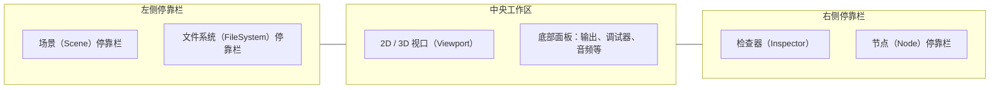

想把"做一款游戏"从想法变成现实，又担心引擎收费、订阅或分成条款？Godot 是一个值得从第一天就放心的选择：它完全免费、开源，采用宽松的 MIT 许可证（MIT License），可以自由用于学习、原型或商业项目，不需要支付授权费用。本篇带你认识 Godot 的定位与最新版本，完成下载安装，创建第一个项目，并熟悉编辑器界面与运行流程，为后续的节点、场景与脚本学习打好地基。

## 学习目标

- 说清 Godot 的定位：完全免费开源的 2D/3D 游戏引擎（Game Engine），以及它覆盖的目标平台；
- 了解当前稳定版 Godot 4.7 与上一版 4.6 的发布背景和主要新特性；
- 完成下载与解压，理解 Godot "无需安装" 的特点；
- 使用项目管理器（Project Manager）创建第一个项目，理解三种渲染器的取舍；
- 认识编辑器的主要停靠栏（Dock）、检查器（Inspector）与底部面板；
- 理解主场景（main scene）与 res:// 路径两个核心约定，会用快捷键运行和停止项目。

## Godot 是什么

Godot 是一个完全免费开源的 2D/3D 游戏引擎，核心特点可以概括为三点：

第一，免费且开源。引擎采用 MIT 许可证，源代码公开，任何人都可以自由使用、修改和分发，商用也不例外。第二，2D 与 3D 一体。同一套编辑器、同一种节点模型同时服务于 2D 游戏和 3D 游戏，你不需要为不同维度学习两套工具。第三，一次开发，多平台导出。从同一个编辑器出发，项目可以导出到 Windows、macOS、Linux、Android、iOS 以及 Web 平台。

对初学者来说，这意味着两件实际的好处：入门没有任何成本门槛，遇到问题时官方文档、源代码与社区资源都是完全开放的。

## 版本现状：4.7 与 4.7.1

截至 2026 年 9 月，Godot 的当前稳定版是 4.7，主题为 "Lights, Camera, Action!"，于 2026 年 6 月 18 日发布，有超过 300 位贡献者和 1600 多个合并请求（Pull Request）参与。同年 7 月 14 日发布了维护版本 4.7.1，主要修复渲染问题，例如网格实例光照闪烁、正交相机下方向光阴影剔除等。

上一个稳定版 4.6 于 2026 年 1 月发布，主题为 "All about your flow"，代表性变化包括：Jolt Physics 物理引擎转正（新建 3D 项目默认使用它）、完整的 3D IK（反向动力学）回归，以及编辑器停靠面板（Dock）支持浮动与重排。如果你在网上看到旧版本相关的教程，4.6 与 4.7 的这些差异值得留意。

## 4.7 主要新特性

Godot 4.7 的更新面很广，这里按主题分组介绍与本仓库后续教程关系较近的部分。

画面与渲染方面：

- HDR 输出：支持 Windows、macOS、iOS、visionOS 与 Linux (Wayland)，官方称可支持高达 10000 nits 的亮度；
- AreaLight3D：新增的矩形面光源节点，提供实时照明、柔和阴影与更真实的反射，适合模拟发光招牌、窗户这类面状光源；
- 文本着色器内联预览：在编辑器内实时预览文本着色器的效果。

工作流与编辑器方面：

- Asset Store 取代旧的 Asset Library，新增资产评分、预览缩放与后台线程处理；
- Control 偏移变换：新的 offset_transform_* 属性，可以平移、旋转或缩放 Control 控件而不影响容器布局；
- 编辑器改进：按两次 F 可跟随移动中的对象；检查器支持分类复制粘贴；新的 MeshLibrary 编辑器；2D Scene Paint Mode（场景绘制模式）；项目管理器会显示项目可升级或降级的图标。

游戏功能与平台方面：

- 内置 VirtualJoystick 虚拟摇杆节点，提供 Fixed、Dynamic、Following 三种模式，移动端触屏操作开箱即用；
- DrawableTexture2D：直接在纹理上进行绘制的便捷 API；
- 2D 细节增强：CollisionShape2D 新增 one_way_collision_direction 属性；GradientTexture2D 新增 FILL_CONIC 圆锥渐变填充；
- 输入：新增键盘与鼠标设备 ID 常量 InputEvent.DEVICE_ID_KEYBOARD 和 DEVICE_ID_MOUSE；iOS 改用 SDL3 手柄库；支持手柄陀螺仪与加速度计输入；
- 动画：动画编辑器节点可折叠；新增 Tween.tween_await()；Animation.length 由 float 改为 double；
- 导出：导出模板支持按平台、按架构单独下载，不必一次性下载全部模板；
- Android：支持画中画（Picture-in-Picture）；Godot Android Build Environment（GABE）达到稳定版；
- XR：首日支持 Android XR 与 Steam Frame；OpenXR action map 简化为 4 个默认 profile。

不需要现在记住每一个特性，知道引擎在活跃演进、大概有什么能力即可。用到对应功能时再回头查。

## 下载与安装

从官网 godotengine.org 的下载页选择对应操作系统的版本。Godot 的安装方式非常直接：下载得到的是一个压缩包，解压后直接运行其中的可执行文件即可启动，没有安装程序，也不写注册表。你可以把解压出来的文件夹放在任意位置。

如果后续想用 C# 开发，需要自行安装 .NET SDK（要求 .NET 8 或更高），本仓库教程以内置的 GDScript 为主，不依赖这一步。

## 用项目管理器创建第一个项目

首次启动 Godot，看到的是项目管理器（Project Manager）。它是所有项目的入口，负责创建、删除、导入与运行项目。窗口设置里还可以调整界面语言（language）、主题与配色预设（theme 与 color preset）、显示缩放（display scale）、网络模式（network mode）与目录命名规范（directory naming convention）。

创建项目的流程是：点击 Create 按钮，填写项目名称，选择一个空文件夹作为项目目录，选择渲染器，最后点击 Create。建议为每个项目准备一个独立的空文件夹，Godot 会把 project.godot 等文件生成在里面。project.godot 是项目的核心配置文件，后面提到的主场景路径也记录在它里面。

### 三种渲染器怎么选

新建项目时需要在三种渲染器（Renderer）之间选择：

- Forward Plus：功能最完整的 3D 渲染管线，桌面 3D 项目通常选它；
- Mobile：面向移动平台的 3D 渲染管线，在性能与画质之间做取舍；
- Compatibility：兼容性优先的选择，也是唯一支持 Web 导出的渲染器，如果目标平台包括浏览器，必须选它。

选错了也不必慌：渲染器可以在项目设置中调整，教程阶段用默认选项即可。

### 导入已有项目与恢复模式

如果拿到的是别人分享的项目文件夹（内含 project.godot），在项目管理器中点击 Import 按钮，定位到该文件夹即可导入；也支持直接选择项目的 zip 压缩包。

还有一个救急功能值得知道：恢复模式（recovery mode）。当某个项目崩溃导致无法正常打开时，可以用恢复模式进入，它会禁用工具脚本、编辑器插件与 GDExtension 插件，方便你排查并修复问题。

## 编辑器界面导览

打开项目后进入编辑器主窗口。界面由几个停靠区（Dock）与中央工作区组成，布局示意如下：

- 场景（Scene）停靠栏：展示当前打开场景的节点树，是编辑场景结构的主要入口，后续教程中会天天用到；
- 文件系统（FileSystem）停靠栏：展示项目内的全部资源文件，对应磁盘上项目文件夹的内容；
- 检查器（Inspector）：显示当前选中对象（节点、资源等）的全部属性；
- 底部面板：包含输出（Output）、调试器（Debugger）、音频（Audio）等面板，运行项目时的日志会出现在输出面板；
- 节点（Node）停靠栏：查看节点信号与分组，在信号篇会重点使用。

检查器值得单独展开讲，因为每一篇教程都离不开它：

- 属性按所属类分组折叠展示；
- 顶部搜索栏不区分大小写，按逐字母匹配过滤属性，属性多时非常好用；
- 右键任意属性可以选择 Open Documentation，直接查看该属性的官方文档；
- 被修改过的默认值旁边会出现还原图标，点击即可恢复默认值；
- 工具菜单提供 Expand All（全部展开）、Collapse All（全部折叠）、Copy Properties 与 Paste Properties（复制粘贴属性，4.7 起支持按分类复制）、Make Sub-Resources Unique（把共享的子资源改为独占副本）等操作。

## 运行项目：主场景与快捷键

Godot 运行的永远是一个场景（Scene）。每个项目必须指定一个主场景（main scene）：按下 F5 运行项目时加载的就是它，路径记录在 project.godot 文件的 application/run/main_scene 条目下。首次按 F5 时如果还没有设置主场景，编辑器会提示你选择一个场景作为主场景。

三个最常用的快捷键要形成肌肉记忆：

- F5：运行主场景（macOS 上为 Cmd+B）；
- F6：运行当前正在编辑的场景；
- F8：停止运行。

主场景通常是游戏的入口，例如主菜单或第一关；而 F6 让你在不启动整个游戏的情况下单独调试某个场景，这在开发单个角色或界面时非常高效。

## res://：统一的资源路径前缀

在 Godot 项目里，你会反复看到 res:// 开头的路径，例如 res://scenes/player.tscn。res:// 表示项目根目录，也就是 project.godot 所在的文件夹。无论项目实际位于 Windows、macOS 还是 Linux 上，资源路径都统一写成 res:// 开头，引擎会自动映射到真实的磁盘位置。这个约定会贯穿后续所有教程，例如代码中的 preload("res://my_scene.tscn")。

## 小结

这一篇完成了三件事。其一，认识 Godot：完全免费开源（MIT 许可证）的 2D/3D 引擎，一套编辑器覆盖 Windows、macOS、Linux、Android、iOS 与 Web 导出，当前稳定版为 4.7。其二，跑通了起步流程：下载解压即用，通过项目管理器创建或导入项目，理解 Forward Plus、Mobile、Compatibility 三种渲染器的取舍，知道崩溃时有恢复模式兜底。其三，熟悉了编辑器：场景与文件系统停靠栏、检查器（分组、搜索、还原图标、Make Sub-Resources Unique）、底部面板，以及 F5/F6/F8 的运行节奏，并理解了主场景与 res:// 两个约定。下一篇将进入 Godot 最核心的模型：节点、场景与实例化。

## 参考链接

- [Godot 4.7 发布说明](https://godotengine.org/releases/4.7/)
- [Godot 4.6 发布说明](https://godotengine.org/releases/4.6)
- [项目管理器](https://docs.godotengine.org/en/stable/tutorials/editor/project_manager.html)
- [检查器停靠栏](https://docs.godotengine.org/en/stable/tutorials/editor/inspector_dock.html)
- [项目设置](https://docs.godotengine.org/en/stable/tutorials/editor/project_settings.html)
